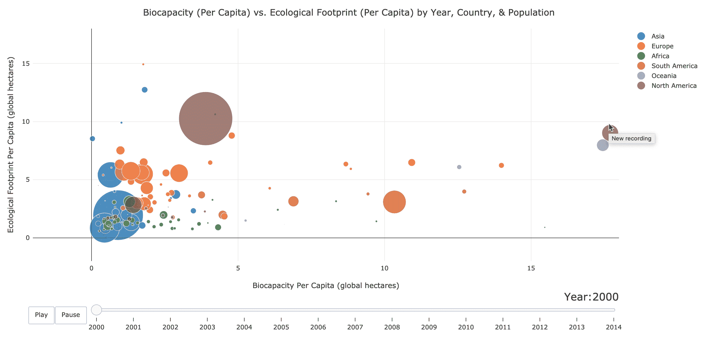
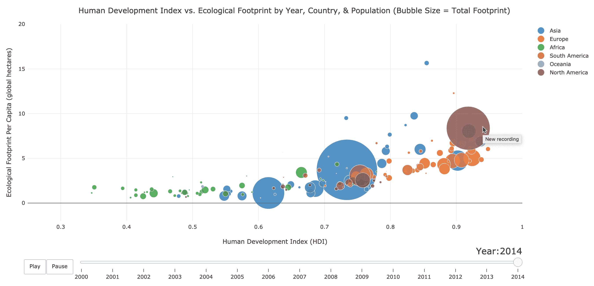

# 人类发展与国家生态足迹:一个视觉导向

> 原文：<https://towardsdatascience.com/human-development-national-eco-footprints-a-visual-orientation-9adf86618d4f?source=collection_archive---------29----------------------->

## 使用 Plot.ly 和 Bubbly

程序员和数据科学家可以将一些开源数据可视化工具整合到他们的工作中，这些工具真的很吸引人。如果你不太赞同我的热情，可以看看[布丁](https://pudding.cool/)的“记者工程师”的一些互动的、有时有趣的、有时与文化相关的项目。在我看来，他们正在引领数据可视化的艺术*。也就是说，数据科学家没有能力仅凭他们的可视化和时间敏感的问题来震撼心灵，他们自己拥有可访问的资源来快速建立信息丰富、易于理解的数据通信。*

*撇开形象化不谈(就目前而言)，以下是我最近抛出的一些问题:我们对人类进步有共同的标准全球定义吗？在评估一个国家的发展时，应该如何权衡教育和健康与经济财富？一个国家培育人民的努力是否需要更大的生态足迹和有限自然资源的更多支出？哪些国家在引领前进，哪些没有？我将在下面探讨这些想法，同时深入一些有用的 Python 库，用于抓取 web 和可视化相关信息。*

**

## *为了支持人类发展指数和类似的指标*

*在关于国家“增长”的讨论中，国内生产总值(GDP)似乎是最容易获得和被大量引用的指标。虽然很容易衡量和比较，但更高的 GDP 肯定不能保证一个地方的普通公民比其他地方的更好。美国每年花费数十亿美元开采石油，GDP 也随之增长。中国是世界上最大的二氧化碳排放国之一，在国民生活和工作环境高度污染的情况下，中国的 GDP 也取得了令人难以置信的增长。GDP 指标是一维的，在衡量实际进展方面显然有其局限性。作为回应，联合国经常引用一个叫做[人类发展指数](https://en.wikipedia.org/wiki/Human_Development_Index) (HDI)的新指标，该指标不仅考虑了人均 GDP，还考虑了预期寿命、识字率、入学率等指标。还有[的不平等调整人类发展指数](https://en.wikipedia.org/wiki/List_of_countries_by_inequality-adjusted_HDI) (IHDI)，与此类似，但惩罚了健康、教育和收入分配不均的国家。请记住，这不是一个完美的指标，因为它不容易解释(在 0 & 1 之间)，排名将取决于其他人的增长，但它比 GDP 更全面，可以作为进步的指南，这是我选择关注人类发展指数的主要原因，以便快速了解数据搜集、搜索、清理、合并和可视化。进入数据探索过程！*

## *抓取维基百科*

*我使用 Python 库 [BeautifulSoup](https://www.crummy.com/software/BeautifulSoup/bs4/doc/) ， [Requests](https://2.python-requests.org/en/master/) ，& [Pandas](https://pandas.pydata.org/pandas-docs/stable/) 从维基百科抓取一个简单的数据表。在导入库之后，我解析了 Wikipedia 表，提取了国家和 HDI 的文本，并将每个文本放入一个列表对象中，如下所示:*

*   ***文章可读性跳过的步骤:**库安装和导入、数据清理、合并来自 WorldBank/Kaggle 的第三方数据集*
*   *在我的 [GitHub 库](https://github.com/as6140/hdi_v_ecology_plotly_blog)上探索完整的笔记本和数据集的更多细节*

```
*#parse with BeautifulSoup & Requests
web_page = "[https://en.wikipedia.org/wiki/List_of_countries_by_inequality-adjusted_HDI](https://en.wikipedia.org/wiki/List_of_countries_by_inequality-adjusted_HDI)"req=requests.get(web_page)
page = req.text
soup = BeautifulSoup(page, 'html.parser')
table = soup.find_all("table", "wikitable")#extract country & HDI text
ihdi = table[0]
table_rows = ihdi.find_all('tr') #tr found in browser developer tool
header = table_rows[1]
temp = ihdi.find_all('td') #td found in browser developer tool#list comprehensions to get lists of country & HDI strings
countries = [table_rows[i].a.get_text() for i in range(len(table_rows))[1:]]IHDI = [temp[i].get_text() for i in range(len(temp)) if "." in temp[i].get_text()]#zip data and create pandas dataframe
data = zip(rank,countries, IHDI)
cols = ['Rank', 'Country', 'IHDI']
ihdi_df = pd.DataFrame(list(data), columns = cols, index=rank)*
```

## *使用 Plot.ly 通过 Choropleth 地图可视化 IHDI*

*在创建了一个包含按国家名称排列的 IHDI 值的熊猫数据框架后，我能够构造一个变量(“数据”)，该变量可以传递到 plot.ly 方法中，如下所示:*

```
*data = [dict(
           type='choropleth',
           locations = ihdi_df['Country'],
           autocolorscale = True,
           z = ihdi_df['IHDI'],
           locationmode = 'country names', 
           marker = dict(line = dict (
                           color = 'rgb (255,255,255)', width = 2)), 
           colorbar = dict(
                           title = "2017 Inequality-Adjusted HDI")
             )]layout = dict(title = 'Countries by 2017 Inequality-Adjusted HDI')#using one of many plotly imports: import plotly.graph_objs as go
fig = go.Figure(data = data, layout = layout)py.offline.iplot(fig);*
```

*Plotly 很棒，因为它易于使用、动态且具有交互性。虽然依赖第三方资源进行数据科学有时很好，但最终在价格、复杂性和文档可用性方面会很昂贵，因此我非常欣赏像 matplotlib 这样简单的库。在下方，您可以将鼠标悬停在国家/地区上方以查看各个 IHDI 值，向任意方向平移地图，放大/缩小地图，并将其重置为原始比例-所有操作均使用嵌入右上角的 plot.ly 按钮。*

*Created in Python with Plot.ly*

## *洞察力:IHDI Choropleth 地图*

*我们现在可以很容易地看到，加拿大、澳大利亚、日本、冰岛和一些斯堪的纳维亚国家在这一特殊的不平等调整人类发展指标上的指数非常高。它们是在发展努力中实现经济实力、教育和健康之间良好平衡的领导者，这些好处可能会更均匀地分配给更大部分的公民。希望提高自身得分的政府应该效仿这些国家在前进中所采用的一些价值观和行动。美国在不平等调整后的排名上有所下降(从人类发展指数的第 13 位降至第 25 位)。中非共和国、南苏丹和尼日尔等非洲国家显然迫切需要提高教育入学率、人均收入、公共卫生服务以及其他经济机会和平均预期寿命的决定因素。没有地图，这些事情可能是显而易见的，但 choropleth 使我们能够清楚地看到陆地、海洋、边界和最近的邻居如何影响测量的值。它可以作为一种地理目录来指导进一步的认识和未来的研究。*

## *人类发展&我们国家的生态足迹*

*经济增长必然会破坏我们的生物圈吗？发达国家的生态足迹与他们的生物能力相符吗？或者我们正在以赤字的方式消耗资源？哪些国家在不依赖有限自然资源的情况下增加了 IHDI？哪些国家正在消耗自然资源，却不一定能发展经济？随着时间的推移，这些因素在各个国家、各个大洲，在总的*和*人均指标和人口方面发生了怎样的变化？我怎么可能用一种容易理解的方式来想象这一切呢？*

*为了简单直观地探究这些问题，我下载、清理并合并了*。在 Kaggle 上使用熊猫的 csv 数据来自世界银行和 T2 的全球足迹网络。我不会讲太多细节，我将总结一下我遇到的一些清洁障碍:*

*   *我添加了列后缀，以便合并许多按年份标记的列(例如 2007 年人类发展指数，2007 年 le，2007 年 pop)*
*   *在不同的数据集中，国家有时会被不同地缩写或截短，所以我将它们对齐(例如。美国-美国-美利坚合众国、圣卢西亚-圣卢西亚等。)*
*   *在生态足迹数据中，我将“美洲”大陆分为北美和南美*
*   *在合并之前决定如何正确处理缺失或空的指标、年份和国家(因为一些指标、年份和国家缺失，所以数据不是当前世界的 100%综合视图)*

*在将合并的数据清理并加载到 Pandas dataframe 后，我使用一个名为 [Bubbly](https://pypi.org/project/bubbly/) 的 Python 库创建了一个气泡图，它依赖于 NumPy、Pandas 和 Plot.ly。令人难以置信的是，每个气泡图可以一次接受多达六个有意义变量的参数！*

```
*# Biocapacity Per Capita vs. EF Per Capita Chart code
from bubbly.bubbly import bubbleplotfigure = bubbleplot(
     #input dataframe, and 2 main variables
     dataset=data1,
     x_column='BiocapPerCap', 
     y_column='EFConsPerCap',
     bubble_column='country', #what each bubble reps 
     time_column='year',       #time interval
     size_column='EFConsTotGHA', #bubble size argument
     color_column='continent',   #bubble color argument
#column titles, main title
x_title="Biocapacity Per Capita (global hectares)",                 y_title = "Ecological Footprint Per Capita (global hectares)", 
title = 'Biocapacity (Per Capita) vs. Ecological Footprint (Per    Capita) by Year, Country, & Population',
    x_logscale=False, #log scale argument
    scale_bubble=3, #how big should bubbles be?
    height=650,
    #scale of axes
    x_range = (-2,18), 
    y_range = (-2,18)
)#render the plot inline
iplot(figure, config={'scrollzoom': True})#alternatively, use: plot(figure, config={'scrollzoom': True})
#to create an html page auto-saved your current directory*
```

*在以下可视化中要寻找什么:*

*   ***每个泡泡:**国家*
*   ***气泡颜色:**大陆*
*   ***气泡大小:**以全球公顷(测量土地，100 公顷= 1 平方公里)为单位的国家总生态足迹*
*   ***水平 X 轴上的位置:**每个国家的人均生物能力，以全球公顷为单位*
*   ***垂直 Y 轴位置:**每个国家的人均生态足迹，以全球公顷为单位*
*   ***滑块/动画:**时间(年)*
*   **右下角附近的国家:***！对地球来说是积极的。***
*   ***左上方附近国家:***！他们在生态赤字下运作。****

******* [**点击探索互动图表(生物容量 pc vs .生态足迹 pc)**](https://as6140.github.io/biocap_pc_v_ecofootprint_pc_bubble_chart.html) *******

**预览:**

****

****洞察:人均生物能力与人均生态足迹****

**请记住，这种分析不是预测性的，而是描述性的，我们可以得出结论，一些国家正在以比其他国家更可持续和更健康的方式发展和增长，但我们不能对变量之间的潜在关系或因果关系做出评论。此外，请记住，这张图表有助于我们分析一个严格的生态比率，尽管这很有趣，但它忽略了许多有意义的因素，这些因素可能有助于评估过去的表现并激励新的行动，并且在 2014 年被截断。**

**玻利维亚在这里看起来真的很好(目前)！这个南美国家的生态容量是其足迹的 5 倍(比例为 16:3)，这是一个令人震惊的净积极生态。然而，玻利维亚的故事并非完美无缺。自从世纪之交以来，这个国家的森林砍伐率一直在上升，这主要与森林转化为大规模农业和牧场有关，特别是在查科地区。它是南美洲的对手，巴西的人均足迹相似，但人均生态承载力只有它的一半。这种影响，在人均规模上，似乎平衡了亚马逊与其庞大人口的利益。在美国，我们正在消耗生态系统提供的 2.3 倍的水，这是一个不容忽视的运营赤字。中国(3.8 倍)和印度(2.4 倍)位居第二(或者说没有第二)，以同样可怕的人均比率，以及意料之中的最大的总足迹。图表中人均足迹与生物能力的比率最低的国家是卡塔尔，卡塔尔和其邻国被世界卫生组织称为[世界上毒性最大的国家](https://medium.com/dohanews/qatar-and-its-neighbors-ranked-among-the-worlds-most-toxic-nations-f7cab5f3e65b)。每个点似乎都在讲述一个新的故事。每个故事似乎都揭示了需要持续的意识和行动。**

****另一个泡沫图:人类发展指数与人均生态足迹****

**为了在气泡图上查看一组不同的变量，我用 x_column、y_column 和 bubble_column (size)的新参数操纵了“figure”对象(显示在上面的 Python 代码中)。**

**要查找的更改:**

*   ****新的水平 X 轴位置:**每个国家的人类发展指数(HDI)**
*   ***国右下方:* ***还好*** *！这些国家在经济、教育和健康方面都在发展，同时(相对)限制了它们对环境的破坏。***
*   ***国左上方:* ***还不好*** *！这些国家正在耗尽地球的资源，却不一定同步造福人类。***

******* [**在此探索互动图表(HDI 与环保电脑)**](https://as6140.github.io/hdi_v_ecofootprint_total_bubble_chart.html) *******

**预览:**

****

****洞察:人类发展指数与人均生态足迹****

**国家人类发展努力必然会破坏生态吗？挖掘石油当然会带来经济利益，例如，我们每次开车都会从中受益。与此同时，有一些方法可以有效地将这种好处转移到能够改善人类发展指数等指标的项目上。当然，说起来容易做起来难，但是考虑到有时是间接的，通常是直接的权衡，哪些国家做得好呢？**

**一般来说，欧洲似乎在树立生态意识的同时也为人类进步设定了标准。向西班牙、葡萄牙、意大利、罗马尼亚、匈牙利和塞浦路斯大声疾呼，它们成功地控制了人均碳足迹，同时处于或接近国家人类发展指数的较高水平。大部分欧洲国家位于或接近这一等级，但是一些没有被提及的欧洲国家似乎更愿意过度利用他们的生态资源。在这张泡泡图中，非洲是另一个大多数国家都聚集在一起的大陆。平均而言，大多数非洲国家都位于人类发展指数排名的后半部分，尽管它们似乎都不是生态破坏的罪魁祸首。北非国家摩洛哥、阿尔及利亚和突尼斯的这一比例最为理想，这可能是因为地处地中海，靠近许多制定标准的欧洲国家。**

**亚洲国家似乎没有明显地聚集在一起，尽管有一些趋势和重要的观察值得注意。从 2000 年到 2014 年，沙特阿拉伯、科威特、巴林、哈萨克斯坦、阿曼和一些近邻似乎在人类发展指数上取得了令人难以置信的进步，但它们对自然资源的依赖也出现了类似的大幅飙升。除了战争和腐败之外，许多开放的贸易政策改革、石油之外的多样化以及融入全球经济的努力对人类发展指数和该地区公民的总体生活水平产生了积极影响。**

**美国、加拿大、澳大利亚、丹麦和新加坡似乎是这些国家中高度发达的环境罪犯。如果没有对环境的真正破坏，我们可能无法达到美国目前的生活水平。我们可以同样感激我们所拥有的，同样致力于改善我们的制度和价值观。这些巨大的、令人生畏的进步肯定是从本地开始的。我们都可以教别人一些东西，种植一些东西，快速洗澡，吃完你的食物，骑自行车，投票。**

**我希望你喜欢这本书，**

**亚历克斯**

**[*查看我的 GitHub 库*](https://github.com/as6140/hdi_v_ecology_plotly_blog) *获取项目数据、代码、详情。***

*****请继续关注我的后续文章，我会继续深入研究数据科学。我鼓励大家喜欢、评论、分享或直接给我发消息，告诉我你们对这里提出的想法的想法，或者对我今后应该研究的有趣主题的建议。*****

**[www.linkedin.com/in/alexshropshire](http://www.linkedin.com/in/alexshropshire)**

**[medium.com/@as6140](http://medium.com/@as6140)**

**[github.com/as6140](http://github.com/as6140)**