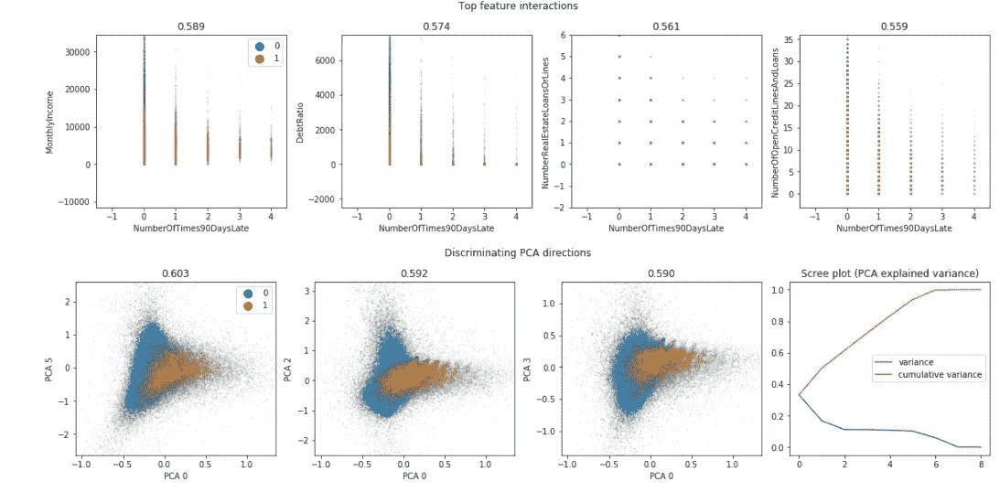
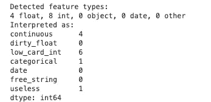
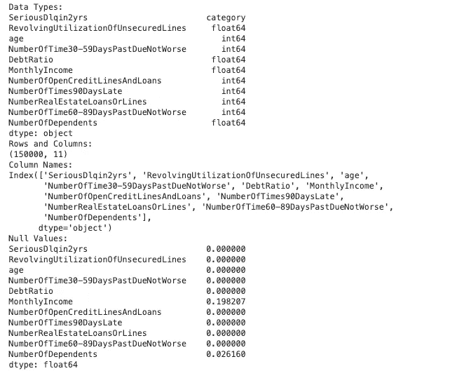
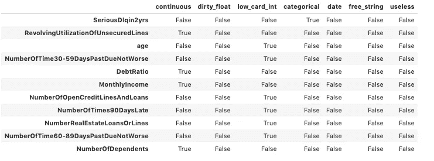
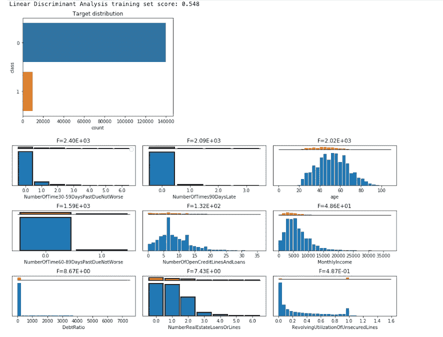
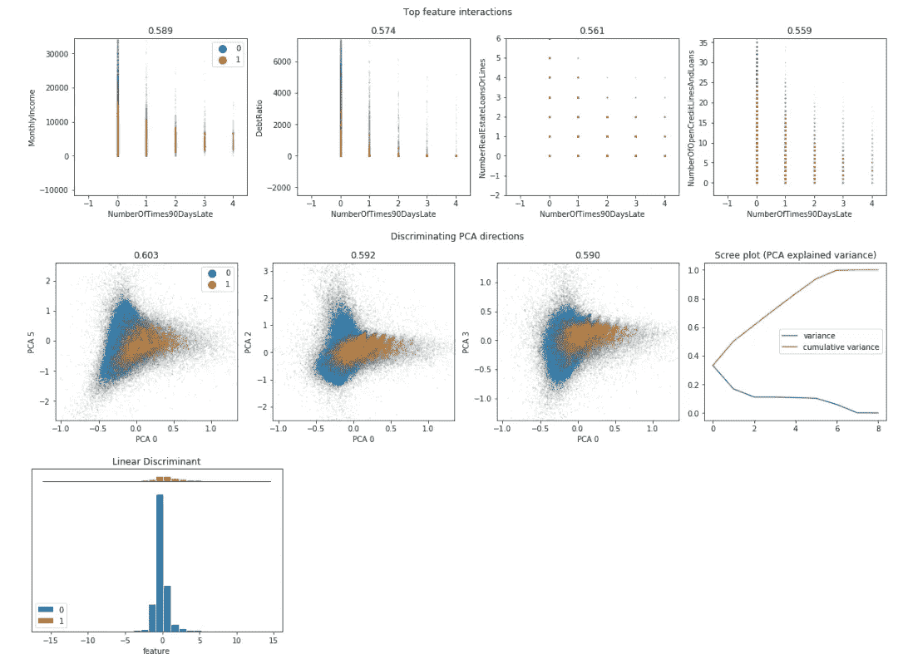
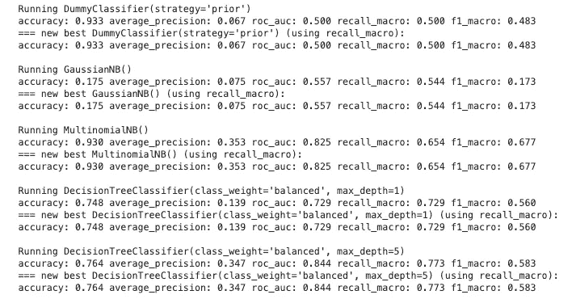

# 使用 Dabl 的人在回路自动机器学习

> 原文：<https://towardsdatascience.com/human-in-the-loop-auto-machine-learning-with-dabl-2fe9c9d1736f?source=collection_archive---------32----------------------->



## 使用这个 python 库自动执行重复的机器学习任务

T 任何机器学习项目最耗时的部分都是数据清理、预处理和分析的初始阶段。在训练一个模型之前，你首先需要经历一个漫长的过程。执行任务，例如处理缺失值、将分类变量转换为数字变量并分析数据，以便为特征工程和选择提供信息。

有许多工具试图自动化这个过程，包括众所周知的 [auto-sklearn](https://automl.github.io/auto-sklearn/master/) 库。然而，其中许多都是一个黑箱，很难准确理解工具是如何改变数据的，如果数据有一些独特性，也很难定制过程。

Andreas Mueller 创建的相对较新的 python 库 d [abl](https://amueller.github.io/dabl/dev/quick_start.html) 试图解决这个问题。Dabl 提供了一个工具来自动化初始模型开发阶段中涉及的许多重复性任务。虽然功能目前有点有限，但确实存在的功能是非常有前途的。看看 Github 回购开发正在进行中，最近的项目承诺发生在 2019 年 11 月 15 日。在本文的剩余部分，我将对该工具进行简单的评估。

## 自动化预处理

Dabl 可以 pip 安装，如下所示。该库还依赖于是否安装了最新版本的 scikit-learn，因此如果您没有安装，则需要升级或安装最新版本`scikit-learn==0.21.3`。

```
pip install dablimport pandas as pd
import dabl
```

为了说明其中的一些特性，我将使用“给我一些信任”竞赛中的 Kaggle 数据集。数据集可以从[这里](https://www.kaggle.com/c/GiveMeSomeCredit/data)下载。我使用的是`cs-training.csv`文件，该文件包含关于一个人的信用历史和环境的特征，以及目标变量(SeriousDiqin2yrs `)。这表明他们在过去两年中是否经历过严重的财务压力。

```
loan_data = pd.read_csv('cs-training.csv')
```

通常，机器学习项目的第一部分是理解数据，并在训练模型之前执行必要的预处理。Dabl 寻求自动化这一过程。如果运行以下命令，dabl 将尝试识别缺失值、要素类型和错误数据。我们数据集的输出显示在代码下面。

```
loan_clean = dabl.clean(loan_data, verbose=1)
describe_data(loan_clean)
```



有关它已识别的要素类型的更多信息，您可以键入。

```
types = dabl.detect_types(loan_clean)
types
```



当模型适合数据时，Dabl 将使用上述方法对特征进行适当的预处理。特别有用的是，1)您可以直观地看到 dabl 正在推断什么，2)如果您认为推断的数据类型不正确，您可以对预处理进行调整。例如，在上文中，dabl 已将特征`NumberOfDependents`识别为连续变量。然而，如果被视为分类，这实际上可能在模型中执行得更好，所以我们可以选择将其指定为`categorical`,如下面的代码所示。

```
loan_clean = dabl.clean(loan_data, type_hints={"NumberOfDependents": "categorical"})
```

## 数据分析

模型开发中第二耗时的部分是数据分析。在训练模型之前，了解数据的基本分布、目标类的平衡程度以及哪些特征与目标变量密切相关非常重要。Dabl 也试图简化这一过程。简单地运行这一行代码就可以返回大量有用的可视化结果。由于 dabl 检测特征类型并自动清理数据，这使得数据分析速度极快。

```
dabl.plot(loan_clean, 'SeriousDlqin2yrs')
```



## 模型开发

Dabl 还寻求加速模型选择过程。通过运行非常少量的代码，dabl 训练一组 scikit-learn 模型并返回相应的分数。

```
fc = dabl.SimpleClassifier(random_state=0)
X = loan_clean.drop('SeriousDlqin2yrs', axis=1)
y = loan_clean.SeriousDlqin2yrs
fc.fit(X, y)
```



A selection of models and scores returned from dabl

这个图书馆很新，还在开发中。看一下文档，还会有一些有用的特性，包括模型解释器和增强模型构建的工具。目前，这个库提供了一种在模型开发之初自动完成大量工作的方法，特别是对于机器学习模型的快速原型开发非常有用。

感谢阅读！