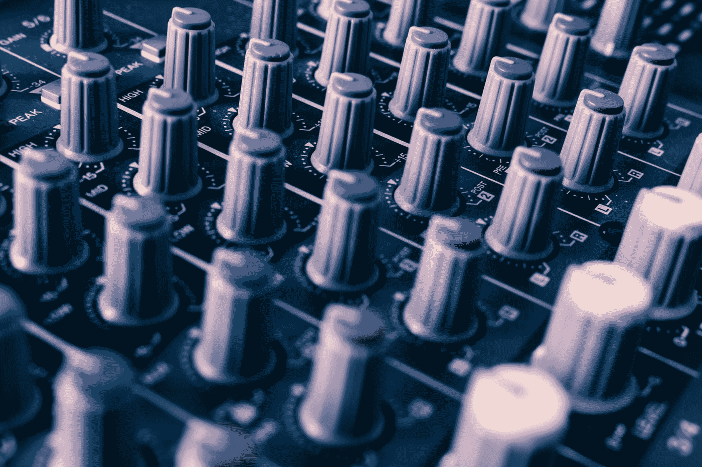
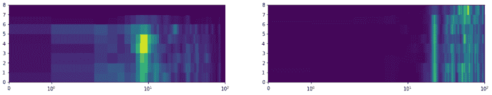
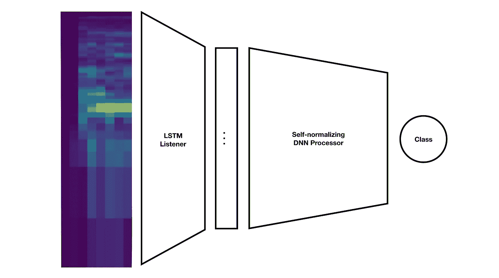
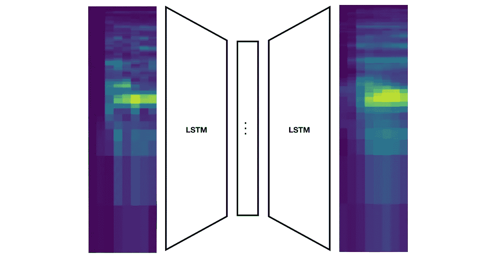
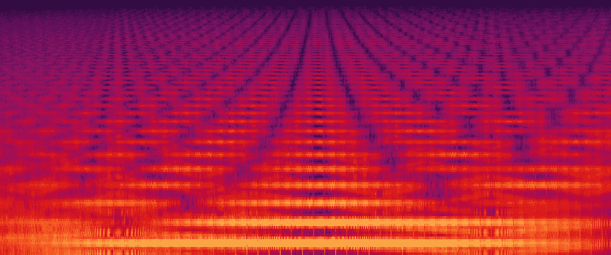

# 人工智能的类人机器听觉(3/3)

> 原文：<https://towardsdatascience.com/human-like-machine-hearing-with-ai-3-3-fd6238426416?source=collection_archive---------10----------------------->

Photo credit: [Malte Wingen](https://unsplash.com/@maltewingen?utm_source=medium&utm_medium=referral)

## 结果和观点。

这是我关于 ***【类人】机器听觉*** 系列文章的最后一部分:用 AI 对人类听觉的部分进行建模来做音频信号处理。

## 本系列的最后一部分将提供:

*   对主要观点的总结。
*   经验测试的结果。
*   相关工作和未来展望。

如果你错过了之前的文章，这里有:

**背景**:[AI 在音频处理上的承诺](/the-promise-of-ai-in-audio-processing-a7e4996eb2ca)
**批评**:[CNN 和 spectrograms 做音频处理有什么问题？](/whats-wrong-with-spectrograms-and-cnns-for-audio-processing-311377d7ccd)
**第一部分** : [具有 AI (1/3)听觉的类人机器](/human-like-machine-hearing-with-ai-1-3-a5713af6e2f8)
**第二部分:** [具有 AI (2/3)听觉的类人机器](/human-like-machine-hearing-with-ai-2-3-f9fab903b20a)

# 总结。

在抽象层次上理解和处理信息不是一件容易的事情。人工神经网络已经在这一领域移山。特别是对于计算机视觉:深度 2D CNN 已经被证明可以捕捉视觉特征的层次，随着网络的每一层，复杂性都在增加。卷积神经网络的灵感来自于大脑皮层，而大脑皮层又受到了人类视觉系统的启发。

人们已经尝试在音频领域重新应用风格转换等技术，但结果很少令人信服。视觉方法似乎不适用于声音。

我认为声音完全是一种不同的动物。在进行特征提取和设计深度学习架构时，这是需要记住的事情。声音表现不同。就像计算机视觉受益于对视觉系统的建模一样，当在神经网络中处理声音时，我们可以受益于考虑人类的听觉。

Photo credit: [Steve Harvey](https://unsplash.com/@trommelkopf?utm_source=medium&utm_medium=referral)

## 声音表现。

为了开始探索建模方法，我们可以建立一个人类基线:

对大脑来说，声音是用光谱表示的。压力波由耳蜗处理，并被分成大约 20-20，000 Hz 范围内的大约 3500 个对数间隔的频带。

声音是以 2-5 毫秒的时间分辨率听到的。比这更短的声音(或声音的间隙)人类几乎察觉不到。

基于这些信息，**我推荐使用一个** [**伽玛通滤波器组**](https://en.wikipedia.org/wiki/Gammatone_filter) 来代替傅立叶变换。 [Gammatone 滤波器组是听觉建模中的常用工具](https://www.sciencedirect.com/science/article/pii/S0165027016302898)，通常，滤波器组允许分离频谱和时间分辨率。**通过这种方式，您可以拥有多个光谱带和一个较短的分析窗口**。

## 内存和缓冲器。

人类被认为具有短期储存感官印象的记忆，以便进行比较和整合。尽管实验结果略有不同，但它们表明人类有大约 0.25-4 秒的回声记忆(专门针对声音的感官记忆)。

> **任何人类能听懂的声音** **都可以在这些限度内表现出来！**

几秒钟的 2-5 ms 窗口，每个窗口有大约 3500 个对数间隔的频带。但这确实积累了大量数据。

Two dilated buffers covering ~1.25s of sound with 8 time steps.

为了减少一点维度，我提出了 ***扩展缓冲区*** 的想法，其中时间序列的时间分辨率随着旧时间步长的增加而降低。这样，可以覆盖更大的时间范围。

Photo credit: [Alireza Attari](https://unsplash.com/@alireza_attari?utm_source=medium&utm_medium=referral)

## 监听器处理器架构。

我们可以**将内耳概念化为一个光谱特征提取器，将听觉皮层概念化为一个分析处理器**，从听觉印象的记忆中导出*“认知属性】*。

在这两者之间，还有一系列经常被遗忘的步骤。[它们被称为*耳蜗核*](https://en.wikipedia.org/wiki/Cochlear_nucleus) 。关于这些我们还有很多不知道的，但是它们对声音做了一种初步的神经编码:对定位和声音识别的基本特征进行编码。

这让我探索了一个 ***监听器-处理器模型*** ，其中声音缓冲区由通用 [LSTM 自动编码器](https://machinelearningmastery.com/lstm-autoencoders/)(一个*)嵌入到一个低维空间，然后被传递到一个特定任务的神经网络(一个 ***【处理器】*** )。这使得 autoencoder 成为一个可重用的预处理步骤，用于对声音进行一些特定任务的分析工作。*

**

*A listener-processor architecture to do sound classification.*

# *结果。*

*我认为这一系列文章提出了一些在神经网络中处理声音的新想法。利用这些原则，我建立了一个模型，使用 [UrbanSound8K 数据集](https://urbansounddataset.weebly.com/urbansound8k.html)进行环境声音分类。*

*由于计算资源有限，我只能勉强接受:*

*   ***100 个伽马酮过滤器。***
*   ***10 ms 分析窗口。***
*   ***8 级扩展缓冲器，覆盖约 1.25 秒的声音。***

*为了训练听者，我将数千个膨胀的缓冲区输入到一个自动编码器中，每边有两个 LSTM 层，将 800 维的连续输入编码到一个 250 维的“静态”潜在空间中。*

**

*An illustration of the LSTM autoencoder architecture.*

*经过大约 50 个时期的训练后，**自动编码器能够捕捉大多数输入缓冲器的粗略结构**。能够产生一种嵌入来捕捉声音中复杂的频率顺序运动是非常有趣的！*

## *但是有用吗？*

*这是要问的问题。为了测试这一点，**我训练了一个 5 层自归一化神经网络，使用来自 LSTM 编码器的嵌入来预测声音类别** (UrbanSound8K 定义了 10 个可能的类别)。*

> *经过 50 代的训练后，该网络预测声音类别的准确率约为 70%。*

*2018 年， [Z .张等人。艾尔。在 UrbanSound8K 数据集](https://arxiv.org/pdf/1808.08405.pdf)上实现了 77.4%的预测准确率。他们通过对γ谱图进行 1D 卷积实现了这一点。随着数据的增加，这种准确性可以被推得更高。我没有资源来探索数据增强，所以我将在系统的非增强版本上进行比较。*

*相比之下，我的方法准确率低了 7.4%。然而，我的技术在 10 ms 的时间范围内工作(通常附带一些内存)，这意味着 70%的准确率涵盖了数据集中声音在任何给定时间的 10 ms 时刻。**这将系统的延迟降低了 300 倍，非常适合实时处理**。简而言之，这种方法不太准确，但在处理时引入的延迟明显更少。*

**

*A “happy accident” I encountered during initial experiments.*

# *视角。*

*完成这个项目确实非常有趣。我希望已经为你提供了一些如何在神经网络中处理声音的想法。虽然我对我的初步结果很满意，但我相信，如果有更好的光谱分辨率和用于训练神经网络的计算资源，这些结果可以得到显著改善。*

*我希望有人会拿起这个，在新问题上用一种**监听器-处理器**的方法进行实验。特别是，我很好奇尝试一种[变分自动编码器](http://kvfrans.com/variational-autoencoders-explained/)方法，看看当它们的潜在空间被调整时，重建的声音会发生什么——也许这可以揭示一些关于声音本身的基本统计特征的直觉。*

# *相关工作。*

*如果您对使用自动编码器的声音表现感兴趣，这里有一些启发了我的项目，我推荐您去看看:*

## *[音字 2Vec](https://arxiv.org/abs/1603.00982)*

*这些人使用 MFCC 和 Seq2Seq 自动编码器研究了一种类似的语音编码方法。他们发现语音结构可以用这种方式充分表达。*

## *[全球音乐翻译网](https://research.fb.com/publications/a-universal-music-translation-network/)*

*这是非常令人印象深刻的，也是我见过的最接近声音风格的转变。它是去年由脸书人工智能研究所发布的。通过使用共享的 WaveNet 编码器，他们将许多原始样本音乐序列压缩到一个潜在空间，然后使用单独的 WaveNet 解码器对每个所需的输出“风格”进行解码。*

## *[用神经网络模拟非线性音频效果](https://arxiv.org/abs/1810.06603v1)*

*马克·马丁内斯和约书亚·赖斯成功地用神经网络模拟了非线性音频效果(如失真)。他们通过使用 1D 卷积来编码原始样本序列，变换这些编码(！)与深度神经网络，然后通过去卷积将这些编码重新合成回原始样本。*

*亲爱的读者，非常感谢你和我一起踏上这段旅程。我对这个系列文章得到的大量积极的、批评性的和信息丰富的回复感到荣幸。*

*忙得不可开交，这篇最后的文章姗姗来迟。现在它已经结束了，我期待着下一章，新的项目和想法来探索。*