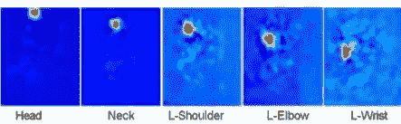

# 人体姿态估计:简化

> 原文：<https://towardsdatascience.com/human-pose-estimation-simplified-6cfd88542ab3?source=collection_archive---------5----------------------->

## 看看人类姿势估计的世界

## 什么是人体姿态估计？

人体姿态估计是计算机视觉领域的一个重要问题。想象一下，能够跟踪一个人的每一个微小动作，并实时进行生物力学分析。这项技术将会产生巨大的影响。应用可能包括视频监控、辅助生活、高级驾驶辅助系统(ADAS)和运动分析。

从形式上讲，姿态估计是从图像或视频中预测一个人的身体部位或关节位置。

Image courtesy Microsoft COCO Dataset (Lin et al., 2014)

## **为什么是这个博客？**

我从事人体姿态估计已经超过 8 个月了。这一领域的研究在广度和深度上都是巨大的。然而，姿势估计方面的大多数文献(研究论文和博客)都相当先进，使得新手很难积累。

姿势估计的未来研究范围是巨大的，创建一个学习斜坡可以让更多的人感兴趣。博客的目的是提供对姿态估计的初步理解，并可能引发对该领域的兴趣。任何之前完全没有计算机视觉经验的人都可以肤浅地关注这个博客。即使是对计算机视觉概念的基本理解，也足以完全理解博客。

# 问题定义

正如我前面说过的，人体姿态估计是一个在深度和宽度上都有大量研究的领域。问题陈述可以基于以下轴进行分类:

## **被跟踪的人数**

根据被跟踪的人数，姿态估计可以分为单人和多人姿态估计。单人姿势估计(SPPE)是两者中较容易的一个，可以保证帧中只有一个人。另一方面，多人姿态估计(MPPE)需要处理额外的人与人之间的遮挡问题。最初的姿态估计方法主要集中在 SPPE，然而随着大规模多人数据集的出现，MPPE 问题最近受到越来越多的关注。

Single-person vs Multi-person Pose Estimation.

## **输入模态**

模态是指不同类型的可用输入。根据获取的难易程度，前三种输入形式是:

*   *红绿蓝(RGB)图像:*我们每天在身边看到的图像，也是姿态估计最常见的输入类型。就输入源的移动性而言，仅处理 RGB 输入的模型比其他模型具有巨大的优势。这是因为普通相机(捕捉 RGB 图像)很容易获得，使它们成为可以在大量设备上使用的模型。
*   *深度(飞行时间)图像:*在深度图像中，像素的值与通过飞行时间测量的距相机的距离有关。像微软 Kinect 这样的低成本设备的引入和流行，使得获取深度数据变得更加容易。深度图像可以补充 RGB 图像，以创建更复杂和精确的计算机视觉模型，而仅深度模型广泛用于关注隐私的地方。
*   *红外(IR)图像:*在红外图像中，像素的值由反射回相机的红外光的量决定。与 RGB 和深度图像相比，基于红外图像的计算机视觉实验很少。微软 Kinect 在录制时也提供红外图像。然而，目前没有包含红外图像的数据集。

RGB image vs Depth image

## **静态图像 vs 视频**

视频只不过是图像的集合，其中每两个连续的帧共享其中存在的大量信息(这是大多数视频压缩技术的基础)。在执行姿态估计时，可以利用视频中的这些时间(基于时间的)依赖性。

对于视频，需要为输入视频序列产生一系列姿态。期望所估计的姿态应该在连续的视频帧之间理想地一致，并且该算法需要在计算上高效以处理大量的帧。对于视频来说，遮挡问题可能更容易解决，因为存在身体部位未被遮挡的过去或未来的帧。

如果时间特征不是流水线的一部分，则可以对视频中的每一帧应用静态姿态估计。然而，由于抖动和不一致性问题，结果通常不如期望的那样好。

Notice the jitter in Single-frame model and the smoothness in Temporal model. Image courtesy Pavllo et al. (2018)

## **2D vs 3D 姿态估计**

根据输出维数的要求，姿态估计问题可以分为 2D 姿态估计和三维姿态估计。2D 姿态估计是预测图像中身体关节的位置(根据像素值)。另一方面，3D 姿态估计预测所有身体关节的三维空间排列作为其最终输出。

2D Pose Estimation vs 3D Pose Estimation

大多数三维姿态估计模型首先预测 2D 姿态，然后尝试将其提升到三维姿态。然而，也存在一些直接预测 3D 姿态的端到端 3D 姿态估计技术。

## **车身模型**

每个姿态估计算法事先都同意一个身体模型。它允许该算法将人体姿态估计问题形式化为估计人体模型参数的问题。大多数算法使用简单的 N 关节刚性运动骨架模型(N 通常在 13 到 30 之间)作为最终输出。形式上，运动学模型可以表示为一个图，其中每个顶点 V 表示一个关节。边 E 可以编码关于身体模型结构的约束或先验信念。

这种模型足以满足大多数应用。然而，对于许多其他应用程序，如角色动画，可能需要更精细的模型。一些技术已经考虑了高度详细的网格模型，用点云表示整个身体。

在早期姿势估计流水线中使用的另一个相当原始的身体模型是基于形状的身体模型。在基于形状的模型中，人体部分使用类似矩形、圆柱、圆锥等几何形状来近似。

Kinematic Model vs Shape-based Model vs Mesh-based Model

## **摄像机数量**

研究的主要部分涉及使用来自单个相机的输入来解决姿态估计问题。然而，有某些算法试图使用来自多个视点/摄像机的数据，将它们组合起来以生成更精确的姿势并更好地处理遮挡。目前对多摄像机姿态估计的研究还比较有限，主要是因为缺少好的数据集。

# 姿态估计流水线

## **预处理**

*   *背景去除:*可能需要从背景中分割出人，或者去除一些噪声。
*   一些算法，特别是在 MPPE，为图像中出现的每个人创建边界框。然后，每个边界框被单独评估人类姿态。

Bounding Box creation. Image courtesy Fang et al. (2017)

*   *摄像机校准和图像配准:*如果使用多个摄像机的输入，则需要进行图像配准。在 3D 人体姿态估计的情况下，相机校准也有助于将报告的地面实况转换成标准世界坐标。

## **特征提取**

机器学习中的特征提取指的是从原始数据(如我们案例中的图像或视频)中创建导出值，这些值可以用作学习算法的输入。特征可以是显式的，也可以是隐式的。显式特征包括传统的基于计算机视觉的特征，如梯度方向直方图(HoG)和尺度不变特征变换(SIFT)。在将输入馈送到下面的学习算法之前，显式地计算这些特征。

Left : Image along with corresponding color gradients, Right : Image with SIFT features

隐式特征是指基于深度学习的特征映射，如来自复杂深度卷积神经网络(CNN)的输出。这些特征地图从来不是明确创建的，而是端到端训练的完整管道的一部分。

VGG16 : A CNN based feature extraction and image classification architecture

## **推论**

**置信图:**预测关节位置的常用方法是为每个关节生成置信图。置信度图是图像上的概率分布，表示每个像素处的联合位置的置信度。

Confidence map examples

*   *自下而上方法:*自下而上方法包括首先检测图像中一个或多个人的部位或关节，然后将这些部位组合在一起，并将它们与特定的人相关联。
    简单来说，该算法首先预测图像中出现的所有身体部位/关节。典型地，这之后是基于身体模型的图形公式，其连接属于同一个人的关节。整数线性规划(ILP)或二分匹配是创建此图的两种常见方法。

Cao et al. complete pipeline. An example of a bottom up approach. Image courtesy Cao et al. (2017)

*   *自顶向下方法:*自顶向下方法在开始时包括分割步骤，首先将每个人分割成一个边界框，然后在每个边界框上单独执行姿态估计。
    自顶向下的姿态估计可以分为基于生成人体模型的方法和基于深度学习的方法。基于生成人体模型的方法包括尝试在图像上拟合人体模型，允许最终预测像人类一样。基于深度学习的方法直接预测关节位置，因此最终的预测不能保证像人类一样。

Fang et al. complete pipeline. An example of a top down approach. Image courtesy Fang et al. (2017)

## **后处理**

许多算法，包括自底向上和自顶向下的方法，在最终输出上没有关系约束。通俗地说，从输入图像预测关节位置的算法没有任何关于拒绝/校正不自然的人类姿势的过滤器。这有时会导致怪异的人体姿态估计。

Pose Estimation using Kinect containing weird and unnatural pose

为了解决这个问题，存在一组后处理算法，其拒绝不自然的人类姿态。来自任何姿势估计管道的输出姿势通过学习算法，该算法基于其可能性对每个姿势进行评分。在测试阶段，得分低于阈值的姿势会被忽略。

# 数据集

人体姿态估计中几种常用数据集简介。

*   **MPII:**MPII 人体姿态数据集是一个多人 2D 姿态估计数据集，包括从 Youtube 视频收集的近 500 个不同的人体活动。MPII 是第一个包含如此多样姿态的数据集，也是第一个在 2014 年发起 2D 姿态估计挑战的数据集。
*   **COCO:**COCO 关键点数据集是一个多人 2D 姿势估计数据集，图像从 Flickr 收集。COCO 是迄今为止最大的 2D 姿态估计数据集，并且正在考虑测试 2D 姿态估计算法的基准。
*   **HumanEva :** HumanEva 是一个单人 3D 姿态估计数据集，包含使用多个 RGB 和灰度相机记录的视频序列。使用基于标记的运动捕捉(mocap)相机来捕捉地面真实 3D 姿态。HumanEva 是第一个大尺寸的 3D 姿态估计数据集。
*   **Human3.6M :** Human3.6M 是单人 2D/3D 姿态估计数据集，包含使用 RGB 和飞行时间(深度)相机记录的视频序列，其中 11 个演员正在执行 15 种不同的可能活动。使用 10 个 mocap 相机获得 3D 姿态。Human3.6M 是迄今为止最大的真实 3D 姿态估计数据集。
*   **超现实:**超现实是一个单人 2D/3D 姿态估计数据集，包含使用实验室记录的 mocap 数据创建的虚拟视频动画。超现实是最大的 3D 姿态估计数据集，但是还没有被接受作为比较 3D 姿态估计算法的基准。这主要是因为它是一个合成数据集。

# 结论

人体姿态估计是一个不断发展的学科，有机会在各个领域进行研究。最近，在人体姿态估计中有一个值得注意的趋势，即转向使用深度学习，特别是基于 CNN 的方法，因为它们在任务和数据集上的优异性能。深度学习成功的一个主要原因是大量训练数据的可用性，特别是随着 COCO 和 Human3.6M 数据集的出现。

如果您有兴趣进一步阅读和更详细地探索人体姿态估计，请查看这些资源。

 [## 姿势估计指南

### 现在我们知道了一点什么是姿态估计，不同类型的姿态估计之间的区别，以及…

www.fritz.ai](https://www.fritz.ai/pose-estimation/) 

*这个博客是努力创建机器学习领域简化介绍的一部分。点击此处查看完整系列*

 [## 机器学习:简化

### 在你一头扎进去之前就知道了

medium.com](https://medium.com/@prakhargannu/machine-learning-simplified-1fe22fec0fac) 

或者只是阅读系列的下一篇博客

 [## 卷积核的类型:简化

### 对迷人的 CNN 层的不同变化的直观介绍

towardsdatascience.com](/types-of-convolution-kernels-simplified-f040cb307c37) 

## **参考文献**

*[1]曹，哲，等，“基于局部亲和场的实时多人二维姿态估计”IEEE 计算机视觉和模式识别会议录。2017.
【2】微软公司。xbox 360 版 kinect，2009 年。
[3] Pavllo，Dario 等人，“视频中的三维人体姿态估计，采用时间卷积和半监督训练。”arXiv 预印本 arXiv:1811.11742 (2018)。
[4]方，郝舒，等，“Rmpe:区域多人姿态估计”IEEE 计算机视觉国际会议论文集。2017.
[5]林、梅尔、贝隆吉、海斯、佩罗娜、拉马南、杜尔和兹尼克。微软 coco:上下文中的公共对象。在欧洲计算机视觉会议上，第 740-755 页。斯普林格，2014。*