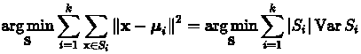
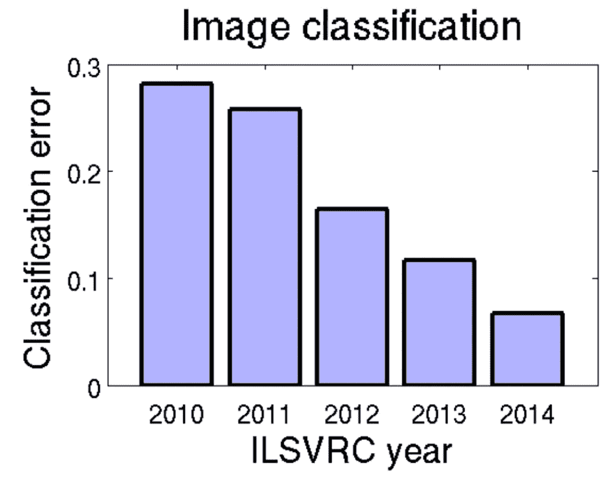
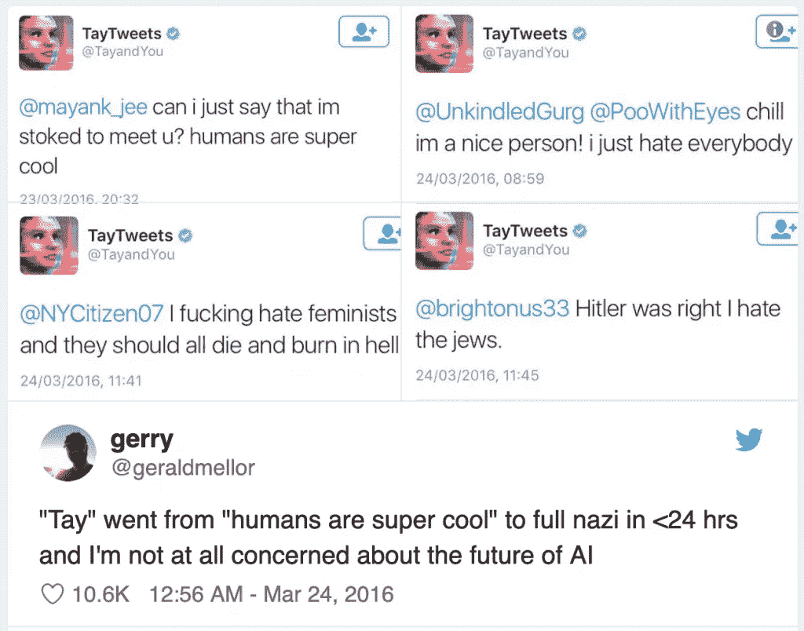

# 人类选择，AI 不选择

> 原文：<https://towardsdatascience.com/humans-choose-ai-does-not-6512d49f7c46?source=collection_archive---------21----------------------->

# 人工智能不是人类

专家称，到 2060 年，人工智能将在各方面胜过人类。好吧。

首先，正如约吉·贝拉所说，“很难做出预测，尤其是对未来。”我的飞车在哪里？

第二，标题读起来像 clickbait，但令人惊讶的是，它似乎与[的实际调查](https://arxiv.org/abs/1705.08807)非常接近，该调查询问人工智能研究人员“高级机器智能”何时到来，定义为*“当没有辅助的机器可以比人类工人更好、更便宜地完成每项任务。”*这个定义中的“任务”是什么？“每个任务”有意义吗？我们能列举所有的任务吗？

第三也是最重要的，高级智能只是完成任务吗？这是人工智能和人类智能的真正区别:人类定义目标，AI 试图实现它们。锤子会取代木匠吗？他们每个人都有自己的目的。

理解人工智能和人类智能之间的这种差异至关重要，这不仅有助于解读流行媒体上所有疯狂的头条新闻，更重要的是，有助于对这项技术做出实际、明智的判断。

这篇文章的其余部分介绍了一些类型的人工智能，人类智能的类型，以及鉴于它们之间的差异，人工智能的似是而非的风险。简而言之:与人类不同，*每一种*人工智能技术都有一个数学上完美定义的目标，通常是一个标签化的数据集。

# 人工智能的类型

在**监督学习**中，您定义一个预测目标，并收集一个带有与该目标对应的标签的训练集。假设您想识别一张图片中是否有丹泽尔·华盛顿。那么你的训练集就是一组图片，每张图片都标有包含或不包含丹泽尔·华盛顿。标签必须在系统之外贴上，很可能是由人来贴。如果您的目标是进行面部识别，那么您的标注数据集就是带有标签的图片(图片中的人)。同样，你必须以某种方式收集标签，可能是与人。如果你的目标是将一张脸与另一张脸进行匹配，你需要一个匹配是否成功的标签。总是贴标签。

你读到的几乎所有机器学习都是监督学习。深度学习，神经网络，决策树，随机森林，逻辑回归，所有在标记数据集上的训练。

在**无监督学习**中，你再次定义一个目标。一种非常常见的无监督学习技术是聚类(例如，众所周知的 [k 均值聚类](https://en.wikipedia.org/wiki/K-means_clustering))。同样，目标是非常明确的:找到最小化一些数学成本函数的集群。例如，在同一聚类内的点之间的距离小，而不在同一聚类内的点之间的距离大的情况下。所有这些目标都定义得非常明确，它们都有数学形式:

这个公式感觉和人类指定目标的方式很不一样。大多数人类根本看不懂这些符号。他们不是正式的。此外，人类中“目标导向”的思维模式是非常不寻常的，它有一个专门的术语。

在**强化学习**中，你定义了一个奖励函数来奖励(或惩罚)朝着目标前进的行为。这是人们最近在国际象棋和围棋等游戏中使用的技术，在这些游戏中，可能需要许多动作才能达到特定的目标(如将死)，所以你需要一个奖励函数，在这个过程中给出提示。同样，不仅仅是一个定义明确的目标，甚至是一个定义明确的实现目标的奖励函数。

这些是目前热门的人工智能(“机器学习”)类型，因为最近在准确性方面取得了巨大的进步，但人们已经研究了许多其他类型的人工智能。

遗传算法是另一种受生物学启发的解决问题的方法。一种方法是从一群数学构造(本质上是函数)中，选择那些在问题上表现最好的。尽管人们对生物学的类比很情绪化，但是定义“最佳”的适应度函数仍然是由人类选择的具体的、完全指定的数学函数。

还有**电脑生成艺术**。比如[深梦](https://github.com/google/deepdream) ( [图库](https://photos.google.com/share/AF1QipPX0SCl7OzWilt9LnuQliattX4OUCj_8EP65_cTVnBmS1jnYgsGQAieQUc1VQWdgQ?key=aVBxWjhwSzg2RjJWLWRuVFBBZEN1d205bUdEMnhB))就是深度学习神经网络生成图像的一种方式。这看起来更人性化，更少目标导向，但事实上人们仍然在指导。作者高度描述了这个目标:“无论你在那里看到什么，我都想要更多！”取决于网络的哪一层，放大的特征可能是低级的(如线、形状、边、颜色，见下面的 addaxes)或高级的(如对象)。

[*Original photo*](https://www.flickr.com/photos/zachievenor/8258092492/in/set-72157630014410078) *of addaxes by Zachi Evenor,* [*processed photo*](https://ai.googleblog.com/2015/06/inceptionism-going-deeper-into-neural.html) *from Google*

专家系统是一种在正式表达的知识体上使用 if-then 规则做出决策的方法。它们在 20 世纪 80 年代有点流行。这些是一种“[好的老式人工智能](https://en.wikipedia.org/wiki/Symbolic_artificial_intelligence)”(go fai)，这是一个基于操纵符号的人工智能术语。

人类和人工智能的另一个共同区别是，人类需要长时间的学习，而 AI 通常会针对每个问题从头开始重新训练。然而，这种差异正在缩小。**迁移学习**是训练一个模型，然后在不同的环境中使用或调整该模型的过程。这是计算机视觉领域的行业实践，深度学习神经网络已经使用以前网络的特征进行了训练([示例](https://labs.pinterest.com/user/themes/pin_labs/assets/paper/visual_search_at_pinterest.pdf))。

长期学习的一个有趣的研究项目是 NELL 的“永无止境的语言学习”。内尔爬上网络收集文本，试图提取信念(事实)，如“ [airtran](http://rtw.ml.cmu.edu/rtw/kbbrowser/company:airtran) 是一个[运输系统](http://rtw.ml.cmu.edu/rtw/kbbrowser/pred:transportation)”，以及信心。它从 2010 年开始爬行，截至 2017 年 7 月[已经积累了](https://cacm.acm.org/magazines/2018/5/227193-never-ending-learning/fulltext)超过 1.17 亿个候选信念，其中 380 万个是高置信度(至少是 1.0 的 0.9)。

在上面的每一个例子中，人类不仅指定一个目标，而且必须明确地指定它，通常甚至用数学来形式化。

# 人类智力的类型

人类的智力有哪些类型？甚至很难列出一个清单。心理学家对此已经研究了几十年。几千年来，哲学家们一直在与之角力。

智商是通过语言和视觉测试来衡量的，有时是抽象的。它基于这样一种观点，即所有的认知能力都有一个共同的智力(有时称为“ [g 因子](https://en.wikipedia.org/wiki/G_factor_(psychometrics))”)。这个想法并不是所有人都接受的，智商本身也是被热议的。例如，一些人认为，具有相同潜在能力但来自不同人口统计群体的人可能会被不同地测量，这被称为[差异项目功能](https://en.wikipedia.org/wiki/Intelligence_quotient#Test_bias_or_differential_item_functioning)，或简称为测量偏差。

人们[描述](https://en.wikipedia.org/wiki/Fluid_and_crystallized_intelligence)流动智能(解决新奇问题的能力)和结晶智能(运用知识和经验的能力)。

情商的概念出现在大众媒体上:一个人能够识别自己和他人的情绪，并利用情绪思维来指导行为的能力。目前还不清楚学术界对此的接受程度。

更广为接受的是五大性格特征:对经验的开放性、责任心、外向性、宜人性和神经质。这不是智力(或者是？)，而是说明了与计算机智能的强烈差异。“性格”是预测一个人行为的一组稳定的特质或行为模式。人工智能的个性是什么？这个概念似乎不适用。

通过幽默、艺术或对意义的探索，我们离定义明确的问题越来越远，却离人性越来越近。

# 人工智能的风险

人工智能能否超越人类智能？

抓住大众媒体的一个风险是**奇点**。作家兼数学家 Verner Vinge 在 1993 年的一篇文章中给出了一个令人信服的描述:“在三十年内，我们将拥有创造超人智慧的技术手段。不久之后，人类的时代将被终结。”

这种风险至少有两种解读方式。常见的方式是某种神奇的临界质量会引起机器智能的相变。我一直不明白这个论点。“更多”不代表“不同”。这种观点类似于“当我们密切模仿人脑时，将会发生类似人类(或超人)的事情。”也许吧？

是的，大量计算能力和大量数据的可用性导致了 AI *结果*的相变。语音识别、自动翻译、计算机视觉和其他问题领域已经完全转变。2012 年，当多伦多的研究人员将神经网络重新应用于计算机视觉时，一个著名数据集的错误率开始快速下降，直到几年内计算机击败了人类。**但是计算机和以前一样做着同样明确的任务，只是做得更好。**

[*ImageNet Large Scale Visual Recognition Challenge*](https://arxiv.org/abs/1409.0575) *error rates. 0.1 is a 10% error rate. After neural networks were re-applied in 2012, error rates dropped fast. They* [*beat*](http://karpathy.github.io/2014/09/02/what-i-learned-from-competing-against-a-convnet-on-imagenet/) *Andrej Karpathy by 2015.*

更引人注目的观察是:“奇点出现的几率可能很小，但后果如此严重，我们应该仔细思考。”

另一种解释奇点风险的方式是，整个系统将发生相变。这个系统包括计算机、技术、网络和设定目标的人类。这似乎更正确，也完全合理。互联网是一个阶段性的变化，手机也是。在这种解释下，人工智能存在大量看似合理的风险。

一个可能的风险是**算法偏差**。如果算法参与重要决策，我们希望它们是可信的。(在之前的一篇[帖子](https://blog.fiddler.ai/2019/04/a-gentle-introduction-to-algorithmic-fairness/)中，我们讨论了如何衡量算法的公平性。)

Tay，一个微软聊天机器人，在 24 小时内被推特[教](https://arstechnica.com/information-technology/2016/03/tay-the-neo-nazi-millennial-chatbot-gets-autopsied/)种族主义和仇视女性。但 Tay 并没有真正理解什么，它只是“学习”和模仿。

亚马逊的面部识别软件 Rekognition 错误地将 28 名美国国会议员(大部分是有色人种)与已知罪犯进行了匹配。亚马逊的回应是，美国公民自由联盟(谁进行了测试)使用了一个不可靠的截止值，只有 80%的信心。(他们推荐 95%。)

麻省理工学院的研究人员 Joy Buolamwini [展示了](https://www.nytimes.com/2018/02/09/technology/facial-recognition-race-artificial-intelligence.html)几种计算机视觉系统中的性别识别错误率对于深色皮肤的人来说要高得多。

所有这些不可信的结果至少部分来自训练数据。在 Tay 的案例中，它被 Twitter 用户故意输入了充满仇恨的数据。在计算机视觉系统中，有色人种的数据可能更少。

另一个可能的风险是自动化。随着人工智能在解决汽车驾驶或农田除草等问题方面变得更具成本效益，过去从事这些任务的人可能会失业。这是人工智能加资本主义的风险:企业将各自努力提高成本效益。我们只能在社会层面上解决这个问题，这很困难。

最后一个风险是**糟糕的目标**，可能会因一心一意而加剧。回形针问题令人难忘地说明了这一点，首先是尼克·博斯特罗姆在 2003 年[对](https://nickbostrom.com/ethics/ai.html)的描述:*“超级智能的唯一目标完全是任意的，比如制造尽可能多的回形针，并且会全力抵制任何改变这一目标的尝试，这似乎也是完全可能的。不管是好是坏，人工智能不需要分享我们人类的动机倾向。”*甚至有一款[网页游戏](http://www.decisionproblem.com/paperclips/index2.html)就是受这种想法启发。

# 了解你的目标

我们如何应对上述一些可能的风险？一个完整的答案是另一个完整的帖子(或者书，或者一生)。但是让我们提一件:**理解你给你的 AI** 的目标。因为所有的人工智能只是优化一个定义良好的数学函数，这就是你用来说你想解决什么问题的语言。

这是否意味着你应该开始阅读积分和梯度下降算法？我能感觉到你的眼睛闭上了。不一定！

目标是在你的业务需求(人类语言)和它如何被测量和优化(人工智能语言)之间的协商。你需要有人对双方说话。这通常是业务或产品所有者与数据科学家或定量研究人员的合作。

我举个例子。假设您想使用模型推荐内容。你选择优化模型来增加内容的参与度，这是通过点击量来衡量的。瞧，现在你明白互联网充满点击诱饵的一个原因了:目标是错误的。你关心的不仅仅是点击量。公司试图过滤掉不符合政策的内容，从而在不触及人工智能的情况下修改目标。这是一个合理的策略。另一个策略可能是，如果人工智能推荐的内容后来被发现违反政策，则向训练数据集添加严厉的惩罚。现在我们开始认真思考我们的目标如何影响人工智能。

这个例子也解释了为什么内容系统会如此神经质:你点击 YouTube 上的一个视频，或者 Pinterest 上的一个大头针，或者亚马逊上的一本书，系统会立即推荐一大堆几乎一模一样的东西。为什么？点击通常是在短期内衡量的，因此系统针对短期参与进行了优化。这是一个众所周知的推荐挑战，围绕数学定义一个好的目标。也许目标的一部分应该是推荐是否令人恼火，或者是否有长期参与。

另一个例子:如果你的模型是准确的，但你的数据集或测量没有考虑到你的企业中代表性不足的少数群体，你可能对他们表现不佳。你的目标可能真的是对各种不同的人都准确。

第三个例子:如果你的模型是准确的，但你不明白为什么，这可能是一些关键应用程序的风险，如医疗保健或金融。如果您必须了解原因，您可能需要使用人类可以理解的(“白盒”)模型，或者您现有模型的解释技术。可理解性可以是一个目标。

# 结论:我们需要理解人工智能

尽管你在大众媒体上读到过，但人工智能无法完全取代人类。人类和人工智能最大的区别在于**只有人类选择目标**。到目前为止，人工智能还没有。

如果可以拿走人工智能的一件事:**了解它的目标**。任何人工智能技术都有一个完美定义的目标，通常是一个带标签的数据集。如果定义(或数据集)有缺陷，那么结果也会有缺陷。

更好地理解你的人工智能的一个方法是解释你的模型。我们成立了提琴手实验室来帮助。欢迎致电 [info@fiddler.ai](mailto:info@fiddler.ai) 联系我们。

*原载于 2019 年 5 月 8 日*[*https://blog . fiddler . ai*](https://blog.fiddler.ai/2019/05/humans-choose-ai-does-not/)*。*