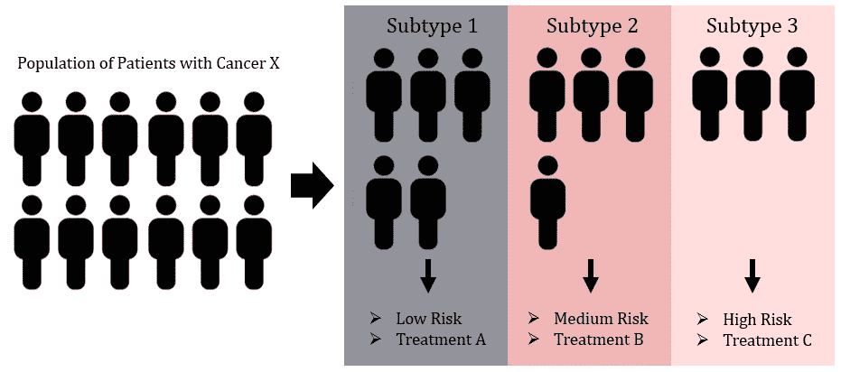
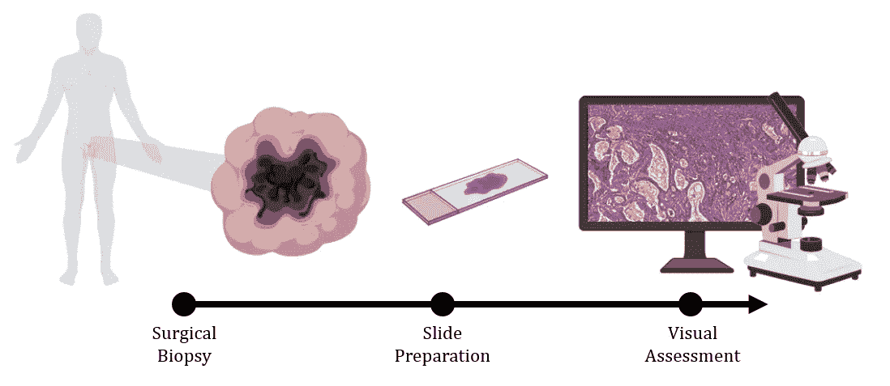
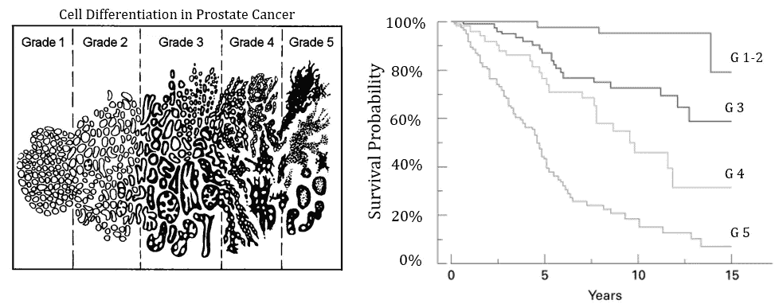
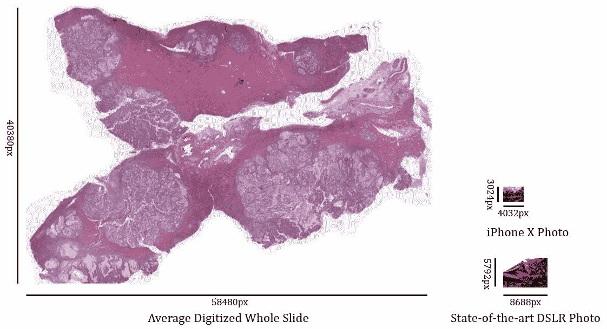
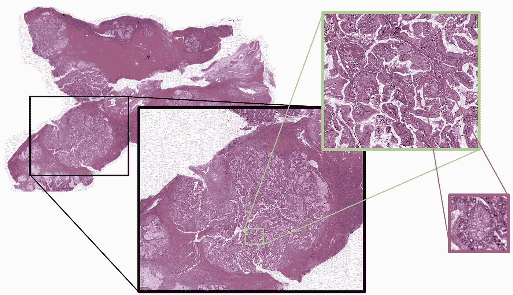
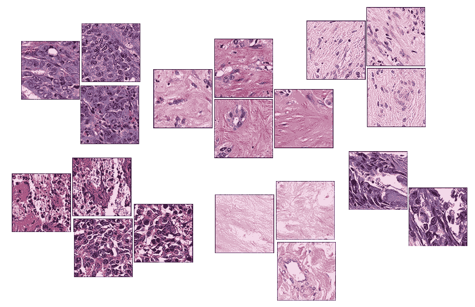

# 人类一直在努力了解罕见的癌症，让我们给人工智能一个机会。

> 原文：<https://towardsdatascience.com/humans-have-struggled-to-understand-rare-cancers-lets-give-artificial-intelligence-a-turn-d9b180b29805?source=collection_archive---------18----------------------->

## 癌症分型的挑战&人工智能如何帮助

被诊断患有一种罕见的癌症，如肝内胆管癌，会有一定程度的孤独感。大多数人甚至不知道癌症发生在哪里。这是一种胆管癌，一组从肝脏伸出的管状结构，[在美国的发病率为 14 万分之一](https://www.ncbi.nlm.nih.gov/pubmed/27000463)。

因为 ICC 由于其罕见性而没有得到很好的研究，医生不能真正参考以前的病例来预测新患者的结果。存活时间可以从几个月[到几年](https://www.spandidos-publications.com/10.3892/or.2013.2290)不等，没有办法知道患者将属于哪个存活组——没有已知的遗传或细胞标记来预测这一点。拥有这样的生存标记是很重要的，不仅对于患者通过了解他们可能的结果来亲自适应他们未来的生活，而且对于他们的医生决定治疗也是如此。

对 ICC 进行“分型”,或者从整体上发现癌症中的亚组，可以帮助缓解这个问题，我将在下一节进一步解释。然而，这是一项艰巨的任务。研究人员可以花费长达几十年的时间进行体力劳动来对癌症进行分型，但仍然可能失败，因为没有足够的病例来做出有力的科学结论。随着最近人工智能(AI)的蓬勃发展，我们现在有能力自动化重复的过程，理解复杂的视觉数据，并从甚至很小的数据集中提取有价值的信息。人工智能提供了新的工具，最终可以更深入地了解罕见的癌症，并在未知的黑暗中给患者带来一些光明。

## 癌症的亚型是什么意思？

抗击癌症的最大困难之一源于这种疾病在人群中表现出的多样性。由于肿瘤之间的遗传变异，患有相同类型癌症的两个患者可能具有显著不同的生存结果和治疗方案。

为了促进治疗决策，临床医生根据细胞，有时是基因特征将每种癌症分成亚组——这被称为癌症的亚类型。在一个很好的分型癌症中，每个亚组中的所有患者应该具有相似的疾病严重程度和生存结果，当与来自同一癌症的不同亚组的患者比较时，这是不同的。

能够根据疾病的严重程度和肿瘤生物学的差异对患者进行比较和分组，对于确定适当的治疗和预测新患者的生存结果非常重要。这项任务主要由病理学家来完成，病理学家是一名临床医生，接受过在显微镜下观察组织以描述疾病特征的训练。

当患者被诊断患有癌症时，通常的程序是对癌块进行活组织检查以了解其细胞和结构组成。该组织将[准备在显微镜载玻片](https://bitesizebio.com/13398/how-histology-slides-are-prepared/)上可视化，以更好地突出细胞形态。

例如，前列腺肿瘤的组织样本有五种主要模式，主要由癌细胞的“分化”程度，或者更简单地说，它们与正常细胞的相似程度来定义。分化良好的细胞生长缓慢，表明这是一种早期的、侵袭性较低的疾病。分化差的细胞表明更多的细胞死亡，或更具侵袭性的癌症，以及更差的生存结果。这五种分类模式用于创建 Gleason 评分，这是一种国际公认的前列腺癌疾病分期工具。

Survival probability of prostate cancer patients over 15 years. Those with a higher Gleason Score (G) have a lower probability of survival as time progresses. [1]

对于前列腺癌，亚型与细胞分化直接相关。同样的规则不一定适用于其他种类的癌症。例如，在某些皮肤癌中，典型特征之一是细胞伸长。

## 亚型是如何被发现的？

前列腺癌有一个最完善的分型方案。前列腺癌分型最初是由明尼阿波利斯弗吉尼亚州医疗中心的病理学主任[Donald Gleason](https://en.wikipedia.org/wiki/Donald_Gleason)博士在 20 世纪 60 年代开始的 20 年中提出的。为了使前列腺癌患者的护理标准化，他亲自观察了数千个组织样本，并记录了复发模式，以与他们已知的生存结果进行比较。通过多次修改和多年的验证，我们有了今天所知的[前列腺亚型](https://en.wikipedia.org/wiki/Gleason_grading_system)。

通过根据病理将患者分组来对癌症进行分型是一项具有挑战性的工作，并且极其耗时。看一张显微镜载玻片就像在谷歌地图上看整个纽约市，纽约市的每条街道代表一组细胞。想象一下看着成千上万像格里森一样的人！此外，一个病理学家可能会看到与另一个病理学家不同的东西——人类偏见是另一个需要克服的因素。

罕见癌症面临另一个挑战。与前列腺癌医学不同，前列腺癌医学有一个定义明确的分级系统，不幸的是发生率很高，而罕见癌症则没有。通常情况下，一个研究机构没有足够大的样本数据集来对组织中所有发生的模式进行全面分析。

## 计算病理学能有什么帮助？

计算病理学和基于人工智能的模型为使用传统方法对癌症进行分型的挑战提供了答案。虽然人类可能需要数年时间来评估数千张幻灯片，但最先进的图形处理单元(GPU)可以在不到一周的时间内完成。此外，人工智能模型有可能从小型数据集提取更多信息，首次为开发罕见癌症的亚型开辟了可能性。

肝内胆管癌是一种罕见的原发性胆管肝癌。由于其罕见性，这种癌症没有确定的亚型，使得治疗决策变得困难。

[我们在纪念斯隆-凯特琳癌症中心的计算病理学小组](http://thomasfuchslab.org)最近发表了一份[预印本](https://arxiv.org/abs/1903.05257)，检查了 246 张 ICC 的数字化切片，并建立了一个基于人工智能的模型，以在数据集内搜索潜在的亚型【2】。尽管案件数量看似不多，但它是国际商会在世界上最大的数据集。

我们的新算法类似于人类病理学家。使用类似于自动驾驶汽车如何识别道路上不同特征的方法，我们的算法首先查看所有数字化的幻灯片，并在所有患者的所有组织中找到视觉上相似的模式。接下来，我们使用统计分析将这些模式与每个患者的已知生存结果进行比较。例如，如果假设每个模式都是一个亚型的指标，该分析将评估有多少患者的组织包含每个模式时具有高复发风险。

在这种情况下，人工智能可以帮助那些超负荷工作且供不应求的病理学家，同时以积极的方式为医学研究做出贡献。在未来，直到癌症不再存在于这个地球上，面对 ICC 和其他罕见癌症的不幸诊断的人们将对未来有更好的理解。

点击此处阅读关于该研究的详细信息[。](https://arxiv.org/abs/1903.05257)

哈桑·穆罕默德是纪念斯隆-凯特琳癌症中心和威尔·康奈尔医学院的博士生。他是托马斯·富克斯实验室(Thomas Fuchs Lab)*的成员，该研究小组致力于开发人工智能模型，以改善医学图像分析和癌症研究。这项工作得到了安珀·辛普森博士的* [*生存周期*](https://www.cycleforsurvival.org) *资助。*

**参考文献**

1.  格里森评分对前列腺癌的预后价值。 *BJU 国际*89.6(2002):538–542。
2.  迈向无监督的癌症分型:使用组织学视觉字典预测预后。 *arXiv 预印本 arXiv:1903.05257* (2019)。