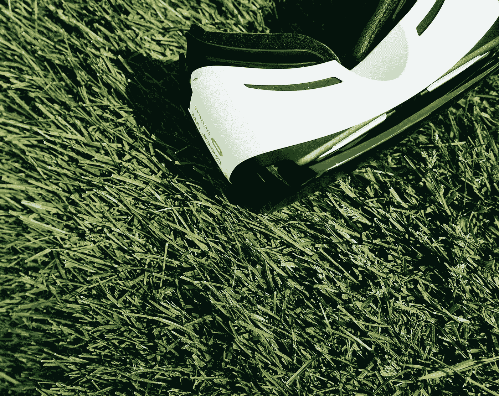

# 人类、机器和教育的未来

> 原文：<https://towardsdatascience.com/humans-machines-and-the-future-of-education-b059430de7c?source=collection_archive---------20----------------------->

## 人工智能和新兴技术能让我们变得更聪明吗？

德克·克内梅尔和乔纳森·福利特

Figure 01: Education became formalized to accelerate our understanding of difficult, complicated, or abstract topics. [Illustration: “The School Teacher”, Albrecht Dürer, 1510 woodcut, National Gallery of Art, Open Access]

人类是如何学习的？我们的第一次学习是体验性的:对我们自己和我们周围的子宫之间的相互作用做出反应。体验式学习甚至延伸到子宫之外，延伸到我们的启蒙老师——我们的母亲和其他有意或无意给我们留下印象的人——唱首歌，让自己感动。事实上，我们在人类历史上所做的许多学习都是这种简单生活的刺激-反应模型，并且在这个过程中，继续学习。这种经验学习的固有模式对很多事情都适用，比如如何对待他人，如何划船，或者去哪里找淡水。然而，在帮助我们掌握语法、哲学和化学等更微妙的东西时，它就不那么有效了。它完全不足以教授我们高度复杂的知识领域，如理论物理。这就是为什么教育变得形式化的一个原因——加速，甚至仅仅是使我们对困难、复杂或抽象的主题的理解成为可能。

在西方，正规教育在大学达到了现代的顶峰，其起源可以追溯到 11 世纪的意大利博洛尼亚。高等教育植根于基督教教育和僧侣教育的延伸——其本身来自佛教传统和远东——从历史上看，高等教育是少数特权阶层的知识绿洲。融入巴黎、牛津和布拉格等城市，虽然大学是自己的地方和空间，但它生活在一个更大的城市和社区中，并成为其中的一部分。关注的焦点是艺术，这个术语的用法与我们今天所想的非常不同，它包括七种艺术的全部或子集:算术、几何、天文学、音乐理论、语法、逻辑和修辞学。

今天的大学经历看起来非常不同。学科数量激增，“艺术和科学”仅代表一所大学中的一个“学院”——几十年来，与商业和工程等更实用的应用知识相比，这个学院的重要性一直在下降。现在比以往任何时候都有更多的公民进入高等教育机构，知识已经大大民主化，尽管它对于仅仅维持简单的生活变得越来越重要。而且，在大多数情况下，随着我们的世界变得越来越世俗，大学，尤其是你的学校的宗教根源被隐藏或淡化了。大约一千年来，这些变化以不同的速度和方式发生。虽然差异是显著的，并且反映了知识和文明的进化方式，但考虑到所涉及的时间长度，我们甚至可以认为这些变化是适度的。

Figure 02: Historically, an oasis of knowledge for the privileged few, the university was integrated into cities such as Paris, Oxford, and Prague. [Illustration: “University”, Themistocles von Eckenbrecher, 1890 drawing, National Gallery of Art, Open Access]

当然，鉴于近几十年来技术的快速变化及其对经济和社会的影响，正规教育已经过时了。正规教育设计在一个模拟的世界里，强迫每个人都学习相同的课程，不同的科目以差不多相同的方式被教授，充其量只能说是笨拙地进行。出现了各种不同的哲学和教学法，它们引入了不同的学习方法，但这些方法并不是平均分布的。标准的教育方法可能是令人麻木的死记硬背——每个教授有数百名学生的大礼堂。不考虑这些障碍，我们渴望一种更好的方式。下一波重大的教育创新看起来将会是极端的。在未来的几十年里，我们可以期待人工智能和其他新兴技术的融合，以及对我们人类动物——我们如何学习、如何生活、如何参与互联人的社会——不断增加的知识，将彻底改变教育。

在一个新兴技术的世界里，教育将会发生怎样的变化？人工智能将如何协助、增强、管理、调节以及改变驱动人类学习的复杂互动？通过检查当前正规教育模式中的一些差距，我们可以看到这种技术能够并将发挥重要作用的一些地方。事实上，这些变化的痕迹已经在这里，就在我们面前。

## **人工智能与个性化课程之路**

KGI[Minerva Schools](https://www.minerva.kgi.edu/)的创始人本·尼尔森(Ben Nelson)支持互联教育，这种教育利用技术的信息共享能力，采用系统思维方法，认为将体验的各个部分联系在一起非常重要。Minerva 学校的理念和结构是对未来教育的启发。“在未来的教育系统中，在线人工智能和虚拟现实平台将在知识传播中变得非常重要。教育应该教会我们变得更加灵活，并提供变革的工具，”尼尔森在[ESADE 商学院组织的关于教育未来的小组讨论](https://www.esade.edu/en/news/minerva-ceo-ben-nelson-artificial-intelligence-and-virtual-reality-will-become-more-important-education-system-future/20212)中说道。尼尔森表示，这种模式转变“将带来更个性化的学习体验，为每个学生带来更好的用户体验。”

为每个学生定制课程的第一步已经在实地进行了。出于这个目的，有许多公司正在为教育市场开发人工智能驱动的软件。虽然人工智能可以提供初步评估和学习任务，但人类合作也是一个重要因素。教师可以与这些工具协同工作，并可以修改甚至覆盖建议，以更好地适应学生。例如，总部位于纽约的电子学习公司 [Knewton](https://www.knewton.com/) 使用人工智能自适应学习技术来识别学生现有知识的差距，并为包括数学、化学、统计和经济学在内的各种学科提供最合适的课程。超过 1400 万学生已经学习了 Knewton 的课程。来自 [Cognii](http://www.cognii.com/) 的 EdTech 软件使用由人工智能驱动的虚拟学习助手驱动的对话来辅导学生并实时提供反馈。Cognii 虚拟助手是根据每个学生的需求定制的。来自匹兹堡的专注于数学的 [Carnegie Learning](https://www.carnegielearning.com/) 开发了一种智能教学设计，使用人工智能在正确的时间向学生提供正确的主题，实现了完全个性化的学习、测试和反馈周期。这些例子虽然还处于萌芽阶段，但表明了人工智能支持的个性化学习的推进，随着时间的推移，这将改变正规教育的面貌。

## **优化教育体验，从被动学习到主动学习**

然而，就教育交付的变化而言，个性化只是冰山一角。为了深入了解正规教育在未来将如何进一步转变，我们采访了尼尔森，他谈到了 Minerva 学校的学习理念:“如果你想到学院或大学中的传统教育，你会想到它是由真正独立的单元组成的集合体，”尼尔森说。“你在学校里学了 30 门课程。有 30 位不同的教授教授这些课程。那些教授真的不怎么合作。事实上，他们不知道在他们特定的班级里，学生的构成是什么。也许某些学生会选择 XYZ 的课程。其他学生可能已经学过 ABC 课程了。……这种教育的本质在很大程度上是以单位为基础的。”

纳尔逊认为大学的方式——一种以讲座为基础、面向信息传播的方式——是一种迫切需要创新的方式。“学生进来后，教授会在大部分时间里代表学生发言。即使教授会回答问题，讲座也能有效地从一个教授传给一个学生。尼尔森说:“大多数学生在课堂上都是被动地坐着。“这两种模式有两个问题。从课程设计的角度来看，这个世界并不是在基于学科知识的离散部分中运转的。”

> “在大多数情况下，世界并不被划分为与生物学相分离的物理学，也不被划分为与经济学相分离的政治学，等等。对离散信息的学习与世界的运作方式没有太大关系。顺便说一下，这也与人们的思维方式无关。”

尼尔森说:“当我们想到某个聪明的人，或者能够思考如何将实际知识恰当地应用于特定情况的人时，我们会想到某个人在一种情况下吸取了教训，并将其应用于另一种情况。”。“当你提供的教育是分散的包时，大脑很难理解这一点。第二，当你坐在一个被动接收信息的环境中时，大脑中的信息保留量微乎其微。一项又一项的研究表明，一个典型的基于测试和讲座的课程，在学期结束后的六个月内，学生已经忘记了他们在期末考试中所知道的 90%，这基本上意味着它是无效的。[在密涅瓦，]我们改变了这两个方面。”

Nelson 描述了 Minerva 的课程架构方法，该方法由他们的技术平台提供支持和交付。“首先，我们创建了一个课程和交付机制，确保您的教育不是以一门课程为基础，而是从课程的角度来看。我们这样做的方式是，我们将几十种不同的元素，学习目标，我们称之为思维习惯或基本概念。思维习惯是随着练习而自动形成的东西。基础概念是可以生成的东西，一旦你学会了，你就可以用许多不同的方式来构建。然后这些学习目标被引入到一门特定背景下的课程中。然后它们会出现在同一门课的不同情境中，然后它们会在新的情境中再次出现在整个课程中，直到你学会了可概括的学习目标。[这]意味着你已经从概念上学会了一些东西，以及在多种情况下实际应用它们的方法，这意味着当你遇到原始情况、原始情况时，你将能够知道在那些情况下该怎么做。”

尼尔森说:“我们已经部署了部分技术，但在不久的将来我们将继续开发和研究脚手架课程的概念——引入一个特定的学习目标，然后在四年内跟踪 30 名不同的教授如何应用和掌握该学习目标。”“这听起来不像是如此激进的改进，但它从根本上改变了教育的本质。”

> “顺便说一下，这只能通过技术来实现，”尼尔森说。“如果没有技术，您就无法在课堂环境中跟踪单个学生的进步并修改他们的个性化智力发展。你需要有数据。你需要有一些数据，教授可以用这些数据做出反应并做一些事情。没有技术，这是不可能的。收集数据是不可能的。不可能传播出去。不可能以教授可以使用的形式实时呈现给他们。”

虽然互联技术是这种方法的促成因素，但同样重要的是实施更好的学习方法的知识和意愿。“我们确保我们 100%的班级都非常活跃，”Nelson 说。“完全主动是什么意思？这意味着我们的教授不允许每次讲话超过四分钟。他们的教案是以这样一种方式组织的，即教授的工作实际上是促进学生对他们所学知识的新颖应用……并且实际上利用课堂时间来促进学生的智力发展。我们这样做是因为我们能够这样做，因为我们已经建立了一个全新的学习环境。”主动学习课程结束两年后，学生能记住 70%的信息，相比之下，基于讲座和测试的课程只有 10%的记忆率。“密涅瓦课程非常吸引人，”尼尔森说。“它们非常密集。它们是综合的，从某种意义上说，你把不同的领域和领域结合在一起，它们是有效的。

Minerva 的教育环境和课程完全通过视频直播在线进行。“所有的学生都住在一起，但教授们却遍布世界各地。我们聘请教授作为我们的全职员工，但我们不会让地理限制他们，这是拥有一个能够让教授和学生密切互动的平台的另一个好处。这考虑到了两件事。它让我们的教授在教授他们的学科方面成为世界上最好的，也让学生能够改变他们的位置。这就是为什么在 Minerva，学生毕业时生活在七个不同的国家，因为他们不必带着教员一起走。你在世界的任何地方都可以接触到这里的教师。它让我们的学生有机会接受非常深入的正规教育，并有能力在现实世界的多种背景下应用这些知识。”

## **从主动学习到增强现实**

虚拟和增强现实是新兴技术，具有令人兴奋的教育应用——这与纳尔逊和其他人支持的主动学习思想非常吻合。斯蒂芬·安德森(Stephen Anderson)是设计教育的领导者，也是 Capital One 的实践发展主管，他认为增强现实等新兴技术是创造持续学习和正反馈循环环境的下一步。

Figure 03: VIrtual reality has the potential to immerse us in new learning environments and help us cultivate our sense of curiosity. [Photo: by Scott Web on Unsplash ]

“我们有这种循序渐进的方法，我们让同龄的孩子在同一个年级学习，希望他们学习同样的内容。它是非常工业化或组织化的。我们将对所有学员一视同仁。让他们通过，他们将在这个年龄带着这些知识毕业，哦，顺便说一下，他们必须在今年涵盖这些材料。我明白为什么我们会采用这种模式，因为这种模式易于扩展，”Anderson 说。“但我们知道这没用，对吗？这不是教人的最好方法。教人的最好方法并不新鲜。它至少在 80 年代末、90 年代的玛利亚·蒙台梭利就已经存在了，在那里它更多的是关于学习者的。更多的是培养对世界的好奇心，以及学习和自学的兴趣。你可以在世界各地的蒙特梭利项目中看到这一点……他们的分支或各种各样的东西，比如华德福学校，在那里它几乎处于另一个极端——那里没有对全面和涵盖所有概念的关注。更重要的是亲自动手，积极参与，鼓励或基于项目，基于调查，所有这些事情。”

安德森给了我们一个积极的学习例子，展示了增强现实如何在各种各样的环境中帮助我们以动手的方式学习——甚至是在日常任务中，比如在家里做饭。“…随着相机和投影仪的价格下降，想象一下，如果我们家里的每个灯泡都可以投影到一个表面上，并且还可以看到互动。所以，现在几乎所有的表面都变成了互动的。所以，你可以[在厨房]在你的砧板前切东西，然后[从学习系统]得到反馈，比如这块肉应该薄一点或厚一点。……你会看到反馈循环、互动性和趣味性这些永恒的理念，”安德森说。

纳尔逊也看到了将会出现的现实和未来趋势，但还没有出现，因为他谈到了新兴技术和 Minerva:“我相信未来的一些真正机会将是增强现实将有效地取代对笔记本电脑类型界面的需求。我可以想象增强现实，你在一个地方有一个教室的学生和一个教授，或者你在世界上 30 个不同的地方有 30 个学生和一个教授通过数据叠加进行身临其境的真实生活体验。我认为当你有机会让教育消除界限和约束时，你会突然对教育的本质有非常不同的想法。这使得人类能够提出比大多数大学目前所做的更先进的解决方案。”

[*Creative Next*](http://www.creativenext.org) *是一个播客，探索人工智能驱动的自动化对创意工作者，如作家、研究人员、艺术家、设计师、工程师和企业家的生活的影响。本文附* [*第一季第七集——人类如何学习*](https://creativenext.org/episodes/how-humans-learn/) *和* [*第一季第九集——高等教育创新*](https://creativenext.org/episodes/higher-education-innovations/) *。*