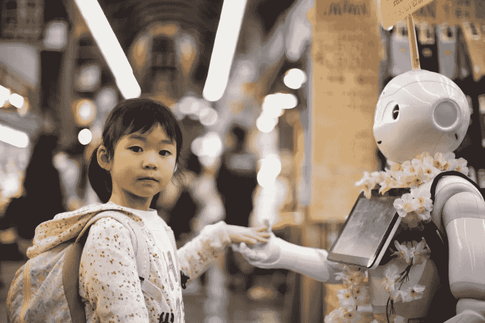

# 人类对机器。在零售中意味着什么？

> 原文：<https://towardsdatascience.com/humans-vs-machines-what-does-it-mean-in-retail-7970824fe25?source=collection_archive---------20----------------------->

上个月，我参加了一场关于“零售业技术的未来以及技术能否取代人类”的辩论随后，我整理了一些内部零售的想法(这里也发表了****)。****

****

**在过去的十年里，技术的进步已经破坏了人类体验的大部分方面。随着技术日新月异的发展，全球零售业的创新和实验都在加速，这也就不足为奇了。根据 Gartner 的数据，2019 年，全球零售技术支出将增长 3.6%，达到 2036 亿美元，在技术支出方面超过大多数其他行业。**

# **我们看到的新兴技术的发展通常是为了满足提高效率、提升客户服务或接触新的未被满足的受众的需求。**

**随着客户支持的即时、24 小时需求，语音和聊天助手已经迅速取代了大多数传统的在线帮助平台和传统服务。顾客不再需要在决定下一次购买前等待信息。丝芙兰、路易威登、H&M 和许多其他品牌都在使用智能界面来改善客户体验；到 2023 年，零售聊天机器人预计将带动 1120 亿美元的零售销售额。**

**物联网的使用率正在上升；实体零售商正在通过访问来自 RFID 标签、相机、传感器、跟踪器和设备的新型数据来丰富商店体验。当顾客在网上查看某一特定产品的价格以进行比较时，商店中捕获的移动数据可以通知零售商，表明他们对商店定价、销售或环境不满意。沃尔玛已经推出了 IRL(智能零售实验室)概念，它可以实时跟踪库存，这意味着顾客不会在没有他们想要的产品的情况下离开商店。**

**随着网上购物和退货成为常态，机器人已经成为“履行”一词的同义词。自 2013 年以来，亚马逊一直在使用机器人来帮助他们的履行中心，但不要认为这些机器人是用来完全取代员工的。在机器人的帮助下，他们纽约配送中心的 2700 多名仓库团队现在不再需要执行耗时的任务，例如从一个过道走到另一个过道，在不同部门寻找商品来完成一个订单。然而，除了亚马逊的机器人/人类标签团队，新英格兰的机器人公司 Symbotic LLC 也制造了自动仓库机器人，比员工更快、更有效地完成订单——劳动力成本降低了 80%,同时在小 25 %- 40%的空间内完成相同数量的订单。**

**所有正在进行技术进步的零售商都有一个共同点，那就是他们正在以闪电般的速度前进。上述品牌和直接面向消费者的宠儿，如 Glossier、Allbirds、Casper 和 Away，正在通过以运营和创新的方式投资技术来巩固竞争优势，使顾客购物更容易、更有趣。**

****

# **随着零售技术的进步，问题来了，它总是符合购物者的最大利益吗？或者它在人际交往中造成了脱节，特别是在顾客和零售商之间？**

**最近的争议围绕着使用面部识别来确定客户的情绪、性别和年龄是否可能侵犯隐私的辩论。美国的沃尔玛和沃尔格林正在测试面部识别，试图个性化商品展示并改善客户服务。但是相关的问题出现了，比如面部照片存储在哪里，谁可以访问它们？难道实体员工不能比电脑更快更有效地理解和服务不开心的顾客吗？**

# **未来两年，零售商将投资于日益增长的智能界面趋势。然而，最先进的技术限制了对话式聊天、语音和高级增强和虚拟现实的“人性化”水平。"**

**两个原因；**

1.  **首先，推动智能聊天和语音界面的对话式人工智能并没有真正理解自然人类语言。与 Alexa、Siri 和 Google Assistant 的对话是基于命令和事务性的，导致对话支离破碎、互不关联，响应和解决时间缓慢。**
2.  ****其次，今天的智能界面无法识别语调、肢体语言和俚语。**在交谈中，同一个句子有成千上万种说法，声音上的屈折可以完全改变一个短语的意思。我们大多数人认为这是一种共同的语言，并随着时间的推移而发展。对我们来说，这种理解水平是自然的，但只是在人类之间。人类和机器之间还没有。**

**实现完全的人类语言理解和视觉识别并不容易。在一篇题为[人工智能最先进方法的问题](https://medium.com/pat-inc/the-problem-with-ai-state-of-the-art-methodology-d54b9cffddd1)的文章中， [Pat Inc](https://pat.ai/) 的联合创始人兼首席执行官贝丝·凯里写道，**

> **“为了理解一段对话，人类不需要听到每一个可以想到的单词和短语组合(这是无限的)。我们只需要知道大约 3000 个基本日常对话所需的单词。”**

**Pat Inc 通过将当代语言学集成到人工智能中，解决了对话式人工智能的固有挑战，消除了用最新最大的数据不断训练算法的需要。**

**如果我们要从零售技术的现状中前进，弥合人类和机器之间的差距需要零售商:**

# **1.了解客户行为何时自然与新创新相吻合。**

**零售商需要分析顾客在购物体验的哪个阶段需要人际互动，什么时候不需要。随着产品信息在网上变得更加容易获得，一些顾客对他们的购买变得更加了解，并且带着他们的信用卡到达购买阶段。这是专注于速度和效率的创新最有益的时候。当客户仍处于品牌认知阶段或产品比较阶段时，人的因素可以更有效地创造价值，并将个人联系保持在品牌客户服务模式的最前沿。**

# **2.对新兴技术采用直观的以人为本的方法。**

**智能界面和其他应用类型为我们创造了一个以更自然、更直观的方式与设备互动的未来。如今的平台正在聚合越来越多的用户信息。在未来，他们还将开始收集环境和情境的相关数据。这不仅会减少对刷卡、语音或信息的依赖，还能让平台适应我们的情绪、精神状态和未言明的偏好。期待零售商了解比你想象的更多的顾客——我们的习惯、惯例、品味、经历——将个性化带到微观层面。**

**随着智能界面成为人类交互的一种有价值的替代方式，人类和机器之间的界限变得模糊了。为了成功整合，新型零售技术必须是直观的(不仅仅是高效的)、有价值的、微妙的，并且总是有助于改善客户体验。**

**推特: [@emsharley](https://twitter.com/emsharley)**

**图片来源: [https://unsplash.com/photos/0E_vhMVqL9g](https://unsplash.com/photos/0E_vhMVqL9g?utm_source=dropbox_paper&utm_medium=referral)**