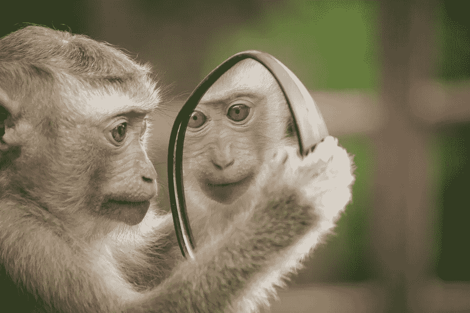

# 机器人有没有实现意识？

> 原文：<https://towardsdatascience.com/hybrid-humans-and-conscious-robots-2a00bca1f509?source=collection_archive---------19----------------------->

## *人工智能、意识和强化学习交汇处的思考*

[Creative Commons Zero — CC0](https://creativecommons.org/publicdomain/zero/1.0/deed.en) [https://www.maxpixel.net/Self-reflection-Thinking-Monkey-Reflection-Mirror-4788334](https://www.maxpixel.net/Self-reflection-Thinking-Monkey-Reflection-Mirror-4788334)

你的意识处于什么水平？凝视着昏迷的亲人的眼睛，我们许多人都为病人是否意识到收到的爱抚或低声祈祷而苦恼。我们将越来越多地找到这些问题的答案，这在很大程度上要归功于对强化学习、人工智能以及它们如何与意识相关的理解不断增长。

Tristan Bekinschtein 及其同事发表在《自然神经科学》上的一项开创性研究表明，一些植物人状态的患者仍然保留了一些基本的强化学习能力(Tristan A Bekinschtein，2009)。这些患者接受了输送到他们眼睛的气流，并配有一些预测刺激，如铃声——一种众所周知的基本强化学习能力测试。尽管无法用任何自我意识的方式表达或回应，这些患者仍然表现出预测空气喷射的能力。这些患者虽然与其他植物人几乎没有区别，但在某种程度上仍然是有意识的，这被证明是对哪些患者后来会恢复我们所认为的完全意识的高度预测。这有助于区分哪些病人应该继续维持生命，哪些应该被仁慈地允许离开人世。它也有助于区分意识的类别。

这些研究支持了一个多层次的意识理论，类似于诺贝尔奖获得者生物学家和神经学家杰拉尔德·埃德尔曼提出的理论。根据埃德尔曼的说法，意识存在于一个至少有两个部分的光谱上——主要意识和次要意识(埃德尔曼，2003)。初级意识是一种意识，包括感知、情感，以及至关重要的以促进预期决策的方式连接基本刺激的能力。这就是所谓的强化学习。在强化学习中，一些过去的经验被用来随着时间的推移改进决策以优化期望的结果。这种初级意识可以延伸到生命之树的根部。狗、鸟甚至许多两栖动物都表现出基本的强化学习能力。这意味着初级意识的核心是强化学习系统，这个系统允许我们区分积极和消极的刺激，从而从中学习，并根据这些过去的经验指导决策。这是否也需要人工智能，如机器人和具有强化学习能力的计算机，如 AlphaZero，应被视为具有初级意识，这是一个有待讨论的问题。随着机器人和人工智能扩大它们的强化学习工具箱，这可能是未来几十年一个激烈竞争的话题。

但这不是关于意识的最终结论。根据埃德尔曼的说法，与初级意识不同的是次级意识，也就是我们意识到的意识。这种元认知是我们通常与人类意识联系在一起的类型，因为它也预示着创造关于我们自己的高度详细的叙述的能力，我们是不同于我们周围环境的代理人。它还可能对应于一种不同类型的学习系统，一种涉及结构化逻辑和显式推理的系统。这种显式推理包括以抽象形式制作世界模型。为了像我们通常认为的那样有意识，我们创造了一个世界模型，把我们自己作为其中一个独特的组成部分，与提供我们意识的积极和消极刺激流分开。越来越多的证据表明，我们在“有意识的人类”中发现的这种类型的陈述性学习对应于某种基于*模型的*强化学习，与只表现出初级意识的动物的*无模型*强化学习形成对比(Samuel J. Gershman，2017)。在决策方面，这种基于*模型的*强化学习与经济学家丹尼尔·卡内曼在双过程理论中概述的“系统 2 思维”相似。系统 2 思维是深思熟虑的、努力的和基于逻辑的，与无模型强化学习的快速直觉决策特征相反。虽然我们对基于模型的强化学习算法在人脑中的确切数学形状知之甚少，更重要的是，它们如何与无模型的同类实时交互，这是目前认知科学中最热门的研究领域之一。因此，我们应该为即将到来的对人类意识的解释做好准备，这些解释深深植根于数学之中。

**无生命的意识**

定义第二意识的问题本身就是一个棘手的问题。近年来，我们已经能够获得这个古老之谜的一些线索。答案可能藏在神经科学家所谓的“心理理论”中。人类的大脑似乎不是单一的，而是由不同的“进化算法”驱动的许多相互竞争的需求和欲望的融合。在许多模块或算法中，有一个似乎负责创建一种思维理论——一种推测另一个人在想什么或感觉什么的能力。事实上，正如最近的一项研究表明的那样，为了更好地“感知”他人的感受，我们会无意识地模仿他人的面部表情。

通过反射性地采取与另一个人相同的表情，我们获得了关于他们精神状态的有用见解。这甚至可能是一些老夫妇变得彼此相似的原因——通过模仿对方的面部表情，他们脸上的皱纹逐渐汇聚成相似的图案。帮助和促进这一过程的是镜像神经元，当我们执行一个动作时，神经元的反应与我们看到别人执行一个动作时一样。这就好像当我们观察他人的行为时，大脑会尝试他们的行为。通过这样的机制，我们形成了关于另一个人的意图和动机的理论。为什么这样的心理理论可能很重要？对于像我们这样高度社会化的动物来说，知道另一个人在想什么对生存大有裨益。这个人是希望我们倒霉吗，或者，他们是友好的和潜在的盟友吗？

也许更有趣的是，我们似乎有一套关于我们自己的心理理论，这是我们大脑的一部分，试图理解并创造一个关于我们自己行为的故事。这是对第二意识的主要解释之一，也就是说，一种针对其拥有者的心理理论。这种自我参照的心理理论对我们所做的事情所产生的信念往往是完全虚假的，或者至少是不真诚的。我们已经很熟悉这个过程，只是名字不同，“否认”，或者虚构。有趣的是，否认似乎更像是常规而不是例外，因为我们或多或少地用错误的解释系统地解释我们的行为。一些神经科学家将意识比作律师，不断为我们的行为辩护，并为我们所做的事情编造可信但非常虚假的理由。

这种与律师的比较暗示了为什么我们可能首先需要这样一个令人讨厌的算法，也就是说，在一个高度社会化的环境中证明我们的行为是正当的。其他缺乏自我参照心理理论的动物似乎既不感到羞耻也不否认。虽然还没有一个明确的答案，为什么人类会进化出这样一种奇怪的进化算法，但我们有猜测的空间。其中一种推测源于所谓的“红皇后效应”从进化的角度来看，红皇后效应是当两种生物在生存斗争中发生一系列级联适应时产生的。一旦一种生物在激烈的战斗中占据上风，另一种生物就会进化出一种机制来对抗它，这一过程不断重复，因此两种生物都必须尽可能快地进化，以保持它们之间的平衡。因此，这里提到了《爱丽丝梦游仙境》中的红皇后，她向年轻的女主角解释说:“在这里，你需要竭尽全力才能保持在同一个地方。”

红皇后效应怎么可能产生第二意识？如果我们假设心理理论的发展是为了阅读他人的思想，更好地预测他们是否会帮助或阻碍我们，那么通过挫败这种适应并找到欺骗它的方法，我们将获得生存优势。如果一个有意识的心理理论可以为我正在做的事情构造一个托辞，即使它们明显是不真实的，这可以给我在一个高度社会化的环境中的生存优势。在警察和强盗的游戏中，如果你开发了一个真理探测器，那么我需要开发一个更好的谎言编造器，周而复始。

在我们目前的关头，假新闻可能会刺激人类内部类似的红皇后种族，将我们引向混合意识形态，将我们的生物湿件与机器智能融合。想想看，在计算机的帮助下，使用 Photoshop 等工具创造虚假故事的能力使得区分真实和虚构变得更加困难。编造虚假故事从未如此容易，因此越来越需要反制武器来揭开这些谎言。这种对策也可能采取算法的形式，尽管它存在于计算机中。例如，有一些人工智能算法被训练来区分真实图像和经过 Photoshop 修饰的图像。个人越来越有必要采用这种人工智能来区分假新闻和真实报道。以这种方式，我们可能会发现自己处于进化的压力之下，将这类人工智能融入到我们的生物湿件中，依靠它们来让我们比说谎者领先一步。很难说这种来回的措施会在哪里结束，但是将“混合”形式的意识添加到我们目前的生物学中并不是不可能的。埃隆马斯克(Elon Musk)支持的名为 Neuralink 的公司已经在创建神经鞋带方面取得了进展，这可能会在人类中实现这种形式的混合意识，将机器和生物融合为一个实体。

另一个可能导致混合意识形式的竞争压力来自市场。目前，进入顶级学术机构的竞争相当激烈，因此学生和求职者将利用像 Adderall 和 Ritalin 这样的药物来获得必要的成绩和考试分数，以获得这些令人垂涎的职位。如果一个申请人的意识受到神经花边或 CRISPR 基因改造的帮助，表现出获得最好的学校和工作的倾向，那么这种适应很可能会在整个人口中迅速传播。红皇后效应可能会导致奇怪和不可预见的后果，明智的做法是仔细考虑我们目前承受的竞争压力，以免它们将我们拖入我们后来发现明显是反乌托邦的角落。

最近的一些实验涉及可能被认为是“无生命的意识”，包括拥有心灵理论的合成药剂。心智理论是用来区分人工智能和人类智能的一种方法。为了理解这种差异，有一个叫做最后通牒游戏的简单实验。在最后通牒游戏中，一个玩家得到 100 美元(或其他价值单位)，他必须决定如何与另一个玩家平分这笔钱。第二个玩家，可以拒绝这个提议，在这种情况下两个玩家都一无所获，也可以接受这个提议，在这种情况下，他们根据玩家一指定的分配得到钱。如果一号玩家是完全理性的，缺乏思维理论，它的出价将远低于人类，因为它会假设另一个玩家会接受任何大于零的出价，因为有所得总比没有所得好。逻辑大概是这样的。由于缺乏思维理论，一号玩家没有考虑到，如果只给一美元，另一个玩家可能会觉得受到了轻视，因此会断然拒绝这个提议。虽然一个纯粹理性的代理人接受美元会比拒绝美元更好，但人类会经常拒绝如此低的报价。这一直是经济学家和心理学家的眼中钉，因为效用理论的整个教条是基于这样一个前提，即人们最大化效用，并会像玩游戏的计算机那样接受如此低的报价。有趣的是，自闭症是一种经常被描述为“精神盲”的疾病，因为患者通常表现出明显的无法通过观察面部特征来阅读他人的思想，患者往往比“正常”人表现得更像纯粹的理性代理人。在这样的游戏中——自闭症患者会期望别人接受低球报价，自己接受也没问题。来自自闭症的证据支持了这样一种观点，即当人类在许多战略环境中运作时，他们正在使用一种思维理论，这影响了他们的决策。

人类拒绝低价提议的一个原因是，我们习惯于玩*重复囚徒困境游戏*，也就是说，这种游戏会重复多次，并拥有一个解决方案，当两个玩家合作时，他们的情况会比他们都自私时更好。如果作为最后通牒游戏中的玩家，我假设我们生活在一个重复囚徒困境的世界中，那么我就有动机惩罚你自私的出价，这样下次我们玩的时候你就不会再出低价了。一个人如何着手创造一种算法，利用思维理论来猜测他人的策略，从而获得与人类更相似的结果？

在这方面取得进展的团体之一是 OpenAI 基金会。OpenAI 团队与牛津大学的研究人员合作，创建了一种强化学习算法，当在最后通牒游戏中更新自己的策略时，它拥有关于另一个玩家的思维理论(Jakob N. Foerster，2018)。他们配方中的秘密成分是在强化学习等式中增加一项，捕捉第二个玩家策略的变化，也就是说，其他玩家的想法。虽然这背后的数学可能有点复杂，但原理很简单——如果我知道你也在学习，那么当我制定自己的策略时，我需要考虑你策略的变化。他们的方法似乎奏效了——在一个重复的囚徒困境游戏中，该算法学习了更像人类玩家的互惠策略，而不是纯粹自私的代理人的策略。这很可能标志着创造人工第二意识的重要一步。假设意识是一种转向自身的心理理论，那么建立一种转向外部的心理理论是合乎逻辑的第一步，就像 OpenAI 实验中那样。这显然是更复杂的心理理论的前兆。例如，可以说狗拥有简单的思维理论。

你可以观察狗扫描你的特征和手势，试图猜测你是否要重新装满它们的食物碗或带它们去散步。据我所知，还没有这样的尝试来修改强化学习，以包括一个关于自己行为的心理理论，这可能不会太远。虽然最初这种新生的机器意识形式很难被认为与我们自己的相似，但也许随着时间的推移，它们会发展出丰富多彩的心理细微差别，如个人叙事、羞耻、否认和投射，这些都是我们自己的意识思维的特征。值得注意的是，即使这种情况发生了，也并不意味着合成意识会对人类构成威胁。他们的目标状态可能仍然是预先确定的，他们的行动仅限于虚拟世界中的虚拟任务。

当我们检查人工智能和强化学习的含义时，组织和优先考虑它的影响是很重要的。虽然有意识机器人的崛起可能会在遥远的未来对人类构成生存威胁，但可能会有更近的挑战，例如，工作自动化程度的提高导致财富差距不断扩大。只有克服了这些近期的障碍，我们才有可能遭遇如此多科幻小说和电影中所预示的耸人听闻的恐怖。