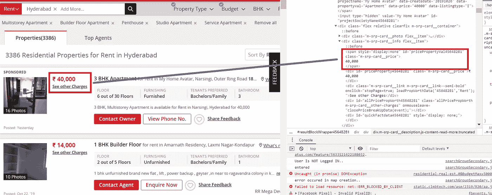
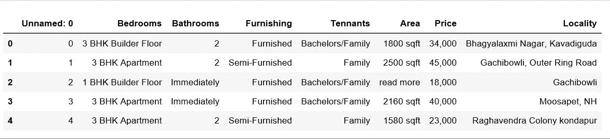
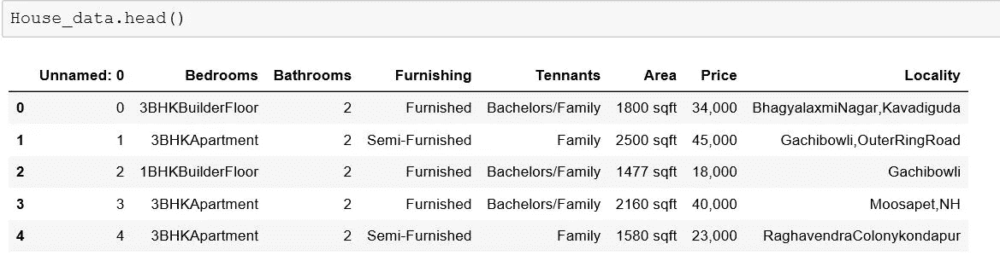
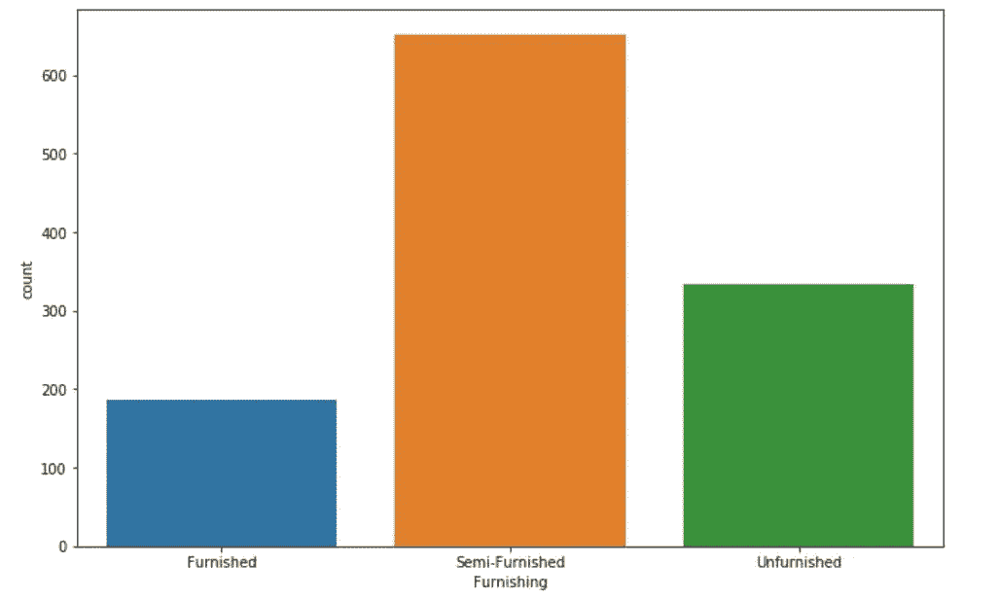
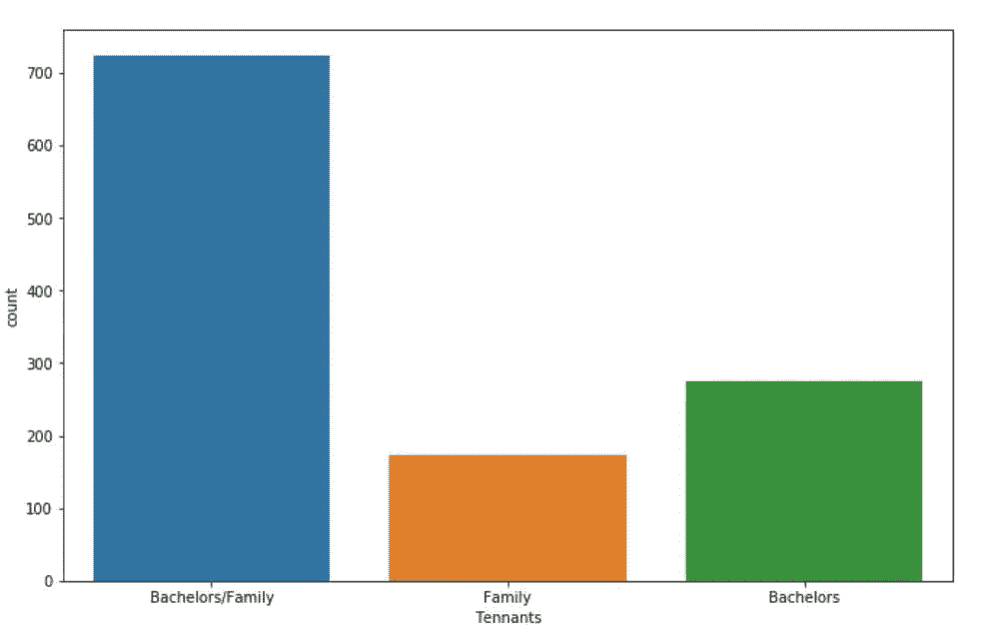
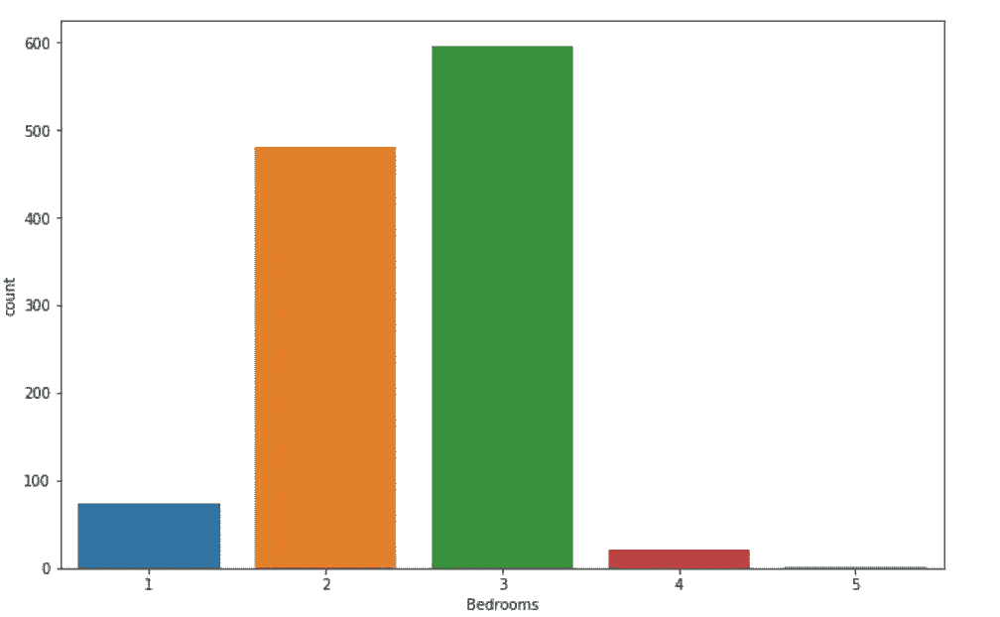
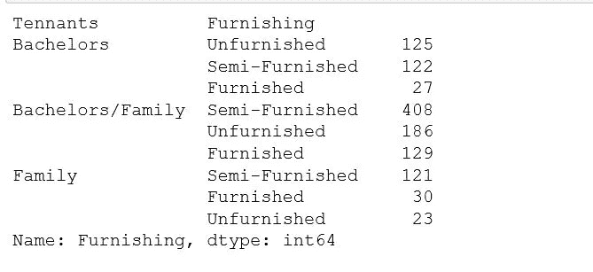

# 海得拉巴房价。

> 原文：<https://towardsdatascience.com/hyderabad-housing-prices-526217d2c6d7?source=collection_archive---------17----------------------->


Photo by [Shiv Prasad](https://unsplash.com/@shiv_saxena?utm_source=medium&utm_medium=referral) on [Unsplash](https://unsplash.com?utm_source=medium&utm_medium=referral)

每天我都从办公室的朋友和同事那里听到很多关于他们在海得拉巴很难找到出租公寓的故事，他们大多要么是公寓不对单身汉开放，要么是某个地区的租金太高，要么是公寓的面积对于给定的价格来说太小。我想了解上述问题的真实情况，所以我决定使用我的 python 技能从一个领先的房屋租赁网站获取并分析关于可供出租的房屋的数据。

我把当前的任务分成了 3 部分。

*   使用网络抓取收集数据。
*   数据预处理。
*   数据分析。

# **数据收集。**


Photo by [Luca Bravo](https://unsplash.com/@lucabravo?utm_source=medium&utm_medium=referral) on [Unsplash](https://unsplash.com?utm_source=medium&utm_medium=referral)

[当没有实时数据可供分析时，网络搜集](https://en.wikipedia.org/wiki/Web_scraping)经常被用作收集数据的工具。首先，我们将收集海得拉巴领先的房地产网站之一的所有搜索结果。我们要收集数据的网站是 magicbrics.com.The 网站，它很棒，所有的数据都排列得很整齐，但是，你可以自由选择你喜欢的网站，你可以很容易地修改代码。

在我们真正开始收集数据之前，我们需要决定需要从网站上收集哪些功能。在当前示例中，我们将收集，

*   没有卧室。
*   没有浴室。
*   家具类型。
*   田纳西人更喜欢。
*   房子的面积(平方英尺)。
*   房子的位置。
*   价格还是租金。

首先，让我们导入所有的依赖项，

```
import re                       # Regular Expressions Library
import pandas as pd             # Data Preprocessing Library
from bs4 import BeautifulSoup   # Used to get Data from HTML files.
from urllib.request import urlopen,Request #Used to get a given url 
```

一些网站会自动阻止任何类型的抓取，这就是为什么我们会定义一个头来传递 ***get*** 命令，这基本上会使我们对网站的查询看起来像是来自实际的浏览器。

```
headers = ({'User-Agent':
            'Mozilla/5.0 (Windows NT 6.1) AppleWebKit/537.36 (KHTML, like Gecko) Chrome/41.0.2228.0 Safari/537.36'})
```

首先，我们需要查询网站，并以 HTML 代码的形式(页面)获取数据。

```
request = Request(url, headers=headers)
response = urlopen(request)
html = response.read()
```

我们的 Html 的输出看起来像下面这样，这是一个原始的 Html 代码，需要传递给 Beautiful Soup 方法来获得结构化的 Html 代码。

```
**Html Output(**html) **:**b'\r\n\r\n\r\n\r\n\r\n\r\n\r\n<!DOCTYPE html>\r\n<html>\r\n\t<head>\r\n\t\t<meta charset="UTF-8">\r\n\t\t<meta http-equiv="X-UA-Compatible" content="IE=edge,chrome=1"> \r\n\t\t<meta name="viewport" content="width=device-width, initial-scale=1">\r\n\t\t<meta name="google-signin-client_id" content="614944930403-u1s9tmqebd273mutmdhmsngnhvivgd6a.apps.googleusercontent.com">\r\n\t\t\r\n\t\t<link rel="dns-prefetch preconnect" href="//cdn.staticmb.com" />\r\n\t\t<link rel="dns-prefetch preconnect" href="//img.staticmb.com" />\r\n\t\t<link rel="dns-prefet'*html_soup = BeautifulSoup(html , 'html.parser')***Beautiful Soup Output (**html_soup) **:**<!DOCTYPE html>
<html>
<head>
<meta charset="utf-8"/>
<meta content="IE=edge,chrome=1" http-equiv="X-UA-Compatible"/>
<meta content="width=device-width, initial-scale=1" name="viewport"/>
<meta content="614944930403-u1s9tmqebd273mutmdhmsngnhvivgd6a.apps.googleusercontent.com" name="google-signin-client_id"/>
<link href="//cdn.staticmb.com" rel="dns-prefetch preconnect"/>
<link href="//img.staticmb.com" rel="dns-prefetch preconnect"/>
<link href="//b.scorecardresearch.com" rel="dns-prefetch preconnect"/>
<link href="//www.googleadservices.com" rel="dns-prefetch preconnect"/>
<link href="//stats.g.doubleclick.net" rel="dns-prefetch preconnect"/>
<link href="//ase.clmbtech.com" rel="dns-prefetch preconnect"/>
<link href="//ingestor.magicbricks.com" rel="dns-prefetch preconnect"/>
<link href="//maps.googleapis.com" rel="dns-prefetch preconnect"/>
<link href="//www.googletagmanager.com" rel="dns-prefetch preconnect"/>
<title>Properties in Hyderabad</title>
```

获得代码后，我们需要浏览 Html 代码，找出在整个源代码中我们可以找到所需功能的确切位置。我们可以在我们的浏览器中检查这一点，我们还可以在 Html 文档中找到某个特定对象的位置，例如属性的价格。右键单击它并选择检查。



整个网页被分成多个块，每个块将被放置在带有类名的 ***div*** 容器中(当前示例是*flex relative clear fix m-SRP-card _ _ container*)，每个这样的块将具有关于单个房屋的所有所需功能。我们可以扫描整个页面，将所有这样的块收集到一个列表中，并对它们进行迭代，以找到所有房屋的特征集。

```
page_container = html_soup.find_all('div', class_ = 'flex relative clearfix m-srp-card__container' )
```

在收集了作为容器列表的网页数据之后，我们可以看到属于每个字段的数据被存储在每个 page_containers 的 *< span >* 标签中。我们可以编写一个脚本来收集每个 page_container 的所有 span 标签，提取数据并在整个 page_containers 列表中循环，如下所示。

```
*span_containers = page_container[3].find_all('span')
span_containers[1].text*Output :  **' \n         \t \t\t\t           \t \t\t\t16,000           \t \t\t'***span_containers[1].text.replace('\n','')*Output :**'           \t \t\t\t           \t \t\t\t16,000           \t \t\t'**
```

除了 locality 之外，所有字段的逻辑都是一样的，Locality 需要从字符串中提取，很难得到。数据会是这样的。我要在 和****2000 sqft***之间的字符串*

```
*'    3 BHK Apartment  for rent *in* ***SMR Vinay Harmony County, Appa junction*** *2000 sqft * '*
```

*因此，我使用正则表达式来查找以' 中的' ***'开始，以 ***'数字(\d)'*** 结束的模式，但是这种模式在数据中并不统一，有些样本还以空格结尾，或者结尾没有任何内容。因此，我使用了 3 种模式来获取位置数据。****

```
 *Locality_1 = Locality_0.text.replace('**\n**',' ')
       Locality_2 = re.search(r'in(.+?)\d', Locality_1)
       **if** Locality_2 **is** **None** :
          Locality_2 = re.search(r'in(.+?),',Locality_1)
       **if** Locality_2 **is** **None** :
         Locality_2 = re.search(r'in(.+?) ',Locality_1)***Output:***YMCA Circle, Narayanguda 
 Amarnath Residency
 Nanakram Guda 
 My Home Avatar, Narsingi, Outer Ring Road 
 Nizampet 
 Kachiguda, NH 
 Miyapur, NH 
 Dukes Galaxy, Banjara Hills, NH 
 Machabollaram, Medchal Road*
```

*以类似的方式，每个 *span_containers* 将具有不同的特性，可以如上所示提取并保存在. csv 文件中以供进一步处理。最终输出。csv 文件如下所示。*

**

*House Prices Data.*

*上面的完整工作代码以及 data.csv 文件可以在我的 Github 资源库[*saitejamahadev/Hyderabad _ housing _ data 中找到。*](https://github.com/saitejamahadev/Hyderabad_Housing_Prices)*

# ***数据预处理。***

**

*Photo by [Mika Baumeister](https://unsplash.com/@mbaumi?utm_source=medium&utm_medium=referral) on [Unsplash](https://unsplash.com?utm_source=medium&utm_medium=referral)*

*数据预处理是任何数据科学项目中的重要步骤。最初，当我们提取数据时，我们确保数据是干净的，没有任何随机值，但如果我们仔细分析数据集的特征，我们会发现数据在抓取过程中提取了一些垃圾或缺失值。*

*unique Bedroom values*

*Unique Bathroom values*

*unique Furnishing type and Tennants preferred*

*通过调用 pandas unique()方法，我们可以看到嵌入到特性集中的不正确的或无用的值，如上所示。我只列出了几个特征，但是几乎所有数据集的特征都有一种或另一种需要解决的不规则性。*

*现在，一些特征(其中垃圾被附加到所需的特征)我们可以提取正确的样本特征值，但是对于其他特征(其中数据被错误地收集，即家具类型)，它可以具有值“家具”或“半家具”或“未家具”，但是不具有如上所示的其他值。*

*数据的这个问题可以被认为是丢失值的问题，根据业务情况，在数据预处理中有许多经典的方法来处理它，但在当前的用例中，我想用特征的模式/平均值的替换来进行，假设在给定的区域，人们不太可能为单身汉租房，而家庭是首选，反之亦然。*

*如果我们观察样本，我们可以看到 ***'\t'*** 通常是嵌入的，移除它并用单个空格替换产生的一个或多个空格将清除我们的大多数样本，这是所有样本共有的。我们可以使用下面几行代码来实现这个结果。*

```
*data.Bathrooms[price] = re.sub(r'\t','', data.Bathrooms[price])
data.Bathrooms[price] = re.sub(r'\s+','',data.Bathrooms[price])*
```

*sample code how different features are handled in preprocessing.*

*最后，清理后的数据可以保存在一个新文件中，如下所示。*

**

*House prices data after preprocessing.*

***注意:**我们在***House _ data _ preprocessing****方法中使用的数据预处理技术是特定于收集的数据类型和数据中存在的不规则性的。当处理不同的网页时，代码需要稍微修改。**

# **数据分析。**

**清理数据后，我们使用 python 数据可视化工具(如 Matplotlib)来尝试和可视化数据，并回答以下问题**

*   **出租公寓的常见装修风格是什么？**
*   **房东一般喜欢什么类型的 Tennants？**
*   **一般有多少间卧室可供出租？**
*   **与 Tennants 相比，家具类型的分布如何？**

**如下。下面的代码片段将回答上述问题。**

**Data Visualization.**

*   **出租公寓的常见装修风格是什么？**

****

**Furnishing Type**

*   **房东一般喜欢什么类型的 Tennants？**

****

**Tennants Preferred**

*   **一般有多少间卧室可供出租？**

****

**Bedrooms Distribution**

*   **与 Tennants 相比，家具类型的分布如何？**

**Furnishing Type vs Tenants Preferred**

****

**FurnishingType vs Tennants Preferred**

****注:**以上数据预处理和分析步骤的完整工作代码请访问[saitejamahadev](https://github.com/saitejamahadev)/[Hyderabad _ House _ Prices _ Analysis](https://github.com/saitejamahadev/Hyderabad_House_Prices_Analysis)。**