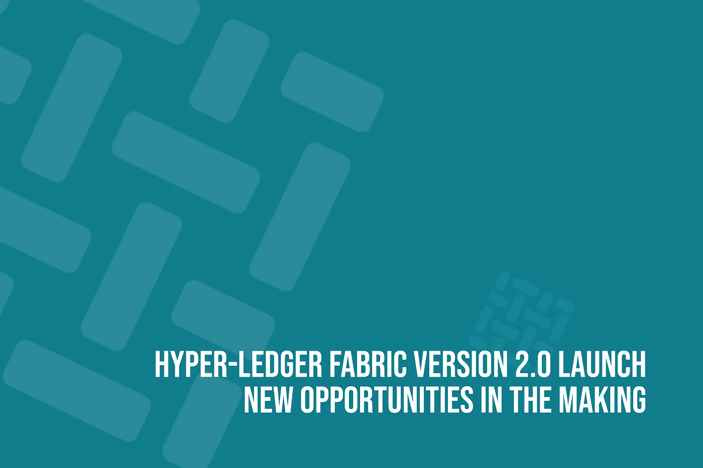

# hyper-Ledger Fabric 2.0 版本发布:新机遇正在形成

> 原文：<https://towardsdatascience.com/hyper-ledger-fabric-version-2-0-launch-new-opportunities-in-the-making-39cb56a0d309?source=collection_archive---------19----------------------->

## 让世界了解区块链技术的最新进展。



Image credits Acodez

区块链技术具有变革性和进化性，但在某些时候，甚至它也未能留下所需的影响。许多专家普遍认为,[区块链将颠覆许多行业，它将彻底改变当今许多商业运作的方式。](https://acodez.in/industries-blockchain-disrupt/)

商业是更具挑战性的领域之一，以其原始的概念形式接受[区块链技术](https://medium.com/@acodez/introduction-to-blockchain-technology-evolution-attacks-24c2743add59)。尤其是当一个人不得不依靠区块链技术来签订合同的时候。在分散式网络中，双方共同签署合同会使敏感信息公开。这些小错误足以让你的生意回到石器时代。在这一点上，需要一种未来的智能解决方案，它可以在混合环境中独立工作。

超级分类帐结构为企业提供了即使在许可网络中编写可访问性限制的机会。随着非许可区块链在分散分类帐技术上的引入而发展的概念使得超分类帐结构如此受欢迎。商业兄弟会可以轻松地签署合同并交换敏感信息，而不必担心信息公开。但即使有所有的优势，仍有灰色区域出现在 Hyper-Ledger Fabric 的早期版本中，随着更新版本的发布，这些缺点已被仔细迎合。在本博客中，我们将讨论 Hyper-Ledger Fabric 2.0 版的新增功能，以及它如何解决以前版本的缺点。

**Hyper-Ledger Fabric 2.0 版有什么新功能？**

**发布新的结构链码生命周期**

在 Fabric 2.0 Alpha 的新模型中，将引入一种新的分散治理，这将发布一种在对等网络上安装链码的新流程。有了这样的功能，现在多个组织将通过在链码上设置不同的参数来在同一页面上达成一致。链码背书政策就是即将推出的一项智能功能。在背书策略中，命令流将以下列方式发生；

**这是一份政策样本**

```
{“identities”: [{ “role”: { “name”: “member”, “mspId”: “Org1MSP” }},{ “role”: { “name”: “member”, “mspId”: “Org2MSP” }}],“policy”: {“1-of”: [{ “signed-by”: **0** }, { “signed-by”: **1** }]}}
```

**样本策略 2**

```
{“identities”: [{ “role”: { “name”: “member”, “mspId”: “Org1MSP” }},{ “role”: { “name”: “member”, “mspId”: “Org2MSP” }},{ “role”: { “name”: “admin”, “mspId”: “Org1MSP” }}],“policy”: {“2-of”: [{ “signed-by”: **2**},{ “1-of”: [{ “signed-by”: **0** }, { “signed-by”: **1** }]}]}}
```

在这两个样本策略中，身份定义了区块链网络的角色和 MSP。

类似地，策略由包含 nOf 格式策略的对象定义，其也是用于背书的特定“签名集策略”,其中“n”是背书的指定签名所需的最小签名数。

在示例策略 1 中，有来自 Org1MSP 和 Org2MSP 的两个身份。在这里，签名集策略说

```
“policy”: {“1-of”: [{ “signed-by”: **0** }, { “signed-by”: **1** }]}
```

定义认可策略时，它应该由 0(使用角色成员)签名，以标识身份数组(Identity Org1MSP)中的 1，或者由 1(使用角色成员)签名的数组，以标识身份数组(Identity Org2MSP)中的身份 2。在功能中，区块链的策略只有在 Org1MSP 或 Org2MSP 的成员对交易进行签名时才会成功。以同样的方式，样本策略 2 将规定任何违反该策略的交易。任何变更只有在(I)签字后才能在区块链被接受。订单管理(ii)。Org1MSP 或 Org2MSP 任何组织的成员。

这就是在分散的环境中，背书政策为您的阅读工作的方式。现在，回到 Fabric Chaincode 将从现在开始改变用例的方式；

## 1.帮助多个组织同意链码的任何特定参数

在之前的版本中，明确提到了 Fabric 的 1.x 版本，规定只有一个组织能够设置链码所需的参数，以确保网络正常运行。在这种设置中，只有一个组织有能力定义链码的参数。

但新的 Hyper-Ledger Fabric 版本 2.0 完全不同，为各方提供了更大的灵活性。这样，它将支持区块链的混合和本地模式。因此，集中式和分散式两种环境都可以得到支持。因此，无论链码需要一个单一成员还是多个成员来签署网络上的任何政策，在它变得能够移动合同和操作之前，通过引入这一新特征，一切都将成为可能。

## 2.链码的升级过程比以前的版本更安全

在过去版本的超级分类帐结构中，只有一个组织或也称为网络中的第一个组织有权升级链码上的交易。因此，网络中的任何新组织都别无选择，只能下载甚至是损坏的链码。这样，新成员总是要承受交易带来的风险。

但是最新版本的超级分类帐结构带来了新的修正，这将允许在链码上建立共识。只有在集团达成共识后，新的链码才会实施，以帮助区块链平台按照业务要求运行。

## 3.通过新的更新简化了认可政策

网络中的链不需要为了背书策略的改变而不时地重新打包或重新安装链码。有新的默认策略可供用户从大多数成员那里寻求共识。

## 4.更好地检查链码包装

读取可读 tar 文件中的链码非常简单。结果，网络中的节点可以容易地检查链码包，并在安装过程中与网络中的其他节点协调。

**在 Hyper-Ledger Fabric 版本 2.0 中引入 fab token**

在最新版本的 Hyper Ledger Fabric 2.0 中，用户有机会使用他们的资产作为令牌。确切地说，FabToken 将是这个新版本中用于启动事务的令牌。它使用未用完的交易输出或 UTXO 模型，以便使用由 Hyper-Ledger 结构网络提供的身份和会员基础设施来发行、转移和兑换代币。使用 FabToken，用户可以很容易地创建新的加密硬币。同时，从一个用户向另一个用户转移硬币将被完全简化。用户可以执行整个交易列表，并使用 FabToken 启动硬币的完全兑换。

FabToken 将以与 ERC 20 标准相同的方式简化加密货币的创建。也就是说，Hyper-Ledger Fabric 2.0 将见证与以太坊相同的令牌创建环境。这种类型的优势将首次在 Hyper-Ledger 网络上提供给开发者。在你冒险在你的 SDK 中使用 FabToken 之前，请记住某些特定的东西。

安装 Hyper-Ledger Fabric SDK 后，使用 docker 映像进行快速验证。您需要访问 FabToken 目录来制作您选择的加密货币。使用以下命令:CD $ HOME/fabric-samples/fab token。

当您计划使用 FabToken 制作任何加密货币时，将会出现对 Fabric 网络的需求。因为 FabTokens 要求光纤网络启动并运行。使用示例节点应用程序来测试 FabToken。使用命令 fabtoken.js 和一个名为“startFabric.sh”的 shell 脚本。它将位于您当前所在的目录中。一旦你给出这些代码，它将启动基本网络和 JavaScript 目录。您需要安装“npm 安装”使用命令。/startFabric.sh 立即启动 FabToken。

要使用 FabToken 创建硬币，在安装 SDK 后应该会出现以下屏幕，

— — fabtoken.js —开始设置客户端网络对象创建客户端对象来表示通道

创建了客户端对象来代表对等方

创建了客户端对象来表示订购者

成功设置客户端侧令牌参数:goldcoinToken 参数:1000

开始颁发令牌操作

用 args goldcoin 开始令牌发放，1000 结束发放令牌操作，返回{ status: 'SUCCESS '，info:' ' }—-fab token . js—end

当您发出此命令时，它将启动令牌创建，并帮助您根据预期创建令牌。

**结论**

创建超级分类帐结构的目的是为企业提供更好的功能。高级功能的引入将有助于 Hyper-Ledger 结构在不同业务中的使用，以便在不久的将来简化和增强其潜力。