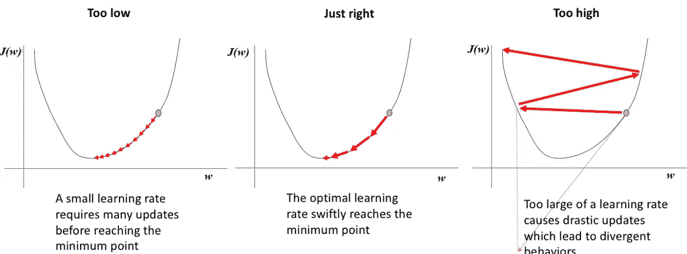
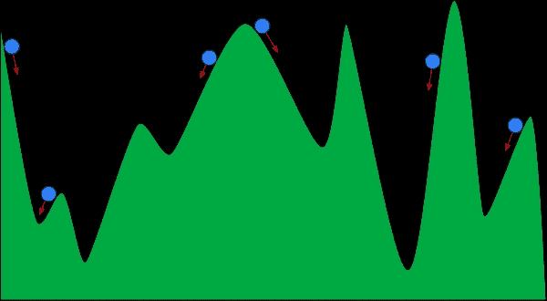
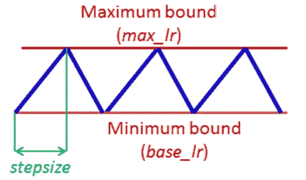
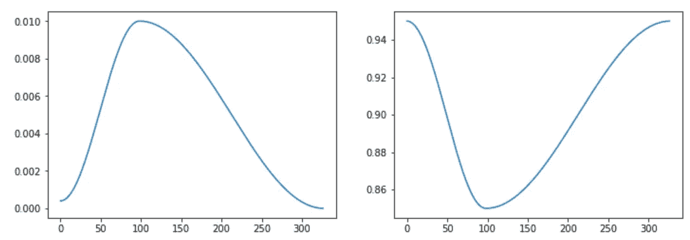

# 深度学习中的超参数调整技术

> 原文：<https://towardsdatascience.com/hyper-parameter-tuning-techniques-in-deep-learning-4dad592c63c8?source=collection_archive---------2----------------------->

设置超参数的过程需要专业知识和大量的反复试验。没有简单易行的方法来设置超参数，特别是学习率、批量、动量和重量衰减。

[Source](https://unsplash.com/photos/RT3QngqeIEc)

> 深度学习模型充满了超参数，在如此高维的空间中找到这些参数的最佳配置不是一个微不足道的挑战。

在讨论寻找最优超参数的方法之前，让我们先了解这些超参数:**学习率**、**批量**、**动量**、**权重衰减**。这些超参数充当旋钮，可以在模型训练期间调整。为了让我们的模型提供最佳结果，我们需要找到这些**超参数的最佳值。**

## 梯度下降

梯度下降是一种常用于训练机器学习算法的优化技术。训练 ML 算法的主要目的是调整权重`*w*`以最小化损失或成本。这个成本是我们的模型做得有多好的度量，我们用`*J(w)*`来表示这个成本。因此，通过最小化成本函数，我们可以找到产生最佳模型性能的最佳参数[1]。

回归问题的典型损失函数图是碗形的，如下所示。

在梯度下降算法中，我们从随机模型参数开始，计算每次学习迭代的误差，不断更新模型参数，以更接近产生最小成本的值。详情请参考我的[帖子](/machine-learning-basics-part-1-a36d38c7916)。梯度下降算法将梯度(斜率)乘以一个称为**学习速率**(或**步长**)的标量，以确定下一个点。此参数说明了在渐变方向上移动权重的距离。

如果我们将`dw`和`db`表示为梯度，以更新梯度下降算法的参数`W`和`b`，如下所示:

如果学习率小，那么训练更可靠，但是它将花费大量时间，因为向损失函数的最小值的步骤很小。

如果学习率很高，那么训练可能不收敛，甚至发散。重量变化可能如此之大，以至于优化器超过了最小值，使损失更严重。因此，我们的目标是找到能够快速找到最小损失的最优学习速率。

[Source](https://www.jeremyjordan.me/nn-learning-rate/)

对于更一般的模型，您可以将梯度下降想象为一个球在山谷中滚动。我们希望它坐落在大山的最深处，然而，很容易看出事情可能会出错。

[Source](/machine-learning-101-an-intuitive-introduction-to-gradient-descent-366b77b52645)

根据球开始滚动的位置，它可能会停在谷底。但不是在最低的一个。这被称为局部最小值。我们初始化模型权重的方式可能导致它停留在局部最小值。为了避免这种情况，我们用随机分布的值初始化权重向量。

我们可以用二维表示损失面，如下所示:

红点是全局最小值，我们想要到达那个点。使用梯度下降，更新将如下所示:

随着梯度下降的每一次迭代，我们随着上下振荡向局部最优移动。如果我们使用更大的学习率，那么垂直振荡将具有更高的幅度。所以，这种垂直振荡减缓了我们的梯度下降，并阻止我们使用大得多的学习率。此外，学习率太小会使梯度下降更慢。

> 我们希望在垂直方向上进行较慢的学习，在水平方向上进行较快的学习，这将帮助我们更快地达到全局最小值。

为了帮助我们实现这一点，我们使用**梯度下降与动量**【2】。

我们从梯度下降开始:

在动量项中，我们采用 dw 和 db 的指数加权平均值，而不是对每个历元独立使用 dw 和 db。

其中，β是另一个称为动量的超参数，范围从 0 到 1。它设置以前值的平均值和当前值之间的权重，以计算新的加权平均值。

在计算指数加权平均值后，我们将更新我们的参数。

通过使用 dw 和 db 的指数加权平均值，我们倾向于使垂直方向上的振荡趋于零。然而，在水平方向上，所有的导数都指向水平方向的右边，所以水平方向上的平均值仍然很大。它允许我们的算法采取更直接的路径走向局部最优，并抑制垂直振荡。由于这个原因，该算法将通过几次迭代而在局部最优处结束。

要直观地了解这是如何工作的，可以考虑一个球滚下山的例子——vᵈʷ和 Vᵈᵇ为球提供了速度，使它运动得更快。我们不希望我们的球加速太快，以至于错过了全局最小值，因此β作为摩擦力。

梯度下降有三种方式:

**批量梯度下降:**

*   一次所有示例:在每次迭代中使用所有训练实例来更新模型参数。
*   随着误差梯度的精确估计而缓慢收敛。

**随机梯度下降(SGD):**

*   *一次一个例子*:在每次迭代中仅使用单个训练实例更新参数。训练实例通常是随机选择的。
*   在误差梯度的噪声估计下快速收敛。

**小批量梯度下降:**

*   一次 b 个样本:小批量梯度下降不是使用所有的样本，而是将训练集分成更小的规模，称为批量，用“b”表示。因此，小批量“b”用于在每次迭代中更新模型参数。

> *小批量梯度下降寻求在随机梯度下降的鲁棒性和批量梯度下降的效率之间找到平衡。*

小批量梯度下降是深度学习领域中最常见的梯度下降实现。Mini-batch 的缺点是它为学习算法增加了一个额外的超参数“批量大小”或“b”。

# 寻找最佳配置的方法:网格搜索和随机搜索

## 网格搜索

在网格搜索[3]中，我们尝试了每个可能的参数配置。

步骤:

*   在 *n* 维上定义一个网格，每个网格映射一个超参数。例如 *n* = (learning_rate，，batch_size)
*   对于每个维度，定义可能值的范围:例如，batch_size = [4，8，16，32]，learning_rate =[0.1，0.01，0.0001]
*   搜索所有可能的配置，并等待结果以建立最佳配置:例如 *C1* = (0.1，4) - > acc = 92%， *C2* = (0.01，4) - > acc = 92.3%，等等

正如我们看到的，维度越多，搜索的时间复杂度就越高。当维度小于或等于 4 时，通常使用这种方法。虽然它保证最终找到最佳配置，但它仍然不是首选。相反，最好使用随机搜索

## 随机搜索

随机搜索[4]在*步骤 1* 中进行随机搜索，从配置空间中随机选取一个点。它如何更好地工作的直觉是，我们可以通过随机搜索更广泛地探索超参数空间(特别是对于更重要的变量)。这将帮助我们在更少的迭代中找到最佳配置。例如，请参见下图:

在网格布局中，很容易注意到，即使我们训练了 9 个(n=3)模型，每个变量也只使用了 3 个值。然而，在随机布局中，我们不太可能多次选择相同的变量。最后，使用第二种方法，我们将为每个变量使用 9 个不同的值来训练 9 个模型。关于网格 vs 随机的详细分析，请参考这篇[论文](http://www.jmlr.org/papers/volume13/bergstra12a/bergstra12a.pdf)。

即使随机搜索比网格搜索执行得更好，这两种方法仍然计算量大且耗时。***2018 年，Leslie N. Smith 在其经典的*** [***论文***](https://arxiv.org/pdf/1803.09820.pdf) **中，就确定最优超参数的各种方法发表了详细的报告。**我们将快速浏览 Smith 建议的方法【5】。该方法基于通过检查训练的测试/验证损失来寻找欠拟合和过拟合的线索，从而找到欠拟合和过拟合之间的平衡，以便努力获得超参数的最优集合。

> 超参数调整过程是一个走钢丝的过程，目的是在欠适应和过适应之间取得平衡。

**欠拟合**是指机器学习模型无法减少测试集或训练集的误差。不合适的模型不足以适应数据分布的潜在复杂性。

**过度拟合**发生在机器学习模型强大到与训练集拟合得太好，泛化误差增大的时候。上图显示了这种欠拟合和过拟合的权衡。

## 方法

1.  通过**监控验证/测试损失**观察和理解培训期间可用的线索。在培训的早期，通过几个时期的短期运行来调整您的架构和超参数。
2.  测试的 ***欠拟合*** 或 ***过拟合*** 的迹象或训练过程早期的验证损失对于调整超参数是有用的。

Model complexity refers to the capacity of the machine learning model. The figure shows the optimal capacity that falls between underfitting and overfitting.

# 寻找最佳超参数

## 学习率

如果学习率(LR)太小，可能会出现过拟合。大的学习率有助于使训练规律化，但是如果学习率太大，训练就会分散。因此，对短期运行进行网格搜索以找到收敛或发散的学习率是可能的，但我们有另一种方法，称为 Leslie N. Smith 的“[循环学习率(CLR)](https://arxiv.org/pdf/1506.01186.pdf) ”。

Leslie 的实验表明，在训练期间改变学习速率总体上是有益的，因此建议在一个值范围内循环地改变学习速率，而不是将其设置为固定值。这种学习率政策的本质来自于这样一种观察，即提高学习率可能会产生短期的负面影响，但却能产生长期的有益影响。这一观察引出了让学习率在一个值的范围内变化的想法，而不是采用逐步的、固定的或指数递减的值。也就是说，设置最小和最大边界，学习率在这些边界之间循环变化。

[Source](https://arxiv.org/pdf/1506.01186.pdf)

如何估计合理的最小和最大边界值？

**LR 范围测试:**在让学习率在低 LR 值和高 LR 值之间线性增加的同时，运行你的模型几个时期。每当你面对一个新的架构或数据集时，这个测试都是非常有价值的。对于浅 3 层架构，large 是 0.01，而对于 resnet，large 是 3.0，您可以尝试多个最大值。

From my previous [post](/machine-learning-text-classification-language-modelling-using-fast-ai-b1b334f2872d), using fast.ai library to do a LR test

使用 1 周期 LR 策略，通过 LR 范围测试确定最大学习率，最大学习率的十分之一的最小学习率似乎工作良好[6]。

## 批量

与学习率超参数(其值不影响计算时间)不同，批量大小必须结合训练的执行时间进行检查。批量大小受硬件内存的限制，而学习速率不受限制。Leslie 建议使用适合硬件内存的批处理大小，并允许使用更大的学习速率。

如果您的服务器有多个 GPU，总批处理大小是 GPU 上的批处理大小乘以 GPU 的数量。如果体系结构很小，或者您的硬件允许非常大的批量，那么您可以比较不同批量的性能。此外，请记住，小批量增加正则化，而大批量增加较少，因此在平衡正则化的适当数量时利用这一点。使用较大的批量通常更好，这样可以使用较大的学习速率。

## **周期性势头**

动量和学习率密切相关。最佳学习速率取决于动量，动量取决于学习速率。由于学习率被认为是最重要的超参数，因此动量也很重要。像学习率一样，在不导致训练不稳定的情况下，将动量设置得尽可能大是很有价值的。

## 寻找学习率和动量组合的步骤

*   **使用循环学习率:**最佳训练程序是一个递增的循环学习率和递减的循环动量的组合，前者初始的小学习率允许收敛开始，后者递减的动量允许学习率在训练的早期到中期变大。当学习率增加时，使用递减的循环动量提供了更快的初始收敛，并稳定了训练以允许更大的学习率。

> 循环动量对于以大动量开始并在学习速率增加时减小动量是有用的，因为它提高了测试精度，并使训练对大学习速率更鲁棒。

下面的图来自我的[帖子](/machine-learning-text-classification-language-modelling-using-fast-ai-b1b334f2872d)典型地显示了学习率和动量在一个训练周期(一个时期)中是如何变化的。

left: learning rate one cycle, right:momentum for one cycle

*   **使用恒定学习率:**如果使用循环学习率，则相反方向的循环动量是有意义的，但是**当学习率恒定时，最佳动量是什么？**在这里周期性的动量并不比一个好的常量值强。如果使用恒定的学习速率，那么大的恒定动量(即 0.9-0.99)将表现为伪递增的学习速率，并将加速训练。然而，使用过大的动量值会导致较差的训练结果，这在训练的早期是可见的，并且这可以被快速测试。

> 对于循环学习率或恒定学习率，一个好的程序是测试 0.9 到 0.99 范围内的动量值，并选择一个表现最佳的值。

## 重量衰减

权重衰减是正则化的一种形式，它在训练中起着重要的作用，因此需要适当地设置它的值[7]。**权重衰减**被定义为将每个历元的梯度下降中的每个权重乘以因子λ [0 < λ < 1】。

Leslie 的实验表明，重量衰减不同于学习速率或动量，最佳值应在训练过程中保持不变(即**周期性重量衰减没有用**)。

如果你不知道重量衰减的合理值，测试 1/10，1/10⁴，1/10⁵和 0。较小的数据集和架构似乎需要较大的权重衰减值，而较大的数据集和较深的架构似乎需要较小的值。我们的假设是，复杂数据提供了自己的正则化，其他正则化应该减少。

如果你用一个恒定的学习速率和使用一个学习速率范围进行搜索，最佳权重衰减是不同的。这符合我们的直觉，因为较大的学习率提供了正则化，所以较小的权重衰减值是最佳的。

# 主要调查结果摘要

## **学习率(LR):**

*   执行学习率范围测试，以确定“大”学习率。
*   使用 1 循环 LR 策略，最大学习率由 LR 范围测试确定，将最小学习率设置为最大学习率的十分之一。

## **气势**:

*   使用动量值 0.99、0.97、0.95 和 0.9 进行短期测试，以获得动量的最佳值。
*   如果使用 1 周期学习率时间表，最好使用一个循环动量(CM ),它从这个最大动量值开始，并随着学习率的增加而减少到 0.8 或 0.85。

## **批量:**

*   使用尽可能大的批处理大小来适应您的内存，然后比较不同批处理大小的性能。
*   小批量增加正规化，而大批量增加较少，所以利用这一点，同时平衡适当数量的正规化。
*   使用较大的批量通常更好，这样可以使用较大的学习速率。

## **重量衰减:**

*   确定适当震级的网格搜索，但通常不要求超过一个有效数字的精度。
*   更复杂的数据集需要更少的正则化，因此测试更小的权重衰减值，例如 104、105、106、0。
*   浅架构需要更多的正则化，因此测试更大的权重衰减值，如 102、103、104。

感谢您的阅读。

## 参考资料:

[1][https://www.jeremyjordan.me/gradient-descent/](https://www.jeremyjordan.me/gradient-descent/)

[https://engmrk.com/gradient-descent-with-momentum/](https://engmrk.com/gradient-descent-with-momentum/)

[3][https://blog . Floyd hub . com/guide-to-hyperparameters-search-for-deep-learning-models/](https://blog.floydhub.com/guide-to-hyperparameters-search-for-deep-learning-models/)

[4][http://www . jmlr . org/papers/volume 13/bergstra 12a/bergstra 12a . pdf](http://www.jmlr.org/papers/volume13/bergstra12a/bergstra12a.pdf)

[https://arxiv.org/pdf/1803.09820.pdf](https://arxiv.org/pdf/1803.09820.pdf)

[6][https://arxiv.org/pdf/1506.01186.pdf](https://arxiv.org/pdf/1506.01186.pdf)

[7][https://papers . nips . cc/paper/563-a-simple-weight-decay-can-improve-generalization . pdf](https://papers.nips.cc/paper/563-a-simple-weight-decay-can-improve-generalization.pdf)

## 其他参考文献

[https://www . analyticsvidhya . com/blog/2018/11/neural-networks-hyperparameter-tuning-regulatory-deep learning/](https://www.analyticsvidhya.com/blog/2018/11/neural-networks-hyperparameter-tuning-regularization-deeplearning/)