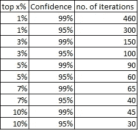

# 利用随机网格搜索的超参数调谐

> 原文：<https://towardsdatascience.com/hyper-parameter-tuning-with-randomised-grid-search-54f865d27926?source=collection_archive---------18----------------------->

## 为什么随机网格搜索更好，如何使用它？

Jewel Changi Singapore — beautiful isn’t it?

> 随机网格搜索在为任何机器学习模型寻找接近最优的超参数时非常有用。
> 
> 经验法则:无论网格大小如何，60 次迭代，95%的时间，可以找到最好的 5%的参数集。

## **什么是网格搜索？**

> 网格搜索是一种寻找最优参数集的残酷搜索算法。

让我们假设我们正在构建一个二元随机森林分类模型，并将使用 AUC 来评估它。在所有的数据处理和特征工程之后，我们需要调整参数以达到最大的精度。

经过一些初步分析后，我们决定从数值范围中选择参数，例如:

Example: parameter grid

这是一个**参数网格**，由**所有可能的参数组合组成。36 (2*3*3*2)组潜在的参数可以从这个网格中提取。**

**网格搜索将计算每组参数的准确度分数，并选择产生最佳结果的一个。**在下面的例子中，网格搜索将输出集合 4，因为它产生最高的 AUC。

Example: AUC score for each parameter set in the grid

## **为什么网格搜索会失败？**

网格搜索保证在网格中找到最佳参数集。然而，**随着更多的参数或更多的参数选择添加到网格中，网格的大小呈指数级增长。**

使用上面的例子，让我们用 5 个候选参数再调整一个参数“最小杂质减少”,并为所有现有参数添加一个选项。通过稍微扩大搜索区域，网格扩展到 720 (3*4*4*3*5)个集合，比原始网格大 20 倍！如果原来的网格搜索需要 20 分钟，这个网格就需要将近 7 个小时才能完成。

**因此，当我们调整具有许多参数的复杂模型时，网格搜索在许多情况下不太可行。**

## 随机网格搜索是网格搜索的一个很好的替代品

**随机网格搜索不是穷举搜索，而是从网格中随机抽取一组参数来计算每次迭代的精确度分数。**可以调整迭代次数，所有迭代中的最佳集合将作为输出。

显然，由于控制了迭代次数，随机网格搜索消耗了更少的计算能力。但是，需要多少次迭代才能找到足够好的参数集呢？

> **经验法则:**无论网格大小如何，60 次迭代，95%的时间，可以找到最好的 5%的参数集。

**简单数学证明:**

1.  让我们将 *n* 表示为迭代次数。
2.  经过 *n* 次迭代后，从网格中抽取的最佳 *p* 组参数中没有一组的概率是(1- *p)ⁿ*
3.  因此，在 *n* 次迭代之后，从网格中抽取至少一组最佳 *p* %参数的概率是 1-(1- *p)ⁿ*
4.  如果我们想要有 95%置信度的最好的 5%参数集，解上面的方程，1-(1–5%*)ⁿ=*95%，n ≈ **59**

从这个证明中，我们还可以得出结论，推荐的迭代次数与网格大小无关。

## 随机网格搜索的迭代次数清单

为了方便读者，请参考下表，了解不同置信度和性能阈值的推荐迭代次数

Recommended number of iterations

感谢阅读！