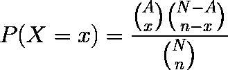
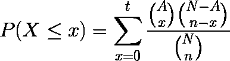
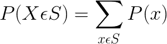
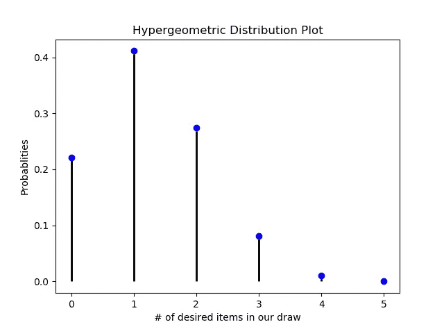
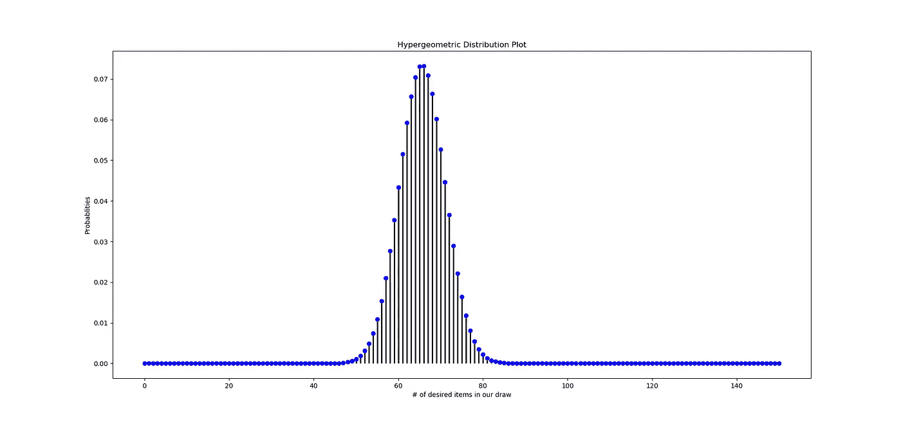

# 用 Python 解释超几何分布

> 原文：<https://towardsdatascience.com/hypergeometric-distribution-explained-with-python-2c80bc613bf4?source=collection_archive---------14----------------------->

在数学课上的概率问题中，你需要的概率要么是给你的，要么是以一种简单明了的方式计算出来的。

Photo by [Francesco Ungaro](https://unsplash.com/@francesco_ungaro?utm_source=medium&utm_medium=referral) on [Unsplash](https://unsplash.com?utm_source=medium&utm_medium=referral)

但现实中并非如此。你需要根据情况自己计算概率。这就是概率分布可以发挥作用的地方。

今天，我们将通过以下方式探索超几何概率分布:

1.  解释它在什么情况下有用。
2.  应用此分布所需的信息。
3.  使用 Python 从头开始编写一些计算代码。
4.  将我们的代码应用到问题中。

# 我们什么时候使用超几何分布？

超几何分布是一个[离散概率分布](/probability-distributions-discrete-and-continuous-7a94ede66dc0)。当您想要确定在不替换特定样本量的情况下获得一定数量成功的概率时，可以使用该方法。这类似于[二项式分布](https://en.wikipedia.org/wiki/Binomial_distribution#Example)，但是这一次你不会得到一次成功的概率。应用这种分布的一些示例情况是:

1.  扑克中一手 5 张牌中拿到 3 张黑桃的概率。
2.  在[万智牌](https://www.lifehacker.com.au/2016/07/an-absolute-beginners-guide-to-magic-the-gathering/)一副标准的 60 张牌中，一手牌拿到 4 到 5 张非地牌的概率。
3.  从特许学校招生抽签中随机抽取的混合性别组中抽出 60%男生参加新生班的概率。

# 超几何计算需要什么参数(信息)？

为了计算超几何分布的概率质量函数(也称为单个实例),我们需要:

a)我们从中抽取的项目总数(称为 N)。

b)N 中所需项目的总数(称为 A)。

c)我们将从 N 中抽取的次数(称为 N)。

d)在我们的 n 个项目(称为 x)的抽签中所需项目的数量。

根据教程的不同，这些变量使用不同的字母。我使用了我在下面发布的视频中使用的字母，在那里我最初了解到了超几何分布。

# 从头开始编写超几何 PMF、CDF 和绘图函数。

回想一下概率质量函数(PMF)，它允许我们计算单一情况的概率。在我们的例子中，这是上面 x 的具体值。超几何分布 PMF 如下。

PMF for Hypergeometric Distribution

稍后，我们用其他函数为我们的计算导入`numpy`。`Matplotlib`将在后面创建我们的情节函数。`scipy`中的`comb`函数是一个内置函数，用于计算我们的 PMF 中的 3 个组合。我们为需要计算的每个组合创建一个变量，并返回 PMF 的计算结果。

累积分布函数(CDF)是计算 x 的一系列值的总概率的函数。这将允许我们用万智牌游戏解决第二个例子。另一个例子是确定在一手五张牌中最多获得 2 张黑桃的概率(也就是 2 张或更少的黑桃)。

要用最多两个黑桃回答黑桃问题，我们需要下面的 CDF:

对于万智牌游戏场景，我们可以使用上面的函数，但是它需要在 4 点开始，在 5 点结束。

PMF sum of a set of x-values.

幸运的是，使用 Python，我们可以创建一个足够灵活的函数来处理这两个问题。

最后，下面是根据您的情况绘制分布图所需的代码。一些代码和样式基于这个 [scipy docs 页面](https://docs.scipy.org/doc/scipy-0.14.0/reference/generated/scipy.stats.hypergeom.html)的例子。

请注意，由于我们展示了从 0 到 n 的所有可能性，所以我们不需要在这个函数中为 x 创建一个参数。设置`N = 52`、`A = 13`和`n = 5`，查看 5 手牌的超几何分布。然后，您将获得下图:

Hypergeometric Distribution plot of example 1

# 将我们的代码应用到问题中。

## 问题 1

现在来利用我们的函数。为了回答第一个问题，我们在`hypergeom_pmf`中使用以下参数，因为我们想要一个单独的实例:

`N = 52`因为一副牌里有 52 张牌。

因为一副牌中共有 13 张黑桃。

`n = 5`既然我们抽了一手 5 开的牌。

`x = 3`因为我们想在第一手牌中抽取 3 张黑桃。

计算`hypergeom_pmf(52, 13, 5, 3)`我们得到的概率是 0.08154261704681873，大概是 8.1%。拿到那只手的机会不大。

## 问题 2

对于第二个问题，我将为您提供一些快速的背景信息。万智牌(简称魔术)是一个可收藏的交易纸牌游戏，玩家使用生物和咒语击败他们的对手。玩家从一副 60 张牌中拿出 7 张牌开始每场游戏。

Image from [manaleak.com](http://www.manaleak.com/mtguk/2017/03/10-important-things-i-learned-when-teaching-people-magic-the-gathering/)

一副牌由允许你施放法术的地牌和法术本身(非地牌)组成。根据不同的牌组，你通常希望你的起手牌中有 4-5 张非地牌，而你的牌组中有大约 23 张地牌。

假设以上，我们来计算一下拿到 4 张或者 5 张非地牌的概率。我们将使用带有以下参数的`hypergeom_cdf`:

由于一副牌有 60 张牌。

`A = 37`因为我们假设我们的 60 副牌中有 23 个地。

`n = 7`因为我们将从一手 7 张牌开始。

`t = 5`因为这是我们想要的非陆地的最大数量。

`min_value = 4`因为这是我们第一手牌中非陆牌的最小数量。

计算`hypergeom_cdf(60, 37, 7, 5, 4)`给我们的概率是 0.5884090217751665，大概是 59%。这意味着我们有大约 59%的机会在第一手 7 张牌中抽 4 或 5 张非地牌。还不错。你会如何改变你牌组中的地和法术的数量来增加这种概率？

## 问题三。

假设你经营一所特许学校，你通过抽签系统录取学生。你有 734 个申请人，其中 321 个是男生，413 个是女生。你只录取随机抽取的前 150 名学生。考虑到你的学校女生比男生多，你希望今年有更多的男生。假设你想知道你的学校录取 90 个男生的几率是多少(150 个中的 60%)。

花几秒钟计算你的答案，然后检查下面的图片。

Image from [almadelmar.org](https://www.almadelmar.org/admissions/enrollment-process/)

你应该使用`hypergeom_pmf`，因为这是一个单实例概率。使用`hypergeom_pmf(734, 321, 150, 90)`你应该得到 3.1730164380350626 e-06…少于百分之一…让我们看一下分布图，看看哪里我们有更好的机会。

Hypergeometric distribution of problem 3

看起来如果我们试着得到 65 个男孩，我们会有更好的机会，但是可能性仍然相当低。也许你应该改变你的入学程序…

# 哈尔滨麻将开局手的问题

现在让你练习一个你可能不熟悉的游戏。[麻将](https://www.thesprucecrafts.com/how-to-play-mahjong-411827)是一种中国各地都玩的著名纸牌游戏，但有着相同的获胜条件。它经常是为了钱而玩的，但那不是我玩的方式。我也不鼓励你赌博…

Image from [fotolia.com](https://www.fotolia.com/id/251142506)

我们将要讨论的麻将来自中国东北的哈尔滨。它是著名的[哈尔滨冰雪节](http://www.harbinice.com/)和我姻亲的家乡。

Image from [mymodernmet.com](https://mymodernmet.com/harbin-ice-festival-2019/)

游戏有 3 种花色，编号为 1 到 9，每张牌 4 份。到目前为止总共有 108 张卡片。此外，还有 4 张钟牌(上图中竖立的红色方块)，总共 112 张牌。在哈尔滨麻将中，除了获胜的一手牌之外，满足特定条件也是获胜的基础。在你的开局手牌中拿到至少 3 张钟牌，你就涵盖了几乎所有的情况。

问题是如果你不是庄家，你的开局手牌中至少有 3 张中牌的概率是多少？这意味着你的第一手牌将有 13 张。尝试使用提供的正确函数自己计算这个概率。然后把你的答案贴在下面的评论里，我会让你知道你是否回答正确。

# 额外资源

感谢阅读！要查看本教程的代码，你可以在我的 [Github](https://github.com/JohnDeJesus22/DataScienceMathFunctions/blob/master/hypergeometricfunctions.py) 找到。

如果你想看这里的视频教程，你可以看看下面的视频。这是我用来学习超几何分布的。

你可以在 [Linkedin](https://www.linkedin.com/in/jdejesus22/) 和 [Twitter](https://twitter.com/johnnydata22?lang=en) 上关注或联系我。直接在 j.dejesus22@gmail.com 联系我。如果你喜欢这个，看看我在下面的一个叫做点双列相关的相关概念上的类似文章:

 [## 与 Python 的点双列相关

### 线性回归是确定数据的两个或多个连续特征之间相关性的经典技术…

towardsdatascience.com](/point-biserial-correlation-with-python-f7cd591bd3b1) 

如果你喜欢在媒体上阅读，并愿意进一步支持我，你可以使用我的[推荐链接](https://medium.com/@j.dejesus22/membership)注册一个媒体会员。这样做可以用你的会费的一部分在经济上支持我，我将不胜感激。

直到下一次，

约翰·德杰苏斯