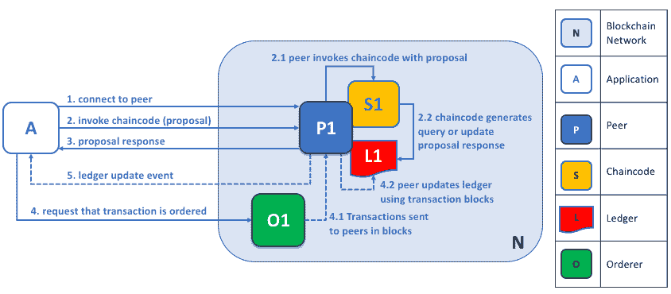
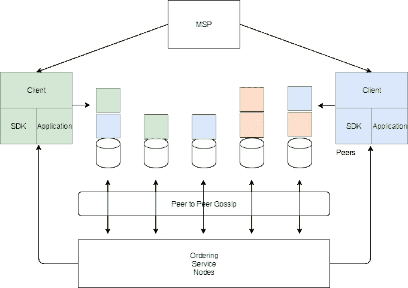

# Hyperledger 结构:技术概述

> 原文：<https://towardsdatascience.com/hyperledger-fabric-technical-overview-a63046c2a430?source=collection_archive---------23----------------------->

我是🇵🇹大学的博士研究员@ Técnico Lisboa，在那里我教授以用户为中心的设计。我是基于 Hyperledger 结构的访问控制项目的导师，该项目由 Hyperledger 和 Linux 基金会支持和资助。

Fabric 允许网络中有不同类型的参与者，这有助于链代码的分布式执行的**执行-命令-验证**范例。

> *作者认为，相对于区块链常见的订单执行模式，如比特币和以太坊，执行订单验证具有优势。*

背书对等体(背书者)执行(背书)智能合同(链码)并向区块链客户端返回已提交交易的验证输出，其中包含背书对等体的签名。这个过程允许并行执行，并处理非确定性代码。

链码是结构网络中的中心元素，因为它规定了成员参与者要遵守的规则。它在 Docker 容器中运行，因此与共享分类帐隔离。

有两种类型的链码:应用链码，其执行应用逻辑并使用 gRPC 消息和系统链码与对等体通信，在配置信道上运行并用于存储生态系统的配置，例如 MSP 的定义、osn 的网络地址、关于共识的配置、订购服务参数以及关于如何改变信道配置的规则。

来源:[https://hyperledger-fabric . readthedocs . io/en/release-1.4/peers/peers . html](https://hyperledger-fabric.readthedocs.io/en/release-1.4/peers/peers.html)

Chaincode 可以动态部署，并且通常在网络上并发运行。它直接运行在对等体的进程上。配置信道存储 MSP 的定义、osn 的网络地址、关于共识的配置、订购服务参数以及关于如何调整信道配置的规则。

> 由于世界状态提供了对这些键的最新值的直接访问，Chaincode 根据世界状态数据执行事务提议。鉴于此，没有必要遍历整个事务日志并计算其值。

最终，chaincode 的目标是修改共享分类账。每个对等方包含一个分类帐组件，由存储包含事务的块的块存储和对等方事务管理器(PTM)组成。每个渠道都有不同的分类账，因为渠道会强制实施链码和数据隔离。

> *通道允许参与者在有权可视化交易子集的参与者子集之间建立通信路径。*

例如，在同一个网络中，可能存在只能访问某类事务的对等体子集。除了通道之外，Fabric 还支持私有数据，这允许通道上组织的一个定义子集将他们的数据与其他数据隔离开来。

具体来说，具有权限的组织可以签署、提交或查询私有数据，这些数据在逻辑上与渠道分类帐数据分离。如果出现争议，可以共享私人数据。

为了进一步保护隐私，私有数据的散列通过订购者，而不是数据本身。它是点对点传播，而不是通过块。

当交易数据必须对订购服务节点保密时，使用私有数据集合而不是通道是一种解决方案。

来源:[https://vital flux . com/hyperledger-fabric-channels-private-区块链-deep-dive/](https://vitalflux.com/hyperledger-fabric-channels-private-blockchain-deep-dive/)

> *Fabric 引入了混合复制模型，结合了主动和被动复制(primarybackup-replication，移植到不可信环境)。*

对于主动复制或状态机复制，分类帐状态仅反映经过验证并就其排序达成一致的交易。当签署者将事务处理的结果发送到提交节点时，发生被动复制。

Fabric 包含三个围绕数据的主要元素:世界状态，对应于分布式分类帐的版本化的键值存储；交易日志，存储所有交易的历史(PTM)；NoSQL 数据库，如 CouchDB，存储世界状态。

可以限制用户查看和编辑特定字段的权限，并且只授予只读权限。与 LevelDB 相比，CouchDB 支持针对整个区块链数据的复杂数据查询，这使得它成为数据分析和审计的合适解决方案。LevelDB 是存储世界状态的另一个内置选项。

> *这是一个简单、快速的键值存储库，提供了从字符串键到字符串值的有序映射。*

虽然 Fabric 没有内置的加密货币，但可以使用 chaincode 创建一个底层令牌，它可以表示执行特定操作的资产或权利。

> 这些资产可以通过交易在网络参与者之间进行交换。

参与者可以拥有网络上的一个或多个对等节点。Fabric 在其模型上定义了几种对等节点:

1.  **提交同行**。每个对等体维护分类帐当前状态的当前快照，作为键值的存储。这样的对等体不能调用链码函数。
2.  **背书人同行**。背书者对等方安装了链码。当他们收到一个事务提议时，他们在隔离的容器上模拟事务执行。基于该模拟，这些对等方准备一个交易提议，然后发送给订购方对等方。背书者对等体的存在避免了所有对等体顺序执行事务。
3.  **订购者同行**。订购者接收经认可的交易，并将它们组装成块。在对交易进行分组之后，订购者通过将这样的块传播给提交对等方来确保一致性，在提交对等方处，它们被验证，然后被提交到共享分类帐。订购方对等方记录有效和无效交易，而其他对等方只包含有效交易。

此外，Fabric 定义了锚点对等体和领导者对等体。

> *锚节点在来自其组织的节点和来自外部组织的节点之间充当中介。*
> 
> *领导节点负责将交易从订购者分发到提交节点。*

# 结构解决方案的架构。

为了达成共识，并且假定在超分类帐结构网络中存在部分信任的假设，结构使用基于许可投票的方案，这实现了低延迟。

> *背书策略定义了对等体使用的基于投票的方案，并因此定义了每个对等体关于交易有效性的权重。*

遵循执行-订单-验证范例的事务流程如下:

1.  **交易建议**。代表组织的区块链客户创建一份交易提案，并将其发送给背书政策中定义的背书伙伴。该提议包含关于提议者的身份、交易有效载荷、随机数和交易标识符的信息。
2.  **执行(背书)**:背书是模拟交易。背书者产生一个包含密钥及其修改值的写集合和一个读集合。背书对等体还检查事务执行的正确性。背书作为建议响应发送，包含写集合、读集合、交易 ID、背书人 ID 和背书人签名。当客户机收集到足够多的背书(需要有相同的执行结果)时，它创建事务并将其发送给订购服务。认可阶段消除了任何最终的不确定性。
3.  **订单**:背书后是订货环节，由订货人完成。订购服务检查提交交易建议的区块链客户在给定频道上是否具有适当的许可(广播和接收许可)。排序产生包含每个通道中有序序列的已签署事务的块。排序允许网络达成共识。定序器将事务的输出广播给所有对等体。
4.  **验证**。首先，每个对等体通过检查交易是否遵循通信方背书策略来验证接收到的交易。之后，将按顺序对块中的所有事务运行读写冲突检查。对于每笔交易，它会将读取集中的密钥版本与当前分类帐中的密钥版本进行比较。它检查值是否相同。在它们不匹配的情况下，对等体丢弃该事务。最后，分类帐被更新，其中分类帐将创建的块附加到其头部。分类帐附加有效性检查的结果，包括无效的事务处理。

*   伊里·安德罗拉基、亚科夫·马涅维奇、斯里尼瓦桑·穆拉利哈兰、切特·穆尔蒂、阮平、马尼什·塞西、加里·辛格、基思·史密斯、亚历山德罗·索尼奥蒂、金苏拉·斯塔萨科普卢等。Hyperledger Fabric:许可区块链的分布式操作系统。2018 年第十三届欧洲系统会议记录
*   超级账本基金会。Hyperledger 结构文档，2018 年。https://hyperledger-fabric.readthedocs.io/en/release-1.4.[网址](https://hyperledger-fabric.readthedocs.io/en/release-1.4.)访问时间 2018-11-12
*   马尔科·武科里奇。重新思考被允许的区块链。在 2017 年 ACM 区块链、加密货币和合同研讨会会议录第 3-7 页