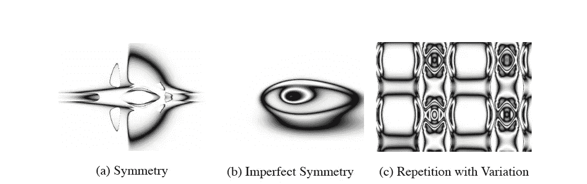
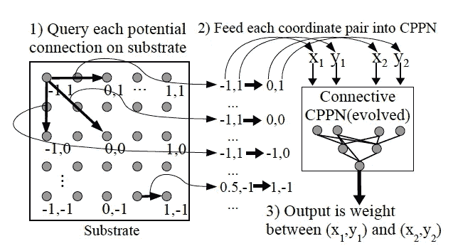
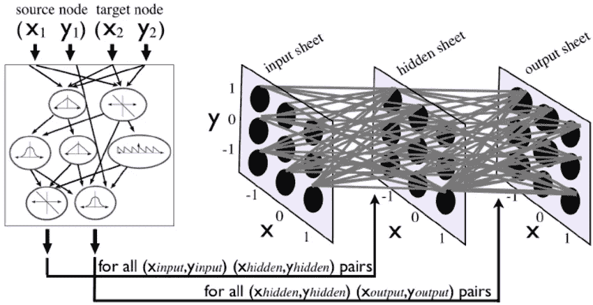
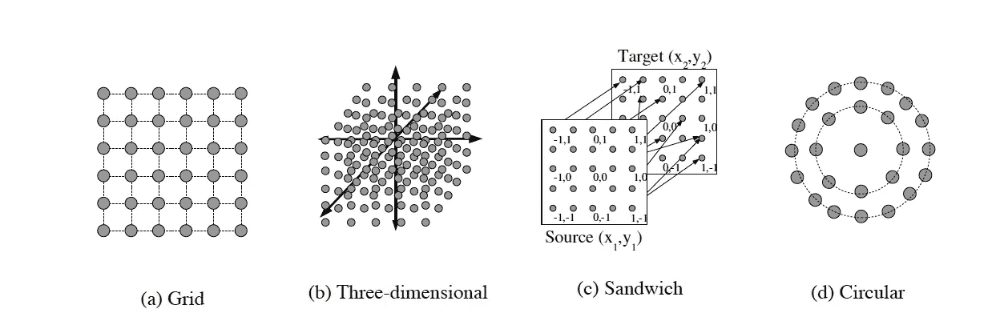
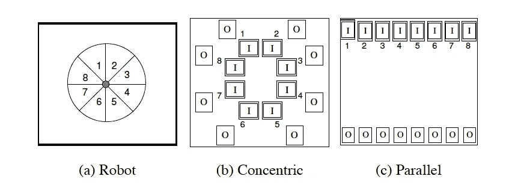

# 超净:强大的，间接的神经网络进化

> 原文：<https://towardsdatascience.com/hyperneat-powerful-indirect-neural-network-evolution-fba5c7c43b7b?source=collection_archive---------5----------------------->

## 超净:强大的，间接的神经网络进化

# 扩展神经进化

上周，我写了一篇关于 [NEAT(增强拓扑的神经进化)](http://hunterheidenreich.com/blog/neuroevolution-of-augmenting-topologies/)的文章，我们讨论了许多围绕算法的很酷的事情。我们还简要地谈到了这种旧算法可能会如何影响我们今天的网络构建方法，暗示了神经网络不需要完全手工构建的事实。

今天，我们将进入一种不同的神经进化方法，一种叫做[超净](http://axon.cs.byu.edu/~dan/778/papers/NeuroEvolution/stanley3**.pdf)的 NEAT 的扩展。你可能还记得，NEAT 的网络结构有一个直接的编码。这使得网络可以更直观地进化，一个节点接一个节点，一个连接接一个连接。HyperNEAT 放弃了这个想法，因为为了进化出像大脑(有数十亿个神经元)这样的网络，人们需要一种更快的方式来进化这种结构。

HyperNEAT 是一个概念上复杂得多的算法(至少在我看来)，甚至我也在努力理解它如何工作的具体细节。今天，我们将深入了解并探索该算法的一些组件，以便我们可以更好地理解是什么使它如此强大，并在这个深度学习的时代对未来的扩展进行推理。

# 超净

# 动机

在深入研究论文和算法之前，我认为值得探索一下 HyperNEAT 背后的动机。

论文全称是[“一种用于进化大规模神经网络的基于超立方体的间接编码”](http://axon.cs.byu.edu/~dan/778/papers/NeuroEvolution/stanley3**.pdf)，相当拗口！但是，我们已经可以看到两个要点。这是一种基于超立方体的间接编码。我们稍后将讨论超立方体部分，但是我们已经知道这是从直接编码到间接编码的转变(参见我在 NEAT 上的上一篇博客，了解两者之间一些差异的更详细描述)。此外，我们还得到了它背后的主要原因:进化大型神经网络！

不仅如此，这种算法的创造者强调，如果人们观察大脑，他们会看到一个具有数十亿节点和数万亿连接的“网络”。他们看到了一个使用重复结构的网络，重复使用同一基因的图谱多次生成相同的物理结构。他们还强调，人类大脑的构造方式是为了利用世界的物理属性:对称性(拥有结构的镜子，例如两只眼睛用于输入)和局部性(结构中的节点影响它们的连接和功能)。

相比之下，我们所知道的神经网络，要么是通过进化过程建立的，要么是手工构建和训练的。这些属性中的任何一个都成立吗？当然，如果我们强迫网络具有对称性和局部性，也许…然而，即使这样，采取一个密集的前馈网络，其中一层中的所有节点都连接到下一层中的所有节点！当观察由普通算法构建的网络时？它们往往是无组织的、零星的，没有表现出任何这些良好的规律性。

以超整齐的方式进入！通过一种被称为连接性组合模式产生网络(CPPNs)的间接编码，HyperNEAT 试图利用几何属性来产生非常大的神经网络，这些网络具有我们可能希望在我们的进化网络中看到的良好特征。

# 什么是组合模式生产网络？

在前一篇文章中，我们讨论了编码，今天我们将深入探讨用于 HyperNEAT 的间接编码。现在，间接编码比你想象的要普遍得多。其实你自己内心也有一个！

DNA 是一种间接编码，因为表型结果(我们实际看到的)比基因型含量(DNA 中的基因)大几个数量级。如果你观察人类基因组，我们会说它有大约 30，000 个基因，编码大约 30 亿个氨基酸。大脑有 3 万亿个连接。很明显，这里面有间接的东西！

从生物学的思想中借鉴来的是一种叫做发展编码的编码方案。这是一个想法，所有的基因应该能够在发育过程中的任何时间点和在个体的任何位置重复使用。组合模式产生网络(CPPNs)是这一概念的抽象，已经表明能够在笛卡尔空间中创建重复结构的模式。请点击此处查看使用 CPPNs 生产的一些结构:

# 纯 CPPNs

表型可以描述为 n 维的函数，其中 n 是表型性状的数量。我们所看到的是从遗传编码到展示特征的某种转化的结果。通过组合简单的函数，复杂的模式实际上可以很容易地表示出来。像对称、重复、不对称和变异这样的东西，都很容易脱离这样的编码结构，这取决于所产生的网络类型。

我们将更深入地了解 CPPNs 在这种情况下的具体用法，但希望这能让您大致了解它们在间接编码环境中的重要性。

# 系在整洁的

在 HyperNEAT 中，一堆熟悉的属性重新出现在原始的 NEAT 纸上。随着时间的推移，像复杂化这样的事情是很重要的(我们将从简单开始，如果需要的话，逐渐变得复杂)。将使用历史标记，以便我们可以正确地排列任何类型的交叉编码。还将使用统一的起始群体，以便从一开始就没有通配符、不兼容的网络。

这篇文章和以前的文章在整洁程度上的主要区别是什么？HyperNEAT 没有使用 NEAT 算法直接进化神经网络，而是使用 NEAT 来进化 CPPNs。这意味着更多的“激活”函数被用于 CPPNs，因为像高斯函数产生对称性，三角函数有助于结构的重复。

# 该算法

既然我们已经讨论了什么是 CPPN，并且我们使用 NEAT 算法来进化和调整它们，这就引出了一个问题:在整个 HyperNEAT 环境中，这些算法实际上是如何使用的？

首先，我们需要引入基底的概念。在超净的范围内，基底仅仅是节点的几何排序。最简单的例子可能是平面或网格，其中每个离散的(x，y)点是一个节点。一个连接的 CPPN 实际上会取其中的两个点，并计算这两个节点之间的权重。我们可以把它想成下面的等式:

`CPPN(x1, y1, x2, y2) = w`

其中 CPPN 是一种进化的 CPPN，就像我们在前面章节中讨论的那样。我们可以看到，这样做时，每个节点之间实际上都有某种权重连接(甚至考虑到循环连接)。连接可以是正的，也可以是负的，还可以定义一个最小权重值，以便任何低于该阈值的输出都不会导致连接。

节点的几何布局必须在任何 CPPN 发展之前指定。因此，随着 CPPN 的发展，实际的连接权重和网络拓扑将导致几何模式(所有输入都基于节点的位置)。

在节点排列在某种二维平面或网格上的情况下，CPPN 是四维的函数，因此我们可以说它是在四维超立方体上发展的。这就是我们得到报纸名字的地方！

# 生产模式的规律性

我们之前提到的所有规则都很容易从这样的编码中脱离出来。对称可以通过在 x1 和 x2 上使用对称函数来实现。这可以是一个类似高斯函数的函数。当对称用于像 x 和 y 这样的事物时，可能会出现不完全对称，但只是相对于一个轴。

就像我们之前提到的，正弦、余弦等周期性函数也会重复。和对称性一样，通过在衬底的非重复方面引入周期性函数，可以引入相对于重复的变化。因此，所有四个主要的规律都可以从这个编码中发展出来。

# 衬底配置

从上面你可能已经猜到基板的配置是至关重要的。这很有道理。在生物学中，事物的结构与其功能紧密相连。因此，在我们自己的演进模式中，我们的节点结构与特定任务上可能看到的功能和性能紧密相连。

在这里，我们可以看到原始论文中特别概述的几种基板配置:

我认为查看三维立方体的配置非常重要，并注意它如何简单地将 CPPN 方程从四维调整为六维:

`CPPN(x1, y1, z1, x2, y2, z2) = w`

此外，通过只允许一半上的节点连接到另一半，网格可以扩展到三明治配置。这很容易被视为输入/输出配置！该论文的作者实际上使用这种配置来在输入半部上接收视觉激活，并使用它来激活输出半部上的某些节点。

圆形布局也很有趣，因为几何图形不必是配置的网格。可以使用放射状的几何图形来代替，允许从圆形所代表的独特几何图形中产生有趣的行为属性。

# 输入输出布局

输入和输出在 CPPNs 发展之前就已经设计好了。然而，与传统的神经网络不同，我们的超净算法知道输入和输出的几何形状，并可以学习利用和接受它的规律。通过 HyperNEAT 接收的这些额外信息，可以很容易地利用输入和输出的局部性和重复性。

# 基底分辨率

HyperNEAT 的另一个强大而独特的特性是能够上下缩放承印物的分辨率。那是什么意思？好吧，假设你根据一定大小的图像进化出一个超整洁的网络。在该尺寸下表现良好的基础几何图形在缩放到新尺寸时会产生相同的图案。除此之外，不需要额外的训练。它只是缩放到另一个尺寸！

# 算法综述

我认为有了这些关于这个算法如何工作的信息，总结一下它的步骤是值得的。

*   1.选择基板配置(节点布局和输入/输出位置)
*   2.创建一个统一的、最小的连接性 CPPNs 初始群体
*   3.重复直到解决:
*   4.对于每个 CPPN
*   (a)使用 CPPN 生成神经网络的连接
*   (b)评估神经网络的性能
*   5.使用 NEAT 算法再现 CPPNs

# 结论

我们做到了！这就是超净算法。如果你希望探索更多的细节，或者希望看看他们用该算法做的一些实验的性能，我鼓励你看看这篇论文(我特别喜欢他们的食物收集机器人实验)。

这对未来有什么影响？这也是我最近一直在思考的事情。今天，从 HyperNEAT 到训练传统的深度网络有联系吗？这是一种更好的训练深度网络的方法吗？还有另一篇关于进化基质超净的论文，其中实际的基质也在进化，这是我希望在未来探索的一篇论文！但是，在那篇论文中是否隐藏着某种东西，在超净和深度神经网络之间架起了桥梁？只有时间能证明，也只有我们能回答这个问题！

希望这篇文章是有帮助的！如果我错过了什么或者你有问题，让我知道。我自己仍在学习和探索这方面的很多东西，所以我很乐意在这里或在 Twitter 上谈论这个话题。

如果你想读更多我写的东西，也许可以看看:

*   [什么是生成性对抗网络](http://hunterheidenreich.com/blog/what-is-a-gan/)
*   [单词嵌入简介](http://hunterheidenreich.com/blog/intro-to-word-embeddings/)
*   [知识代理简介](http://hunterheidenreich.com/blog/knowledge-based-agents/)

*原载于*[*hunterheidenreich.com*](http://hunterheidenreich.com/blog/next-gen-neuroevolution-hyperneat/)*。*