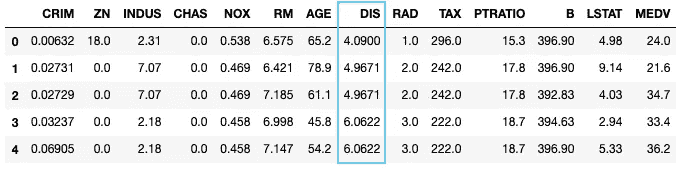
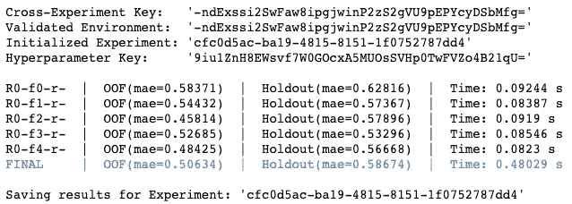
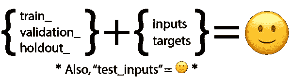
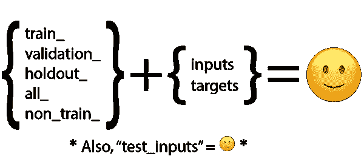
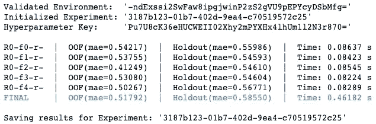
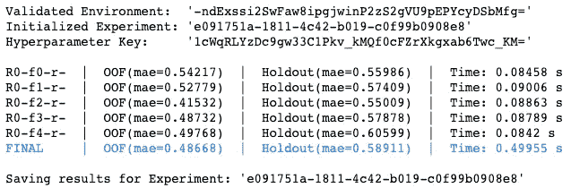
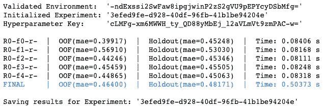
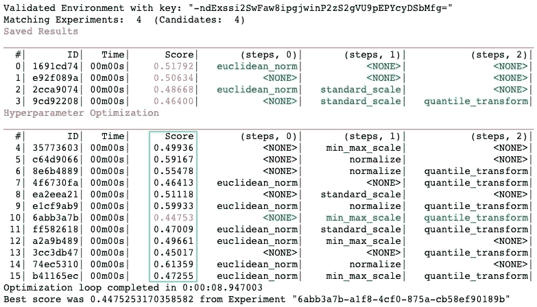
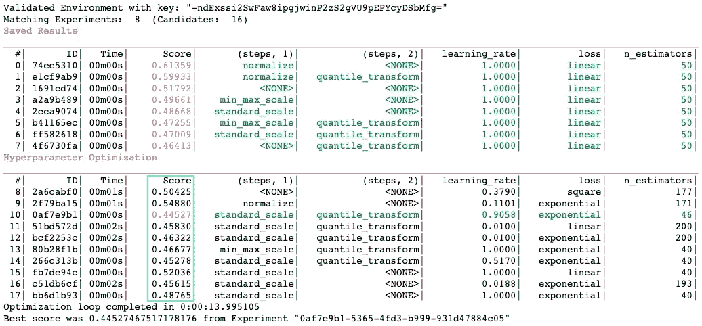
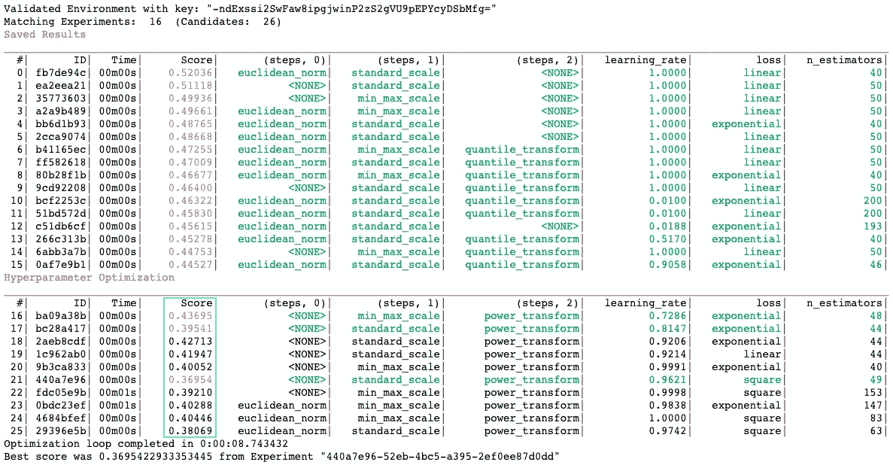

# HyperparameterHunter 3.0 中的特征工程优化

> 原文：<https://towardsdatascience.com/hyperparameter-hunter-feature-engineering-958966818b6e?source=collection_archive---------24----------------------->

使用[超参数猎人](https://github.com/HunterMcGushion/hyperparameter_hunter)自动保存并优化您的特征工程步骤和超参数，使优化更加智能，并确保不会浪费任何实验

Pre-HyperparameterHunter demo of fitting feature engineering into hyperparameter optimization. Photo: [Robyn Mackenzie](https://www.canva.com/photos/MADapr9WTMs-square-peg-in-a-round-hole/)

漫长的等待结束了。[超参数猎人](https://github.com/HunterMcGushion/hyperparameter_hunter) 3.0(阿耳忒弥斯)已经到来，增加了对特征工程的支持，并带来了礼物！

*   **Gift #1)** 清晰且可定制的特征工程师语法:你自己的功能列表
*   **Gift #2)** 为自动记录的建筑特色工程工作流程搭建一致的脚手架
*   **Gift #3)** 针对特征工程步骤的优化，以及(明显地)检测过去的实验以启动优化
*   **礼物#4)** 你的理智和时间:停止跟踪功能工程步骤的 janky 列表，以及它们如何与你的所有其他超参数一起工作

# 1.特征工程背景

## 1.1.这是什么？

很多人对特征工程和预处理有不同的定义，那么[超参数猎人](https://github.com/HunterMcGushion/hyperparameter_hunter)是如何定义的呢？

我们对“特征工程”有一个非常宽泛的定义，因此它本身和“预处理”之间的界限是模糊的。我们认为“特征工程”是在模型拟合之前应用于数据的任何修改——无论是在实验开始时执行一次，还是在交叉验证的每个折叠中重复执行。不过，从技术上来说， [HyperparameterHunter](https://github.com/HunterMcGushion/hyperparameter_hunter) 让你为自己定义“特征工程”的细节，我们很快就会看到。以下是我们的“特征工程”的几个方面:

**1)** 手动特征创建， **2)** 缩放/规范化/标准化，
**3)** 重新采样(参见[我们的](https://github.com/HunterMcGushion/hyperparameter_hunter/blob/master/examples/feature_engineering_examples/imblearn_resampling_example.py) `[imblearn](https://github.com/HunterMcGushion/hyperparameter_hunter/blob/master/examples/feature_engineering_examples/imblearn_resampling_example.py)` [示例](https://github.com/HunterMcGushion/hyperparameter_hunter/blob/master/examples/feature_engineering_examples/imblearn_resampling_example.py))， **4)** 目标数据转换， **5)** 特征选择/消除， **6)** 编码(一键热码，标签等)。)、
**7)** 插补、 **8)** 二值化/宁滨/离散化

…还有许多其他东西！

## 1.2.我为什么要在乎？

这是一个合理的问题，因为特征工程很少成为超参数优化的话题。那么，你为什么要让[超参数猎人](https://github.com/HunterMcGushion/hyperparameter_hunter)跟踪特征工程呢？

第一，特征工程很重要。

> 你几乎总是需要预处理你的数据。这是一个必需的步骤。
> — [*机器学习掌握*](https://machinelearningmastery.com/prepare-data-machine-learning-python-scikit-learn/)

第二，我们通常将特征工程步骤视为超参数——只是我们习惯于手动调整的超参数。

应该用`StandardScaler`还是`Normalizer`？我将对这两种算法都进行测试，并尽力记住哪一种(如果有的话)最适合每种算法。我应该将日期一次性编码成星期几，还是创建一个二进制的“is_weekend”特性？我在乎月份吗？年份？我应该把 12 个月转换成四季吗？闰年呢？？

最终，我们使用的众多特征工程步骤中的每一个都只是我们应该优化的另一个超参数——但我们没有。为什么？

特征工程在普通超参数优化中的缺失实际上有一个很好的原因:很难。这并不完全像在 0.1 和 0.7 之间选择一个值，或者在 NN 层中选择使用 sigmoid 或 ReLU 变换。我们讨论的是参数化和优化一组函数，这些函数需要知道什么并返回什么，所有这些都是为了转换您的宝贵数据。

你有没有把一个脚本扔在一起做你所有的特性工程，然后拖着它到处跑——为了你的整个项目——根据需要随意地添加、删除和修改片段？你并不孤单。在项目结束时，不可能重新创建实验，因为没有为它们执行的清晰、自动的特征工程记录。此外，忽略特征工程使得超参数优化完全不可靠。当然，一定有更好的方法…而且确实有！

# 2.超参数亨特方法

在我们开始使用 HyperparameterHunter 之前，让我们快速浏览一下我们的数据:SKLearn 的[波士顿住房回归数据集](https://scikit-learn.org/stable/datasets/index.html#boston-house-prices-dataset)。我们将使用“DIS”列作为目标，就像 SKLearn 的[目标转换示例](https://scikit-learn.org/stable/auto_examples/compose/plot_transformed_target.html#real-world-data-set)一样。该数据集具有可管理的 506 个样本，其中 13 个特征不包括目标。

## 2.1.基线

因为特征工程的目标是产生更好的模型，所以让我们建立一个基线`[CVExperiment](https://hyperparameter-hunter.readthedocs.io/en/latest/api_essentials.html#experiment-execution)`。和往常一样，我们将从建立一个`[Environment](https://hyperparameter-hunter.readthedocs.io/en/latest/source/hyperparameter_hunter.html#hyperparameter_hunter.environment.Environment)`开始，以宽泛地定义任务以及如何评估结果。

我们将进行五次分割的交叉验证，我们将只关注中位数绝对误差。
还有，因为**我们不是山顶洞人**，我们会通过 SKLearn 的`train_test_split`告诉`[Environment](https://hyperparameter-hunter.readthedocs.io/en/latest/source/hyperparameter_hunter.html#hyperparameter_hunter.environment.Environment)`从`train_dataset`预留一个`holdout_dataset`。

然后，我们将使用`AdaBoostRegressor`和它的默认参数运行一个简单的`[CVExperiment](https://hyperparameter-hunter.readthedocs.io/en/latest/api_essentials.html#experiment-execution)`，看看没有华丽的新`FeatureEngineer`我们会做些什么。

## 2.2.定义

已经建立了 0.51 的基线 MAE 用于折叠外预测，让我们看看我们可以采取的几个特征工程步骤来消除它。

**2.2.A .手动特征创建** 因为我们很有创造力，我们喜欢从特征工程中获得乐趣，所以我们将首先在输入数据中添加我们自己的特征。让我们制作一个特征，它是其他 13 个特征中的[欧几里德范数](http://mathworld.wolfram.com/L2-Norm.html)，或 *ℓ2 范数*-范数！本着创造性的精神，让我们创造性地将我们的欧几里德范数函数命名为`euclidean_norm`:

**2.2.B .输入缩放** 接下来，我们必须做输入缩放，因为这是最近所有酷孩子都在做的事情。说真的，扩展数据通常是个好主意。
记得`fit_transform`用我们的`train_inputs`，然后只`transform`我们的`non_train_inputs`(验证/保持数据)以避免[数据泄露](https://machinelearningmastery.com/data-leakage-machine-learning/)。

**2.2.C .目标转换** 我们的最后一个特征工程步骤将使用 SKLearn 的`QuantileTransformer`来均匀分布我们的目标输出，从而分散最频繁出现的值，减少离群值的影响。与我们的输入缩放一样，我们必须注意`fit_transform`只是我们的`train_targets`，然后是`transform`和`non_train_targets`。

## 2.3.我们什么时候到达[超参数猎人](https://github.com/HunterMcGushion/hyperparameter_hunter)？

我知道你在想什么，我也在想同样的事情。别拖延了。向我展示如何在[超参数搜索](https://github.com/HunterMcGushion/hyperparameter_hunter)中完成所有这些操作。

表白时间:我可能是想偷偷摸摸的过去，没有提到我们上面清晰简洁的函数就是我们做`FeatureEngineer`所需要的全部。

> *但是，Hunter，定义特征工程步骤的语法是如此流畅和符合逻辑！我从来没有想到 HyperparameterHunter 会期望它们采用与我已经使用的完全相同的格式！这太疯狂了。但是怎么做呢？？？
> —你，大概是*

亲爱的读者，秘密成分在上面的函数签名中，特别是输入参数。我们称这些函数为 EngineerStep 函数，因为每个函数都生成一个`[EngineerStep](https://hyperparameter-hunter.readthedocs.io/en/latest/source/hyperparameter_hunter.html#hyperparameter_hunter.EngineerStep)`。那么，`[FeatureEngineer](https://hyperparameter-hunter.readthedocs.io/en/latest/source/hyperparameter_hunter.html#hyperparameter_hunter.FeatureEngineer)`就是一系列`EngineerStep`或函数。

回到秘密配料。EngineerStep 函数只是一个普通的函数，您可以在其中进行任何想要的数据处理。您只需要在签名的参数中告诉它您想要的数据。敏锐的读者可能已经注意到了上面 EngineerStep 函数中的模式，但是这里有一个方便的公式来记住有效的 EngineerStep 函数参数。

*扣上。这个数学很高级，但是不要担心；我是专业的…*

只需从第一组中取出一个字符串，将第二组中的一个字符串粘在上面，就得到一个有效的 EngineerStep 函数参数。另一个重要的部分是函数返回什么。幸运的是，这更容易记住。返回签名参数的新值。你也可以选择返回一个转换器来执行反向的目标转换，就像上面我们对`quantile_transform`所做的那样。但是等等！还有呢！

我们还有两个别名来组合数据，以便于处理，我们已经在上面的函数中使用过了！让我们更新高度复杂和微妙的公式，添加额外的 EngineerStep 函数参数别名:

正如新参数的名称所暗示的，“all _ inputs”/“all _ targets”为您提供了一个包含所有数据集输入/目标的大数据框架。“non_train_inputs”和“non_train_targets”是相似的，只是它们省略了所有的训练数据。每个公式下面的注释提醒我们“test_inputs”没有 targets 对应的参数，因为我们没有通过设计来跟踪测试目标。

# 3.潜入水中

带着我们对如何制作自己的`FeatureEngineer`步骤的新认识，让我们开始将`FeatureEngineer`与`[CVExperiment](https://hyperparameter-hunter.readthedocs.io/en/latest/api_essentials.html#experiment-execution)`结合使用。

我们只需要`[CVExperiment](https://hyperparameter-hunter.readthedocs.io/en/latest/source/hyperparameter_hunter.html#hyperparameter_hunter.CVExperiment)`里的`feature_engineer` kwarg，或者任何 OptPro 的`[forge_experiment](https://hyperparameter-hunter.readthedocs.io/en/latest/source/hyperparameter_hunter.optimization.html#hyperparameter_hunter.optimization.protocol_core.BaseOptPro.forge_experiment)` [方法](https://hyperparameter-hunter.readthedocs.io/en/latest/source/hyperparameter_hunter.optimization.html#hyperparameter_hunter.optimization.protocol_core.BaseOptPro.forge_experiment)。`feature_engineer`可以是一个`[FeatureEngineer](https://hyperparameter-hunter.readthedocs.io/en/latest/source/hyperparameter_hunter.html#hyperparameter_hunter.FeatureEngineer)`实例，也可以是一系列`[EngineerStep](https://hyperparameter-hunter.readthedocs.io/en/latest/source/hyperparameter_hunter.html#hyperparameter_hunter.EngineerStep)`函数，就像我们上面定义的那样。

## 3.1.试水:实验

记住，我们的基线实验结束时，OOF 数据的中值绝对误差为 0.51。让我们用几个增强的`[FeatureEngineer](https://hyperparameter-hunter.readthedocs.io/en/latest/source/hyperparameter_hunter.html#hyperparameter_hunter.FeatureEngineer)`来测试一下，看看会发生什么...

嗯，那很容易……
让我们来消化一下刚刚发生的事情。三个不同的`[CVExperiment](https://hyperparameter-hunter.readthedocs.io/en/latest/api_essentials.html#experiment-execution)` s，每个都有不同的`FeatureEngineer`。实验#1 的表现和我们的基线一样好。#2 好一点。然后在#3 中，我们看到误差从 0.51 下降到 0.46。或许我们可以称`quantile_transform`为唯一重要的特征工程步骤，然后回家！但是我们怎么能确定呢？

## 3.2.面向第一:优化

对于跳过“3.1”部分的人。试水”，**我也喜欢危险地生活。**虽然在`[CVExperiment](https://hyperparameter-hunter.readthedocs.io/en/latest/api_essentials.html#experiment-execution)`中使用`[FeatureEngineer](https://hyperparameter-hunter.readthedocs.io/en/latest/source/hyperparameter_hunter.html#hyperparameter_hunter.FeatureEngineer)`很棒，但是让 [HyperparameterHunter](https://github.com/HunterMcGushion/hyperparameter_hunter) 的 OptPros 为我们处理测试所有不同的特征工程步骤组合会更好！

现在，你可能会担心增加优化一定会使特性工程复杂化。你可以放松了，因为我们只需要 OptPros 的`[forge_experiment](https://hyperparameter-hunter.readthedocs.io/en/latest/source/hyperparameter_hunter.optimization.html#hyperparameter_hunter.optimization.protocol_core.BaseOptPro.forge_experiment)` [方法](https://hyperparameter-hunter.readthedocs.io/en/latest/source/hyperparameter_hunter.optimization.html#hyperparameter_hunter.optimization.protocol_core.BaseOptPro.forge_experiment)，这就像初始化一个`[CVExperiment](https://hyperparameter-hunter.readthedocs.io/en/latest/api_essentials.html#experiment-execution)`！

要搜索不同`[EngineerStep](https://hyperparameter-hunter.readthedocs.io/en/latest/source/hyperparameter_hunter.html#hyperparameter_hunter.EngineerStep)`的空间，只需将步骤放在`[Categorical](https://hyperparameter-hunter.readthedocs.io/en/latest/source/hyperparameter_hunter.html#hyperparameter_hunter.Categorical)`中，就像标准的超参数优化一样！`Categorical`也有一个`optional` kwarg，指的是美国疯狂的科学家都想尝试一个特别有问题的`EngineerStep`。如果`optional`=真(默认=假)，搜索空间不仅包括显式给出的`categories`，还包括当前`EngineerStep`的完全省略。

在我们进行特性优化之前，我们需要更多的`EngineerStep`函数来优化。也许除了`standard_scale`，我们还想尝试一些其他的缩放方法，所以让我们定义一下`min_max_scale`和`normalize`。

这可能是足够的炒作。让我们看看功能优化的实际效果！
*注意，在经典的* [*超参数猎人*](https://github.com/HunterMcGushion/hyperparameter_hunter) *时尚中，我们下面的 OptPro 自动计算出我们上面的四个实验与我们的搜索空间兼容，并使用它们作为学习材料来启动优化。*

Blue rectangle added around scores of new Experiments conducted by OptPro

每当 OptPros 发现一个实验的分数比我们目前最好的分数高时，它会很有帮助地将分数涂成粉红色，将超参数涂成绿色。通过 16 次实验，我们的 OptPro 才刚刚起步，但`quantile_transform`看起来仍然很有希望。此外，似乎搜索一些不同的缩放器可能会有所收获，因为我们新的最佳实验使用了最近添加的`min_max_scale`，而不是`standard_scale`。

# 4.回到我们的根源

Some nerd (me) + my friends, who won’t appreciate how sick this burn is

既然这是[超参数搜寻者](https://github.com/HunterMcGushion/hyperparameter_hunter)并且搜寻最佳超参数是我们的全部事情，让我们回到我们的根本。我们将把我们的新特性优化技术与一些经典的超参数优化混合在一起，因为没有人想被**局部最优所困。**

除了添加经典的超参数优化，让我们假装非常确信`euclidean_norm`是重要的(尽管它实际上似乎并不重要),并通过移除包围它的`Categorical`使它成为必需的`EngineerStep`。请注意，这一变化意味着我们的 OptPro 将只从 16 个候选实验中的 8 个保存的实验中学习，因为我们限制了它的搜索空间。

`quantile_transform`继续胜过无目标改造，但让我们添加一些真正的竞争与`power_transform`。

我们也可以通过从`BayesianOptPro`切换到`RandomForestOptPro`(或者其他任何 OptPro)来获得第二种意见。纵观上面我们所有的实验，似乎`normalize`做得不太好，所以我们把它去掉吧。事实上，假设我们肯定想要`standard_scale`或`min_max_scale`，那么我们将从组合中去掉`normalize`，并在第二个`EngineerStep`的末尾删除`optional=True`部分。也许我们也有点过于热心地认为`euclidean_norm`是件大事，所以让我们再做一次第一个`EngineerStep` `optional`。当然，我们还需要添加我们的新`power_transform`作为我们上一个`EngineerStep`的选择。

总之，下面的 OptPro 将修改上面的所有三个`EngineerStep`，我们将尝试`RandomForestOptPro`来改变节奏。

尽管我们改变了整个`FeatureEngineer`的空间，甚至获得了一个新的 OptPro 来运行该节目，但我们从 26 个保存的候选实验中识别出 16 个匹配实验并没有问题，这些实验可用于启动优化。我要说这比从头开始好多了。

更好的是，我们有了一个新的最佳实验，大大提高了 0.37 MAE，低于我们没有任何功能工程的基线 0.51。

# 现在飞吧，你这只伟大的孔雀！

这些结果的神奇之处在于，它们都保存在你的本地计算机上，这意味着你可以在未来几天、几周、几年甚至几代人的时间里继续使用它们！好吧，也许不是最后一部分。
关键是，当你从这个玩具问题中抽身出来，开始构建需要数小时训练的模型时，你为什么会满足于重新运行同一个模型，或者从过去的实验中获取有价值的优化信息，或者不得不手动跟踪所有这些荒谬的超参数和特征工程步骤？

展开你的翅膀！让[超参数猎人](https://github.com/HunterMcGushion/hyperparameter_hunter)去处理所有那些烦人的事情，这样你就可以停止努力跟踪每件事，把你的时间花在真正的机器学习上。

如果你还没有足够的超参数猎人，看看我们的[回购的自述](https://github.com/HunterMcGushion/hyperparameter_hunter)快速入门，或者我们的许多[例子](https://github.com/HunterMcGushion/hyperparameter_hunter/tree/master/examples)，或者这个优秀的[文章](/putting-ml-in-production-ii-logging-and-monitoring-algorithms-91f174044e4e)(前 HH-3.0)由 [Javier Rodriguez Zaurin](https://towardsdatascience.com/@jrzaurin) 关于将 ML 投入生产。