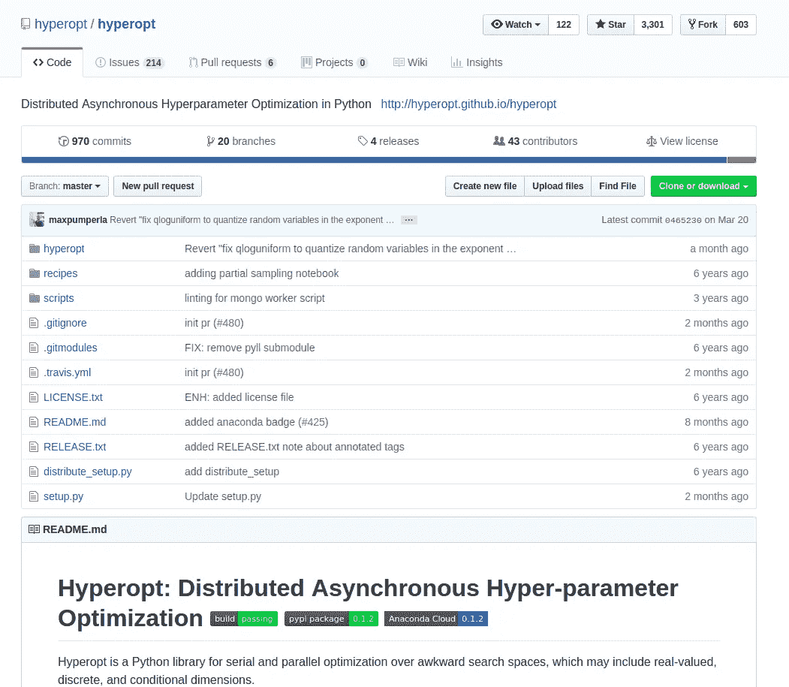
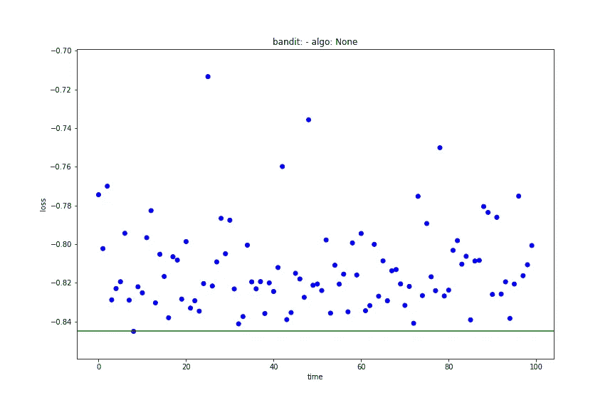
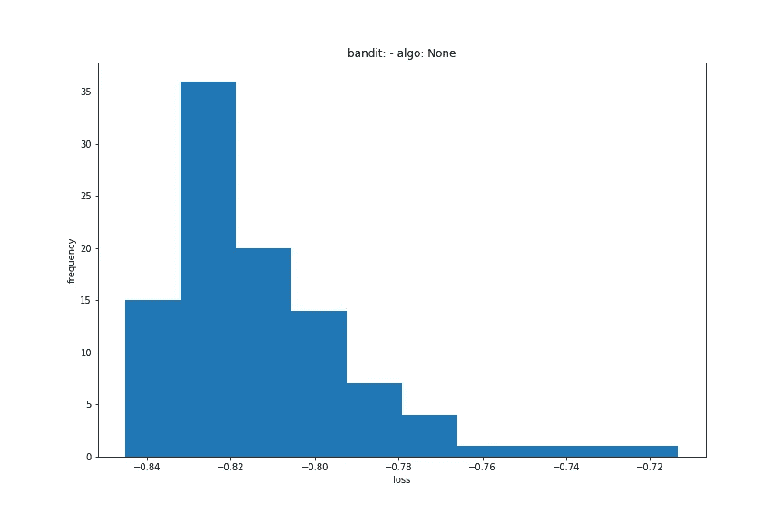
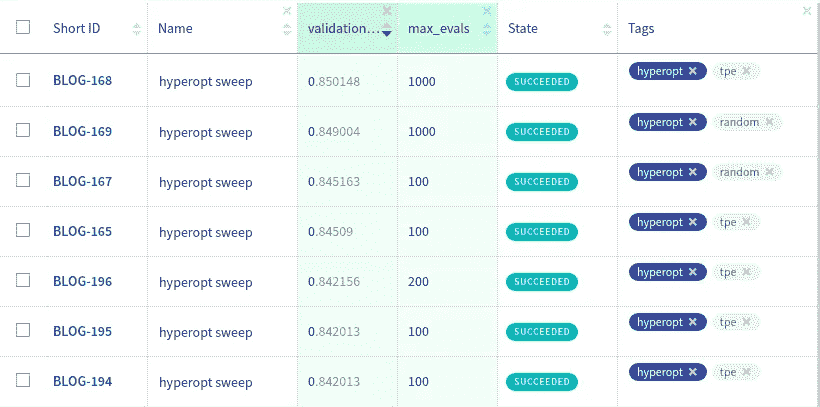
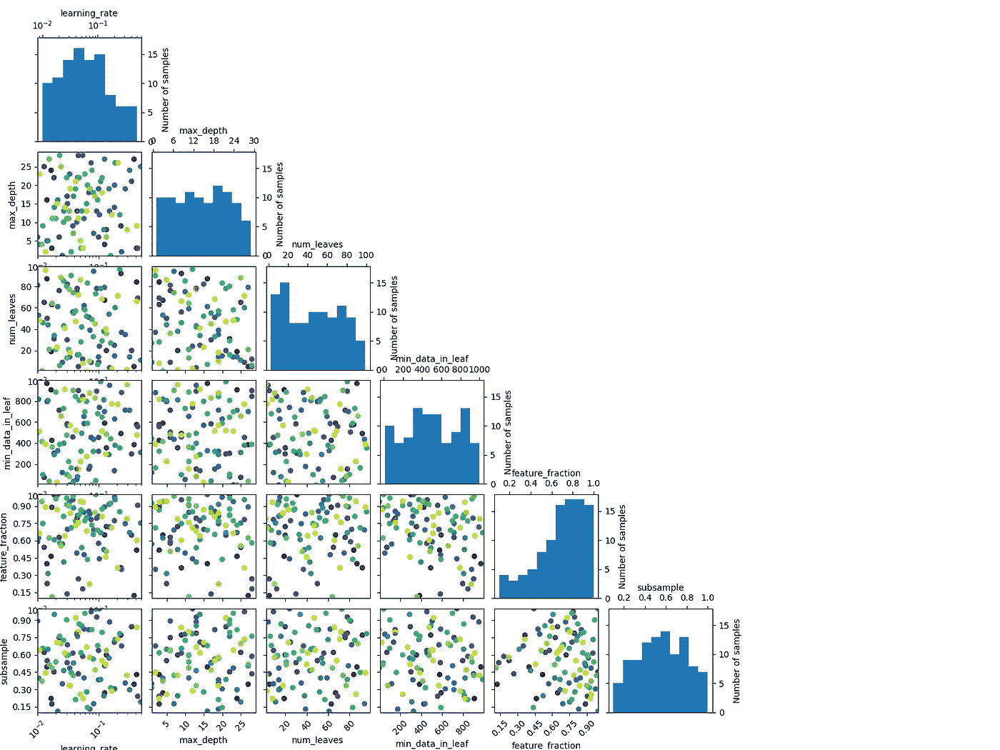
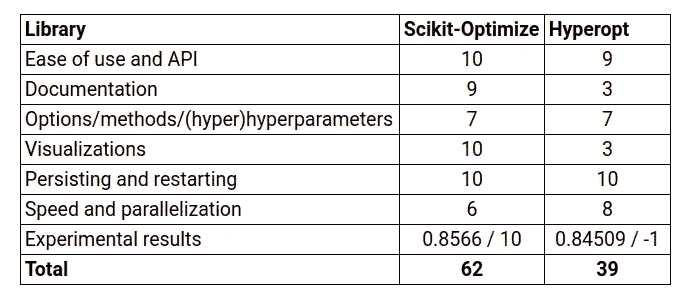

# 第二部分:远视。

> 原文：<https://towardsdatascience.com/hyperparameter-optimization-in-python-part-2-hyperopt-5f661db91324?source=collection_archive---------4----------------------->

## [Python 中超参数优化。](https://towardsdatascience.com/tagged/hpo-in-python)

在这个博客系列中，我将比较 python HPO 库。在阅读这篇文章之前，我强烈建议你阅读 [**第 0 部分:简介**](/hyperparameter-optimization-in-python-part-0-introduction-c4b66791614b) 其中我:

*   谈论 HPO 是什么，
*   要比较的选定库，
*   选择了评估标准，
*   为 HPO 定义了一个示例问题。

这篇博文和本系列其他部分的代码可以在 [github](https://github.com/neptune-ml/blog-hyperparameter_optimization) 上获得，而所有关于脚本、超参数、图表和结果(可以下载)的实验都可以在 Neptune 上获得[。更多信息，请阅读这篇关于](https://ui.neptune.ml/jakub-czakon/blog-hpo/wiki/Skopt-forest-51912822-7a61-42ad-87d1-108998739c73?utm_source=medium&utm_medium=crosspost&utm_campaign=blog-hyperopt-medium&utm_content=explore-dashboard)[组织实验过程的文章。](https://neptune.ml/blog/experiment-management?utm_source=medium&utm_medium=crosspost&utm_campaign=blog-hyperopt-medium&utm_content=blog)

好，我们开始吧。

# 远视



这是 HPO 空间中的经典。这个项目有超过 3300 星，600 叉和 40 个贡献者(2 个主要的)。甚至有基于它构建的项目，如:

*   [hyperas](https://github.com/maxpumperla/hyperas) :远视+角膜
*   [超视-sklearn](https://github.com/hyperopt/hyperopt-sklearn) :超视+ sklearn

## 易于设置和 API

这个 API 非常简单易用。我们需要定义一个搜索空间、目标并运行优化函数:

首先，定义搜索空间。它可以是一个常规词典，也可以是本例中的 OrderedDict:

有点尴尬的是，我必须定义这个名字两次，一次作为字典键，一次作为参数采样器中的`label`。

然后，定义目标函数。记住[远视](https://github.com/hyperopt/hyperopt/tree/master/hyperopt)最小化功能，所以如果需要，改变符号:

最后，实例化**试验**对象，并运行优化:

…完成了！

所有的信息、超参数、损失和其他东西都保存在`trials`对象中。您可以毫无问题地访问它，也可以将其保存起来供以后使用。如果你想看完整的示例脚本，包括训练曲线、诊断图表等等，请看[这个版本化的 ml 实验。](https://ui.neptune.ml/jakub-czakon/blog-hpo/e/BLOG-165/source-code?path=.&file=search_hyperopt.py&utm_source=medium&utm_medium=crosspost&utm_campaign=blog-hyperopt-medium&utm_content=explore-script)

我给它的分数是 **9/10** ,因为在空间搜索定义中有重复的名称，而且对于简单的问题，我宁愿不实例化`trials`对象，而只是在默认情况下将它实例化为`Trials()`。

> **分数 9/10**

## 选项、方法和(超)超参数

**搜索空间**

这就是[远视](https://github.com/hyperopt/hyperopt/tree/master/hyperopt)大放异彩的地方。有大量采样选项可供选择:

*   `Categorical parameters-`使用 *hp.choice*
*   `Integer parameters-`你可以使用 *hp.randit* 、 *hp.quniform* 、 *hp.qloguniform* 或 *hp.qlognormal* ，这给了你很多选择来为你的整数超参数空间建模
*   `Float parameters-`类似于整数参数，你真的可以选择用 *hp.normal* 、 *hp.uniform* 、 *hp.lognormal* 和 *hp.loguniform* 来解决你的问题

但事实并非如此。您可以轻松地定义嵌套空间，其中某些参数的值依赖于其他参数。以文档中的例子为例:

我们可以看到，通过将 *hp.choice* 与其他采样方法相结合，我们可以拥有条件搜索空间。

这在从特征预处理、模型选择方法到模型超参数的复杂空间中搜索时非常有用。

**优化方法**

有两种优化算法可以尝试。

`*tpe.rand.suggest*`

你对参数的标准随机搜索。

`*tpe.suggest*`

类似于在[之前关于 Scikit-Optimize](https://neptune.ml/blog/scikit-optimize?utm_source=medium&utm_medium=crosspost&utm_campaign=blog-hyperopt-medium&utm_content=blog) 的博文中所解释的，我们想要使用一个廉价的代理模型来估计昂贵的目标函数在一组参数上的性能。不同之处在于，我们想要估计尾部的密度，而不是估计实际性能(点估计)。

我喜欢 AutoML.org 弗赖堡[的了不起的人们从](https://www.automl.org/) [AutoML_Book](https://www.automl.org/wp-content/uploads/2019/05/AutoML_Book.pdf) 中摘录的以下解释。

> 树 Parzen 估计器对给定运行的密度函数 p(λ|y < α) and p(λ|y ≥ α). Given a percentile α (usually set to 15%), the observations are divided in good observations and bad observations and simple 1-d Parzen windows are used to model the two distributions.

By using p(λ|y < α) and p(λ|y ≥ α) one can estimate the Expected Improvement ( **EI** )进行建模，而不是对给定配置λ的观测值 y 的概率 p(y|λ)进行建模。

有趣的是，在优化器中没有指定 **λ** 参数的选项。

**回调**

本质上没有回调，但是您可以将回调函数放在`objective`中，每次调用`objective`时都会执行回调函数。

我不喜欢它，但我想我可以忍受。

总而言之，这是嵌套搜索空间的一大优势，但我不喜欢没有干净回调的事实。 [TPE](https://papers.nips.cc/paper/4443-algorithms-for-hyper-parameter-optimization.pdf) 没有任何(超)超参数，这一方面很好(工作量少，过拟合少),但另一方面，它不允许您调整不工作的东西。我给它 7/10。

> **分数 7/10**

## 证明文件

说得好听点，它需要很多爱。

官方文档页面由维基上的[托管。如果你问我的话，我觉得这更像是一次图书馆之旅，而不是正式的文档。也就是说，读完之后，你应该能够有效地使用这个库。问题是，当你想找到一个特定的东西时，你需要浏览整个维基来寻找它。](https://github.com/hyperopt/hyperopt/wiki)

它缺少基本的例子。我找到的唯一一个(`hyperopt/recipes`)是 6 岁，有错误。

绝大多数函数和 main 类方法都缺少 docstrings。不幸的是，这使得导航和回答简单的问题变得很困难，比如这个函数实际上是做什么的？

好消息是，有很多关于它的博客帖子。其中一些我认为有用的是:

*   [区数据实验室](https://medium.com/u/96c976e31f28?source=post_page-----5f661db91324--------------------------------)的【远视参数整定】
*   Vooban 撰写的《优化神经网络超参数的远视教程》
*   [Tanay agr awal](https://blog.goodaudience.com/on-using-hyperopt-advanced-machine-learning-a2dde2ccece7)[的《关于使用 Hyperopt:高级机器学习》](https://medium.com/u/2e08a5e263c0?source=post_page-----5f661db91324--------------------------------)
*   [](/an-introductory-example-of-bayesian-optimization-in-python-with-hyperopt-aae40fff4ff0)[Will Koehrsen](https://medium.com/u/e2f299e30cb9?source=post_page-----5f661db91324--------------------------------)撰写的“使用 Hyperopt 在 Python 中进行贝叶斯优化的介绍性示例”

文档肯定不是这个项目的强项，但因为它是一个经典，所以有很多外部资源。我给它 3/10。

> **比分 3/10**

**注**

如果你正在考虑为社区做一些有益的事情，你可以继续，添加 docstrings，一堆例子，并为这个项目创建 read-the-docs 文档。就我而言，我会很感激的。

## 形象化

[远视](https://github.com/hyperopt/hyperopt)有可视化模块 [plotting.py](https://github.com/hyperopt/hyperopt/blob/master/hyperopt/plotting.py) 。它有三个功能:

*   它向您显示每次迭代的结果，并突出显示最好的分数。



plot_history(trials) of the [best experiment](https://ui.neptune.ml/jakub-czakon/blog-hpo/e/BLOG-165/details)

*   `main_plot_histogram`-显示所有迭代结果的直方图。



plot_histogram(trials) of the [best experiment](https://ui.neptune.ml/jakub-czakon/blog-hpo/e/BLOG-165/details)

*   哪个…我真的不知道它是做什么的，因为我无法让它运行，也没有文档字符串或示例(同样，文档也远非完美)。

有一些基本的可视化工具，但它们不是非常有用。感觉像 **3/10** 。

> **分数 3/10**

**注**

正如我在上一篇帖子中提到的，我喜欢 Scikit-Optimize 提供的图形，并且我实现了一组函数来帮助在不同的 HPO 库之间进行转换，以便您可以对每个库使用这些可视化。我已经把它们放在`neptune-contrib`包里，你可以在这里[查看如何使用](https://neptune-contrib.readthedocs.io/user_guide/hpo/utils.html)。

## 持续/重启

你可以先处理一下`trials`对象，以后再用。例如，保存部分可以读作:

pickle 会再次加载，而重新启动就像传递`trials`对象(现在不为空)并将 **max_evals** 从 100 更改为 200 一样简单。

简单且工作没有问题: **10/10。**

> **分数 10/10**

## 速度和并行化

使用 hyperopt，您可以将计算分布在一组机器上。Tanay Agrawal 撰写的这篇[博客文章](https://blog.goodaudience.com/on-using-hyperopt-advanced-machine-learning-a2dde2ccece7)中可以找到很好的分步指导，但简而言之，你需要:

*   启动一个装有 MongoDB 的服务器，它将使用您的工人培训脚本的结果，并发送下一个参数集进行尝试，
*   在您的训练脚本中，创建一个指向您在上一步中启动的数据库服务器的`MongoTrials`对象，而不是`Trials()`,
*   将您的*目标*函数移动到一个单独的 objective.py 脚本中，并将其重命名为*函数，*
*   编译您的 Python 训练脚本，
*   运行*远视-蒙哥-工人*

虽然它完成了任务，但感觉并不完美。您需要围绕*目标*函数做一些杂耍，在 CLI 中启动 MongoDB 会使事情变得更容易。

因为上面的 **8/10** 对我感觉很公平。

> **得分 8/10**

## 实验结果

你可以在海王星探索所有[版本化的 ml 实验](https://ui.neptune.ml/jakub-czakon/blog-hpo/experiments?tag=%5B%22hyperopt%22%5D&viewId=95618c17-ba92-4e89-aca5-27288a6b6286&utm_source=medium&utm_medium=crosspost&utm_campaign=blog-hyperopt-medium&utm_content=explore-dashboard)。每个实验都有一个脚本。例如，你可以在这里看到[最佳的代码。](https://ui.neptune.ml/jakub-czakon/blog-hpo/e/BLOG-194/source-code?path=.&file=source&utm_source=medium&utm_medium=crosspost&utm_campaign=blog-hyperopt-medium&utm_content=explore-script)

还可以下载实验元数据给*熊猫。数据帧*通过运行:

我们来看看[的实验结果:](https://ui.neptune.ml/jakub-czakon/blog-hpo/experiments?tag=%5B%22hyperopt%22%5D&viewId=95618c17-ba92-4e89-aca5-27288a6b6286&utm_source=medium&utm_medium=crosspost&utm_campaign=blog-hyperopt-medium&utm_content=explore-dashboard)



只有当我们运行更多的迭代时,`tpe`方法才略微胜出。在 100 次迭代的预定义预算中，`random`搜索略胜`tpe`。

查看 Scikit 的 *plot_evaluations* 图表——优化最佳 100 次迭代实验:



我们可以看到，只有对于 **feature_fraction** 参数，搜索实际上已经转向某个方向。否则，它基本上是随机的(这解释了为什么结果如此接近随机搜索)。

总的来说，我在 100 次迭代中得到的最高分仅仅是 0.84509，实际上比随机搜索(来自 Scikit-Optimize)的 0.8464 差了 0.001。我将把它转换成 **-1** 点(-0.001*100)。

> **分数–1**

# 结论

[hyperpt](https://github.com/hyperopt/hyperopt)是一款经典产品，已经为社区服务多年。它有一个易于使用的 API，可以在一个机器集群上并行计算，并且对嵌套搜索空间有很好的支持。

然而，它的文档有限，只有很少的例子和文档字符串，这使得它很难使用，尤其是在黄金路径之外。Visualization suite 也非常有限，并没有带来很多价值。有点麻烦的是，对于我们的示例问题，它无法打败随机搜索。

让我们来看看所有标准的结果:



**39** 的分数远低于 Scikit-Optimize 的分数。最大的因素是文档、可视化和实验结果。

# 下一步是什么？

下次我们将仔细看看另一个用于超参数优化 Optuna 的 Tree-Parzen 估计器库。

**你可以在这里查看这个系列的第三部分** [**Optuna vs 远视。**](https://neptune.ml/blog/optuna-vs-hyperopt?utm_source=medium&utm_medium=crosspost&utm_campaign=blog-hyperopt-medium&utm_content=blog)

你也可以在我的 Python 专栏的 [**HPO 中阅读这个系列的其他帖子。**](https://towardsdatascience.com/tagged/hpo-in-python)

*如果你喜欢这个，你可以在我们的* [*Neptune 博客上找到更多类似的帖子。*](https://neptune.ml/blog?utm_source=medium&utm_medium=crosspost&utm_campaign=blog-hyperopt-medium&utm_content=blog)

*你也可以找我* [*发微博@Neptune_a*](https://twitter.com/neptune_ai) *我或者* [*在 LinkedIn 上发帖*](https://www.linkedin.com/in/jakub-czakon-2b797b69/) *关于 ML 和数据科学的东西。*

# 参考

```
@book{automl_book,
    editor = {Hutter, Frank and Kotthoff, Lars and Vanschoren, Joaquin},
    note = {In press, available at http://automl.org/book.},
    publisher = {Springer},
    title = {Automated Machine Learning: Methods, Systems, Challenges},
    year = {2018}
}
```