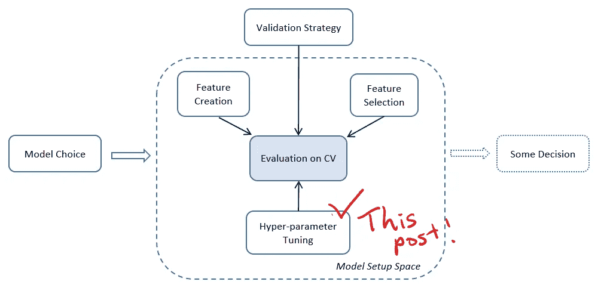
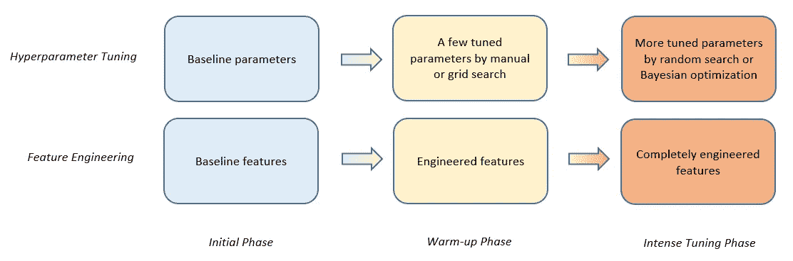
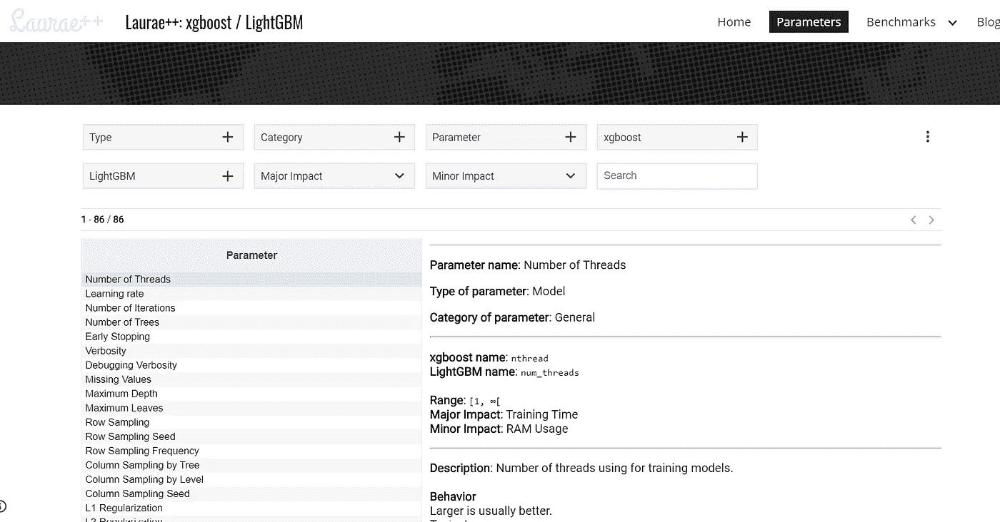
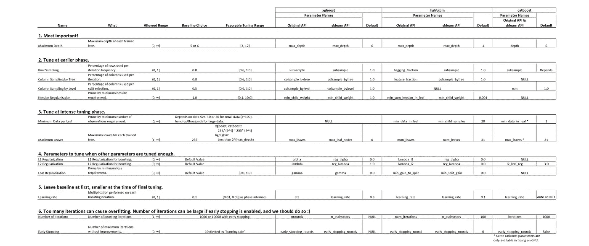
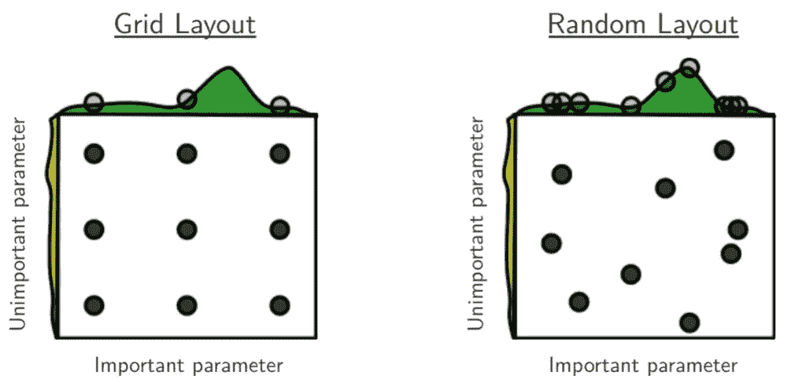
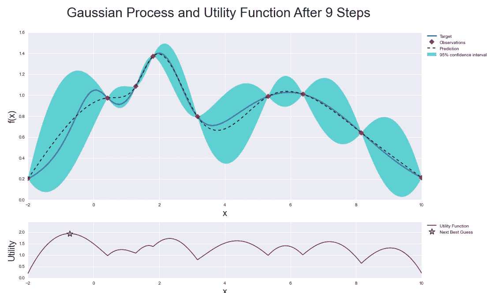
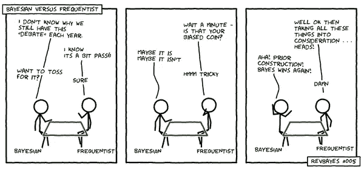
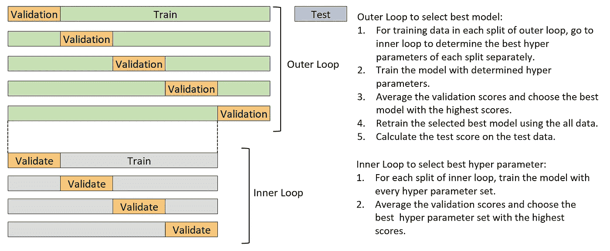

# 解释了超参数调优——调优阶段、调优方法、贝叶斯优化和示例代码！

> 原文：<https://towardsdatascience.com/hyperparameter-tuning-explained-d0ebb2ba1d35?source=collection_archive---------14----------------------->

## 本书"[赢得 KAGGLE](https://www.amazon.co.jp/dp/4297108437) 的数据分析技巧"

## 何时以及如何使用手动/网格/随机搜索和贝叶斯优化

Simple Mandala of modeling world (Validation Strategy is out of setup space because the same validation approach should be applied to any models compared for fair model selection)

超参数是 ML 模型的重要组成部分，可以使模型成为黄金或垃圾。

在这篇文章中，我将讨论:

*   **随着建模的进行，调谐阶段的演变**，
*   **各车型的重要参数(特别是 GBDT 车型)，**
*   **常见的四种调优方法(手动/网格搜索/随机搜索/贝叶斯优化)。**

# 目录

1.  **通用超参数调整策略**

*   1.1.特征工程参数调整的三个阶段
*   1.2.什么是超参数基线，哪些参数值得调整？

**2。超参数调整的四种基本方法**

*   2.1.人工调谐
*   2.2.网格搜索
*   2.3.随机搜索
*   2.4.贝叶斯优化

**3。超参数调整和交叉验证中的 k 折叠**

**4。结论**

这是另一篇帖子接的一本新书中介绍的技巧*[*数据分析技巧赢 Kaggle*](https://www.amazon.co.jp/dp/4297108437)*由三位高阶 Kaggle 作者(不包括我自己)由此可见这不是个人推广！:) )**

**关于这本书本身的完整目录，请看我的[其他帖子](https://medium.com/@daydreamersjp/a-new-book-data-analysis-techniques-to-win-kaggle-is-a-current-best-and-complete-for-table-data-4af66a88388)。**

# **1.通用超参数调整策略**

## **1.1.特征工程参数调整的三个阶段**

**我们如何调整超参数不仅是关于我们使用哪种调整方法的问题，也是关于我们如何发展超参数学习阶段直到我们找到最终的和最好的。**

**这应该取决于任务和我们实际上通过超参数变化看到多少分数变化，但我们应该记住以下常见步骤:**

*   ***初始阶段*:开始**基线参数** &基线特征工程，**
*   ***预热阶段*:围绕**手动调谐或网格搜索几个重要参数**用几个搜索候选&更多特色工程，**
*   ***激烈调优阶段* : **对更多参数进行随机搜索或贝叶斯优化** &最终特征工程**

****

**Plates are getting hotter.**

## **1.2.什么是超参数基线，哪些参数值得调整？**

**然后，您会有另一个问题:**“什么是超参数基线，哪些参数值得调优？”****

**每个模型的参数是不同的，因此我不能在这里讨论每个模型的参数。留意参数的选择始终是数据科学家的工作。它应该从对模型算法和模型文档的理解开始。**

**在这篇文章中，我将只给**留下一些关于 GBDT 模型、xgboost、lightbgm 和 catboost** 的资源，这些模型我曾经讨论为[的入门模型](/what-is-the-best-starter-model-in-table-data-ml-lessons-from-a-high-rank-kagglers-new-book-f08b821db797)。**

**[***Laurae ++的这个网页***](https://sites.google.com/view/lauraepp/parameters) 对于 xgboost/lightgbm 来说一直是一个很棒的起点。**

*   **你可以找到每个参数的描述，典型值，允许范围，变化的影响等。字面上的大量信息。**
*   **它们不包括 catboost(截至 2019 年 12 月 7 日)。**

****

**Laurae++, a descently-designed information-rich web site about hyperparameters of xgboost and lightgbm ( [https://sites.google.com/view/lauraepp/parameters](https://sites.google.com/view/lauraepp/parameters))**

*****解析维迪亚*** 也提供了关于 GBDT 模型超参数的丰富内容:**

*   ***xgboost* : [《使用 Python 代码在 xgboost 中进行参数调整的完整指南》](https://www.analyticsvidhya.com/blog/2016/03/complete-guide-parameter-tuning-xgboost-with-codes-python/)**
*   ***Light GBM*::[Light GBM vs XGBOOST 哪个算法取冠？](https://www.analyticsvidhya.com/blog/2017/06/which-algorithm-takes-the-crown-light-gbm-vs-xgboost/)”**

**一旦你开始谷歌搜索，还有许多其他随机的网页。这是我从《数据科学》杂志上找到的一篇文章，它提供了三种主要 GBDT 车型的对比列表。**

*   **[“使用 Hyperopt 在 XGBoost、LightGBM 和 CatBoost 上进行超参数优化的示例”](/an-example-of-hyperparameter-optimization-on-xgboost-lightgbm-and-catboost-using-hyperopt-12bc41a271e)**

**下面的图表总结了我对分级重要性中哪些参数是重要的、它们有利的基线选择和调整范围的看法。**

****

**List of important hyperparameters of three GBDT models, their baseline choice and tuning range.**

**(对于表格开发，我的朋友兼同事丁玉轩给了我很好的建议。谢谢大家！)**

**使用 Python 包建模 GBDT 的人通常使用原始函数版本(“原始 API”)或 sklearn 包装器版本(“sklearn API”)，这使得函数的使用等同于其他 sklearn ML 模型 API。**

**大多数情况下，你可以根据自己的喜好选择任何一个，但请记住，**除了 catboost 包，original API 和 sklearn API 可能会有不同的参数名，即使它们表示相同的参数。**我在上面的总结中包含了两个参数名称。**

# **2.超参数调整的四种基本方法**

## **#1 手动调谐**

**通过手动调整，基于当前选择的参数和它们的得分，我们改变它们中的一部分，再次训练模型，并检查得分的差异，而不使用自动选择参数来改变新参数的值。**

****手动调谐**的优点是:**

*   **您可以记住超参数的行为，并在另一个项目中使用您的知识。因此，我建议至少对主要型号进行一次手动调优。**

****缺点**是:**

*   **需要手工操作。**
*   **你可能会过度思考乐谱的意外移动，而没有尝试很多次并检查它是否是广义的移动。**

**书中给出了一些手动调谐的例子:**

*   **当你发现有太多无用的变量输入到模型中时，你就增加正则化参数的权重。**
*   **当你认为变量间的相互作用在模型中没有被考虑很多时，你可以增加分裂的次数(GBDT 案例)。**

**一旦您了解了下面讨论的其他方法，**您可能会说，如果远不是达到全局最佳参数的最佳方法，我们为什么要进行手动调整**，但在实践中，这在早期阶段很好地用于了解对超参数变化的敏感度，或在最后阶段进行调整。**

**另外，**令人惊讶的是，许多顶尖的 Kagglers 更喜欢使用手动调谐来进行网格搜索或随机搜索。****

## **#2 网格搜索**

****网格搜索**是一种方法，我们从准备候选超参数集开始，为每个候选超参数集训练模型，并选择性能最佳的超参数集。**

**通常通过 `[sklearn.model_selection](https://scikit-learn.org/stable/modules/generated/sklearn.model_selection.GridSearchCV.html)`的`[GridSearchCV](https://scikit-learn.org/stable/modules/generated/sklearn.model_selection.GridSearchCV.html)` [等支持库自动完成参数设置和评估。](https://scikit-learn.org/stable/modules/generated/sklearn.model_selection.GridSearchCV.html)**

****这种方法**的优点是:**

*   **您可以涵盖所有可能的预期参数集。无论你多么坚信其中一套是最可行的，谁知道，邻居可能会更成功。网格搜索不会失去这种可能性。**

****缺点**在于它是:**

*   **一个超参数集的一次运行需要一些时间。整个参数集的运行时间可能很长，因此要探索的参数数量有实际限制。**

## **#3 随机搜索**

**另一方面，随机搜索是一种方法，其中我们像网格搜索一样准备候选超参数集，但是接下来从准备的超参数搜索空间中随机选择超参数集。重复随机选择、模型训练和评估指定的次数，以搜索超参数。最后，选择性能最佳的超参数集。**

**我们可以通过指定参数的密度函数而不是特定值来控制随机性，例如均匀分布或正态分布。**

**这里再次说明，设置参数和评估通常是通过 `[sklearn.model_selection](https://scikit-learn.org/stable/modules/generated/sklearn.model_selection.RandomizedSearchCV.html)`的`[RandomizedSearchCV](https://scikit-learn.org/stable/modules/generated/sklearn.model_selection.RandomizedSearchCV.html)` [等支持库自动完成的。](https://scikit-learn.org/stable/modules/generated/sklearn.model_selection.RandomizedSearchCV.html)**

****使用随机搜索**的优点是:**

*   **您不必担心运行时间，因为您可以控制参数搜索的数量。**

****缺点**是:**

*   **应该有一些妥协，最终选择的超参数集可能不是您在搜索中输入的范围之外的真正最佳值。**
*   **根据搜索次数和参数空间的大小，有些参数可能没有被充分研究。**

****

**The ‘world famous’ grid search vs. random search illustration by James Bergstra James, Yoshua Bengio on “Random Search for HyperParameter Optimization” ( [http://www.jmlr.org/papers/volume13/bergstra12a/bergstra12a.pdf](http://www.jmlr.org/papers/volume13/bergstra12a/bergstra12a.pdf))**

## **#4 贝叶斯优化**

****[**贝叶斯优化**](https://arxiv.org/abs/1807.02811) **的基本概念是“如果我们随机搜索一些点，并且知道其中一些点比其他点更有希望，为什么我们不在它们周围再看一看？”******

****在贝叶斯优化中，它从随机开始，基于贝叶斯方法缩小搜索空间。****

****如果你知道贝叶斯定理，你可以理解它只是通过开始随机搜索将关于可能超参数的信念的先验分布更新为后验分布。****

********

****Illustration of Bayesian optimization. Based on the Bayesian update next try will happen on star point in the bottom chart ( [https://github.com/fmfn/BayesianOptimization](https://github.com/fmfn/BayesianOptimization))****

******贝叶斯优化方法**的优势在于:****

*   ****搜索是潜在有效的([但不一定](/automated-machine-learning-hyperparameter-tuning-in-python-dfda59b72f8a))。****

******缺点**是:****

*   ****可能陷入局部最优。****

****做贝叶斯优化常见的有两个 python 库，`[hyperopt](https://github.com/hyperopt/hyperopt)`和`[optuna](https://github.com/optuna/optuna)`。还有其他名字如`[gpyopt](https://github.com/SheffieldML/GPyOpt)`、`[spearmint](https://github.com/JasperSnoek/spearmint)`、`[scikit-optimize](https://scikit-optimize.github.io/)`。****

****下面是使用`hyperopt`的示例代码。****

********

****Bayesian Versus Frequentist ( [https://irsae.no/blog-report-international-summer-school-on-bayesian-modelling/](https://irsae.no/blog-report-international-summer-school-on-bayesian-modelling/))****

# ****3.超参数调整和交叉验证中的折叠****

****在上面讨论的任何超参数调整方法中，为了避免**过拟合，**首先对数据进行折叠，对训练折叠数据和非折叠数据重复训练和验证，这一点很重要。****

****此外，如果在交叉验证中继续使用相同的褶皱分割(以便比较模型)，那么**您的具有选定超参数的模型可能过度拟合褶皱，但没有机会识别它**。****

****因此，**通过更改随机数种子**，将折叠分割从超参数调整更改为交叉验证非常重要。****

****另一种方法可能是做 [**嵌套交叉验证**](https://scikit-learn.org/stable/auto_examples/model_selection/plot_nested_cross_validation_iris.html) 。在嵌套交叉验证中，有两个层次交叉验证循环:外部和内部。****

********

****Nested cross-validation****

****嵌套交叉验证的一个巨大缺点是，它显著增加了运行时间，增加了内循环折叠的次数。我个人觉得做嵌套的交叉验证太多了，对于额外的运行时间来说好处不大，即使在 Kaggle 竞争中也不是主流。****

# ****4.结论****

****我们在超参数调整中采用的方法将随着建模阶段的发展而发展，首先通过手动或网格搜索从少量参数开始，随着模型随着有效特征的增加而变得更好，通过随机搜索或贝叶斯优化查看更多参数，但我们如何做没有固定的规则。****

****模型会有很多超参数，因此找到重要的参数及其搜索范围并不是一件容易的事情。然而，像 GBDT 家族这样受欢迎的模型是精心制作的，我们对它们知道得足够多，知道从哪里开始和去哪里。****

****我们必须担心数据折叠不会过度拟合模型，那么必须将折叠分割从超参数调整更改为模型选择交叉验证。****

****如果你发现遗漏了什么，请告诉我。它将帮助我改进这个总结，为读者提供更好的信息！****