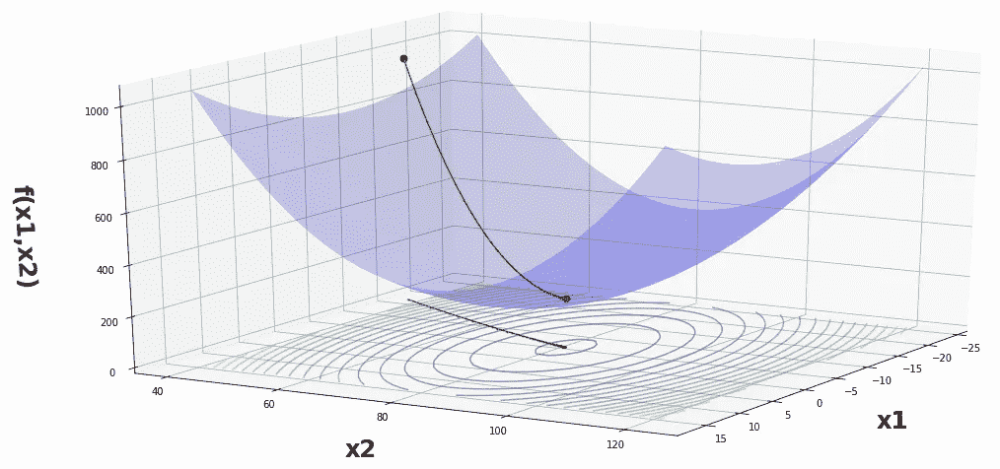
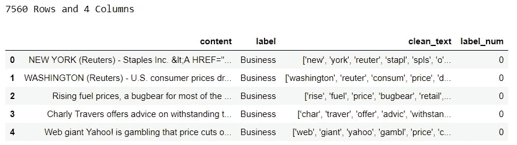
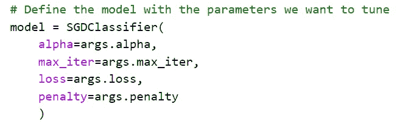
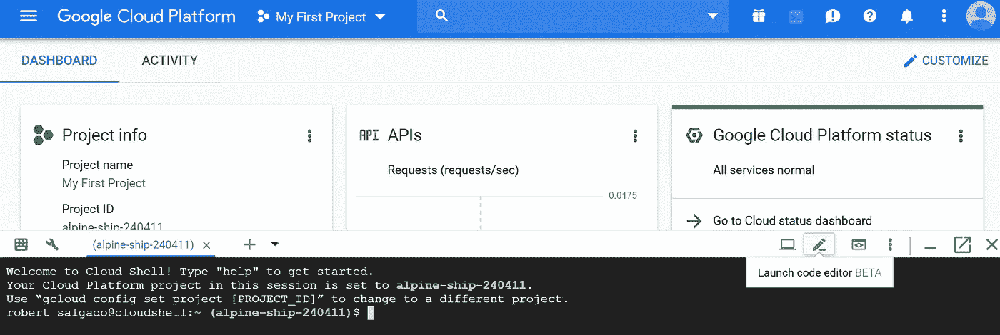
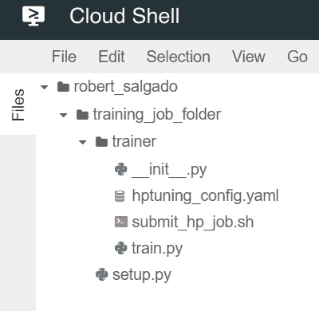
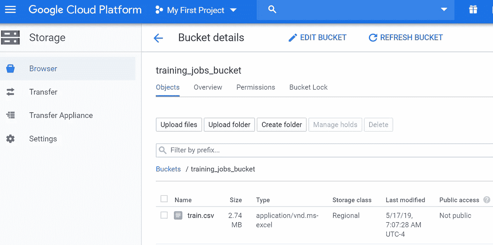
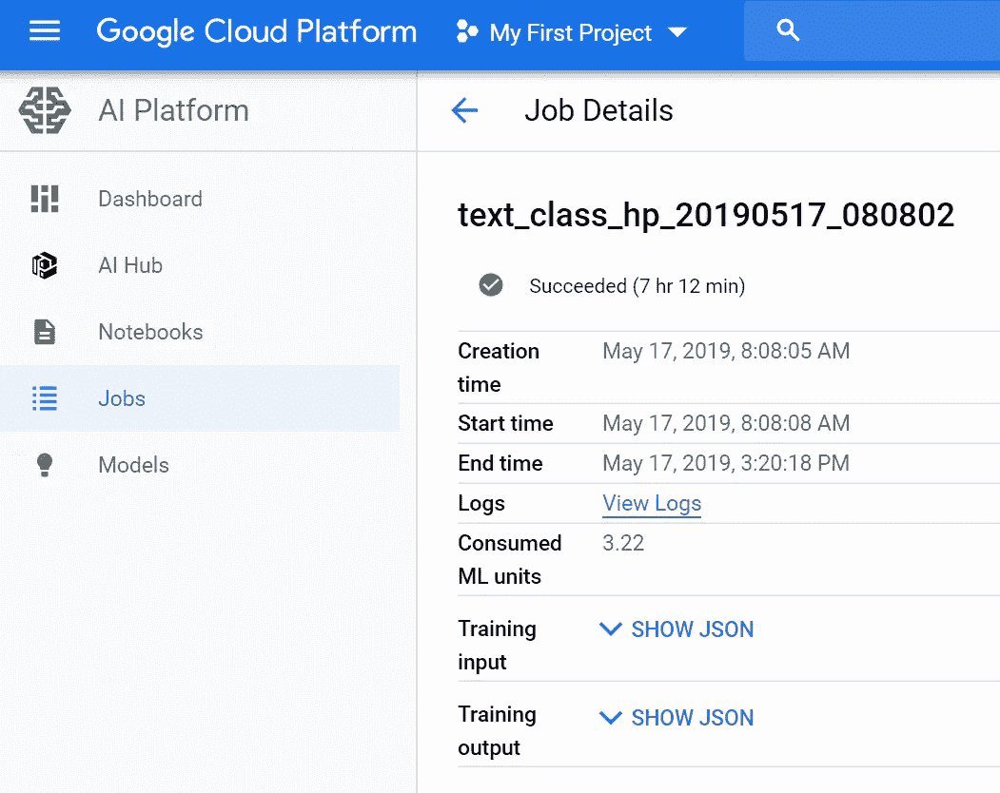
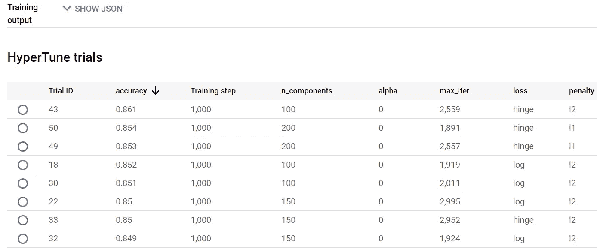
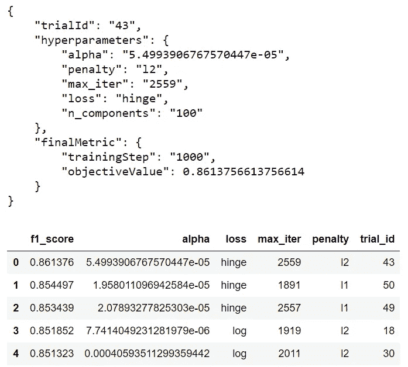

# 使用 Scikit-Learn 在 Google 云平台上调整超参数

> 原文：<https://towardsdatascience.com/hyperparameter-tuning-on-google-cloud-platform-with-scikit-learn-7d6155195efb?source=collection_archive---------13----------------------->

谷歌云平台的 AI 平台(原 ML Engine)为你的模型提供超参数调优服务。为什么要花费额外的时间和精力去学习如何使用它，而不是仅仅在虚拟机上运行您已经拥有的代码呢？这些好处值得付出额外的时间和精力吗？

使用它的一个原因是人工智能平台提供了开箱即用的贝叶斯优化。它比网格搜索更有效，从长远来看，也比随机搜索更准确。他们还提供提前停止和恢复已完成的培训工作的能力。如果你认为你第一次没有进行足够的试验，这允许你使用过去的数据进行一些更好的试验。

所有这些都有助于加快超参数调整过程，同时比网格搜索或随机搜索更好地找到最佳匹配。当经常对大量数据进行训练或运行大量实验时，它肯定可以节省金钱和时间。



Stochastic Gradient Descent Visualized [Source](https://gist.github.com/felipessalvatore/c2e1c09dfcb8710b847e2457620f8204)

和往常一样，我所有的代码都可以在我的 git hub [页面](https://github.com/robsalgado/personal_data_science_projects/tree/master/hp_tuning_gcp)上找到。在讲述了如何在 GCP 上运行超参数调优工作之后，我将比较他们提供的三台预定义机器的培训时间和成本。

我还将展示如何从 api 自动检索训练运行中的最佳超参数。然后，您可以将它们直接传递到您的生产模型中，或者如果您正在运行实验，请将它们保存在 Google 云存储上的 csv 文件中、BigQuery 中的一个表中或任何您希望稍后进行分析的地方。

那么什么是超参数优化的贝叶斯优化呢？超参数调整是一个优化问题，这意味着确切的性质是未知的，并且计算起来很昂贵，因此以一种知情的方式进行将是有益的。

> 当函数的数学形式未知或者计算起来很昂贵时，贝叶斯优化是一种非常强大的技术。其背后的主要思想是基于数据计算目标函数的后验分布(使用著名的贝叶斯定理)，然后选择好的点来尝试这个分布。[来源](https://cloud.google.com/blog/products/gcp/hyperparameter-tuning-cloud-machine-learning-engine-using-bayesian-optimization)

这意味着，随着更多的试验运行和后验分布开始改善，最有成效的超参数值开始出现。因此，通过根据模型所获得的信息对未来惠普价值做出明智的决策，我们可以加快找到最佳匹配的过程。要了解更多关于贝叶斯统计的知识，请查阅这本[的书](https://greenteapress.com/wp/think-bayes/)。


Photo by [Jose Antonio Gallego Vázquez](https://unsplash.com/@joseantoniogall?utm_source=medium&utm_medium=referral) on [Unsplash](https://unsplash.com?utm_source=medium&utm_medium=referral)

在 GCP 上提交超参数调整工作有 4 个主要部分:

*   一个训练文件，其中包含您想要使用的模型的常用代码，以及您想要用来评估模型的分数。它还包括一个参数解析器，可以为每次试验添加不同参数的 hp 值
*   包含要在训练文件中使用的超参数值的 yaml 文件
*   提交培训作业的 shell 可执行文件
*   安装附加依赖项的安装文件

如果你不熟悉在云中或者 GCP 上工作，有一些额外的步骤，但是我认为它们是值得的，一旦你建立了框架，很容易适应不同的模型。

我在这里使用的模型是一个多类文本分类模型，来自我以前的[文章](https://medium.com/@robert.salgado/multiclass-text-classification-from-start-to-finish-f616a8642538)。该模型在这里并不重要，但它是随机梯度下降，在此之前有特征创建(tf-idf)和维数减少(LSA)。如果您愿意，也可以调整这些参数的超参数。训练数据已经清理完毕，如下所示:



每个类都有 1，890 个示例，非常平衡。让我们仔细看看运行培训作业所需的每个文件。

# 培训文件

顶部是参数解析器。这将把每个踪迹的 hp 值从 yaml 文件馈送给估计器。模型的 hp 值将由参数解析器从 yaml 文件中传递，如下所示:



然后我们要从谷歌云存储中下载训练数据。从那里，文本通过 tf-idf 矢量器，我们定义我们的目标和特征，然后我们减少我们的目标的维度。然后通常的训练-测试-拆分，然后我们将训练数据拟合到分类器，并根据测试数据进行预测。

之后，我们定义我们的分数，在这种情况下只是准确性，因为我们有平衡的类。下一步是调用 hypertune 库，在这里我们设置度量以及与度量值相关的全局步长。每次试验后，模型都保存在您指定的 GCS 文件夹中。

# 超参数配置文件

在这个文件的第一部分，您指定了目标，在我们的例子中是最大化精度。如果你想基于 RMSE 这样的东西进行优化，那么你应该把它设置为最小化。然后，您设置想要运行的试验次数。试验越多越好，但肯定存在收益递减的问题。他们建议将轨迹的数量至少设置为参数数量的 10 倍，在我们的例子中是 50 个。

接下来，您必须指定想要运行的并发试验的数量。并行运行试验减少了运行时间，但在使用贝叶斯优化时也会降低效率。这是因为它使用先前试验的结果来通知后续试验的 hp 值。

然后，您必须传入 hp metric 标记，最后您还可以启用早期停止，这将在试验明显没有成效时停止试验，从而节省时间。之后，你为每个 hp 定义最小/最大值或不同的类型/类别，这是非常直接的，本质上就是你在网格搜索中所做的。

然后你必须定义你希望每个参数发生什么。当你有一个范围的值要研究时，你可以传入离散值，就像我在这里对“n_components”所做的那样，或者给定一个最小/最大范围，让它遍历并缩放这些值以线性搜索。如果您要搜索的空间非常大，它们还有一个对数刻度和一个反向对数刻度选项。对于分类 1，你必须传递那些谨慎的值。

你也可以选择指定一个搜索算法。如果你没有，它默认为贝叶斯优化。其他选择是网格搜索或随机搜索，所以你也可以这样做。这也是您可以通过使用“resumePreviousJobId”字段并传入作业 Id 来恢复更早的试验的地方，如果您认为更多的试验是值得的。

# 安装文件

这只是下载了我们需要的 hypertune 库依赖项。如果你需要其他不能直接下载到 AI 平台的依赖项，你可以在这里添加。这里我们唯一需要的是 hypertune 库。

# 命令过程

这包含了我们提交培训作业所需的变量和 gcloud 命令。就变量而言,“bucket name”是您希望将模型下载到的 bucket,“job directory”是您希望将模型保存到的 bucket 中的文件夹。为“作业名”添加时间戳是一个好的做法，以便将来识别。

“培训包路径”是您在 GCP 上保存文件的文件夹，而“主培训师模块”是带有模型和参数解析器的文件。您还需要设置 AI 平台的运行时版本、python 版本、区域、规模层以及指向 hp config yaml 文件的位置。

然后实际的 gcloud 命令运行训练作业，该作业使用我们定义的上述变量。最后一部分是一个可选命令，如果您想将日志流式传输到控制台，但是您当然可以在此时关闭 shell 并执行其他操作。

# 把所有东西放在一起

打开 GCP 上的代码编辑器，打开外壳，点击右下角的“笔”图标:



GCP 有一个内置的代码编辑器，这里的任何代码都可以很容易地推到一个云源代码库进行版本控制。当你打开它，你会看到你已经有一个文件夹与你的用户名。

创建一个培训作业文件夹，并随意命名。在主培训作业文件夹中，为培训文件和 yaml 配置文件创建一个子文件夹。您还需要添加一个空的“__init__”文件，这也是我放置 shell 脚本的地方。在主培训文件夹中是放置安装文件的位置。



接下来，将训练数据上传到云存储桶。你可以通过用户界面做到这一点。我使用的存储桶名称是“training_jobs_bucket ”,但是您可以使用任何您喜欢的名称。



现在，我们准备运行培训作业。假设您已经为在 AI 平台上运行培训作业做好了一切准备，您只需打开 shell 并输入以下命令来运行 shell 脚本:

```
chmod +x training_job_folder/trainer/submit_hp_job.sh
training_job_folder/trainer/submit_hp_job.sh
```

就是这样。您的作业现在将运行，您可以在 GCP 的 AI 平台部分检查输出。



它将显示每个试验的精确度从高到低排序，以及该试验的 hp 值。



人工智能平台也有一个 api，你也可以从那里得到结果。这样，您可以将最佳参数直接传递到您的生产模型中，或者您可以轻松地分析实验结果。这里有一个如何做到这一点的例子:



对于凭证，我使用一个服务帐户并提供凭证 json 文件的路径。然后只需提供项目 id 和作业名称。然后提出要求。返回的第一个对象将是最佳超参数。

我用三种不同的标准机器类型(基本型、标准型和高级型)进行了三次不同的测试。除了这三个预定义的层，他们还有带 GPU 和 TPU 的机器，您可以随时创建自定义机器。

使用相同的 hp 值运行了 50 次试验，启用了提前停止，并且我没有运行任何并发试验。如上所述，运行并发试验会加快进程，但这并不是我真正关心的。最后，毫不奇怪，所有三次运行都产生了大约 86%的最高准确率。

计算这些工作之一成本的公式是:

```
(Price per hour / 60) * job duration in minutes
```

*   基本:(. 19/60)* 432 = 1.37 美元
*   标准 _ 1:(1.988/60)* 194 = 6.43 美元
*   premium _ 1:(16.5536/60)* 222 = 61.25 美元

有趣的是，高级层实际上比标准层花费的时间更长，而且成本几乎是标准层的 10 倍。这可能有几个原因，我启用了提前停止，所以在标准运行中可能有一些试验被提前停止，但在高级运行中没有。我也没有运行并发试验，所以我不知道在这种情况下标准会比溢价有多大优势。

与 standard 相比，Premium 拥有更大的主机(16 个 vcpu 对 8 个 vcpu)，但真正的区别在于工作线程的数量(19 个对 4 个)和参数服务器的数量(11 个对 3 个)。所以你应该自己去探索这个问题，你不应该只是假设 premium 会给你最快的结果，这真的取决于你想要达到的目标。

# 结论

要使用 hyperparameter 服务，您还需要做更多的工作和一点点的学习曲线，但总的来说，我认为这是值得的，我自己也会继续使用它。很多事情，比如实现贝叶斯优化和记录结果，都是为你处理的。我真的很喜欢贝叶斯方法来调整，如果这在训练大量数据或运行大量实验时节省了我的时间，那么这里的额外努力对我来说绝对是值得的。