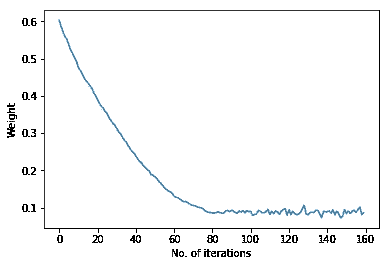

# 在 Keras 中使用回调进行超参数调优

> 原文：<https://towardsdatascience.com/hyperparameter-tuning-with-callbacks-in-keras-5230f51f29b3?source=collection_archive---------10----------------------->

## 通过可视化梯度下降调整超参数的简单方法

# 为什么这很重要？

本文展示了一种简单的方法，通过在 Keras 中使用回调访问模型权重来调整超参数。

应用机器学习是一个经验过程，您需要尝试不同的超参数设置，并推断哪些设置最适合您的应用。

这种技术通常被称为超参数调谐。

这些超参数可以是学习率(alpha)、迭代次数、最小批量等。

# **目标**

通常通过*在连续迭代中观察成本函数*的趋势来执行调整。一个好的机器学习模型具有不断降低的成本函数，直到某个最小值。

本文展示了一种简单的方法，借助**等高线图、**为 **Keras 模型**可视化成本函数的最小化。

在我们的例子中，我们将考虑一个单变量线性回归问题，该问题根据花在广告上的钱数来预测特定产品的销售额。

> **注意**:虽然选择的问题相当简单，但这项技术也适用于深度神经网络。

# **背景**

## 成本函数和梯度下降

**成本函数**是根据模型估计输入和相应输出之间关系的能力来衡量模型错误程度的方法。

简单来说..

> *“你的模型表现有多差”*

**另一方面，梯度下降**是一种通过重复更新网络的参数值来最小化成本函数的技术。

梯度下降的目标可以被认为是…

> *“反复调整参数，直到达到局部最小值”*

线性回归的成本函数通常是[均方误差](https://en.wikipedia.org/wiki/Mean_squared_error)，在这里[有很好的解释](https://www.khanacademy.org/math/statistics-probability/describing-relationships-quantitative-data/more-on-regression/v/squared-error-of-regression-line)。

# **问题描述**

[Advertising.csv](https://github.com/abhishekr7/cost-minimization-visual/blob/master/Advertising.csv) 文件包含分配给各种来源(*电视*、*广播、*、*报纸*)的广告预算及其对特定产品销售*的影响。*

由于我们的重点是单变量回归，我们将只考虑分配给 *TV* 的预算作为我们的[独立](https://en.wikipedia.org/wiki/Dependent_and_independent_variables#Statistics_synonyms)变量*。*

本文的代码和数据可以在[这里](https://github.com/abhishekr7/cost-minimization-visual)找到。

在将 csv 文件加载到一个 [pandas](https://pandas.pydata.org/) dataframe 中并删除不必要的列之后…

```
df = pd.read_csv(‘path/to/file/Advertising.csv’)
df.drop([‘Unnamed: 0’,’radio’,’newspaper’],axis = 1 , inplace=True)
X = df[‘TV’]
Y = df[‘sales’]
df.head()
```

…最终的数据帧将是这样的


Advertising Data Set

后来，我们将数据分成训练集和测试集

```
X_train, X_test, Y_train, Y_test = train_test_split(X, Y, 
                                                    test_size = 0.2)
```

现在，请注意，Keras 并没有明确提供像 [scikit-learn](https://scikit-learn.org/) 这样的线性回归模型。但是我们可以用单个神经元的密集层来模拟线性回归。

```
model = Sequential()
model.add(Dense(1, activation = ‘linear’, use_bias = True,
                                                     input_dim = 1))
model.compile(optimizer = optimizers.RMSprop(lr = 0.01),
                     loss = ‘mean_squared_error’, metrics = [‘mae’])
```

设计的模型看起来会像…


Univariate Linear Regression “Network”

训练模型，我们得到一个相当令人满意的预测图…


# **绘制成本函数**

线性回归的成本函数由下式给出


从等式中可以清楚地看出，我们对可视化成本最小化的要求是每次迭代后更新的图层的权重(和偏差)。

如果我们能够以某种方式访问图层的权重，我们将能够轻松地可视化成本最小化/梯度下降。

Keras 提供了一个 **get_weights()** 函数供用户访问网络层的权重。

```
model.get_weights()
```

但是该函数在训练后返回模型的最终权重(和偏差)。

我们需要一种方法来访问每次迭代(或每批)结束时的权重。

为此，我们将利用一个[回调](http://keras.io/callbacks/)。

# **在 Keras 中定义回调**

Keras 回调帮助您更快地修复 bug 并构建更好的模型。

> “回调是在训练过程的给定阶段应用的一组函数。您可以在训练期间使用回调来查看模型的内部状态和统计数据。

这正是我们所需要的，因为现在我们可以在每次小批量之后(即每次迭代之后)获得 _weights()。重量存储在一个*重量历史*列表中，以备后用。还为偏差项维护了一个单独的列表。

```
weight_history = []
bias_history = []
class MyCallback(keras.callbacks.Callback):
    def on_batch_end(self, batch, logs):
        weight, bias = model.get_weights() B = bias[0]
        W = weight[0][0]
        weight_history.append(W)
        bias_history.append(B)callback = MyCallback()
```

创建的回调与用于训练模型的输入和输出一起传递。

```
model.fit(X_train, Y_train, epochs = 10, batch_size = 10,
                               verbose = True, **callbacks=[callback]**)
```

现在，存储的权重可用于绘制关于权重(W)和偏差(B)的成本函数(J)。

等高线图仅根据*重量历史*和*偏差历史绘制。*这里不需要计算成本函数。


# **解读等高线图**

等高线图的基本直觉是，连续的线代表恒定的量值(称为等高线),并且量值随着我们从图的中间部分到向外部分而增加。

等高线的大小已经给出，在这里，它表示成本函数(J)的可能值。您可以大致观察到，成本(红线)从接近 5000 开始，并继续下降，直到在特定点停止。

这与损失函数值相对应，损失函数值也被认为是均方误差。


> **注意**:两个图之间的误差是由于均方误差(如上)是根据验证分割计算的，而等高线图是使用整个训练数据绘制的。

## 什么也有用？

如上所述，绘制迭代损失函数也可用于超参数调整。事实上，这是数据科学家最常用的技术。

## 为什么要使用等高线图？

等高线图提供的优势在于，它们给出了关于梯度下降算法在迭代中更新模型/网络参数所遵循的轨迹的更好的直觉。

# 最后…

因为我们已经获得了模型参数，所以观察它们随时间变化的趋势是值得的。



Weight vs. Time


Bias vs. Time

因此，可以观察到我们的模型的权重和偏差达到成本函数的局部最小值所遵循的趋势。

现在，您已经可以访问所有的图，您可以有效地检查您的模型是否学习缓慢或超调(学习率)，是否小批量产生可观察到的好处，理想的迭代次数(或甚至是时期)等。