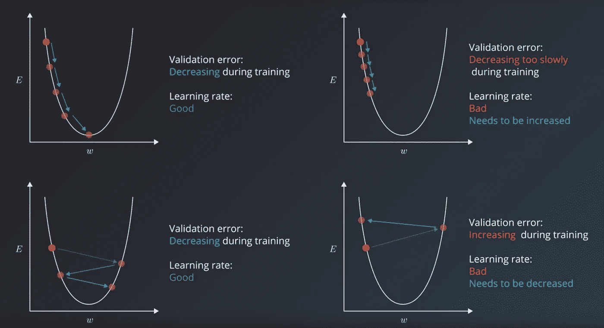
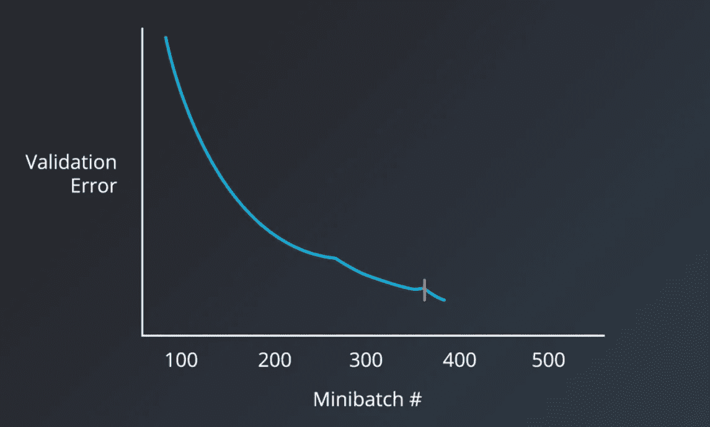
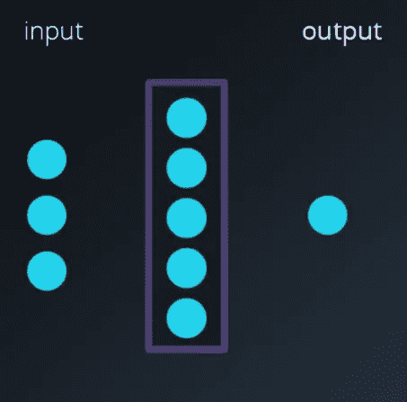
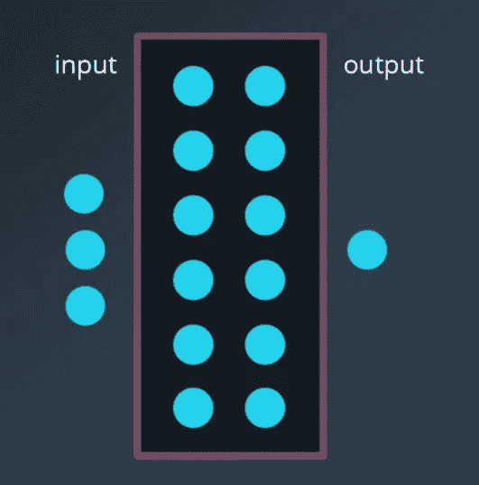

# 深度学习中的超参数

> 原文：<https://towardsdatascience.com/hyperparameters-in-deep-learning-927f7b2084dd?source=collection_archive---------4----------------------->

## 超参数调音就像调音你的吉他。然后奇迹发生了！

Photo by [Roberta Sorge](https://unsplash.com/@robertina?utm_source=medium&utm_medium=referral) on [Unsplash](https://unsplash.com?utm_source=medium&utm_medium=referral)

当你处于学习阶段时，为你的吉他调音是至关重要的，因为你正在创造不同感官之间的联系。你的耳朵、手指和眼睛都在学吉他。习惯吉他走音就像养成了一个坏习惯，一个会破坏你爱上吉他学习过程的整个体验的习惯。

给你的吉他调音真的可以帮助你爱上吉他。机器学习和深度学习的超参数调整也是如此

超参数是我们在将学习算法应用于数据集之前需要设置的变量。

超参数的挑战在于，不存在放之四海而皆准的神奇数字。最佳数字取决于每个任务和每个数据集

超参数可分为两类:

**1)优化器超参数**

*   1.1 —学习率
*   1.2 —小批量
*   1.3 —历元数

**2)模型特定超参数**

*   2.1 —隐藏单元的数量
*   2.2 —第一层
*   2.3 —层数

# 1.优化程序超参数

它们更多地与优化和训练过程相关

## **1.1 学习率:**

> 一个最重要的超参数，你应该始终确保它已被调整 Yoshua Bengio

良好的起点= 0.01

如果我们的学习率比最优值小，那么将需要更长的时间(数百或数千个)才能达到理想状态

或者，另一方面

如果我们的学习速率比最优值大得多，那么它将超过理想状态，并且我们的算法可能不收敛

这只是一个例证。在现实世界中，事情要复杂得多。

a)您的模型将有成百上千个参数，每个参数都有自己的误差曲线。学习率必须指导他们所有人

b)误差曲线不是整齐的 u 形。它们有更复杂的局部极小值形状

## **1.2 小批量尺寸:**

批量大小对训练过程的资源需求、速度和迭代次数有影响，这种影响可能不像你想的那么微不足道

在历史上，有一个关于进行随机训练的争论，其中您将数据集的*单个示例拟合到模型，并且仅使用一个示例，进行正向传递，计算误差，然后反向传递，并为所有超参数设置调整值。然后对数据集中的每个示例重复此操作。*

或者，最好将整个数据输入训练步骤，并使用通过查看数据集中的所有示例而生成的误差来计算梯度。这被称为批量训练

目前常用的方法是设置一个**小批量。**

随机训练是指小批量=1，批量训练是指小批量=训练集中的样本数

> 推荐的实验起始值
> 
> 1, 2, 4, 8, 16, 32, 64, 128, 256

较大的迷你批次大小允许在训练计算中利用矩阵乘法来提高计算能力，但这是以训练过程需要更多存储器为代价的。

较小的小批量会在误差计算中引入更多噪声，并且通常更有助于防止训练过程停止在局部最小值。

小型批量的良好价值= 32

因此，虽然计算能力的提升激励我们增加迷你批次的大小，但这种实际的算法优势激励我们实际上让它变得更小

## **1.3 历元数:**

为了给我们的训练步骤选择正确的历元数，我们应该关注的度量是验证误差。

直观的手动方法是，只要验证误差不断减小，就让模型训练尽可能多的迭代次数。

有一种技术叫做提前停止来决定什么时候停止训练模型。如果验证误差在过去 10 或 20 个时期内没有改善，则停止训练过程

# 2.模型超参数

他们更多地参与到模型的结构中

## **2.1 隐藏单元数量:**

隐藏单元数是其中最神秘的超参数之一。

神经网络是通用函数逼近器，对于学习逼近函数(或预测任务)的网络，它需要有足够的“能力”来学习函数

> 隐单元的数量是衡量模型学习能力的主要指标

‘Learning Capacity’ for a Simple Function

对于一个简单的函数，它可能需要较少数量的隐藏单元。

函数越复杂，模型需要的学习能力就越强

‘Learning Capacity’ for a Complex Function

单位数量略多于最佳数量不是问题，但数量大得多会导致模型过度拟合，即如果您提供的模型容量过大，它可能会过度拟合，并试图记住数据集。

## **2.2 第一个隐藏层:**

涉及第一隐藏层的另一个启发是，已经观察到，将隐藏单元的数量设置为大于输入的数量会在任务数量上给出更好的结果。

## **2.3 层数:**

Andrej Karpathy 在他的博客中告诉我们，在实践中，3 层神经网络往往会优于 2 层网络。但是更深入的研究很少会有更大的帮助。

卷积神经网络是一个例外，它越深入，性能越好。

# 感谢阅读！

*   如果你喜欢这个，[关注我的 medium](https://medium.com/@samarth.agrawal.86) 了解更多。
*   你的掌声对你写更多、写得更好是一个巨大的鼓励和动力。
*   有兴趣合作吗？我们在 [Linkedin](https://www.linkedin.com/in/samarth-agrawal-2501/) 上连线吧。
*   请随意写下您的想法/建议/反馈。

参考资料: [Udacity_DeepLearning](https://in.udacity.com/course/deep-learning-nanodegree--nd101)