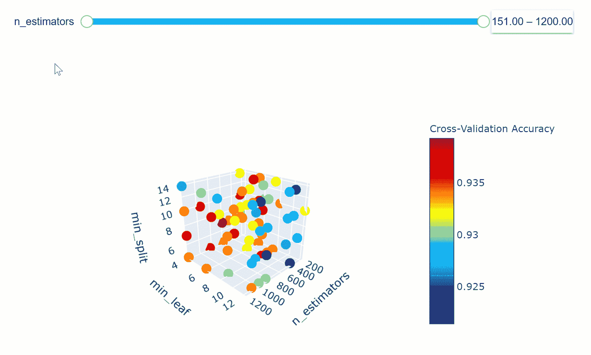
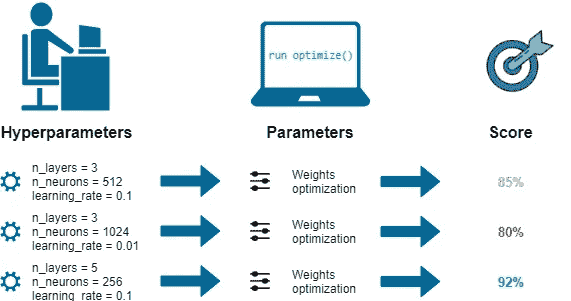
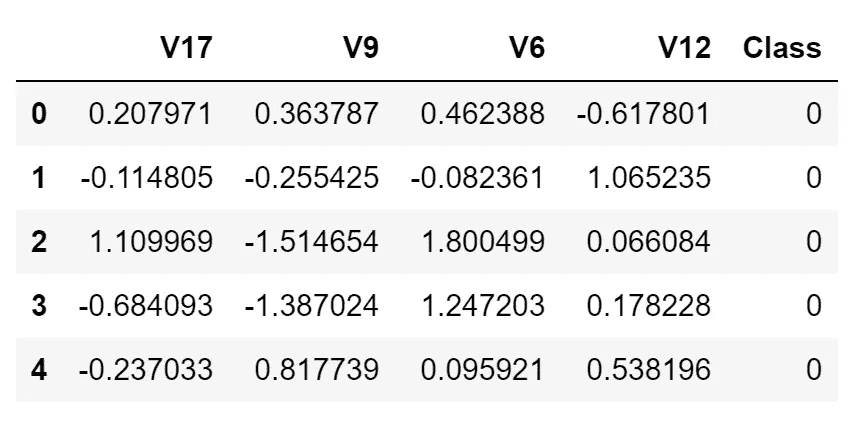
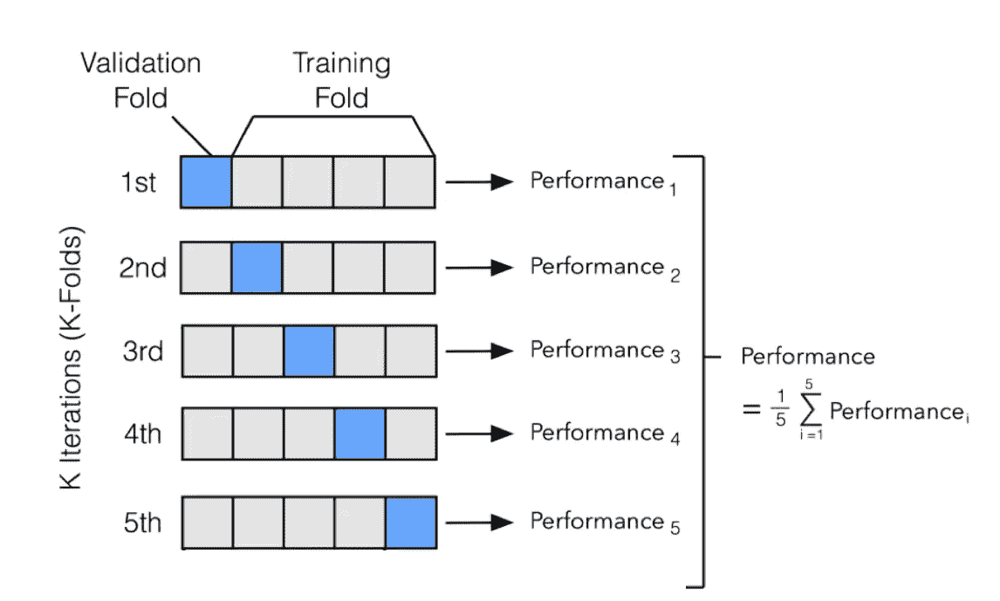
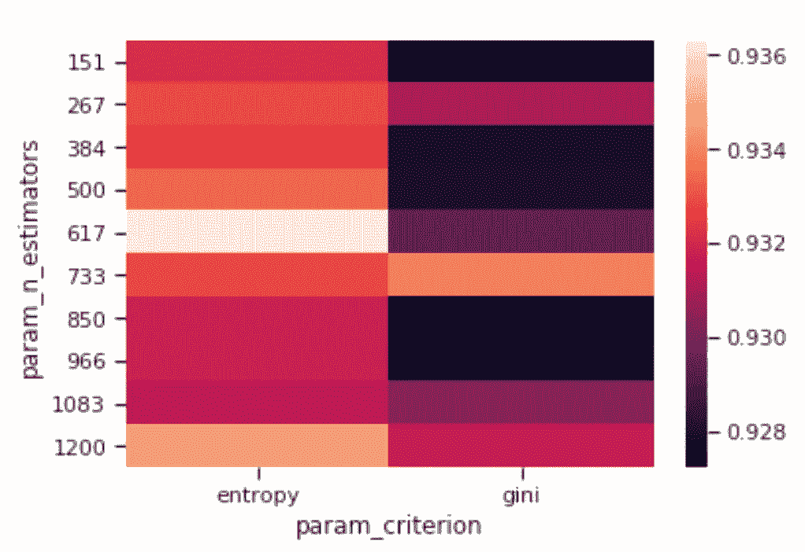

# 超参数优化

> 原文：<https://towardsdatascience.com/hyperparameters-optimization-526348bb8e2d?source=collection_archive---------0----------------------->

## 介绍如何使用随机搜索、自动超参数调整和人工神经网络调整等技术来微调机器和深度学习模型。



# 介绍

机器学习模型由两种不同类型的参数组成:

*   **超参数** =用户在开始训练前可以任意设置的所有参数(如随机森林中的估计数)。
*   **模型参数=** 改为在模型训练期间学习(如神经网络中的权重、线性回归)。

模型参数定义了如何使用输入数据来获得期望的输出，并在训练时学习。相反，超参数首先决定了我们的模型是如何构建的。

机器学习模型调整是一种优化问题。我们有一组超参数，我们的目标是找到它们值的正确组合，这可以帮助我们找到函数的最小值(例如损失)或最大值(例如精度)(图 1)。

当比较不同的机器学习模型在数据集上的表现时，这可能特别重要。事实上，举例来说，将具有最佳超参数的 SVM 模型与未经优化的随机森林模型进行比较是不公平的。

在本帖中，将解释以下超参数优化方法:

1.  **手动搜索**
2.  **随机搜索**
3.  **网格搜索**
4.  **自动超参数调整(贝叶斯优化，遗传算法)**
5.  **人工神经网络调整**



Figure 1: ML Optimization Workflow [1]

为了演示如何在 Python 中执行超参数优化，我决定对[信用卡欺诈检测 Kaggle 数据集](https://www.kaggle.com/mlg-ulb/creditcardfraud)执行完整的数据分析。在本文中，我们的目标是正确分类哪些信用卡交易应该被标记为欺诈或真实(二元分类)。该数据集在发布前已被匿名化，因此，大部分特征的含义尚未公开。

在这种情况下，我决定只使用数据集的一个子集，以便加快训练时间，并确保在两个不同的类之间实现完美的平衡。此外，只有有限数量的功能被用来使优化任务更具挑战性。最终的数据集如下图所示(图 2)。



Figure 2: Credit Card Fraud Detection Dataset

本文中使用的所有代码(以及更多！)可以在我的 [GitHub 库](https://github.com/pierpaolo28/Kaggle-Challenges/blob/master/credit-card-fraud-model-tuning.ipynb)和 [Kaggle 个人资料](https://www.kaggle.com/pierpaolo28/credit-card-fraud-model-tuning)中找到。

# 机器学习

首先，我们需要将数据集分为训练集和测试集。

在本文中，我们将使用随机森林分类器作为优化模型。

随机森林模型由大量不相关的决策树组成，这些决策树连接在一起构成一个集合。在随机森林中，每个决策树做出自己的预测，并且选择整体模型输出作为最频繁出现的预测。

我们现在可以开始计算我们的基本模型精度。

```
[[110   6]
 [  6 118]]
              precision    recall  f1-score   support

           0       0.95      0.95      0.95       116
           1       0.95      0.95      0.95       124

    accuracy                           0.95       240
   macro avg       0.95      0.95      0.95       240
weighted avg       0.95      0.95      0.95       240
```

使用带有默认 scikit-learn 参数的随机森林分类器可获得 95%的总体准确率。现在让我们看看应用一些优化技术是否可以获得更高的精度。

## 手动搜索

当使用手动搜索时，我们根据我们的判断/经验选择一些模型超参数。然后，我们训练该模型，评估其准确性，并再次开始该过程。重复这一循环，直到达到令人满意的精确度。

随机森林分类器使用的主要参数是:

*   **标准** =用于评估分割质量的函数。
*   **max_depth** =每棵树允许的最大层数。
*   **max_features** =分割节点时考虑的最大特征数。
*   **min_samples_leaf** =可以存储在树叶中的最小样本数。
*   **min_samples_split** =节点中导致节点分裂所需的最小样本数。
*   **n_estimators** =集合中的树的数量。

关于随机森林参数的更多信息可以在 scikit-learn [文档](https://scikit-learn.org/stable/modules/generated/sklearn.ensemble.RandomForestClassifier.html)中找到。

作为手动搜索的一个例子，我试图在我们的模型中指定估计量的数量。不幸的是，这并没有带来任何准确性的提高。

```
[[110   6]
 [  6 118]]
              precision    recall  f1-score   support

           0       0.95      0.95      0.95       116
           1       0.95      0.95      0.95       124

    accuracy                           0.95       240
   macro avg       0.95      0.95      0.95       240
weighted avg       0.95      0.95      0.95       240
```

## 随机搜索

在随机搜索中，我们创建超参数网格，并在这些超参数的一些随机组合上训练/测试我们的模型。在这个例子中，我还决定对训练集执行交叉验证。

当执行机器学习任务时，我们通常将数据集分为训练集和测试集。这样做是为了在训练模型后测试我们的模型(这样我们可以检查它在处理未知数据时的性能)。当使用交叉验证时，我们将训练集分成 N 个其他分区，以确保我们的模型不会过度拟合我们的数据。

最常用的交叉验证方法之一是 K 倍验证。在 K-Fold 中，我们将我们的训练集分成 N 个分区，然后使用 N-1 个分区迭代地训练我们的模型，并用剩余的分区对其进行测试(在每次迭代中，我们都改变剩余的分区)。一旦对模型进行了 N 次训练，我们就对每次迭代中获得的训练结果进行平均，以获得我们的总体训练性能结果(图 3)。



Figure 3: K-Fold Cross-Validation [2]

在实现超参数优化时使用交叉验证非常重要。通过这种方式，我们可以避免使用一些超参数，这些超参数对训练数据非常有效，但对测试数据却不太有效。

我们现在可以开始实现随机搜索，首先定义一个超参数网格，当调用***RandomizedSearchCV()***时，将随机采样该网格。对于这个例子，我决定将我们的训练集分成 4 个部分( ***cv = 4*** )，并选择 80 作为要采样的组合数( ***n_iter = 80*** )。使用 sci kit-learn***best _ estimator _***属性，我们可以检索在训练期间表现最佳的一组超参数来测试我们的模型。

一旦训练了我们的模型，我们就可以想象改变它的一些超参数会如何影响整体模型的准确性(图 4)。在这种情况下，我决定观察改变估计量的数量和标准如何影响我们的随机森林精度。



Figure 4: Criterion vs N Estimators Accuracy Heatmap

然后，我们可以通过使我们的可视化更具互动性来更进一步。在下面的图表中，我们可以检查(使用滑块)在考虑所选 min_split 和 min_leaf 参数的情况下，改变模型中估计量的数量会如何影响模型的整体准确性。

通过更改 n_estimators 参数、放大和缩小图表、更改其方向以及将鼠标悬停在单个数据点上来获得有关它们的更多信息，您可以随意摆弄下面的图表！

如果你有兴趣了解更多关于如何使用 [Plotly](/interactive-data-visualization-167ae26016e8) 创建这些动画，我的代码可以在[这里](https://www.kaggle.com/kernels/scriptcontent/20590929/download)找到。此外， [Xoel López Barata](/using-3d-visualizations-to-tune-hyperparameters-of-ml-models-with-python-ba2885eab2e9) 写的一篇文章也谈到了这一点。

我们现在可以使用随机搜索来评估我们的模型表现如何。在这种情况下，与我们的基本模型相比，使用随机搜索可以持续提高准确性。

```
[[115   1]
 [  6 118]]
              precision    recall  f1-score   support

           0       0.95      0.99      0.97       116
           1       0.99      0.95      0.97       124

    accuracy                           0.97       240
   macro avg       0.97      0.97      0.97       240
weighted avg       0.97      0.97      0.97       240
```

## 网格搜索

在网格搜索中，我们建立超参数网格，并在每个可能的组合上训练/测试我们的模型。

为了选择在网格搜索中使用的参数，我们现在可以看看哪些参数最适合随机搜索，并基于它们形成一个网格，看看我们是否可以找到更好的组合。

网格搜索可以使用 scikit-learn***GridSearchCV()***函数在 Python 中实现。也是在这个场合，我决定把我们的训练集分成 4 折( ***cv = 4*** )。

使用网格搜索时，会尝试网格中所有可能的参数组合。在这种情况下，训练时将使用 128000 个组合(2×10×4×4×10)。相反，在之前的网格搜索示例中，只使用了 80 种组合。

```
[[115   1]
 [  7 117]]
              precision    recall  f1-score   support

           0       0.94      0.99      0.97       116
           1       0.99      0.94      0.97       124

    accuracy                           0.97       240
   macro avg       0.97      0.97      0.97       240
weighted avg       0.97      0.97      0.97       240
```

与随机搜索相比，网格搜索速度较慢，但它总体上更有效，因为它可以遍历整个搜索空间。相反，随机搜索可能会更快，但可能会错过搜索空间中的一些重要点。

# 自动超参数调谐

当使用自动超参数调整时，使用诸如贝叶斯优化、梯度下降和进化算法的技术来识别要使用的模型超参数。

## 贝叶斯优化

使用 Hyperopt 库可以在 Python 中执行贝叶斯优化。贝叶斯优化使用概率来寻找函数的最小值。最终目标是找到一个函数的输入值，它能给我们提供尽可能低的输出值。

贝叶斯优化已被证明比随机、网格或人工搜索更有效。因此，贝叶斯优化可以在测试阶段带来更好的性能，并减少优化时间。

在 Hyperopt 中，给函数 **fmin()** 三个主要参数，可以实现贝叶斯优化。

*   **目标函数** =定义最小化的损失函数。
*   **域空间** =定义要测试的输入值的范围(在贝叶斯优化中，该空间为每个使用的超参数创建一个概率分布)。
*   **优化算法** =定义用于选择最佳输入值的搜索算法，以便在每次新的迭代中使用。

另外，还可以在 ***fmin()*** 中定义要执行的最大求值次数。

贝叶斯优化可以通过牢记过去的结果来选择输入值，从而减少搜索迭代的次数。通过这种方式，我们可以从一开始就将我们的搜索集中在与我们期望的输出更接近的值上。

我们现在可以使用 **fmin()** 函数运行我们的贝叶斯优化器。首先创建一个 **Trials()** 对象，以便以后能够可视化 **fmin()** 函数运行时发生的情况(例如，损失函数如何变化，以及使用的超参数如何变化)。

```
100%|██████████| 80/80 [03:07<00:00,  2.02s/it, best loss: -0.9339285714285713]{'criterion': 1,
 'max_depth': 120.0,
 'max_features': 2,
 'min_samples_leaf': 0.0006380325074247448,
 'min_samples_split': 0.06603114636418073,
 'n_estimators': 1}
```

我们现在可以检索识别的最佳参数集，并使用训练期间创建的 ***最佳*** 字典测试我们的模型。一些参数已经使用索引数字存储在 ***best*** 字典中，因此，在将它们输入到我们的随机森林之前，我们需要首先将它们转换回字符串。

使用贝叶斯优化的分类报告如下所示。

```
[[114   2]
 [ 11 113]]
              precision    recall  f1-score   support

           0       0.91      0.98      0.95       116
           1       0.98      0.91      0.95       124

    accuracy                           0.95       240
   macro avg       0.95      0.95      0.95       240
weighted avg       0.95      0.95      0.95       240
```

## 遗传算法

遗传算法试图将自然选择机制应用于机器学习环境。它们受到达尔文自然选择过程的启发，因此通常也被称为进化算法。

让我们想象我们用一些预定义的超参数创建 N 个机器学习模型的群体。然后，我们可以计算每个模型的准确性，并决定只保留一半的模型(表现最好的模型)。我们现在可以生成一些子代，这些子代具有与最佳模型相似的超参数，从而再次得到 N 个模型的群体。在这一点上，我们可以再次计算每个模型的准确性，并重复定义数量的代的循环。通过这种方式，只有最好的模型会在流程结束时保留下来。

为了用 Python 实现遗传算法，我们可以使用 [TPOT 自动机器学习库](https://epistasislab.github.io/tpot/)。TPOT 建立在 scikit-learn 库的基础上，可用于回归或分类任务。

使用遗传算法确定的训练报告和最佳参数显示在下面的代码片段中。

```
Generation 1 - Current best internal CV score: 0.9392857142857143
Generation 2 - Current best internal CV score: 0.9392857142857143
Generation 3 - Current best internal CV score: 0.9392857142857143
Generation 4 - Current best internal CV score: 0.9392857142857143
Generation 5 - Current best internal CV score: 0.9392857142857143

Best pipeline: RandomForestClassifier(CombineDFs(input_matrix, input_matrix), criterion=entropy, max_depth=406, max_features=log2, min_samples_leaf=4, min_samples_split=5, n_estimators=617)
```

我们的随机森林遗传算法优化模型的总体精度如下所示。

```
0.9708333333333333
```

# 人工神经网络(ann)调整

使用 KerasClassifier 包装器，可以像使用 scikit-learn 机器学习模型一样，对深度学习模型应用网格搜索和随机搜索。在下面的例子中，我们将尝试优化我们的一些人工神经网络参数，例如:每层使用多少个神经元，以及使用哪个激活函数和优化器。深度学习超参数优化的更多示例可在[此处](https://machinelearningmastery.com/grid-search-hyperparameters-deep-learning-models-python-keras/)获得。

```
Max Accuracy Registred: 0.932 using {'activation': 'relu', 'neurons': 35, 'optimizer': 'Adam'}
```

使用我们的人工神经网络(ANN)获得的总体准确度可以在下面观察到。

```
[[115   1]
 [  8 116]]
              precision    recall  f1-score   support

           0       0.93      0.99      0.96       116
           1       0.99      0.94      0.96       124

    accuracy                           0.96       240
   macro avg       0.96      0.96      0.96       240
weighted avg       0.96      0.96      0.96       240
```

# 估价

我们现在可以比较所有不同的优化技术在这个给定练习中的表现。总的来说，随机搜索和进化算法表现最好。

```
Base Accuracy vs Manual Search 0.0000%.
Base Accuracy vs Random Search 2.1930%.
Base Accuracy vs Grid Search 1.7544%.
Base Accuracy vs Bayesian Optimization Accuracy -0.4386%.
Base Accuracy vs Evolutionary Algorithms 2.1930%.
Base Accuracy vs Optimized ANN 1.3158%.
```

所获得的结果高度依赖于所选择的网格空间和所使用的数据集。因此，在不同的情况下，不同的优化技术会比其他技术表现得更好。

*我希望你喜欢这篇文章，谢谢你的阅读！*

# 联系人

如果你想了解我最新的文章和项目[，请通过媒体](https://medium.com/@pierpaoloippolito28?source=post_page---------------------------)关注我，并订阅我的[邮件列表](http://eepurl.com/gwO-Dr?source=post_page---------------------------)。以下是我的一些联系人详细信息:

*   [领英](https://uk.linkedin.com/in/pier-paolo-ippolito-202917146?source=post_page---------------------------)
*   [个人博客](https://pierpaolo28.github.io/blog/?source=post_page---------------------------)
*   [个人网站](https://pierpaolo28.github.io/?source=post_page---------------------------)
*   [中等轮廓](https://towardsdatascience.com/@pierpaoloippolito28?source=post_page---------------------------)
*   [GitHub](https://github.com/pierpaolo28?source=post_page---------------------------)
*   [卡格尔](https://www.kaggle.com/pierpaolo28?source=post_page---------------------------)

# 文献学

[1]超参数优化:自动化算法的解释，Dawid Kopczyk。访问地点:[https://dkopczyk.quantee.co.uk/hyperparameter-optimization/](https://dkopczyk.quantee.co.uk/hyperparameter-optimization/)

[2]型号选择，ethen8181。访问网址:[http://ethen 8181 . github . io/machine-learning/model _ selection/model _ selection . html](http://ethen8181.github.io/machine-learning/model_selection/model_selection.html)