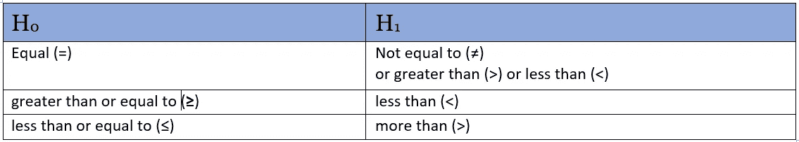
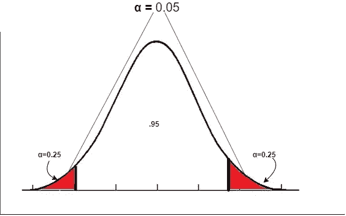
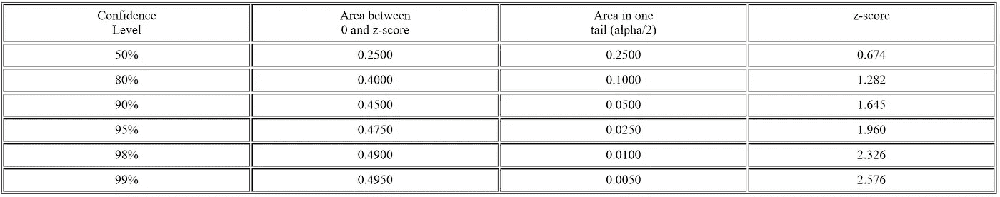
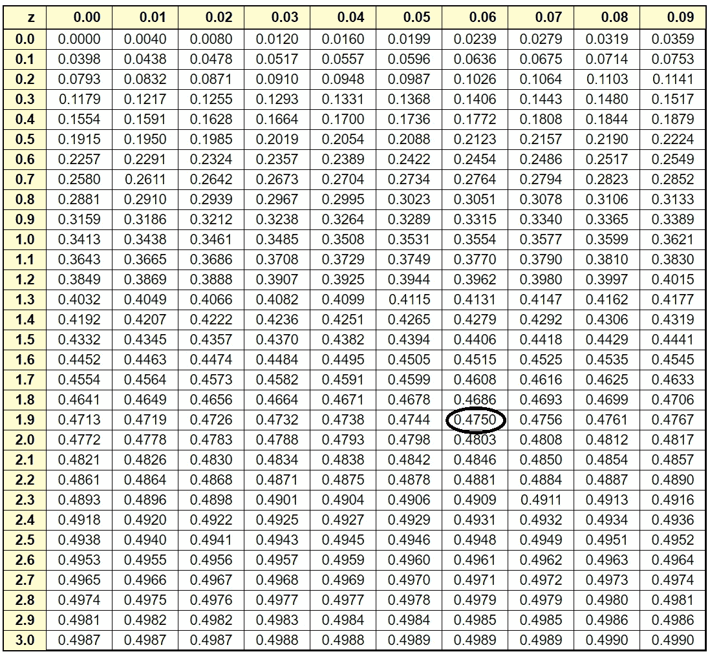
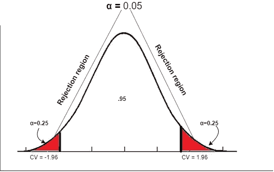

# 假设检验—双尾检验

> 原文：<https://towardsdatascience.com/hypothesis-testing-2-tailed-test-42f0d5ef1071?source=collection_archive---------2----------------------->

在这篇文章中，我们将讨论如何对一个**双尾检验**进行假设检验。在我之前的[帖子](https://medium.com/swlh/hypothesis-testing-c8c408a62cb2)中，我已经用例子详细讨论了假设检验以及如何使用**无效(H0)** 和**替代(H1)** 假设来验证它。所以，在这篇文章中，我不会去探究假设检验的内容和方法。相反，我们将直接看到如何进行双尾检验，实施这种方法的条件和标准是什么。

所以，让我们直接进入一个问题，看看如何解决它。在解决问题的过程中，我会解释一些必要的概念，让你对这个方法更清楚。

**问题陈述**:一批学生平均身高 100 cm，标准差 15。然而，Tedd 认为这种情况已经改变，所以他决定测试该批中随机抽取的 75 名学生的身高。样本的平均高度是 105。是否有足够的证据表明平均身高发生了变化？

让我们重申一下执行假设检验的步骤:

1.  指定零假设(H0)和替代假设(H1)
2.  选择显著性水平(α)
3.  找到关键值
4.  查找测试统计数据
5.  得出你的结论

让我们执行假设检验的第一步，即:

1.  **指定零假设(H0)和备择假设(H1)**

**零假设(H0):** 这里的零假设指的是目前对总体而言为真的假设。在我们的例子中，这一批学生的平均身高是 100。

H0 : μ = 100

**替代假设(H1):** 替代假设总是被**宣称**的东西。“在我们的例子中，Tedd 认为(**声明**)实际值已经改变”。他不知道平均数是上升了还是下降了，但他相信平均数已经变了，不再是 100 了。

H1: μ ≠100

永远记住，一个替代假设总是用≠或< or >符号表示。请参考下表了解更多信息。

因此，如果另一个假设写有≠符号，这意味着我们将进行**双尾检验**，因为它可能大于 100 或小于 100，因此是双尾的。

所以，在陈述完无效假设和替代假设之后，是时候进入第二步了:

**2。选择显著性水平(α)**

显著性水平基本上被定义为曲线尾部的面积。通常，提供了显著性水平，但是如果没有，那么我们需要选择显著性水平。

因此，如果没有提供显著性水平，那么我们将其取为 0.05，因为这是最常见的值。让我们看看这是如何在**双尾测试**中表现出来的

在上面的曲线中，你可以看到显著性水平是 0.05，两条尾巴是对称的，这意味着它们有相同的面积。这意味着每条尾巴的面积为 0.025。

我们需要在曲线上看到的最后一点是，曲线的总面积是 1%或 100%。由于尾部的总面积等于 0.05，那么曲线中间的面积将是 95%或 0.95。

我们已经陈述了我们的重要性。现在让我们进入第三步

**3。找到临界值**

临界值基本上是分隔红色阴影区域(尾部区域)和曲线中间区域的 **z 值**或 **t 值**。

这里的临界值可以是一个 **z 值**或一个 **t 值**。让我们看看在我们的例子中会是什么。

请记住，当向我们提供总体标准差(σ)时，我们将使用 **z 值**。

我们将在以下情况下使用 t 值:

1.  问题陈述中没有给出总体标准差(σ)。
2.  抽取或提供的样本量小于 30。

在我们的例子中，我们将使用 **z 值**作为提供的总体标准差。为了计算 z 值，我们将使用下面给出的 z 表。

我们基本上可以使用几种方法来计算 z 值。

1.  正如我们所知，不包括尾部的曲线面积是 0.95 或 95%，这意味着声明的置信水平是 95%。因此，我们可以使用置信度来查找 z 值。
2.  我们还可以使用其中一条曲线的面积 0.025 来查找 z 值。

上表中需要注意的一点是“0 和 z 值之间的区域”一栏只不过是置信水平的一半(在我们的例子中是 0.4750)。但是，假设我们有一个上表中没有提供的置信度，那么您需要将该置信度除以 2，并在 Z 表的内部查找该区域，然后在外部查找相应的 Z 得分。

在我们的例子中，如果我们将置信水平除以 2，那么它将是 0.4750。因此，如果您在下表中查找并添加对应于 0.4750 的“**z”**的行值和列值，则结果为 1.96

所以，我们在曲线右尾的临界值是 1.96，在曲线左尾或低端，低于平均值的是-1.96

**拒绝区域**

这些临界值之所以如此重要，是因为它将红色区域与曲线中间分开。红色区域称为拒绝区域。

之所以称之为拒绝区域，是因为在下一步中，我们将执行一项测试，该测试将给出样本的 **z 值。如果样本 z 值落在任何拒绝区域(红色区域)，这意味着我们可以**拒绝我们的零假设。**现在，让我们进入第 4 步。**

**4。查找测试统计**

这意味着我们将找到样本的 **z 值**。

z 值=(x-bar-μ)÷(σ÷√[ n])

其中 x-bar =样本平均值= 105

μ =总体平均值= 100

σ =样本的标准偏差= 15

n =样本量= 75

z 值=(105–100)÷(15÷√7.5)= 2.89

这个值 2.89 称为检验统计量。

这是我们的最后一步。

**5。得出结论**

所以，如果你看曲线，2.89 的值肯定位于曲线右侧的红色区域，因为临界值 1.96 小于 2.89。**由于值位于拒绝区域，我们可以拒绝零假设**。

**结论:**

拒绝 H0:μ= 100

接受 H1:也就是μ ≠ 100

因此，根据问题陈述，有足够的证据表明平均身高发生了变化，因为我们能够接受另一个假设，即平均身高不等于 100。