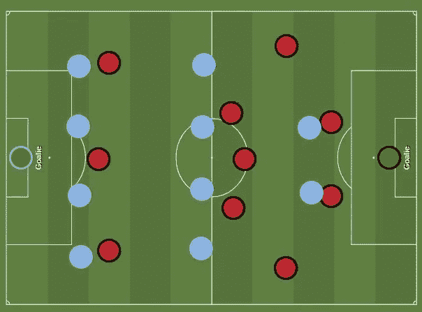
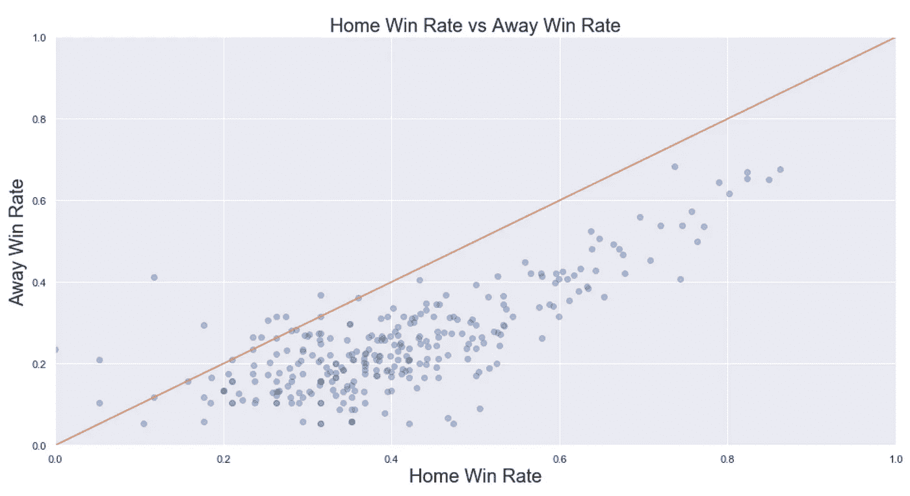
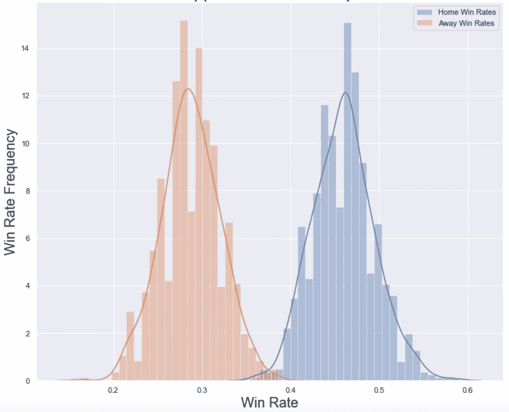
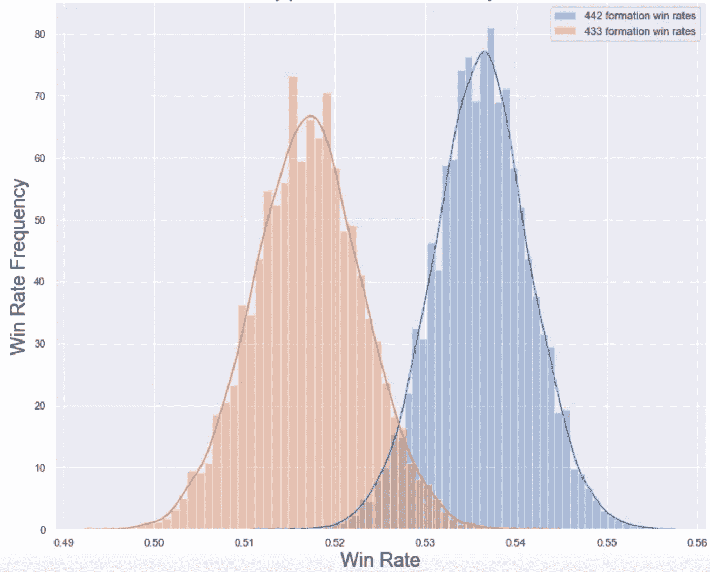

# 假设检验欧洲足球数据

> 原文：<https://towardsdatascience.com/hypothesis-testing-european-soccer-data-using-python-af536f94c44a?source=collection_archive---------9----------------------->

## Python 中探索的主场优势、理想阵型和联赛间属性

康纳·安德森、凯文·维拉斯科和亚历克斯·什罗普希尔

# 简介和假设

欧洲足球队在主场比赛存在潜在优势的传统观念有统计学意义吗？哪种阵型的整体胜率更高，4-4-2 还是 4-3-3？当比较英超和法甲的球队属性时，平均而言，哪个联赛的防守侵略性更高？平均来说，哪一个更有能力让球员进入投篮位置？我们的假设测试会产生有价值的、有统计学意义的结论吗，或者只是留给我们更多没有答案的问题？

我们使用了来自 Kaggle.com 的[欧洲足球数据库来探索这些假设，给出了一个 sqlite3 数据库，其中有 7 个数据表，涵盖了 2008 年至 2016 年来自 11 个欧洲国家的 25，000 场历史足球比赛，10，000 名球员和球队(由](https://www.kaggle.com/hugomathien/soccer) [EA Sports](http://sofifa.com/) 评估的球员&球队评级)。为了从单个统计假设的角度总结我们的方法，我们运行了四个双尾双样本 T 检验，阈值为拒绝或不拒绝每个零假设(alpha=0.05)。为了运行这些测试，我们的数据必须随机抽样，近似正态分布，并且是独立的。我们的测试产生了各种描述性的结果指标和有用的可视化，可以在本文末尾链接的 GitHub 资源库中更详细地查看，但为了简洁起见，我将坚持下面最重要的几点。

## 测试 1:主队与客队的胜率

**H0(零假设)**:平均值之间没有统计学上的显著差异。主场球队的胜率和平均成绩。客场球队的胜率

**哈(替代 Hyp。)**:平均值之间存在统计学上的显著差异。主场球队的胜率和平均成绩。客场球队的胜率


Is there any truth to home-field advantage?

## 测试 2:4–4–2 与 4–3–3 的成功率

**H0**:4–4–2 的胜率和 4–3–3 的胜率在统计上没有显著差异

**HA**:4–4–2 胜率和 4–3–3 胜率之间存在统计上的显著差异



Blue = 4–4–2 Formation | Red = 4–3–3 Formation

## 测试 3:防守侵略性评级(英超 vs 法甲)

**H0:** 两者的平均得分没有统计学上的显著差异。英国队和美国志愿队的防守侵略性评级。法国队防守攻击性评分

**HA:** 存在着统计学上的显著差异。英国队和美国志愿队的防守侵略性评级。法国队防守攻击性评分

## 测试 4:射门机会创造评级(英超 vs 法甲)

**H0:** 平均得分没有统计学上的显著差异。英格兰球队的投篮机会创造率和平均得分。法国队的射门机会创造评分

**HA:** 平均值之间存在统计学上的显著差异。英格兰球队的投篮机会创造率和平均得分。法国队的射门机会创造评分

# 流程和挑战概述

*SQLite→PostgreSQL→Pandas data frames*

Kaggle 以 SQLite 数据库格式提供了 7 个数据表，为了改善团队协作，我们选择[通过指示`pgloader`从 SQLite 文件加载数据，将数据移动到 PostgreSQL 数据库](https://pgloader.readthedocs.io/en/latest/ref/sqlite.html)，这几乎可以完美地工作。 *Player* 表出现了一个错误，因此我们首先将它转换为 csv 格式，然后使用以下代码直接加载到 DataFrame 中，从而解决了这个问题:

```
import sqlite3
import pandas as pd
conn = sqlite3.connect('database.sqlite')
df = pd.read_sql_query("SELECT * FROM Player", conn)
df.to_csv('player.csv',index=False)player_df = pd.read_csv('player.csv')
player_df.head()
```

对于能够完全进入 PostgreSQL 的表，我们通过以下方式将它们加载到 Pandas 数据帧中:

```
conn = psycopg2.connect('dbname=soccer')
cur = conn.cursor()
query = '''
SELECT *
FROM Country
;'''
cur.execute(query)countries_data = cur.fetchall()
countries_df = pd.DataFrame(countries_data)
countries_df.columns = [i[0] for i in cur.description]
countries_df.head()
```

*主场进球&客场进球栏目→二进制主场胜&客场胜栏目→主场胜率&客场胜率*

我们决定利用我们对每支球队在每场比赛中的进球数的了解来创建 2 个二元列，其中 1 代表主队或客场队获胜，0 代表“未获胜”，或球队平局或失败。我们的胜率基本上是指总比赛数中的胜率，它完全基于特定球队在给定比赛中获胜的机会，不会对输球和平局进行不同的处罚(传统上，联盟对获胜奖励 3 分，平局奖励 1 分，失败奖励 0 分)。如上所述，胜率将通过取这些二进制列的平均值来计算。

```
#initiate new columns with 0’s (there are other approaches)
match_df['home_team_win'] = np.zeros
match_df['away_team_win'] = np.zeros#set home team WINs equal to 1 in the new column
match_df['home_team_win'].loc[match_df['home_team_goal'] > match_df['away_team_goal']] = 1
#LOSS = 0
match_df['home_team_win'].loc[match_df['home_team_goal'] < match_df['away_team_goal']] = 0
#TIE = 0
match_df['home_team_win'].loc[match_df['home_team_goal'] == match_df['away_team_goal']] = 0
#repeat for away_team_win column#getting to a win rate for the entire dataset
home_team_win_array = np.array(match_df['home_team_win'])
home_win_rate = np.mean(home_team_win_array)
#repeat for away_team_win column
```

*推算检验功效、效应大小和样本量*

为了在每次测试中达到我们的理想样本量，我们计算了效应大小(Cohen 的 *d* )，它考虑了样本数据的平均值和混合方差之间的差异。我们用它来计算达到期望的α水平(0.05)和期望的功率水平(通常在 0.8 左右)所需的最小样本量。总之，这些决定有助于在测试返回 I 型错误(拒绝真 H0-假阳性)或 II 型错误(拒绝假 H0 失败-假阴性)的风险之间取得平衡。令我们惊讶的是，由于样本平均值之间的差异很小，计算表明我们实际上想要更多的样本用于我们的分析，而不是我们现有的样本。因此，在假设检验 2、3 和 4 中，我们检验的功效显著降低，增加了第二类错误的风险。尽管如此，我们还是继续进行测试，但是一个更理想的场景将允许我们在自信地结束测试之前获得更大的统计能力。

*自举案例*

推断统计学的一个目标是确定总体参数的值，这通常是昂贵的或不可能直接测量的。统计抽样帮助我们克服这一挑战。我们对人口进行抽样，测量一个关于人口的统计数据，并使用它来有希望地说一些关于相应人口的有意义的事情。在我们的第一个假设检验的情况下，我们希望确定主队有一个特定的平均胜率。收集每一场欧洲足球比赛的结果并不容易，因此我们从 2008 年至 2016 年的 25K 场比赛中取样，并说人口的平均胜率在我们样本的平均胜率的误差范围内。

假设我们想更准确地知道那段时间主队的平均胜率是多少，但是我们所能利用的就是这些样本。看起来之前的误差幅度可能是我们最好的猜测。然而，我们可以使用 bootstrapping 来改进这种猜测。为了做到这一点，我们从 25K 个已知匹配中随机抽取替换为的*。我们称之为引导样本。通过替换，该引导样本很可能与我们的初始样本不同。一些匹配可能在我们的样本中出现不止一次，而另一些可能被忽略。使用 Python，我们可以快速创建这些引导样本的数千次迭代。bootstrap 方法产生的估计样本通常形成正态分布，我们可以用集中趋势和方差的度量来概括。大致基于大数定律，如果我们一次又一次地取样，我们可以得出一种“小总体”。由于自举和快速计算机的帮助，即使你使用单个样本来生成数据，这也是适用的。*

```
#example of bootstrapping code applied to our home team win binary column
sample_means_home = []
for _ in range(1000): #number of iterations
    sample_mean = np.random.choice(home_team_win_array,size=202).mean() 
#sample size: 202
    sample_means_home.append(sample_mean)
len(sample_means_home) #should be 1000
```

# 结论

## 测试 1:主队与客队的胜率

> **结论:**否决 H0，赞成哈。主队和客场队的胜率有显著差异。主场优势肯定是存在的！下面是我们在假设检验之外创建的一个简单的可视化图，以说明团队和整体数据的情况:



Most teams tend to win more on their home field



## 测试 2:4–4–2 与 4–3–3 的成功率

> **结论:**拒绝 H0，赞成哈。4–4–2 和 4–3–3 的胜率有显著差异。根据我们的数据，就胜率而言，4–4–2 是更好的阵型，尽管我们可以用更多的样本和/或更大的阵型平均得分差异来进行更强的测试。胜率。



4–4–2 is better on average, but our low power metric (0.67) indicates Type II risk

## 测试 3:防守侵略性评级(英超 vs 法甲)

> **结论:**拒绝 H0，附带告诫。平均成绩似乎有所不同。英格兰队对法国队的防守侵略性评级(EA Sports)，但我们的测试缺乏力量(冒着 II 型错误的风险)。我们不能自信地说 avg 真的有差别。联赛间的防守侵略。我们将能够用更多的样本和/或联盟平均值之间的更大差异来运行更强的测试。

## 测试 4:射门机会创造评级(英超 vs 法甲)

> **结论:**拒绝 H0，附带警告。平均成绩似乎有所不同。英格兰队对法国队的投篮机会创造评级(EA Sports)，但我们的测试缺乏动力(冒着 II 型错误的风险)。我们不能自信地说平均成绩有真正的差异。联赛间的投篮机会创造能力。我们将能够用更多的样本和/或联盟平均值之间的更大差异来运行更强的测试。

感谢您阅读我们简单易懂的欧洲足球假设检验概述！

*深入我们的数据、代码和统计测试的细节，探索我们的 GitHub 库:* [*康纳*](https://github.com/ConnorAnderson29/mod2-final-project)*——*[*凯文*](https://github.com/kevintheduu/Hypothesis-Testing-European-Soccer-Data)*——*[*亚历克斯*](https://github.com/as6140/hypothesis-testing-european-soccer-data)

*在 LinkedIn 上与我们联系，分享您的想法和问题，或者关注我们的数据科学之旅:* [*康纳*](https://www.linkedin.com/in/connor-anderson29/)*——*[*凯文*](https://www.linkedin.com/in/kevinrexisvelasco/)*——*[亚历克斯](https://www.linkedin.com/in/alexshropshire/)