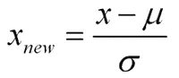

# 使用 Python 进行机器学习中的假设检验

> 原文：<https://towardsdatascience.com/hypothesis-testing-in-machine-learning-using-python-a0dc89e169ce?source=collection_archive---------1----------------------->

可能所有初学机器学习或中级水平或统计学的学生都听说过这个时髦词[假设检验。](https://en.wikipedia.org/wiki/Statistical_hypothesis_testing)

今天我将简单介绍一下这个让我在学习时感到头疼的话题。我用 python 把所有这些概念和例子放在一起。

在我考虑更广泛的事情之前，脑子里有些问题-

**什么是假设检验？我们为什么要用它？假设的基础是什么？假设检验的重要参数是什么？**

让我们一个一个地开始:

**1。什么是假设检验？**

假设检验是一种统计方法，用于利用实验数据进行统计决策。假设检验基本上是我们对总体参数的一种假设。

你说班上学生的平均年龄是 40 岁，或者一个男孩比女孩高。

所有这些我们假设的例子都需要一些统计方法来证明。我们需要一些我们假设为真的数学结论。

**2** 。**我们为什么要用它？**

**假设检验**是统计学中必不可少的程序。**假设检验**评估关于总体的两个互斥陈述，以确定哪个陈述最受样本数据支持。当**我们**说一个发现具有统计学意义时，这要归功于**假设检验**。

**3** 。假设的基础是什么？


Normal Curve images with different mean and variance

假设的基础是[归一化](https://en.wikipedia.org/wiki/Normalization_(statistics))和[标准归一化](https://stats.stackexchange.com/questions/10289/whats-the-difference-between-normalization-and-standardization)。我们所有的假设都是围绕这两个术语的基础。让我们看看这些。


Standardised Normal curve image and separation on data in percentage in each section.

你一定想知道这两个图像之间的区别，一个可能会说我没有发现，而另一个会看到一些平坦的图形相比陡峭。伙计，这不是我想要表现的，在第一张图中，你可以看到不同的正态曲线，所有这些正态曲线可以有不同的均值和方差，在第二张图中，如果你注意到图形是适当分布的，并且**均值=0，方差=1，总是**。当我们使用**标准化的正常数据时，z 分数的概念就出现了。**

**正态分布-**

如果**一个变量的分布**具有**正态曲线**的形状——一种特殊的钟形**曲线**，那么这个变量就被称为正态分布或者具有**正态分布**。…一个**正态分布**的图形被称为**正态曲线**，它具有以下所有**属性** : 1 .平均值、中值和众数相等。


Normal distribution formula

**标准化正态分布—**

标准正态分布是平均值为 0、标准差为 1 的正态分布



Standard Normal Distribution

**哪些是假设检验的重要参数？**

**零假设:-** 在推断统计学中，零假设是一个一般性的陈述或默认立场，即两个测量的现象之间没有关系，或者组之间没有关联

换句话说，这是一个基本假设，或者是基于领域或问题知识做出的。

例如:一家公司的产量为每天 50 台等。

## 替代假设:-

备选假设是在**假设**测试中使用的与原假设相反的假设。人们通常认为这些观察结果是真实效应的结果(叠加了一些偶然变化)

例如:某公司生产的是！=50 单位/每天等。


Null and Alternate hypothesis.

**显著性水平:**指我们接受或拒绝零假设的显著程度。接受或拒绝一个假设不可能有 100%的准确性，因此我们选择一个通常为 5%的显著性水平。

这通常用 alpha(数学符号)表示，通常是 0.05 或 5%，这意味着您的输出应该有 95%的信心在每个样本中给出类似的结果。

**第一类错误:**当我们拒绝原假设，尽管那个假设是真的。第一类误差用α表示。在假设检验中，显示临界区域的正态曲线称为α区域

**第二类错误:**当我们接受零假设但它是假的。第二类错误用β表示。在假设检验中，显示接受区域的正态曲线称为贝塔区域。

**单尾检验:-** 统计假设的检验，其中拒绝区域仅在抽样分布的**一侧，称为**单** - **尾检验**。**

例如:-一所大学有≥ 4000 名学生或数据科学≤ 80%的组织采用。

**双尾检验:-** 一个**两个** - **尾检验**是一种统计**检验**，其中一个分布的临界面积为**两个** - **侧**，并检验一个样本是否大于或小于某个范围的值。如果被测样品落入任何一个关键区域，则接受替代假设，而不是零假设。

举例:某学院！= 4000 学生或数据科学！= 80%的组织采用


one and two-tailed images

**P 值:-****P 值**或计算概率，是当研究问题的零假设(H 0)为真时，发现观察到的或更极端的结果的概率——极端的**定义**取决于假设是如何被检验的。

如果您的 P 值小于所选的显著性水平，那么您拒绝零假设，即接受您的样本提供了支持替代假设的合理证据。它并不意味着“有意义的”或“重要的”差异；这由您在考虑结果的现实相关性时决定。

例子:你有一枚硬币，你不知道这是公平的还是棘手的，所以让我们决定**无效**和**交替假设**

H0:一枚硬币是公平的。

H1:硬币是一种狡猾的硬币。和**α**=**5%或 0.05**

现在我们抛硬币，计算 **p 值**(概率值)。

第一次投掷硬币，结果是**尾** - P 值= 50%(因为头和尾的概率相等)

第二次抛硬币，结果是**尾，现在 p 值=** 50/2 **= 25%**

同样，我们连续投掷 6 次，得到的结果是 P 值= **1.5%** ，但我们将显著性水平设为 95%，意味着我们允许 5%的误差率，这里我们看到我们超出了该水平，即我们的零假设不成立，因此我们需要拒绝并提出这枚硬币是一枚棘手的硬币，实际上是一枚复杂的硬币。

[](http://blog.minitab.com/blog/statistics-and-quality-data-analysis/what-are-degrees-of-freedom-in-statistics)**:-现在想象你不戴帽子。你对数据分析感兴趣。您有一个包含 10 个值的数据集。如果你不估算任何东西，每个值可以取任意数，对吗？每个值都可以自由变化。但是，假设您想使用单样本 t 检验，用 10 个值的样本来检验总体均值。现在，您有了一个约束条件—平均值的估计。具体是什么约束？根据平均值的定义，以下关系必须成立:数据中所有值的总和必须等于 *n* x 平均值，其中 *n* 是数据集中值的数量。**

**因此，如果一个数据集有 10 个值，这 10 个值的总和*必须*等于平均值 x 10。如果 10 个值的平均值是 3.5(您可以选择任何数字)，此约束要求 10 个值的总和必须等于 10 x 3.5 = 35。**

**有了这个约束，数据集中的第一个值可以自由变化。不管它是什么值，所有 10 个数的和仍然有可能是 35。第二个值也可以自由变化，因为无论您选择什么值，它仍然允许所有值的总和为 35 的可能性。**

**现在让我们来看看一些广泛使用的假设检验类型:-**

1.  **T 检验(学生 T 检验)**
2.  **z 检验**
3.  **方差分析检验**
4.  **卡方检验**

****T-检验:-**T-检验是一种推断统计，用于确定在某些特征上可能相关的两组的平均值之间是否存在显著差异。它主要用于数据集，如作为投掷硬币 a 100 次的结果而记录的数据集，将遵循正态分布，并且可能具有未知的[方差](https://www.investopedia.com/terms/v/variance.asp)。t 检验用作[假设检验](https://www.investopedia.com/terms/h/hypothesistesting.asp)工具，允许检验适用于总体的假设。**

**t 检验有两种类型:1。一个样本 t 检验 2。双样本 t 检验。**

****单样本 t 检验**:单样本 *t* 检验确定样本均值在统计上是否不同于已知或假设的总体均值。单样本 *t* 测试是一种参数测试。**

**例如:-你有 10 个年龄，你正在检查平均年龄是否为 30。(使用 python 检查下面的代码)**

```
from scipy.stats import ttest_1samp
import numpy as npages = np.genfromtxt(“ages.csv”)print(ages)ages_mean = np.mean(ages)
print(ages_mean)
tset, pval = ttest_1samp(ages, 30)print(“p-values”,pval)if pval < 0.05:    # alpha value is 0.05 or 5%
   print(" we are rejecting null hypothesis")
else:
  print("we are accepting null hypothesis")
```

**上述代码的输出是:**

****

**one-sample t-test output**

****双样本 T 检验:-** 独立**样本 T 检验**或双样本 T 检验比较两个独立组的平均值，以确定是否有统计证据表明相关总体平均值存在显著差异。独立的**样本 t 检验**是一个参数**检验**。这个**测试**也被称为:独立 **t 测试**。**

**示例:week1 和 week2 之间有任何关联吗(下面用 python 给出了代码)**

```
from scipy.stats import ttest_ind
import numpy as npweek1 = np.genfromtxt("week1.csv",  delimiter=",")
week2 = np.genfromtxt("week2.csv",  delimiter=",")print(week1)
print("week2 data :-\n")
print(week2)
week1_mean = np.mean(week1)
week2_mean = np.mean(week2)print("week1 mean value:",week1_mean)
print("week2 mean value:",week2_mean)week1_std = np.std(week1)
week2_std = np.std(week2)print("week1 std value:",week1_std)
print("week2 std value:",week2_std)ttest,pval = ttest_ind(week1,week2)
print("p-value",pval)if pval <0.05:
  print("we reject null hypothesis")
else:
  print("we accept null hypothesis")
```

****

**2-sampled t-test output**

****成对样本 t 检验:-** 成对样本 t 检验也叫相依样本 t 检验。这是一个单变量测试，测试两个相关变量之间的显著差异。这方面的一个例子是，如果您在某个治疗、条件或时间点之前和之后收集个人的血压。**

****H0:——表示两个样本之间的差值为 0****

****H1:-两个样本之间的平均差异不为 0****

**检查下面的代码是否相同**

```
import pandas as pd
from scipy import stats
df = pd.read_csv("blood_pressure.csv")df[['bp_before','bp_after']].describe()ttest,pval = stats.ttest_rel(df['bp_before'], df['bp_after'])
print(pval)if pval<0.05:
    print("reject null hypothesis")
else:
    print("accept null hypothesis")
```

# **当你可以进行 Z 测试的时候。**

**统计中使用了几种不同类型的检验(即 [f 检验](https://www.statisticshowto.datasciencecentral.com/probability-and-statistics/hypothesis-testing/f-test/)、[卡方检验](https://www.statisticshowto.datasciencecentral.com/probability-and-statistics/chi-square/)、 [t 检验](https://www.statisticshowto.datasciencecentral.com/probability-and-statistics/t-test/))。在以下情况下，可以使用 Z 检验:**

*   **您的[样本量](https://www.statisticshowto.datasciencecentral.com/probability-and-statistics/find-sample-size/)大于 30。否则，使用 [t 测试](https://www.statisticshowto.datasciencecentral.com/probability-and-statistics/t-test/)。**
*   **数据点应该是相互独立的。换句话说，一个数据点不相关或者不影响另一个数据点。**
*   **您的数据应该是正态分布的。然而，对于大样本量(超过 30)，这并不总是重要的。**
*   **您的数据应该从总体中随机选择，其中每一项都有平等的机会被选中。**
*   **[样本大小](https://www.statisticshowto.datasciencecentral.com/probability-and-statistics/find-sample-size/)应尽可能相等。**

**再举一个例子，我们使用 z-test 对血压进行一些均值测试，如 156 (python 代码如下所示)**单样本 Z 测试。****

```
import pandas as pd
from scipy import stats
from statsmodels.stats import weightstats as stestsztest ,pval = stests.ztest(df['bp_before'], x2=None, value=156)
print(float(pval))if pval<0.05:
    print("reject null hypothesis")
else:
    print("accept null hypothesis")
```

****双样本 Z 检验-** 在双样本 Z 检验中，类似于这里的 t 检验，我们检查两个独立的数据组，并决定两组的样本均值是否相等。**

****H0:两组平均值为 0****

****H1:两组的平均值不为 0****

**示例:我们在采血后和采血前检查采血数据。(下面是 python 代码)**

```
ztest ,pval1 = stests.ztest(df['bp_before'], x2=df['bp_after'], value=0,alternative='two-sided')
print(float(pval1))if pval<0.05:
    print("reject null hypothesis")
else:
    print("accept null hypothesis")
```

****ANOVA(F-TEST):-**t-TEST 在处理两组时效果很好，但有时我们希望同时比较两组以上的数据。例如，如果我们想测试选民年龄是否因种族等分类变量而不同，我们必须比较变量的每个级别或组的平均值。我们可以对每一组进行单独的 t 检验，但是当你进行多次检验时，就会增加假阳性的机会。[方差分析](https://en.wikipedia.org/wiki/Analysis_of_variance)或 ANOVA 是一种统计推断测试，允许您同时比较多个组。**

****F =组间变异性/组内变异性****

****

**F-Test or Anova concept image**

**与 z 分布和 t 分布不同，F 分布没有任何负值，因为组间和组内的变异性由于每个偏差的平方而总是正的。**

****单向 F-检验(Anova) :-** 它根据两组或更多组平均相似性和 F-分数来判断它们是否相似。**

**示例:有 3 种不同类别植物及其重量，需要检查所有 3 组是否相似(下面的 python 代码)**

```
df_anova = pd.read_csv('PlantGrowth.csv')
df_anova = df_anova[['weight','group']]grps = pd.unique(df_anova.group.values)
d_data = {grp:df_anova['weight'][df_anova.group == grp] for grp in grps}

F, p = stats.f_oneway(d_data['ctrl'], d_data['trt1'], d_data['trt2'])print("p-value for significance is: ", p)if p<0.05:
    print("reject null hypothesis")
else:
    print("accept null hypothesis")
```

****双向 f 检验:-** 双向 f 检验是单向 f 检验的扩展，当我们有 2 个自变量和 2+组时使用。双向 f 检验不能说明哪个变量是主导变量。如果我们需要检查个体显著性，则需要执行**事后**测试。**

**现在让我们来看看总的平均作物产量(不按任何分组的平均作物产量)，以及按每个因素和按组合在一起的因素的平均作物产量**

```
import statsmodels.api as sm
from statsmodels.formula.api import olsdf_anova2 = pd.read_csv("[https://raw.githubusercontent.com/Opensourcefordatascience/Data-sets/master/crop_yield.csv](https://raw.githubusercontent.com/Opensourcefordatascience/Data-sets/master/crop_yield.csv)")model = ols('Yield ~ C(Fert)*C(Water)', df_anova2).fit()
print(f"Overall model F({model.df_model: .0f},{model.df_resid: .0f}) = {model.fvalue: .3f}, p = {model.f_pvalue: .4f}")res = sm.stats.anova_lm(model, typ= 2)
res
```

****卡方检验-** 当一个总体中有两个[分类变量](https://stattrek.com/Help/Glossary.aspx?Target=Categorical%20variable)时，应用该检验。它用于确定两个变量之间是否有显著的关联。**

**例如，在选举调查中，选民可以按性别(男性或女性)和投票偏好(民主党、共和党或无党派)分类。我们可以使用卡方检验来确定性别是否与投票偏好有关**

**查看下面的 python 示例**

```
df_chi = pd.read_csv('chi-test.csv')
contingency_table=pd.crosstab(df_chi["Gender"],df_chi["Shopping?"])
print('contingency_table :-\n',contingency_table)#Observed Values
Observed_Values = contingency_table.values 
print("Observed Values :-\n",Observed_Values)b=stats.chi2_contingency(contingency_table)
Expected_Values = b[3]
print("Expected Values :-\n",Expected_Values)no_of_rows=len(contingency_table.iloc[0:2,0])
no_of_columns=len(contingency_table.iloc[0,0:2])
ddof=(no_of_rows-1)*(no_of_columns-1)
print("Degree of Freedom:-",ddof)
alpha = 0.05from scipy.stats import chi2
chi_square=sum([(o-e)**2./e for o,e in zip(Observed_Values,Expected_Values)])
chi_square_statistic=chi_square[0]+chi_square[1]
print("chi-square statistic:-",chi_square_statistic)critical_value=chi2.ppf(q=1-alpha,df=ddof)
print('critical_value:',critical_value)#p-value
p_value=1-chi2.cdf(x=chi_square_statistic,df=ddof)
print('p-value:',p_value)print('Significance level: ',alpha)
print('Degree of Freedom: ',ddof)
print('chi-square statistic:',chi_square_statistic)
print('critical_value:',critical_value)
print('p-value:',p_value)if chi_square_statistic>=critical_value:
    print("Reject H0,There is a relationship between 2 categorical variables")
else:
    print("Retain H0,There is no relationship between 2 categorical variables")

if p_value<=alpha:
    print("Reject H0,There is a relationship between 2 categorical variables")
else:
    print("Retain H0,There is no relationship between 2 categorical variables")
```

**您可以在我的 [git](https://github.com/yug95/MachineLearning) 存储库中获得所有代码。**

**啊，我们终于结束了这篇文章。我希望这篇文章会有所帮助。任何反馈都会受到欢迎。**

**更多更新请查看我的 [git](https://github.com/yug95/MachineLearning) 并在媒体上关注 we。**