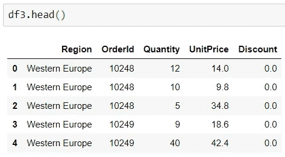
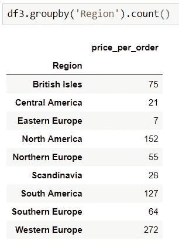
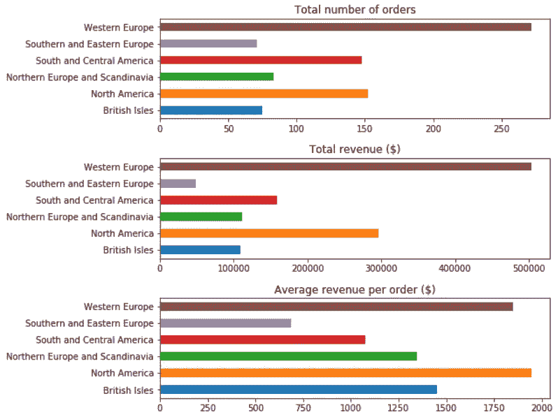
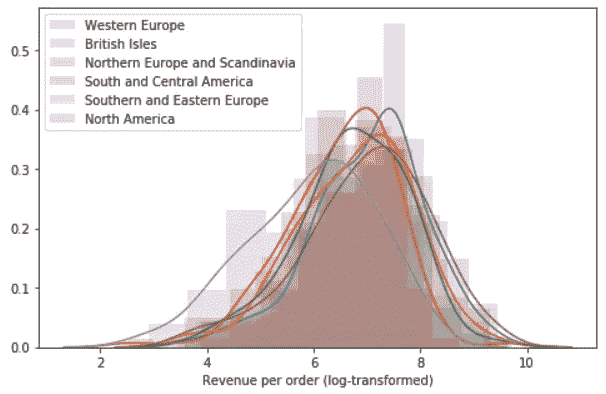

# 使用方差分析进行假设检验:一项核心数据科学技能

> 原文：<https://towardsdatascience.com/hypothesis-testing-in-the-northwind-dataset-using-anova-db3ab16b5eba?source=collection_archive---------14----------------------->

## 使用假设检验确定最有利可图的客户的例子

# 项目目标

作为 Northwind 数据库项目的一部分，我需要对数据提出一些问题，以便为公司获得有价值的商业见解。Northwind 数据库是 Microsoft 为一家名为 Northwind Traders 的虚构公司提供的示例数据库，该公司从世界各地进口和出口消费品。该数据库包含公司活动的一系列信息，包括客户、客户订单、产品及其供应商。我感兴趣的是更好地了解他们的客户，并找出哪些客户群体对 Northwind 的利润贡献最大。所以我决定问的一个问题是:

> 不同地区的客户每份订单的平均收入是否不同？

# 陈述假设

为了回答这个问题，我首先创建了一个无效替代假设:

零假设:每个订单的平均花费金额在不同的客户区域之间是相同的

另一个假设:在不同的客户区域，每个订单的平均消费金额是不同的(或高或低)

阿尔法水平(即，当假设为真时拒绝零假设的概率)设置为 0.05。

# 获取和清理数据

第一步是使用这个(只有轻微的标签错误)模式提取正确的数据:


Northwind database schema

为了回答正在调查的问题，我需要提取客户区域、订购的每种产品的总量、单价以及每份订单的折扣级别。为此，我使用 Order 表连接了 Customer 和 OrderDetail 表:

```
# Importing the required libraries
from sqlalchemy import create_engine
from sqlalchemy.orm import Session, sessionmaker
import pandas as pd
import seaborn as sns
import numpy as np
import matplotlib.pyplot as plt
import statsmodels.api as sm
from statsmodels.formula.api import ols# Creating an engine and connecting to a database with SQLAlchemy
engine = create_engine('sqlite:///Northwind_small.sqlite', echo=True)
Session = sessionmaker(bind=engine)
session = Session()
con = engine.connect()# Extracting the data required as a pandas dataframe using a SQL query
df3 = pd.read_sql_query('''
 SELECT c.Region, od.OrderId, od.Quantity, od.UnitPrice, od.Discount
 FROM Customer c
 JOIN [Order] o ON c.Id = o.CustomerId
 JOIN OrderDetail od ON od.OrderId = o.Id
 ''', engine)
```

产生的数据框架现在显示了每个订单中每个产品的订单 ID、数量、单价和折扣:



The first five rows of the dataset

但我真正想要的是每份订单的总收入。这是使用下面单元格中的代码计算的，该代码将折扣应用于单价和单位数量的乘积，然后对每个订单求和，并删除不再需要的列:

```
# Calculating the revenue per sub-order
df3['price_per_order'] = df3.Quantity * df3.UnitPrice * (1 - df3.Discount)# Dropping the columns for quantity, unit price and discount now that we have the total revenue
df3.drop(['Quantity', 'UnitPrice', 'Discount'], axis=1, inplace=True)# Grouping the data by order and summing the revenue for each order
df3 = df3.groupby(['Region', 'OrderId'])['price_per_order'].sum().reset_index()# Dropping the OrderId as we no longer need this
df3.drop('OrderId', axis=1, inplace=True)
```

这给我留下了一个只包含我需要的数据的数据框架:


The first five rows of the new dataset

但是，对每个地区的订单数量进行快速统计后发现，一些地区的客户仅下了少量订单:



因为方差分析将用于检验假设，所以最好确保相对相等的样本量，特别是满足方差相等的假设。因此，较小的群体与其他具有地理意义的群体结合在一起，并采用了 30 人的最小群体规模。

```
# Combining Eastern and Southern Europe
df3.loc[(df3.Region == 'Eastern Europe') | (df3.Region == 'Southern Europe'),'Region'] = 'Southern and Eastern Europe'# Combining Scandinavia and Northern Europe
df3.loc[(df3.Region == 'Scandinavia') | (df3.Region == 'Northern Europe'),'Region'] = 'Northern Europe and Scandinavia'# Combining Central and South America
df3.loc[(df3.Region == 'Central America') | (df3.Region == 'South America'),'Region'] = 'South and Central America'
```


# 探索数据

既然数据已经有了正确的格式和分组，就可以开始研究它了。以下代码块生成了下图，该图绘制了每个地区的订单数、每份订单的总收入和每份订单的平均收入:

```
# Plotting the number of orders, total revenue per order and average revenue per order for each region
fig, (ax1, ax2, ax3) = plt.subplots(3, 1, figsize=(8,8))
df3.groupby(['Region'])['Region'].count().plot(kind='barh', ax=ax1)
df3.groupby(['Region'])['price_per_order'].sum().plot(kind='barh', ax=ax2)
df3.groupby(['Region'])['price_per_order'].mean().plot(kind='barh', ax=ax3)
ax1.set_title('Total number of orders')
ax1.set_ylabel('')
ax2.set_title('Total revenue ($)')
ax2.set_ylabel('')
ax3.set_title('Average revenue per order ($)')
ax3.set_ylabel('')
fig.subplots_adjust(hspace=0.4);
```



图表显示，西欧是订单数量最多的地区，总收入也最高。然而，北美的平均订单最贵(其次是西欧)。南欧和东欧的订单数量最少，总收入最低，平均订单最便宜。第三张图支持了另一个假设，即各地区之间的平均订单收入存在显著差异。这通过使用统计假设检验被进一步研究。

# 假设检验和结果

为了回答来自不同地区的顾客每份订单的平均花费是否不同的问题，使用了 ANOVA。这评估了多个样本之间的变化程度，在这种情况下，每个样本是不同的区域。

方差分析假设数据是正态分布的，样本具有相似的方差。分布图是使用 seaborn 绘制的，这表明数据非常严重地正偏，具有长尾。对数据进行对数变换会产生具有更相似分布的更正态分布的数据。对数转换数据的分布(如下所示)由以下代码生成:

```
# Copying the dataset and log-transforming price_per_order
df3_log = df3.copy()
df3_log['price_per_order'] = np.log(df3['price_per_order'])# Plotting the distributions for the log-transformed data
plt.figure(figsize=(8,5))
for region in set(df3_log.Region):
    region_group = df3_log.loc[df3_log['Region'] == region]
    sns.distplot(region_group['price_per_order'], hist_kws=dict(alpha=0.2), label=region)
    plt.legend()
    plt.xlabel('Revenue per order (log-transformed)')
```



数据现在更加正态分布，均值的方差也更加相似。现在可以进行方差分析测试了:

```
# Fitting a model of price_per_order on Region categories, and using statsmodels to compute an ANOVA table
lm = ols('price_per_order ~ C(Region)', df3_log).fit()
sm.stats.anova_lm(lm, typ=2)
```


上面的 ANOVA 表显示 p 值低于 alpha 值 0.05。因此，我能够拒绝零假设，接受替代假设。不同地区之间的平均订单价值存在统计上的显著差异，即平均而言，来自世界不同地区的客户在订单上花费的金额不同。

# 结论

## 商业洞察:

*   不同地区客户的平均每单收入存在显著的统计差异。
*   西欧客户下的订单最多，是 Northwind 盈利的最大贡献者。然而，尽管北美客户的订单数量大约是西欧客户的一半，但他们平均每份订单的花费更多。
*   订单平均最贵的地区(北美，1，945.93 美元)和订单最便宜的地区(南欧和东欧，686.73 美元)之间的差额为 1，259.20 美元，是北美订单的 2.8 倍。
*   南欧和东欧的订单数量最少，总收入最低，每笔订单的平均收入也最低。
*   北美客户的订单数量与南美和中美客户相似，但他们每份订单的平均支出是南美和中美客户的 1.8 倍。

## **未来工作的潜在业务行动和方向:**

*   如果 Northwind 希望专注于利润更高的客户，一个潜在的行动将是停止为南欧和东欧的客户提供服务，而更多地关注西欧和北美的客户。
*   然而，还需要进一步的分析来证实这些发现。例如，一些更贵的产品可能只在某些地区有售。