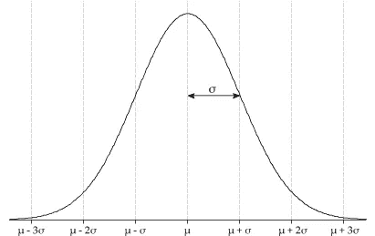
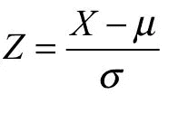
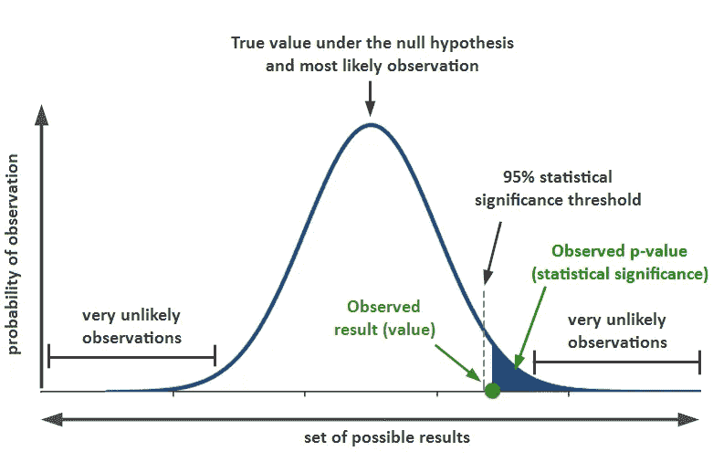
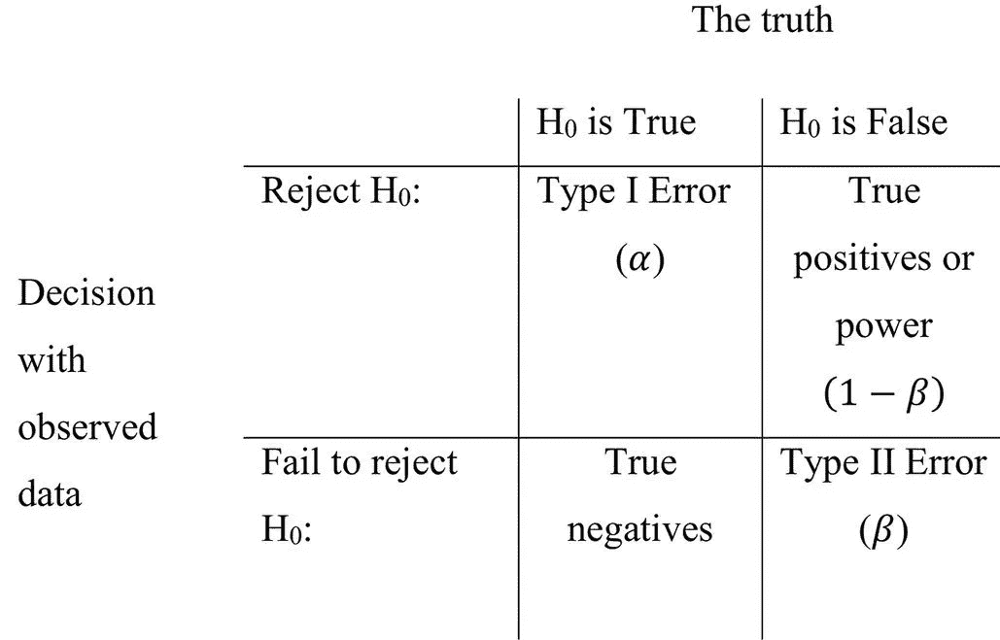
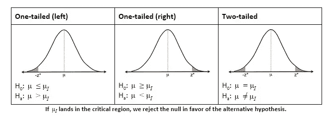

# 假设检验——什么、为什么和如何

> 原文：<https://towardsdatascience.com/hypothesis-testing-the-what-why-and-how-867d382b99ca?source=collection_archive---------9----------------------->

理解假设检验背后的直觉。它到底是什么，我们为什么要这样做，以及如何执行它。让我们开始吧！

# 直觉

我们先来了解一下假设检验背后的直觉。假设你在一家电子商务公司工作，你设计了一个新的网站来吸引更多的顾客。你的老板想知道你的新网站设计是否值得投资，或者只是一个噱头。你是做什么的？你不能只是把网站推广给你所有的客户，然后全力以赴。几天后，你会想通过引导流量到新网站来确认你的新设计是否真的有效。如果结果出来*惊人的好*，那意味着你的新网站设计确实很棒。否则，这可能只是一个一次性的运动。

你的新网站就是你想要测试的*假设*。但是你想让它和别的东西比较，对吗？为此，你做了一个“零假设”。你的无效假设说你的网站是垃圾。没有任何实际影响。然后你提出一个‘替代假设’。你的另一个假设是你的新网站真的很棒，它真的增加了你的客户。我们首先假设我们的零假设是正确的。所以如果你成功地证明了你的零假设是错误的，你实际上证明了你的替代假设是正确的！

太好了！所以你现在对*我们在做什么*，为什么我们在做什么*，以及*我们如何*我们在做什么有一个直觉。现在让我们进入细节。*

# 显著性水平和置信区间

继续我们的示例，假设贵公司每天的平均客户数量约为 5430 人。如果你为一年中的每一天的顾客画一张图，你将得到下面的正态分布图[，平均值为 5430。](https://www.statisticshowto.datasciencecentral.com/probability-and-statistics/normal-distributions/)

The normal distribution curve with mean μ and standard deviation σ

在你开始测试你的新想法之前，你设置一个**显著性水平**——一个*阈值概率*。这也被称为**临界值— α。**

> 曲线下超过临界值的区域就是临界区。临界值定义了我们的样本统计量(我们的实验值)与零假设值(原始平均值)之间的距离，在此之前，我们可以说它是异常的，足以拒绝零假设。

然后你把流量导向你的新网站几天，看看结果。假设平均有 5723 个客户。现在这个数字的增加可能是由于你的新设计(你的替代假设提出的)或者仅仅是运气。然后，我们计算这个实验的 [*测试统计量*](https://www.statisticshowto.datasciencecentral.com/test-statistic/)——这是 Z 测试的 Z 得分(下面将详细介绍)。这意味着，我们需要检查 5723 的实验值离我们的原始分布均值有多远或多少标准差。这可以使用下面的表达式来计算:

X = Sample mean, μ=Population mean, σ=Standard deviation

临界值可以是 0 到 1 之间的任何值。通常选择为 0.05。这意味着只有当达到 5723 的 Z 值的 **P 值**小于 0.05 时，你才能**拒绝**零假设。否则，你**无法拒绝**。现在，你可能知道曲线下的[面积表示总概率，超过临界值的面积将是 5%。或者我们可以说我们有 95%的**置信区间**。如果将临界值降低到 0.01，假设检验会变得更加严格，因为如果要拒绝零假设，您现在希望新的 p 值更低(小于 0.01)。这意味着你的置信区间将是 99%。](http://onlinestatbook.com/2/normal_distribution/areas_normal.html)

# p 值

达到 5723 或更大极限值的概率是假设我们的零假设为真的 P 值。请注意，这不是实现点估计 5723 的概率，这将是非常低的。*它是实现一个如此罕见甚至更罕见的价值的总概率*。它是正常曲线下超过 P 值标记的区域。这个 P 值是用我们刚刚找到的 Z 值计算出来的。每个 Z 得分都有一个对应的 P 值。这可以使用任何统计软件如 R 或甚至从[Z-表](http://www.z-table.com/)中找到。

[source](http://blog.analytics-toolkit.com/2017/statistical-significance-ab-testing-complete-guide/)

现在，如果这个 P 值小于临界值——意味着达到这个客户数量的可能性非常小，这确实不是运气，我们可以*拒绝*我们的零假设。现在，我们不能说我们*接受*我们的替代假设，因为统计学是一个推理游戏，我们永远不可能 100%确定。但是，正如我们已经设定了我们的置信区间，我们可以有 95%甚至 99%的把握。这就是错误出现的地方！

# 第一类和第二类错误

就像我说的，我们永远不能百分百确定。你的结论总是有可能是错误的，而事实真相是完全相反的。

如果你的显著性水平是 0.05，这意味着你有 5%的几率是错的！意思是，你拒绝了你的无效假设，当它在现实中是正确的时候。这是第 1 类错误。因此，犯类型 1 错误的概率是 **α** 。

反过来，你也可以断定你的零假设是真的，或者用统计学的话说，你*没有拒绝*你的零假设，而实际上它是假的。这是第二类错误的一个例子。犯第二类错误的概率用β来解释— **β** 。

[source](https://bmjopen.bmj.com/content/7/8/e015397\)

**功效**是当零假设为假时，拒绝零假设的概率。所以犯第二类错误的概率是 1-(幂)*或* 1-β。

现在我们如何减少这些误差？我们可以简单地增加我们的信心水平，或者换句话说，减少我们的α。这样做减少了α下的面积，从而减少了犯类型 1 错误的概率。但是减少α 会增加犯第二类错误的概率，因为你将会更多地拒绝你的零假设！所以有一个取舍。

你也可以增加你的样本大小，n，这将使你的分布曲线更窄，从而降低犯错误的概率。

# 单尾与双尾检验

统计测试也可以是方向性的。这意味着你提出的另一个假设是结果增加*或者减少*或者减少*。在我们的例子中，我们想测试客户是否增加了。所以这是一个单尾检验的例子。因此，对于 95%的置信区间，5%的概率分布是在我们测试的方向上(在我们的例子中是向右)。*

相反，我们也可以从另一个方向进行测试。例如，测试对软件进行某些更改是否会显著减少处理时间。在这种情况下，我们将考虑正常曲线的左侧部分。

[source](https://turnthewheelsandbox.wordpress.com/2015/08/02/lesson-9-hypothesis-testing/)

对于两个尾检验的情况，没有具体的方向。我们的替代假设只是检查新的统计数据是否发生了显著变化，即它是显著大于还是小于原始统计数据。因此，对于 95%的置信区间，我们的 5%概率分布将被分成两部分，两个方向各 2.5%。因此α 将是 0.025。

# 统计测试的类型

## z 检验

当要计算两个分布之间的均值差异时，通常使用 z 检验。总体的标准差应该是已知的，样本数应该大于 30。z-检验的一个最重要的假设是所有的样本观测值都是相互独立的。

## t 检验

当总体的标准偏差未知且必须从样本中近似得出时，使用 t 检验。它通常用于比较两个不同的群体。t 检验有三种主要类型:

*   一个[独立样本 t 检验](https://www.statisticshowto.datasciencecentral.com/independent-samples-t-test/)比较两组的[均值](https://www.statisticshowto.datasciencecentral.com/probability-and-statistics/statistics-definitions/mean-median-mode/#mean)。
*   一个[成对样本 t 检验](https://www.statisticshowto.datasciencecentral.com/probability-and-statistics/t-test/#PairedTTest)比较同一组在不同时间(比如说，相隔一年)的平均值。
*   一个[样本 t 检验](https://www.statisticshowto.datasciencecentral.com/one-sample-t-test/)根据已知的平均值检验一个组的平均值

## 卡方检验

卡方检验通常用于与分类变量相关的检验。卡方检验主要有两种类型——*拟合优度*检验和*关联检验。*对于一个分类变量，拟合优度测试用于测试观察值是否与分布相匹配。另一方面，关联测试用于比较*列联表*中的两个变量，看它们是否独立。

卡方检验通常用于 [**特征选择**](/chi-square-test-for-feature-selection-in-machine-learning-206b1f0b8223) 过程。我们使用关联测试来检查所有特征与目标变量的相关性。然后选择相关性最高的顶部特征来训练模型。

这些是主要使用的统计测试。还有更多的测试，如 [F 检验](https://www.statisticshowto.datasciencecentral.com/probability-and-statistics/hypothesis-testing/f-test/)、[方差分析](https://www.statisticshowto.datasciencecentral.com/probability-and-statistics/hypothesis-testing/anova/)。

如果您想更深入地挖掘并理解背后的实际数学，我建议您参考以下优秀资源:

*   [https://www . uda city . com/course/intro-to-推论-统计- ud201](https://www.udacity.com/course/intro-to-inferential-statistics--ud201)
*   [https://www.khanacademy.org/math/ap-statistics](https://www.khanacademy.org/math/ap-statistics)

本文到此为止。请在下面评论你的想法！