# 假设检验可视化

> 原文：<https://towardsdatascience.com/hypothesis-testing-visualized-6f30b18fc78f?source=collection_archive---------7----------------------->

## 从字面上看统计测试是如何工作的

在本文中，我们将对假设检验有一个直观的视觉感受。虽然网上有很多用文字解释的文章，但主要依靠视觉的文章还远远不够；这是令人惊讶的，因为这个主题非常适合通过图片和电影来阐述。

但是在我们走得太远之前，让我们简单描述一下它到底是什么。

# 什么是…

在进行一般性描述之前，最好从假设检验的例子开始。我们首先需要的是一个假设。例如，我们可以假设男性的平均身高大于女性的平均身高。本着‘矛盾求证’的精神，我们首先假设两性的平均身高没有差别。这成为我们的默认假设，或者无效假设。如果我们收集两组人的身高数据，并发现如果零假设为真，那么观察到该数据的可能性极小(例如，“如果零假设为真，为什么我在样本中看到男性和女性的平均身高有如此大的差异？”)，我们可以拒绝它，得出确实有区别的结论。

对于一般的假设检验问题，我们需要以下内容:

1.  我们关心的一个指标(上面例子中的平均身高)。
2.  两个(或更多)以某种已知方式彼此不同的群体(在上面的例子中是雄性和雌性)。
3.  一个**无效的**假设，即我们的组之间的度量是相同的，因此我们在收集的数据中观察到的任何差异都只能是统计噪声和另一个假设，即确实存在一些差异。

然后，我们可以继续收集两组的数据，估计他们感兴趣的度量，并查看我们的数据与我们的无效假设和替代假设的兼容性如何。最后一部分是假设检验理论的来源。我们将在前面的章节中看到它是如何工作的。

# 如何拒绝

现在我们已经形成了我们的假设并收集了我们的数据，我们如何用它来拒绝我们的零？总体框架如下:

1.  定义一个统计量，用于测量两组之间我们关心的指标的偏差。在我们的平均身高示例中，这样的度量可以是男性和女性平均身高之间的差异(零假设是零)。另一个可能是男性和女性平均身高的比率(零假设是 1)。
2.  由于我们从假设零假设开始，我们已经知道了检验统计分布的平均值(在上面的例子中，零表示差异，一表示比率)。关于分布的其他一切(如方差和其他矩)，我们从收集的数据中获得。
3.  现在，从收集的数据中获得统计的点估计值(对于平均高度的差异，平均您看到的两组的高度并取其差异)。如果零假设是真的，那么看到比我们观察到的估计值更极端的东西的概率是多少？如果这个概率(称为 p 值)低于某个阈值，我们得出结论，零假设不可能产生它。这个概率成为我们测试的假阳性率的估计值(因为我们将拒绝 null，即使它在这个概率下是真的)。

# 关于方差的一个注记

需要强调的是，关注点的分布是测试统计中估计值的分布，而不是总体中度量值的分布。例如，在我们比较男性和女性平均身高的例子中，男性的身高会有一些差异。然而，这不是我们感兴趣的方差。如果我们取 n 个男性的平均身高，我们就得到了男性人口平均身高的估计值。除非我们集合地球上所有男性成员，测量他们的身高并取平均值，否则这个估计值会有偏差*。如果我们再进行一次实验，我们可能会得到一组不同身高的男性。所以，这次我们得到的平均值会略有不同。重复实验之间的这种差异(*如果*我们进行了多次)是我们有兴趣估计的。*

当我们增加任何一组的样本量时，该组估计值的方差就会减小。如果你刚好过敏或者只是没心情数学，只想跳到图片，可以跳过下面一节跳到下一节，我不会难受的:)

# **方差:数学**

我们的检验统计量的方差(例如，男性和女性平均身高估计值的差异)取决于两组的度量估计值的方差。为了具体说明这一点，假设我们对 n1 名男性进行了采样，并计算了他们身高的方差 s1。男性平均身高估计值的方差变成:s1 /n1。这是因为男性的平均身高估计为:

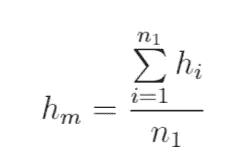

Eq 1: Estimate of mean height of males

因此，这个估计值的方差(如果我们对 n_1 个雄性样本进行多次采样，估计值 h_m 会变化多少)变为:

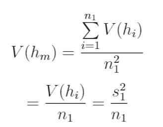

Eq 2: Variance in estimate of average height of males given we sample n_1 of them.

在等式(2)中，V(h_i)的最佳估计，即单个样本的方差是 S1，即根据我们的样本计算的方差。你可以看到，随着我们收集的样本越来越多，这个估计量的方差越来越小。

类似地，如果抽样 n_2 名女性，女性身高方差的估计为:s_2 /n2。

如果我们选择均值差异作为我们的检验统计量，它可以表示为:

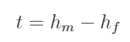

并且该统计中的方差变成(因为来自两组的样本之间没有相关性):

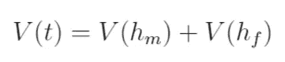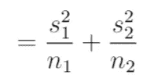

Eq 3: Variance of test statistic

要使它变小，n_1 和 n_2 都必须变大。这里，我们举了手段不同的例子。然而，一般结论也适用于我们可能构建的其他检验统计量(如均值比)。

# 给我看看照片

好吧，我答应给你照片，但你到目前为止只看到文字和符号。让我们想象一下假设检验是什么样子的。下面的图 0 显示了 t 的[概率密度函数](https://en.wikipedia.org/wiki/Probability_density_function)(均值差异的检验统计量)。

假设我们选择了一个假阳性率(FPR)，α为 15%(我们不希望有超过 15%的几率在没有差异的情况下错误地得出有差异的结论)。

粉色垂直线是右边区域变为 15%的点。所以这成为我们拒绝零的门槛。如果观察到的统计值大于粉红线，我们拒绝零(推断高度之间存在显著差异)，如果小于粉红线，我们不拒绝它(数据无法推断高度存在显著差异)。

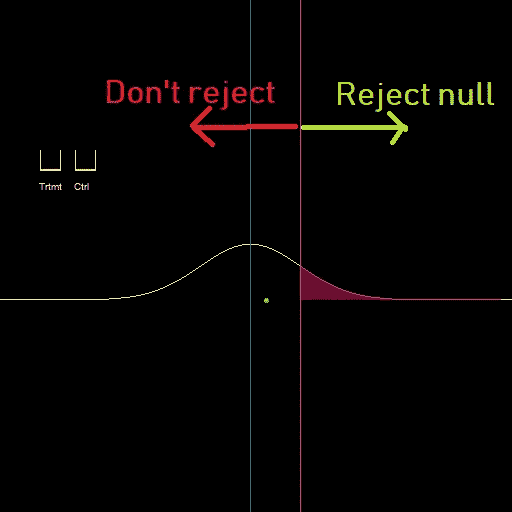

Fig 0: Distribution of the difference of means. The pink area is 15%, so the pink vertical line is our current threshold. If the difference we observe from the data is greater than it, we reject the null.

注意，对于我们拒绝零假设的标准，我们不是基于检验统计量本身，而是基于从零假设下的分布计算的概率来构造阈值。为什么要用这种复杂的方式呢？因为在给定足够的数据的情况下，它确保我们的测试能够捕捉到两组指标之间的最小差异，因为统计估计的方差将变为零。

假设男性的身高总是比女性高 5 厘米。上面图 1 中的绿点代表了这 5 厘米的差异。然而，由于它位于粉红色阈值的左侧，我们无法识别它，并得出结论，没有发现差异。

让我们看看当我们开始增加其中一组的数据量时会发生什么(假设是雄性——在图中这些组被标记为治疗组和对照组；假设治疗是指雄性，控制是指雌性)。根据等式(3)，测试统计的方差开始下降。结果，粉红色的线(右边的区域是 15%)开始向左朝着绿点移动。同样根据图 1，我们可以看到，在另一组的贡献开始占主导地位之前，增加男性组的样本量只能减少这么多的方差。所以，粉色的线不能到达绿色的点。

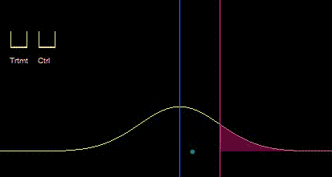

Fig 1: As we increase the sample size of the one of the groups, the variance of the test statistic under the null reduces. This causes the point at which the FPR is 15% to shift to the left. Eventually however, the variance stops reducing since the second group becomes the blocker. Created using: [https://github.com/ryu577/pyray](https://github.com/ryu577/pyray)

然而，当我们增加第二组(女性)的样本量时，方差再次开始显著减小，并且我们的阈值粉色线再次向左移动，直到它最终到达绿点。有了这么多数据，我们就能捕捉到平均高度的差异，小到蓝线上的绿点。这个故事的寓意是，给定足够的数据(在两个组中)，即使是最小的效应大小也可以被捕捉到。

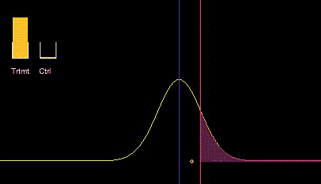

Fig 2: Beyond a point, increasing the sample size for the first group started giving us diminishing returns. So, we had to start increasing the sample size of the other group to get a further reduction in the variance of the distribution of the test statistic under the null hypothesis.

现在，我们刚刚表明，如果我们对假阳性率有 15%的容差，我们会得到上面图 1 和图 2 中的粉红色线。但这是我们设定的。如果假阳性率是我们唯一关心的，为什么不把它设置得尽可能低(0)？这将涉及到将粉红色线移动到无穷大，我们永远不会拒绝零。不会有假阳性，因为根本不会有阳性。这个测试的明显缺点是当另一个假设事实上是真的时(这里*是*高度之间的差异)。现在，因为我们从不拒绝零，我们会错误地总是拒绝它，即使存在差异。这将使我们的假阴性率(即使有显著差异，概率测试也返回阴性)达到 100%。在统计学术语中，假阳性率被称为第一类错误，用α表示，而假阴性率被称为第二类错误，用β表示。现在，α来自零假设，其中我们知道检验统计量的平均值(对于我们一直在进行的等均值检验，均值差的平均值为零)。为了得到β，我们假设交替假设为真(确实存在高度差异)。所以，我们需要得到它下面的统计分布。这个备择假设的方差和其他方面应该与零假设相同。但是，我们应该把意思定为什么呢？对于空值，它是零(对于均值差异检验统计量)。另一种方法是，我们挥挥手，从帽子里抽出一个数字。这就是我们希望测试关注的“效果大小”。基本上，我们假设平均值的差异正好是 5 cm(比方说),然后看看我们的测试在捕捉这种差异方面有多好(拒绝零)。

在下图 3 所示的两个图表中，黄色曲线是零假设，紫色曲线是替代假设。它们峰值的差距就是效应大小。图 3 清楚地显示了α(用黄色区域表示)和β(用紫色区域表示)之间的权衡。当我们减小α时，我们将粉色阈值向右移动。但这会导致紫色区域β增加。还要注意，当α=0 时，我们总是预测为负。因此，当交替假设为真时，假阴性率变为β=1。类似地，当α=1 时，β=0。因为它们之间有明显的权衡，我们会得到一个连接这两个极端的递减函数。这种α-β权衡图如下图 3 左下方所示。当粉色阈值来回移动时，我们沿着递减函数移动。

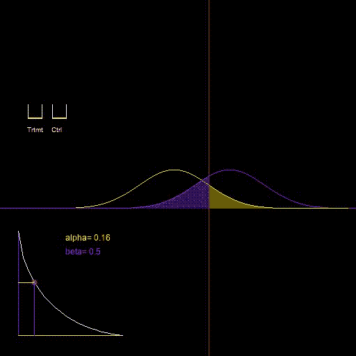

Fig 3: Tradeoff between FPR and FNR. Image created using [https://github.com/ryu577/pyray](https://github.com/ryu577/pyray)

# 最糟糕的测试

现在我们知道，假阳性率α由我们来设定，但它与假阴性率β之间存在权衡。对于给定的样本量(在两组中)，任何基于我们构建的统计数据的测试都将具有如图 3 左下方所示的α-β曲线。我们希望α和β都低，所以如果一个给定的假设检验的曲线保持在另一个的曲线之下，我们会更喜欢它。在统计学术语中，更可取的检验被称为“更有效的检验”，因为 1-β被称为检验的功效。既然我们有了一种称测试为“更有效”的方法，那么对于“最有效”测试的自然探索就产生了，给定我们感兴趣的度量以及该度量在治疗组和对照组中的分布。这是一个[一致最有效测试](https://en.wikipedia.org/wiki/Uniformly_most_powerful_test)的概念，在统计学中有相当多的努力来寻找这些测试。然而，我们将在这一节中反其道而行之，寻找最坏的可能，最没有力量的测试。因为如果我们知道最糟糕的交易是什么，我们就永远不会以最糟糕的方式受骗。

假设汤姆的任务是确定男性和女性的身高在统计学上是否有显著差异。他没有出去从一些男性和女性那里收集一些数据，而是呆在家里简单地扔硬币。硬币正面朝上的概率为α。如果他确实得到了“正面”，他只是简单地得出结论:零假设是正确的，平均身高没有差异(用统计学的行话来说，他“未能拒绝零”)。如果他得到了反面(概率 1-α)，他得出结论，另一个假设是正确的。假设零假设为真，他将有错误拒绝它的概率α(根据定义)。而如果备选项为真，他将有*而不是*拒绝空的概率β=1-α。所以在这种情况下，α和β的关系就是β=1-α。这显示在下面图 4 的红线中。对于一个更合理的测试，它实际上收集了一些样本数据并构建了一个合理的测试统计量(如差异或均值比)，对应的关系可能看起来像下面的白色曲线。

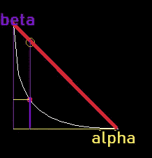

Fig 4: The α-β curve for the worst possible hypothesis test is given by the red line, β=1-α. A more reasonable hypothesis test where we actually look at some data might be given by the white curve. You can see for a given α, the β we get for the red line is much higher (worse).

# 样本量

假设检验中的另一个重要问题涉及到我们的实验需要多少样本量。要回答这个问题，我们需要目标假阳性率(α)、假阴性率(β)和我们感兴趣的效应大小。假设我们想要 16%的假阳性率和 10%的假阴性率。这在下面图 5 左下方的图中用绿点表示。您可以看到，最初，α-β曲线没有触及绿点(对于目标α，β比我们期望的要高得多)。然而，随着我们开始增加对照组和治疗组的样本量，整个曲线开始向下移动，直到最终绿点位于其上(注意，黄色区域α保持不变，但紫色区域β显著减少)。这是因为粉色线向左移动，紫色曲线变细。这基本上是我们如何预先知道，在给定假阳性和假阴性率的情况下，我们需要两组样本的大小，以及我们希望获得的效应大小。

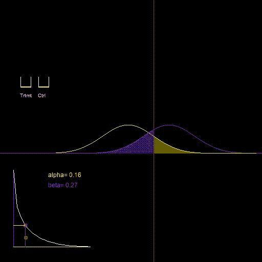

Fig 5: Increasing sample size allows us to get any FNR for a given FPR. Image created using [https://github.com/ryu577/pyray](https://github.com/ryu577/pyray)

这涵盖了假设检验的大部分重要方面。让我知道你的想法，我错过了什么，如果有任何其他方面的假设检验有利于这样的可视化。