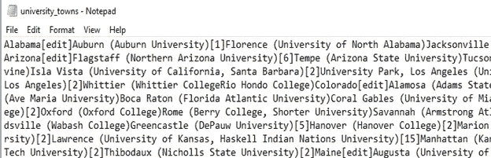

# 假设检验:大学城的房价受经济衰退的影响小吗？

> 原文：<https://towardsdatascience.com/hypothesis-testing-were-housing-prices-of-university-towns-less-affected-by-the-recession-3e582d2dde4a?source=collection_archive---------16----------------------->

衰退是经济活动普遍下降时的商业周期收缩。经济衰退发生在支出普遍下降的时候，这可能是由于各种事件，如金融危机、外部贸易冲击或经济泡沫破裂。在衰退期间，我们发现国内生产总值、收入、就业、销售和工业生产稳步下降。衰退于 2007 年 12 月袭击了美国，持续了大约 18 个月(2009 年 6 月)

在这篇博文中，让我们看看大学城(例如，锡拉丘兹是一个大学城，因为它的学生人口比传统的非学生人口多)的平均房价受经济衰退的影响是否比其他城镇小。

我们使用假设检验的方法来找出大学城的平均房价在经济衰退期间是否受影响较小。你可以在这里阅读更多关于假设检验的内容

问题:大学城的平均房价受经济衰退的影响比其他城镇小吗？

零假设:大学城的平均房价同样受到了经济衰退的影响。

**数据:**

1.从 Zillow.com 的 T4 传来了美国的房屋数据。特别是城市级别的所有房屋的数据文件，[该文件](https://github.com/harshdarji23/Hypothesis-Testing-Recession-Housing-Prices)具有细粒度级别的房屋销售价格中值。

2.维基百科上关于大学城的页面上有一个美国大学城的列表，它已经被复制并粘贴到文件 [university](https://github.com/harshdarji23/Hypothesis-Testing-Recession-Housing-Prices/blob/master/university_towns.txt) towns 中。

3.来自美国商务部经济分析局，在 [GDP](https://github.com/harshdarji23/Hypothesis-Testing-Recession-Housing-Prices/blob/master/gdplev.xls) 文件中，以现值美元表示的美国季度 GDP 超时值

**数据角力:**

数据分析中最被低估的任务是清理、操作数据，并准备好对数据应用机器学习算法。我们将使用 3 个不同的数据文件来测试我们的假设。我们开始吧！

**大学城:**



该文档是文本文件，其格式为州[编辑] —城镇名称—大学名称[编号] —城镇名称—大学名称[编号]。因此，第一个任务是获取一个包含州名和该州大学城的数据框。

```
**def** get_list_of_university_towns():

    **with** open('university_towns.txt') **as** file:
        data = []
        **for** line **in** file:
            data.append(line[:-1])         
    state_town = []
    **for** line **in** data:
        **if** line[-6:] == '[edit]':
            state = line[:-6]
        **elif** '(' **in** line:
            town = line[:line.index('(')-1]
            state_town.append([state,town])

        **else**:
            town = line
            state_town.append([state,town])
    state_college_df = pd.DataFrame(state_town,columns = ['State','TownName'])
    **return** state_college_dfget_list_of_university_towns()
```

给你。，我们创建了一个函数，该函数将返回一个包含州和相应大学城的数据框。我们去掉了[编辑]、数字、大学和括号。


Data Frame- Univerity Towns

**GDP**


我们可以看到，前 6 行是由标题，所以我们将摆脱它。我们不需要所有的数据，因为我们正在努力寻找 2009 年某个地方发生的经济衰退的影响。我们去掉了 1929 年至 1999 年的所有数据，我们的数据集现在应该有 2000 年至 2016 年的季度 GDP。即从行 212 开始的列 E 和列 F。我们采用季度 GDP，因为这将有助于我们从微观层面理解衰退的影响。

```
x = pd.ExcelFile('gdplev.xls')
gdp = x.parse(skiprows=7)
gdp = gdp[['Unnamed: 4', 'Unnamed: 5']]
gdp = gdp.loc[212:]
gdp.columns = ['Quarter','GDP']
gdp['GDP'] = pd.to_numeric(gdp['GDP'])
gdp
```


Data Frame — gdp

**Zillow 房产数据**


在这个数据集中，我们有很多列，我们感兴趣的是从 2000 年开始的州、城镇名称和年份。我们希望我们的年份采用年-季度的形式(2000 年第一季度、2000 年第二季度、2000 年第三季度……)，但是我们的数据采用年-月的形式(2000-01 年)。2000–02…)因此，我们编写一个函数来获取所需形式的数据。

```
*# Use this dictionary to map state names to two letter acronyms*
states = {'OH': 'Ohio', 'KY': 'Kentucky', 'AS': 'American Samoa', 'NV': 'Nevada', 'WY': 'Wyoming', 
          'NA': 'National', 'AL': 'Alabama', 'MD': 'Maryland', 'AK': 'Alaska', 'UT': 'Utah', 'OR': 'Oregon', 
          'MT': 'Montana', 'IL': 'Illinois', 'TN': 'Tennessee', 'DC': 'District of Columbia', 'VT': 'Vermont', 
          'ID': 'Idaho', 'AR': 'Arkansas', 'ME': 'Maine', 'WA': 'Washington', 'HI': 'Hawaii', 'WI': 'Wisconsin', 
          'MI': 'Michigan', 'IN': 'Indiana', 'NJ': 'New Jersey', 'AZ': 'Arizona', 'GU': 'Guam', 'MS': 'Mississippi', 
          'PR': 'Puerto Rico', 'NC': 'North Carolina', 'TX': 'Texas', 'SD': 'South Dakota', 'MP': 'Northern Mariana Islands', 
          'IA': 'Iowa', 'MO': 'Missouri', 'CT': 'Connecticut', 'WV': 'West Virginia', 'SC': 'South Carolina', 'LA': 'Louisiana',
          'KS': 'Kansas', 'NY': 'New York', 'NE': 'Nebraska', 'OK': 'Oklahoma','FL': 'Florida', 'CA': 'California', 
          'CO': 'Colorado', 'PA': 'Pennsylvania', 'DE': 'Delaware', 'NM': 'New Mexico', 'RI': 'Rhode Island', 
          'MN': 'Minnesota', 'VI': 'Virgin Islands', 'NH': 'New Hampshire', 'MA': 'Massachusetts', 'GA': 'Georgia', 
          'ND': 'North Dakota', 'VA': 'Virginia'}
```

```
**def** convert_housing_data_to_quarters():

    df = pd.read_csv('City_Zhvi_AllHomes.csv')
    df = df.drop(df.columns[[0] + list(range(3,51))], axis=1)
    df2 = pd.DataFrame(df[['State', 'RegionName']])
    df2.rename(columns={'RegionName':'TownName'},inplace=**True**)
    **for** year **in** range(2000, 2016):
        df2[str(year) + 'q1'] = df[[str(year) + '-01', str(year) + '-02', str(year) + '-03']].mean(axis = 1)
        df2[str(year) + 'q2'] = df[[str(year) + '-04', str(year) + '-05', str(year) + '-06']].mean(axis = 1)
        df2[str(year) + 'q3'] = df[[str(year) + '-07', str(year) + '-08', str(year) + '-09']].mean(axis = 1)
        df2[str(year) + 'q4'] = df[[str(year) + '-10', str(year) + '-11', str(year) + '-12']].mean(axis = 1)

    year = 2016
    df2[str(year) + 'q1'] = df[[str(year) + '-01', str(year) + '-02', str(year) + '-03']].mean(axis = 1)
    df2[str(year) + 'q2'] = df[[str(year) + '-04', str(year) + '-05', str(year) + '-06']].mean(axis = 1)
    df2[str(year) + 'q3'] = df[[str(year) + '-07', str(year) + '-08']].mean(axis = 1)

    df2['State'] = [states[state] **for** state **in** df2['State']]
    df2 = df2.set_index(['State', 'TownName'])
    ans = pd.DataFrame(df2)

    **return** ans

convert_housing_data_to_quarters()
```

为了将年-月转换为年-季度，我们创建了一个新列 Year-Quarter (2000q1，2000 Q2..)取第一季度前三个月(1 月-3 月)和第二季度前三个月(4 月-6 月)的房价平均值，我们对 2000 年到 2015 年的每一年都这样做。对于 2016 年，我们有截至 8 月的数据，即截至第三季度的数据。此外，我们注意到我们的州名有缩写(NY，IL..)但是我们想要一个全名，因为我们包含大学城的数据框有完整的州名。在字典(states)的帮助下，我们将缩写转化为全名。让我们看看我们的数据现在是什么样子。


Data Frame - Housing Prices

**提问:**

1.衰退的开始日期是什么时候？

在这里，我们用 GDP 数据来回答这个问题。例如，如果我们有数字 1，2，5，3，2，7，8，我们可以看到 5>3 和 3>2，所以我们的衰退开始日期将在数字 5。使用同样的逻辑，我们得到一个衰退的开始日期。

```
**def** get_recession_start():

    x = pd.ExcelFile('gdplev.xls')
    gdp = x.parse(skiprows=7)*#skiprows=17,skip_footer=(38))*
    gdp = gdp[['Unnamed: 4', 'Unnamed: 5']]
    gdp = gdp.loc[212:]
    gdp.columns = ['Quarter','GDP']
    gdp['GDP'] = pd.to_numeric(gdp['GDP'])
    quarters = []
    **for** i **in** range(len(gdp) - 2):
        **if** (gdp.iloc[i][1] > gdp.iloc[i+1][1]) & (gdp.iloc[i+1][1] > gdp.iloc[i+2][1]):
            quarters.append(gdp.iloc[i][0])
    **return** quarters[0]

get_recession_start()
```

我们的开始日期是 2008 年第三季度。

2.经济衰退何时触底？

这里的衰退底部是指 GDP 最低的点。

```
**def** get_recession_bottom():
    *'''Returns the year and quarter of the recession end time as a* 
 *string value in a format such as 2005q3'''*
    df = pd.read_excel('gdplev.xls', skiprows = 7)
    df = df[['Unnamed: 4','Unnamed: 6']]
    df.columns = ['Quarter','GDP']
    df = df.iloc[212:]
    df = df.reset_index()
    df = df[['Quarter','GDP']]

    recession_end = []
    **for** i **in** range(len(df) - 4):
        **if** ((df.iloc[i][1] > df.iloc[i+1][1]) & (df.iloc[i+1][1] > df.iloc[i+2][1]) & (df.iloc[i+2][1] < df.iloc[i+3][1]) & (df.iloc[i+3][1] < df.iloc[i+4][1])):
            recession_end.append([df.iloc[i][0],df.iloc[i+1][0],df.iloc[i+2][0],df.iloc[i+3][0],df.iloc[i+4][0]])

    ans = recession_end[0][2]

    **return** ans

get_recession_bottom()
```

2009 年 Q2 出现了经济衰退的谷底

**数据可视化:**

如果我们以年季度为轴，GDP 为 y 轴绘制时间序列图，我们应该可以更准确地理解上面回答的问题。

```
gdp1=gdp.loc[245:252]
plt.figure(figsize=(12,7))
ax = sns.lineplot(x="Quarter", y="GDP", data=gdp1)
```


Start-2008q3, bottom-2009q2, end-2009q4

为了方便使用，让我们将函数返回的所有值放入一个变量中。

```
nitowns = get_list_of_university_towns()
bottom = get_recession_bottom()
start = get_recession_start()
hdata = convert_housing_data_to_quarters()
bstart = hdata.columns[hdata.columns.get_loc(start) - 1]
```

现在，如果我们想知道大学城的房价是否受影响较小，我们就取一个比率，(衰退开始时的 Gdp-衰退底部的 Gdp)/衰退开始时的 Gdp。该比率是从衰退开始日期到衰退底部房价的下降。

```
hdata['ratio'] =  (hdata[bstart] - hdata[bottom])/ hdata[bstart]
hdata['ratio']
```


下一步是合并数据框。我们创建一个包含州、城镇名称、衰退底部、衰退开始和比率的新数据框架 hdata，并将该数据框架与大学城数据框架合并。

```
hdata = hdata[[bottom, bstart, 'ratio']]
hdata = hdata.reset_index()
unitowns_hdata = pd.merge(hdata,unitowns,how='inner',on=['State','TownName'])
unitowns_hdata.head()
```

现在，让我们看看我们的数据框是什么样子的:


我们需要在数据框中将大学城与其他城镇分开。因此，我们创建一个列“uni ”,如果是大学城，则用 True 填充，否则用 False 填充，然后创建一个数据框 ut，其中包含所有大学城的 True 值和非大学城的 nut 值。

```
unitowns_hdata['uni'] = **True**
hdata2 = pd.merge(hdata, unitowns_hdata, how='outer', on=['State','TownName',bottom, bstart, 'ratio'])
hdata2['uni'] = hdata2['uni'].fillna(**False**)
ut = hdata2[hdata2['uni'] == **True**]
nut = hdata2[hdata2['uni'] == **False**]
```


**T 检验:**

t 检验用于确定大学城的平均房价与非大学城相比是否具有统计学意义。

我们对 ut 和 n ut 数据框架进行 T 检验，检查大学城的房价是否受经济衰退影响较小。我们采用 99%的置信区间来检验我们的假设。

```
**def** hypo():
    **from** **scipy.stats** **import** ttest_ind
    t,p = ttest_ind(ut['ratio'].dropna(), nut['ratio'].dropna())
    different = **True** **if** p<0.01 **else** **False**
    better = "university town" **if** ut['ratio'].mean() < nut['ratio'].mean() **else** "non-university town"
    **return** (p,different,better)
hypo()
```

**输出:**


**p, different, better**

**结论:**

> 在 99%的置信区间，我们拒绝假设大学城的平均房价同样受到(而不是更少)经济衰退的影响，因为 p 值(0.00336292287685515)小于 0.01。我们可以得出结论，美国大学城的平均房价受经济衰退的影响较小

