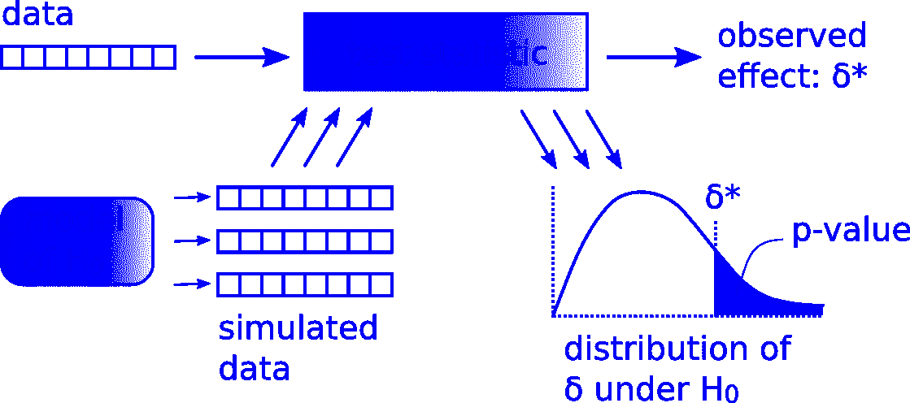

# 用 Numpy 进行假设检验

> 原文：<https://towardsdatascience.com/hypothesis-testing-with-numpy-271c185e8cf0?source=collection_archive---------20----------------------->



各位数据科学爱好者，我们都做假设检验来从一个更大的流行样本数据中推断结果。这个测试帮助我们发现我们的零假设是对还是错。

首先，让我们明白当我们做假设检验时。当我们既不能从图形化 EDA 中得出结论，也不能通过比较汇总统计数据得出结论时，我们就这样做。在这种情况下，我们从现有的数据集模拟一个假设。做到这一点的一个方法是**置换我们拥有的数据集**。在继续之前，让我们看看如何做置换

```
def permutation_sample(data1, data2):
   #Generate a permutation sample from two data sets.
   # Concatenate the data sets: data
   data = np.concatenate((data1, data2)) # Permute the concatenated array: permuted_data
   permuted_data = np.random.permutation(data) # Split the permuted array into two: perm_sample_1, perm_sample_2
   perm_sample_1 = permuted_data[:len(data1)]
   perm_sample_2 = permuted_data[len(data1):] return perm_sample_1, perm_sample_2
```

您可以在“for 循环”中使用该函数来产生许多您需要的样本集。注意，这里我写了这个函数，从两个数据集推断样本。根据需要调整函数。

现在，既然我们知道如何使用排列来模拟假设，让我们来测试它。记住，假设假设是真的，测试假设是对观察到的数据的合理程度的评估。理解我们正在评估的数据是什么以及我们如何量化它是很重要的。这个问题的答案是**测试统计。**

*检验统计量是一个单一的数字，可以从观察到的数据和我们从零假设*模拟的数据中计算出来。这将有助于我们比较假设预测的结果和我们从数据中实际观察到的结果。我们可以选择能够帮助我们回答我们试图用假设来解决的问题的检验统计量。如果假设为真，样本的检验统计量和原始数据的检验统计量将是相同的，或者它们之间的差异太小。现在让我们看看如何使用 python 来计算这个测试统计复制。

```
def draw_perm_reps(data_1, data_2, func, size=1):
    """Generate multiple permutation replicates.""" # Initialize array of replicates: perm_replicates
    perm_replicates = np.empty(size) for i in range(size):
        # Generate permutation sample
        perm_sample_1, perm_sample_2 = permutation_sample(data_1, data_2) # Compute the test statistic
        perm_replicates[i] = func(perm_sample_1, perm_sample_2) return perm_replicates
```

在上面的函数中，您可以调整要传递的数据集的数量。在 for 循环中，对于每次迭代，它将使用我们之前编写的函数计算置换样本，然后计算测试统计量。您可以传递任何函数(如 np.mean()、np.var()或您自己的函数)来计算您的测试统计数据。

然后我们将这些值绘制成柱状图。然后，我们在直方图上标记来自原始数据的测试统计值。如果我们对原始数据的测试统计量的面积进行合计，就会得到 **p 值**。这可以用 python 实现，


P-Value, Red line represents the original data’s test statistics.

```
# Compute p-value: p
p = np.sum(perm_replicates >= test_statistic_of_original_data)/   len(perm_replicates)
```

例如，如果我们得到 p 值 0.05，我们可以说我们有 95%的信心我们的假设是正确的。即(100-(0.05×100))。

p 值是在零假设的假设下，获得测试统计值的概率，该值至少与观察到的值一样极端。注意，p 值不是假设为真的概率。

综上，让我们写下假设检验的**流水线。**

1.  显然，陈述零假设
2.  定义您的测试统计
3.  假设零假设为真，生成多组模拟数据
4.  计算每个模拟数据的测试统计
5.  p 值是测试统计至少与真实数据一样极端的集合的分数

在这里，我分享了一些关于如何进行假设检验的解释和 python 片段。希望对你有帮助。让我知道你的反馈。