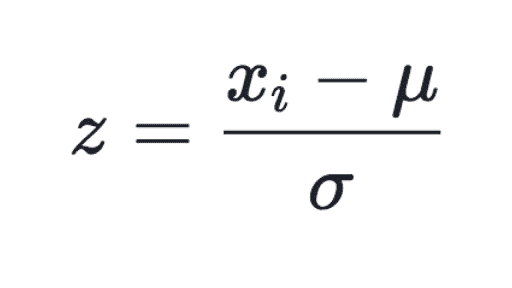
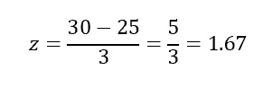
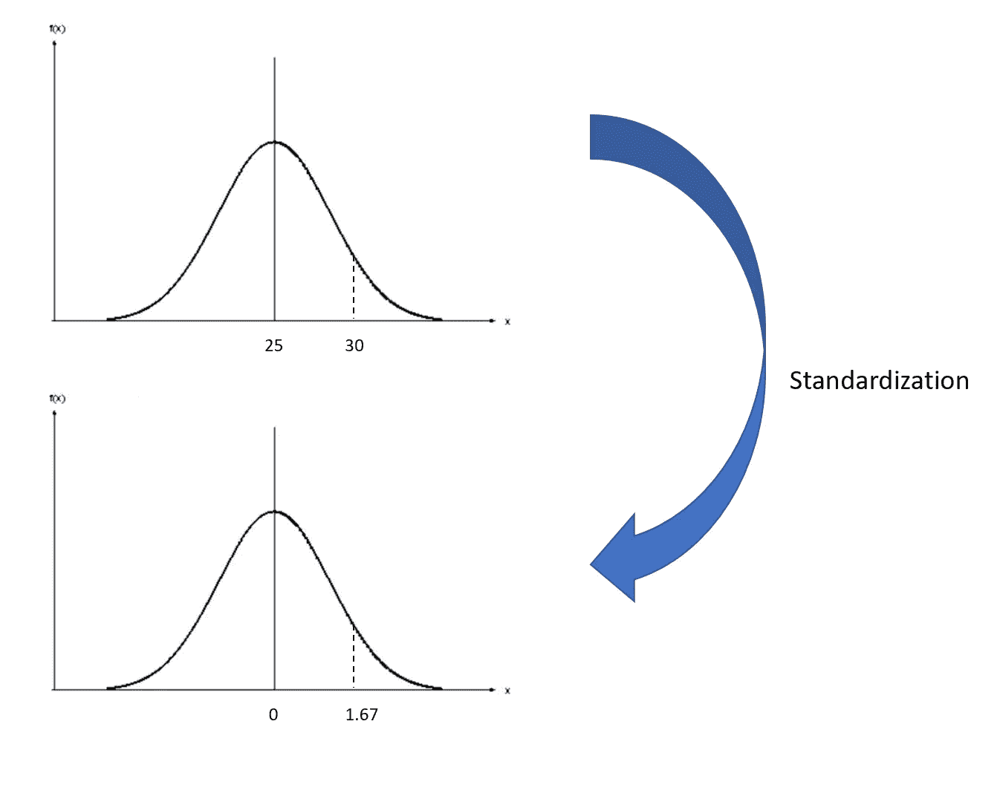
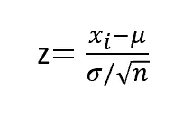
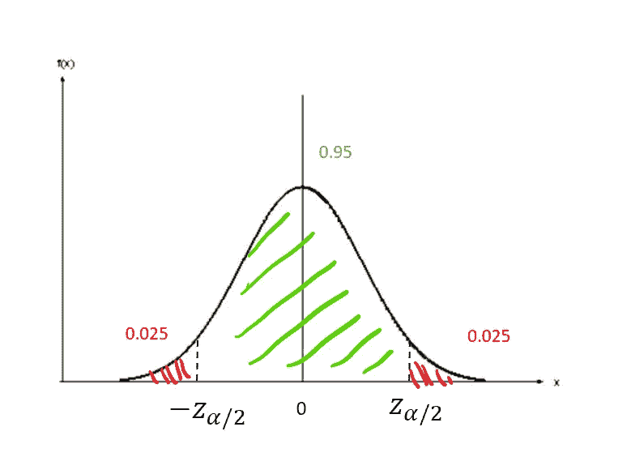
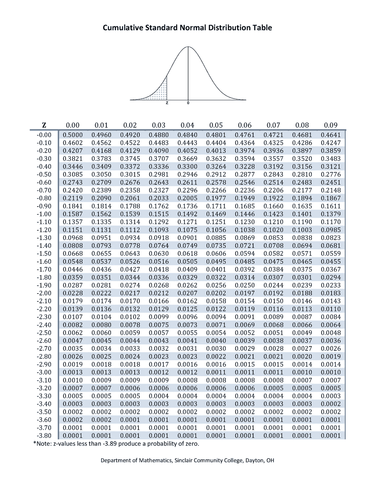
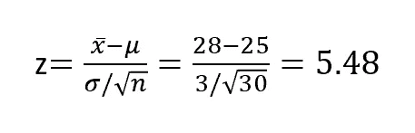
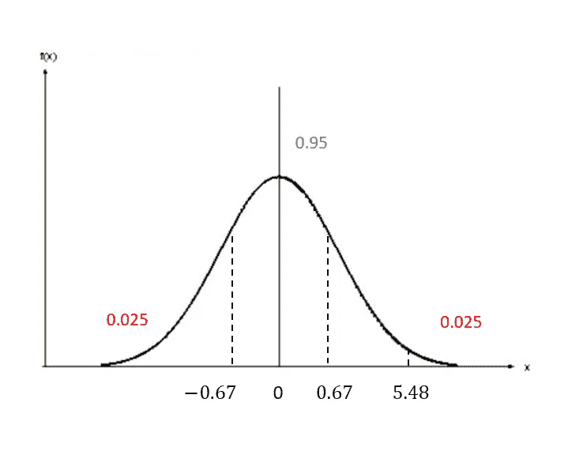
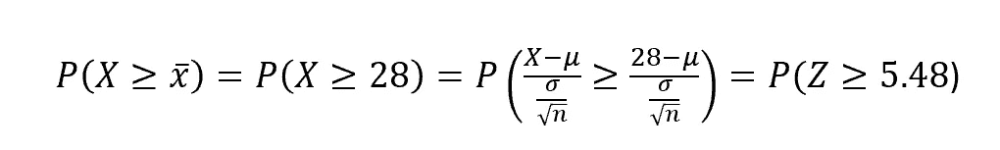
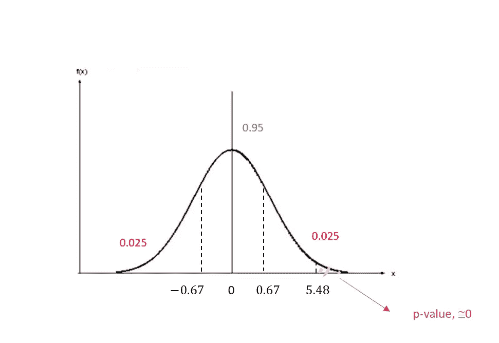

# 假设检验和 p 值:一个温和的介绍

> 原文：<https://towardsdatascience.com/hypothesis-tests-and-p-value-a-gentle-introduction-4b52322bfc50?source=collection_archive---------10----------------------->

每当统计学家被要求对一些无法观察到的人口参数作出推断时，他们需要从人口中有代表性的样本开始。然而，一旦获得了该参数的估计值(称为统计量)，他们如何能够说明它是否对应于真实的参数，因为后者是未知的？

因为不可能比较两个结果(同样，一个是不可观察的)，所以有必要做出一些假设并进行所谓的假设检验。

这些测试旨在评估估计值与真实参数相等的可能性。这个想法是，它总是存在一种可以被认为是默认的情况:这是一种保守的情况，如果你对自己的假设没有足够的把握，你最好保持这种情况。这种情况将是我们的零假设，或 H0。另一方面，还有另一种情况，如果被接受，将会改变现状。这是另一种假设，或 H1。

这些假设有一个有意义的解释，而做出错误决定的惩罚是不均衡的。事实上，如果你因为你的发现而决定拒绝零，而事实证明这是真的，你就陷入了你可能面临的最糟糕的情况:事实上，你拒绝了保守状态，也就是说，你的“舒适区”。另一方面，当选择为真时，不拒绝空值也没那么糟糕。为了更简单，让我们考虑下面的例子。

假设你是一名医生，你必须决定是否让一名病人住院。你非常谨慎，如果有疑问，你通常更愿意让你的病人住院至少一个晚上，但是这对你的组织来说是非常昂贵的。因此你决定设定这两个假设:

*   H0:*‘病人需要住院’*
*   H1:*‘病人不需要住院’*

想象一下，病人实际上需要住院治疗，但你确信情况正好相反:你将把一个病情严重的人送回家，这可能会带来可怕的后果。另一方面，如果你决定让病人留院观察一晚，但事实证明他完全正常，你肯定会损失一些钱，但这种情况并不像让某人因疏忽而死亡那么糟糕。

话虽如此，我们如何具体地进行假设检验呢？要做到这一点，了解数据的分布是至关重要的。这里，我们将使用标准正态分布，它具有众所周知的钟形，平均值=0，标准差=1。

要标准化一个样本的正态分布，步骤如下:

z 值称为 z 得分，它表示位于总体平均值和数据点值之间的标准偏差数。

也就是说，假设你在考试中得了 30 分，平均分是 25，标准差是 3。您的 z 分数将等于:

这意味着你的分数比平均值高 1.67 个标准差*。让我们想象一下:*

请注意，当您有多个样本并且想要描述这些样本平均值的标准偏差时，您可以使用以下 z 得分公式:

其中 n =样本大小。

很好，但是这和假设检验有什么关系呢？这个想法是，你需要 z-score 来计算你的假设的概率，从而决定，在给定的置信水平下，是否拒绝零。让我们看看下面的例子。

想象一下，上面例子中测试的总体平均值是 25。然而，在选择了 30 名学生的样本后，发现他们的平均分数更高，比如说 28 分。可能出现的问题是，这一证据是否足够有力地表明人口的平均值高于 25。你的假设是:

*   H0:“平均数等于 25”
*   H1:“平均值大于 25”

然后，你必须设置所谓的显著性水平，这是你愿意拒绝零假设的误差幅度。因此，用α表示的显著性水平是当零假设为真时做出错误决策的概率。它通常采用 1%、5%和 10%这样的值，当假设为真时，它对应于拒绝零假设的区域。

即，α=5%，由于分布是对称的，我们将有两个 z 得分的临界值，表示为 Zα/2 和-Zα/2，它们是接受区域(绿色区域)的边界，而红色区域表示拒绝区域:

知道概率分布的重要性来了。事实上，由于我们已知的标准正态分布，我们可以使用包含与每个 z 分数相关的概率的表格。

也就是说，如果我们想在α=5%的情况下解决上述问题，我们必须找到那些决定 95%接受区域的临界 z 分数。因此，他们将在尾部为每一边留下 2.5%的概率，我们可以很容易地在表上看到这些值分别是-1.96 和 1.96。

现在，我们可以计算问题的 z 值:

由于 z 值超出了接受范围，我们可以拒绝总体均值等于 25 的零假设:我们有足够的证据(显著性为 5%)来拒绝该假设。

这个问题也可以用不同的方法来解决。假设您想要计算实际样本均值(或其更极端的值)出现的概率，而不是您的 z 得分。换句话说，*事前*获得样本均值等于或大于 28 的可能性有多大？

因为 z 分数大于 3.89(或小于-3.89)产生的概率为 0，所以我们的结果将为零(大约)。这意味着获得样本均值的可能性非常低(几乎不可能),以至于出现的事实表明人口的真实分布均值不等于 25。该概率的值称为 p 值。

一般来说，如果 p 值小于显著性水平，我们可以拒绝零假设。

假设检验是可以在各种情况下运行的强大工具。在本文中，我们看到了参数假设检验的例子，但是它们也可以指概率分布、数据间缺乏相关性、区间估计等。