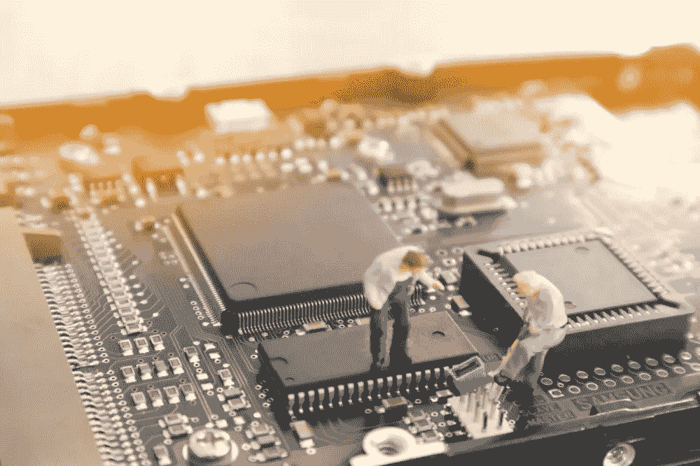
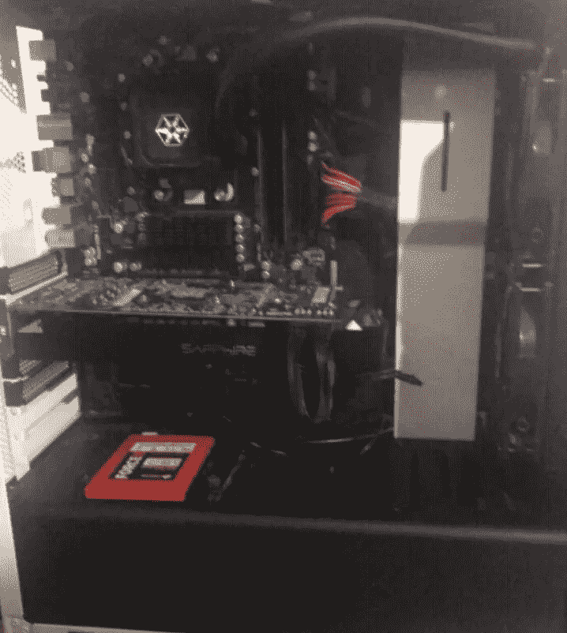
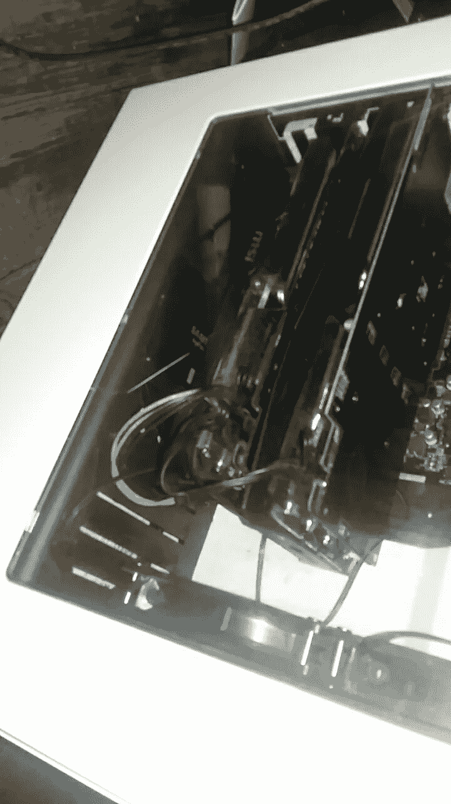

# 我买了一台新电脑只是为了试用 CUDA，值得吗？

> 原文：<https://towardsdatascience.com/i-bought-a-new-computer-just-to-try-out-cuda-was-it-worth-it-958216e755b1?source=collection_archive---------19----------------------->



我一直对统计计算中图形处理的潜力很感兴趣。我最近一直在使用许多 OpenCL 包，而不是基于 CPU 的股票包，因为我的显卡是由 AMD 制造的，openCL 是他们对希望利用 GPU 的数学能力而不仅仅是图形的程序员做出的唯一足够的贡献。

当然，我最感兴趣的是 CUDA，这是一个 Nvidia 专有的并行计算平台。然而，我拥有的最后一个 Nvidia GPU 是 8800GT，我周围所有的卡都是 team red 的，大多数都是旧卡(我是一个硬件迷。)

因此，在过去的几周里，我不是在搜索，而是在 Letgo、脸书和 Craigslist 上查看了几次我感兴趣的硬件，只有一个要求:

> 它需要一个 Nvidia 显卡。

在我搜索的最后一刻，我偶然发现了一个令人震惊的发现。



这台电脑在 Letgo 上的售价只有区区 140 美元，但还是有一些问题。显然，我想知道处理器，但我可以告诉插座是 AM3+,这是一个好消息，无论处理器是什么，都值得用安装在机箱前面的 240 毫米大散热器来冷却。

此外，显卡是蓝宝石和蓝色 PCB，蓝色 PCB 很重要，因为蓝宝石不再使用它们，至少据我所知，它们通常与镭龙 HD 系列相关。显然，镭龙高清是没有骰子的 CUDA，是你能从 Nvidia 卡最远。

然而，不管怎样，这笔交易肯定是诱人的，因为这是一个 140 美元的相当不错的系统！我交叉手指，希望主板会配备 AMD FX 八核处理器或类似的东西(piledriver，而不是推土机。)结果是 AMD FX 830e 八核处理器的主频达到了 3.5 GHz。

但还是；显卡。我给卖电脑的人发信息问了几个问题，让他启动 bios 帮我检查一些规格。该系统添加了高达 8gb 的双通道内存、750w 模块化电源、240mm 散热器/AIO、128 GB SSD(不确定读写速度)、一些 Aura 主板和这张 Saphire 卡。

但为了让交易更甜蜜，他透露，除了他卖给我的规格，另加 20 美元，他会卖给我一个 GTX 1060 ROG strix 图形卡！

把它带回家后，我把它组装在一起，换了一个装有操作系统的固态硬盘(砰！Os)，引导到 EFI 和一切工作完美。我添加了一些升级，一个 570 Evo SSD，8g 额外的内存和一个 R9 290 来驱动任何额外的显示器，结果看起来有点像这样:



> 太美了。

现在我们有了硬件，我们需要为软件做同样的事情！

# 让 CUDA 工作起来

CUDA 的设置实际上是相当广泛的，因为它不像设置你的驱动那么简单。首先，您必须进入您的终端并安装依赖项:

```
sudo apt-get install freeglut3 freeglut3-dev libxi-dev libxmu-dev
```

然后你必须去[“Cuda 专区”](https://developer.nvidia.com/cuda-zone)给自己找一些二进制文件…或者如果你在 Debian 上，你可以得到回购:

```
wget http://developer.download.nvidia.com/compute/cuda/10.1/Prod/local_installers/cuda_10.1.243_418.87.00_linux.run
```

然后我们从 repo 中运行 sh 文件(作为 root 用户):

```
sudo sh ./cuda_10.1.243_418.87.00_linux.run
```

还有一种方法可以在 DPKG 上安装 CUDA 环境，但我选择了 SH 版本，因为这通常是我对 Nvidia 等可靠来源的首选途径。当你通过 SH 安装时，你会被问一些问题，我添加了#注释来解释我的回答，这样你就可以决定你是否认为说是合适的。

```
You are attempting to install on an unsupported configuration. Do you wish to continue?
(y)es/(n)o [ default is no ]: y# Obviously, we have to do this to proceed with the CUDA installation. Install NVIDIA Accelerated Graphics Driver for Linux-x86_64 396.26?
(y)es/(n)o/(q)uit: n# I said no to this, as I use the POP! OS Nvida DriverInstall the CUDA 9.2 Toolkit?
(y)es/(n)o/(q)uit: y# Of course, the whole reason we're here is for the toolkitEnter Toolkit Location
 [ default is /usr/local/cuda-9.2 ]:# That location suited me fine.Do you want to install a symbolic link at /usr/local/cuda?
(y)es/(n)o/(q)uit: y# There's no reason not to, so it's global and usable with everything.Install the CUDA 9.2 Samples?
(y)es/(n)o/(q)uit: y# I figured why not so I can see the usage in Python, and C as I do a lot of writing there, as well.Enter CUDA Samples Location
 [ default is /home/kinghorn ]: /usr/local/cuda-9.2
```

安装 cuBLAS 修补程序:

```
sudo sh cuda_9.2.88.1_linux.run
```

最后但同样重要的是，我们必须将回显路径添加到我们的系统中，我们首先在以下位置创建一个 sh 文件:

`/etc/profile.d/cuda.sh`

并将以下内容放入其中:

```
export PATH=$PATH:/usr/local/cuda/bin
export CUDADIR=/usr/local/cuda
```

另一个 sh 文件位于:

```
/etc/ld.so.conf.d/cuda.conf
```

包含:

```
/usr/local/cuda/lib64
```

当然，我们必须以超级用户的身份编辑它们。然后我们终于可以跑了

```
sudo ldconfig
```

现在我们有了 CUDA 设置！我越来越兴奋了！现在让我们进入 Julia 并设置我们的软件包！这应该很容易，但在这里我们将发现如果流行！驱动程序将会兼容。我们需要以下包:

```
CuArrays
CUDAnative
CUDAdrv
```

为了确保一切正常，我将推进这些路径，然后构建每个包:

```
ENV["LD_LIBRARY_PATH"] = "/usr/lib/cuda/lib64" 
ENV["CUDA_PATH"] = "/usr/lib/cuda" 
**using** Pkg; Pkg.build("CuArrays")
Pkg.build("CUDAnative")
Pkg.build("CUDAdrv")
```

现在只需启动 Jupyter 并进行测试！

```
ERROR: LoadError: Available CUDA toolchain does not provide libcudadevrt
```

小崽子，真不幸。看起来我们可能要安装 Nvidia 的驱动程序，我真的希望 POP 的驱动程序可能是驱动程序上的一个分叉工作，但似乎不是这样，或者如果是，它有点太修改了。

# 终于开始工作了

在 CUDA 控制面板中做了一些调整，并在我的部分做了一些 bashrc 编辑之后，我的 CUDA 驱动终于可以工作了。那么，在我的 CPU 上，Julia 和修改过的线性回归函数之间的时间比较如何呢？我着手做美国数据科学家最擅长的事情，进行了 20 次测试，得到了两个特征的平均值:

> CPU:

```
0.2208722 seconds
```

> CUDA:

```
0.052839374 seconds
```

> 哇！

有了这样的收获，我决定单独使用 OpenCL 进行第三次独立测试，结果令人震惊:

```
0.10083948593 seconds
```

# 结论

使用 CUDA 时，深度学习和简单预测建模的性能明显提高。将来，我也想使用一张有张量核的卡片，因为它的速度肯定是无可挑剔的。不管怎样，我对这一切的结果很满意！那么为了使用 CUDA 而购买一台全新的机器值得吗？

> 不值得。