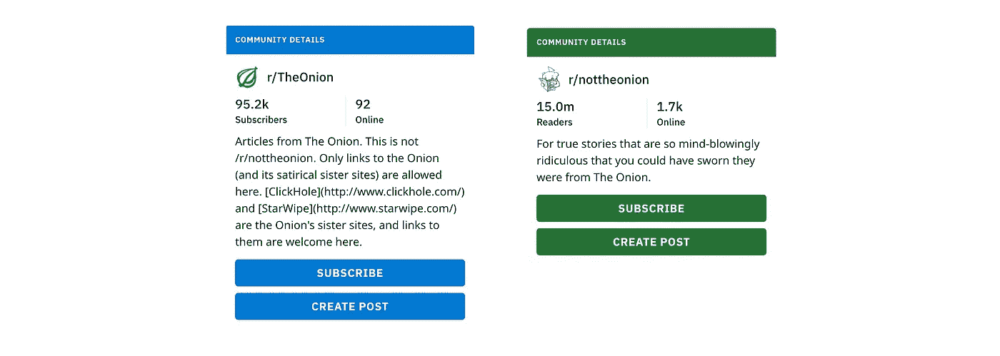
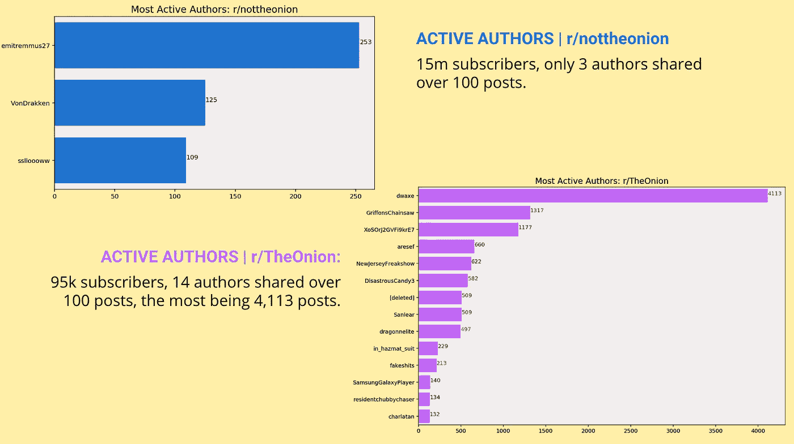
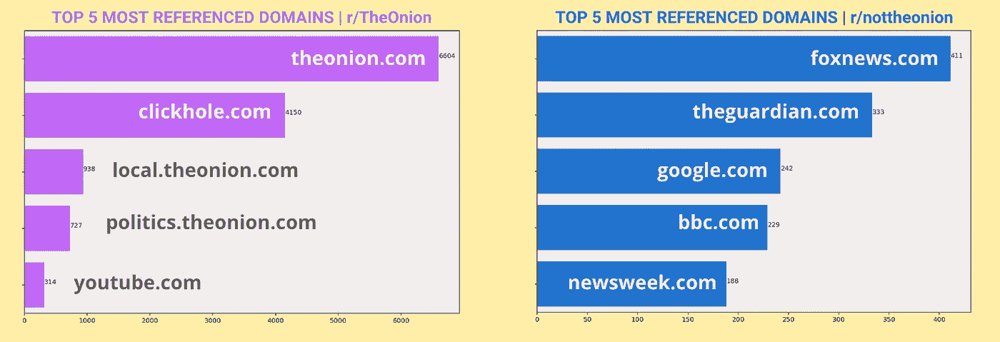
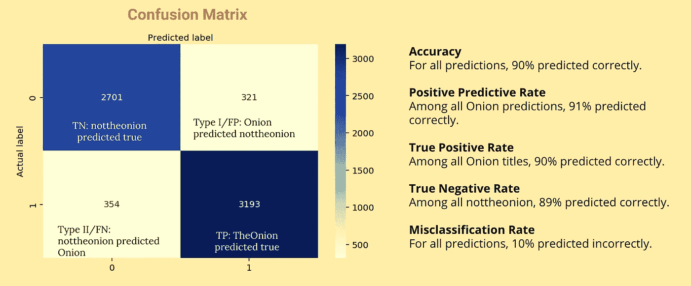
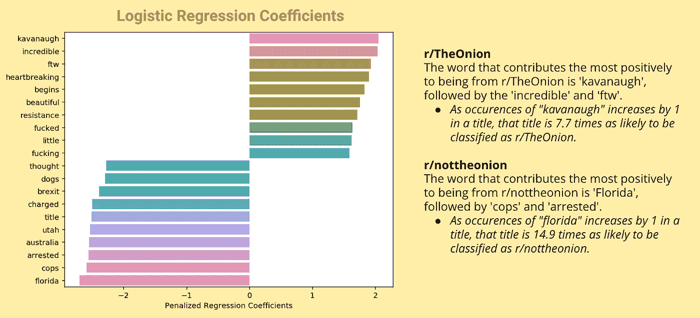

# 我使用自然语言处理和分类模型构建了一个假新闻检测器

> 原文：<https://towardsdatascience.com/i-built-a-fake-news-detector-using-natural-language-processing-and-classification-models-da180338860e?source=collection_archive---------3----------------------->


Credit: [Unsplash](https://unsplash.com/photos/XmMsdtiGSfo)

## 分析来自子编辑 r/TheOnion & r/nottheonion 的开源数据。

当 WhatsApp [宣布](https://www.theguardian.com/technology/2019/feb/06/whatsapp-deleting-two-million-accounts-per-month-to-stop-fake-news)每月删除 200 万个账户以防止假新闻传播时，我被激起了兴趣。在数百万被标记为删除的账户中，有多少被误归类为假新闻？WhatsApp 甚至是如何创造出删除数百万假新闻账号的自动化流程的？为了回答这些问题，我使用 Reddit 的开源数据构建了自己的假新闻检测器。以下是我是如何做到的，以及我一路走来学到的东西。

在 [Pushshift.io API 包装器](https://github.com/dmarx/psaw) *的帮助下，我从子编辑 [r/TheOnion](https://www.reddit.com/r/TheOnion/) 和 [r/nottheonion](https://www.google.com/search?q=nottheonion&rlz=1C5CHFA_enUS820US820&oq=nottheonion&aqs=chrome..69i57j69i60l2j69i61j0l2.1961j0j4&sourceid=chrome&ie=UTF-8) 中搜集了大约 3 万篇帖子。我选择了这些小标题，看看我能在多大程度上区分假新闻和荒谬新闻。r/TheOnion 上的帖子以来自 www.theonion.com 或其他类似恶搞网站的讽刺新闻为特色。r/nottheonion 上的帖子以可信新闻机构报道的荒谬时事为特色。



r/TheOnion has 95.2k subscribers while r/nottheonion has 15 million subscribers. Image credit: Reddit.

为了保持我的数据简洁明了，我选择将我的预测变量(`X`)设为文章的标题，将我的目标变量(`y`)设为 1 来表示 r/TheOnion，设为 0 来表示 r/nottheonion。为了清理数据，我创建了一个数据清理函数，删除数据帧中的重复行，删除所有文本中的标点和数字，删除多余的空格，并将所有文本转换为小写。

```
# Data cleaning function
def clean_data(dataframe):# Drop duplicate rows
    dataframe.drop_duplicates(subset='title', inplace=True)

    # Remove punctation
    dataframe['title'] = dataframe['title'].str.replace('[^\w\s]',' ')# Remove numbers 
    dataframe['title'] = dataframe['title'].str.replace('[^A-Za-z]',' ')# Make sure any double-spaces are single 
    dataframe['title'] = dataframe['title'].str.replace('  ',' ')
    dataframe['title'] = dataframe['title'].str.replace('  ',' ')# Transform all text to lowercase
    dataframe['title'] = dataframe['title'].str.lower()

    print("New shape:", dataframe.shape)
    return dataframe.head()
```

既然我的 Subreddit 数据集已经很好很干净了，我就可以进行探索性数据分析(EDA)了。即使我决定给我的预测变量(`X`)分配帖子标题，在我的数据搜集过程中，我也获得了帖子的其他特征，以揭示数据中隐藏的故事。总的来说，我从每篇文章中总结了以下特征:

*   `title`:子编辑帖子的标题
*   `subreddit`:这个帖子属于哪个子编辑
*   `num_comments`:一篇帖子的评论数
*   `author`:文章作者的用户名
*   `subreddit_subcribers`:该子编辑的用户数量
*   `score`:Reddit 上收到的分数
*   `domain`:帖子中引用的域名
*   `created_utc`:帖子创建的日期和时间

当我观察到一个作者分享的帖子数量时，一些奇怪的事情引起了我的注意。在拥有 1500 万订阅者的 r/n 联盟中，只有三位作者分享了超过 100 篇帖子，而拥有 95000 订阅者的 r/n 联盟有 14 位作者分享了超过 100 篇帖子，最多的是 4113 篇帖子。在做出这个观察之后，我确认了我做出了一个很好的决定，将 r/TheOnion 作为一个案例来了解 WhatsApp 的假新闻问题。在 WhatsApp 的“[帮助防止谣言和假新闻传播的提示](https://faq.whatsapp.com/en/android/26000216/?category=5245250)”中，七个提示中有三个侧重于防止假新闻传播。假新闻的最大问题之一不一定是它被写出来，而是它被传播。r/TheOnion 作者的活动模仿了假新闻现象的核心特征。



Most Active Authors in r/nottheonion & and r/TheOnion. Image credit: Jasmine Vasandani

> **数据科学中的第一个最大错误是将每个业务挑战都视为预测方法。记住 70%的低挂问题可以通过做 EDA 来解决。**
> 
> Sundar Ramamurthy

在对数据进行 EDA 的过程中，我发现了另一件有趣的事情，那就是每个子编辑中引用最多的域。当然，r/TheOnion 中提到的大多数域名来自[theonion.com](http://www.theonion.com)和其他恶搞新闻网站。然而，r/nottheonion 中引用最多的域给了我一脚。r/nottheonion 上被引用次数最多的五个域名分别是[foxnews.com](http://www.foxnews.come,)、[theguardian.com](http://www.theguardian.com)、[google.com](http://www.google.com)、[bbc.com](http://www.bbc.com)和[newsweek.com](http://www.newsweek.com)。



Top 5 Most Referenced Domains in r/TheOnion & r/nottheonion. Image credit: Jasmine Vasandani

我对我的数据集进行了更多的 EDA，并通过对数据应用`CountVectorizer(ngram_range = (1,1))`来分析最常用的词。我还通过对数据应用`CountVectorizer(ngram_range = (2,2))`分析了最常用的二元模型。在这两个子编辑之间，我记下了常见的常用词，并将它们添加到一个自定义的`stop_words`列表中，稍后我将在数据建模中使用该列表。

我本可以早点开始建模过程，但是我决定先进行 EDA，以便更好地了解我的数据。在数据与我分享了他们的故事后，我开始创建和完善我的预测模型。我设置了我的预测器(标题)和目标(子编辑)变量，进行了训练/测试分割，并通过[管道](https://scikit-learn.org/stable/modules/generated/sklearn.pipeline.Pipeline.html)和 [GridSearchCV](https://scikit-learn.org/stable/modules/generated/sklearn.model_selection.GridSearchCV.html) 找到了我的模型的最佳参数。我使用了矢量器和分类模型的组合来寻找能给我最高准确度分数的最佳参数。我对准确性进行了优化，以确保所有假新闻都被归类为假新闻，而所有真实新闻都不会被归类为假新闻。

我结合使用[计数矢量器](https://scikit-learn.org/stable/modules/generated/sklearn.feature_extraction.text.CountVectorizer.html)和[tfid 矢量器](https://scikit-learn.org/stable/modules/generated/sklearn.feature_extraction.text.TfidfVectorizer.html)与[逻辑回归](https://scikit-learn.org/stable/modules/generated/sklearn.linear_model.LogisticRegression.html)和[多项式](https://scikit-learn.org/stable/modules/generated/sklearn.naive_bayes.MultinomialNB.html)实现了四个模型。我实现最高测试准确度分数的最佳模型是 CountVectorizer 和 MultinomialNB。下面是我如何找到这个模型的最佳参数的代码。

```
# Assign vectorizer and model to pipeline
pipe = Pipeline([('cvec', CountVectorizer()),    
                 ('nb', MultinomialNB())])# Tune GridSearchCV
pipe_params = {'cvec__ngram_range': [(1,1),(1,3)],
               'nb__alpha': [.36, .6]}gs = GridSearchCV(pipe, param_grid=pipe_params, cv=3)
gs.fit(X_train, y_train);
print("Best score:", gs.best_score_)
print("Train score", gs.score(X_train, y_train))
print("Test score", gs.score(X_test, y_test))gs.best_params_
```

我解释系数的最佳模型实现了 CountVectorizer 和 LogisticRegression。下面是我如何找到这个模型的最佳参数的代码。

```
pipe = Pipeline([('cvec', CountVectorizer()),    
                 ('lr', LogisticRegression(solver='liblinear'))])# Tune GridSearchCV
pipe_params = {'cvec__stop_words': [None, 'english', custom],
               'cvec__ngram_range': [(1,1), (2,2), (1,3)],
               'lr__C': [0.01, 1]}gs = GridSearchCV(pipe, param_grid=pipe_params, cv=3)
gs.fit(X_train, y_train);
print("Best score:", gs.best_score_)
print("Train score", gs.score(X_train, y_train))
print("Test score", gs.score(X_test, y_test))gs.best_params_
```

为了评估我的 CountVectorizer 和 MultinomialNB 模型，我实现了一个混淆矩阵。虽然 90%的准确率测试分数很高，但这仍然意味着 10%的帖子被错误地分类为假新闻或真实新闻。如果这是 WhatsApp 对其假新闻检测器的评分，每月将有 10%的假新闻账户被错误分类。好在我先在一个较小的数据集上创建了一个假新闻检测器。



Confusion Matrix. Image credit: Jasmine Vasandani

最后，尽管我的 CountVectorizer 和 LogisticRegression 模型的性能不如上面的模型，但我仍然决定解释它的系数，以更好地了解每个单词如何影响预测。在我的逻辑回归系数的下图中，对来自 r/TheOnion 贡献最大的词是“kavanaugh”，其次是“incredible”和“ftw”。对“来自 r/not theon”贡献最大的词是“佛罗里达”，其次是“警察”和“被捕”。在指数化我的系数之后，我发现当“kavanaugh”在标题中的出现次数增加 1 时，该标题被归类为 r/TheOnion 的可能性是 7.7 倍。并且随着标题中“florida”的出现增加 1，该标题被分类为 r/nottheonion 的可能性是 14.9 倍。



Logistic Regression Coefficients. Image credit: Jasmine Vasandani

回顾我的过程，我会在我的数据上测试更多的 NLP 矢量器和分类模型。展望未来，我很好奇如何通过机器学习来解析图像、视频和其他形式的媒体，因为新闻文章并不总是以文本格式编写的。我也对 WhatsApp 可能如何创建一个检测假新闻账户的模型有了更好的理解。至于 WhatsApp 删除账号的准确率得分，那是我至今还在想的问题。

要查看我在这个过程中的所有代码，请查看我的 [GitHub repo](https://github.com/jasminevasandani/NLP_Classification_Model_FakeNews) 。

*帽子提示[大卫·五车二](http://davidcapella.com/)与我分享 API 包装器！

*Jasmine Vasandani 是一名数据科学家、战略家和研究员。她热衷于建立包容性的数据社区。了解她更多:*[*www.jasminev.co*](http://www.jasminev.co)*/*