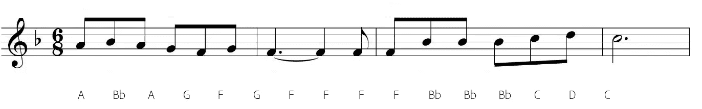
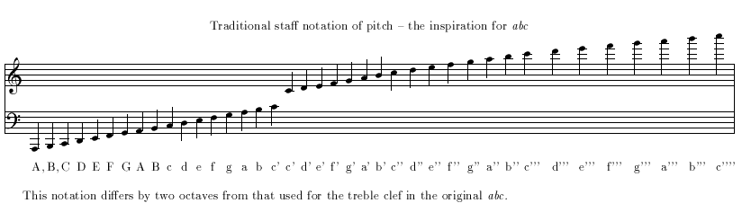
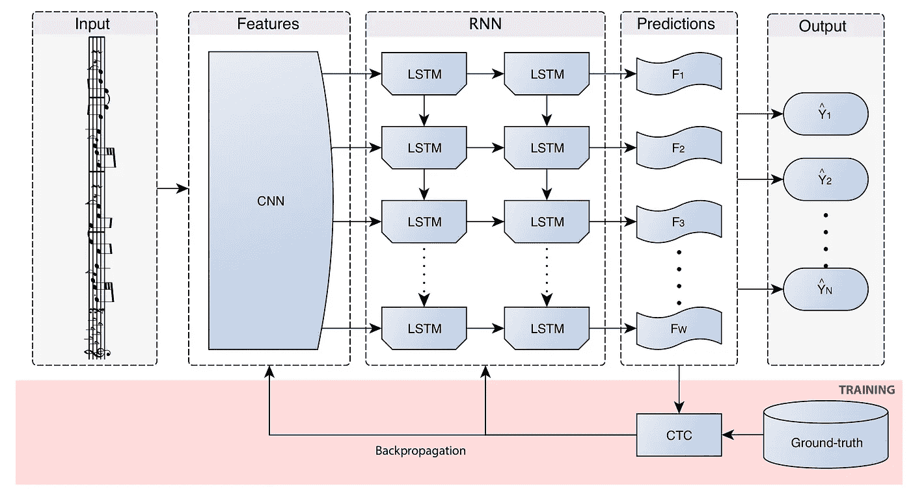
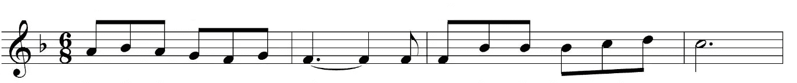

# 我做了一个乐谱转录器——以下是我的操作方法

> 原文：<https://towardsdatascience.com/i-built-a-music-sheet-transcriber-heres-how-74708fe7c04c?source=collection_archive---------6----------------------->

## 从音符到 ABC 符号的翻译从未如此简单！

过去几年，机器学习和深度学习领域经历了巨大的变革，并在许多领域带来了许多有用的应用。一个感兴趣的领域是光学音乐识别(OMR)。根据维基百科，OMR 是一个研究领域，调查如何通过计算读取文档中的音乐符号。OMR 的目标是教会计算机阅读和解释乐谱，并生成机器可读版本的书面乐谱。让我们就这么做吧！



The end product — an annotated music sheet with notes translated in ABC notation

## 音乐速成班

在我开始写代码之前，我先简单介绍一下乐谱。我们中的许多人都是通过学习如何阅读音符的缓慢而痛苦的过程开始学习音乐的。事实上，许多人通过在乐谱上写下每个音符对应的字母来将音符转换成 ABC 符号。



Converting between notes and ABC notation

我自己经历过这个过程，我决定如果我能建立一个 web 应用程序，可以自动将音符翻译成 ABC 符号，并在乐谱上标注 ABC 字母，那将是非常棒的！

## 深度学习模型

因此，我开始寻找能够执行这项任务的合适的深度学习架构。在此之前，我没有太多的光学识别模型的经验，所以我不确定是否会有任何关于这个主题的现有工作。让我惊讶的是，我在《应用科学杂志》上发现了一篇由 Calvo-Zaragoza 等人在 2018 年发表的非常精彩的研究论文，题目是[端到端的神经光学音乐识别单音乐谱](https://www.mdpi.com/2076-3417/8/4/606)。他们甚至策划了一个数据集:乐谱的印刷图像(PrIMuS ),包含超过 80，000 个西方常用记谱法的真实乐谱！

Calvo-Zaragoza 等人提出的模型由一个卷积神经网络(CNN)组成，用于从输入图像中提取特征，随后是一个双向长短期记忆(BLSTM)网络，用于处理序列，单个五线谱被视为一个序列。CNN 最后一层的输出连接到 BLSTM 第一层的输入，形成卷积递归神经网络(CRNN)。研究人员使用了一种特殊的损失函数，[连接主义者时间分类(CTC)损失函数](https://mediatum.ub.tum.de/doc/1292048/file.pdf)，它提供了一种优化 CRNN 参数的方法，以便在给定输入 x 的情况下，它可能会给出正确的序列 y。这里，输入 x 代表单个五线谱图像，y 是其相应的音乐符号序列。



Graphical scheme of the CRNN taken from [the paper](https://www.mdpi.com/2076-3417/8/4/606/htm).

但是请注意，该模型不输出关于每个音符的确切位置的信息，而只输出音符出现的顺序。然而，这并不重要，因为尽管音乐读者可能不知道哪个音符对应于哪个字母，但他们可以根据输出的字母数量来理解。

有关 CRNN 架构和实验细节的更多信息，请查看他们的论文[这里](https://www.mdpi.com/2076-3417/8/4/606/htm)了解更多信息。

## 在 Web 上部署

如果你只是想得到代码，点击[这里](https://github.com/liuhh02/web-omr)。

好了，现在我们已经简单地了解了模型架构，现在是实现的时候了！研究人员已经上传了他们在 Tensorflow 中实现的模型，并将代码上传到 [Github](https://github.com/calvozaragoza/tf-deep-omr) 上。在此基础上，我能够快速建立模型，并准备在 web 上部署它。首先，确保您安装了 tensorflow v1、flask 和 OpenCV。然后，下载研究人员训练的[语义模型](https://grfia.dlsi.ua.es/primus/models/PrIMuS/Semantic-Model.zip)以及[语义词汇](https://github.com/calvozaragoza/tf-deep-omr/blob/master/Data/vocabulary_semantic.txt)。还要下载字体 [Aaargh.ttf](https://www.fontsquirrel.com/fonts/aaargh) ，因为需要用 ABC 符号对图像进行注释。(如果您想自己训练模型，请前往 tensorflow 模型 [Github 存储库](https://github.com/calvozaragoza/tf-deep-omr)获取说明，并下载 [PrIMuS 数据集](https://grfia.dlsi.ua.es/primus/))。语义词汇表基本上是一个将整数表示映射到实际音符的字典，比如 index *348* 如何给你 *note-A2_quarter* 。但是，由于模型的词汇表包含的信息比需要的要多得多(如拍号、竖线等),而且由于演奏者无需任何音乐背景知识就可以在乐谱上看到，所以不需要对这些信息进行注释，因此我对模型的输出进行了后处理，仅包含 ABC 字母，代码如下:

```
notes=[]
 for i in array_of_notes: // array_of_notes contains the full output
 if i[0:5]==”note-”:
 if not i[6].isdigit():
 notes.append(i[5:7])
 else:
 notes.append(i[5])
```

幸运的是，所有的笔记都标有“note-”作为前 5 个字符，所以很容易只抓住那些与 ABC 字母相关的。

## Web 应用程序是做什么的？

获得包含相关注释的数组后，我使用 PIL ( Python 图像库)库将注释添加到图片本身。这包括创建一个新的完全白色的图像，其宽度和高度是原始图像的 1.5 倍，以扩展原始图像。然后，我使用 Image.paste()函数将原始图像复制到白色图像上。在下面用空白扩展了原始图像后，我可以在五线谱下面打印 ABC 字母。



Original Image


Annotated Image

如前所述，该模型不包含每个音符的确切位置信息，而是只打印出一系列字母，所以我必须做一些计算，使 ABC 字母在五线谱下方排列*非常*。它没有完全对齐，这肯定是未来改进的一个领域，但这不是一个大问题，因为音乐播放器可以根据出现的顺序知道哪个字母对应哪个音符。

在研究人员提供的 tensorflow [predict.py](https://github.com/calvozaragoza/tf-deep-omr/blob/master/ctc_predict.py) 代码的基础上，我用 Flask 实现了我的 web 应用。Flask 是一个非常方便的 web 应用程序框架，它可以让每个人在尽可能短的时间内将自己的 python 代码移植到 web 应用程序上。所有 Flask 需要的是您的主要 python 代码、html 文件和 css 模板，您就可以开始了！

## 仔细看看弗拉斯克

Flask python 文件只需要对当前的机器学习 python 文件做一些小的补充。首先，你必须添加行

```
app = Flask(__name__)
```

导入 Flask 后，在您的机器学习代码上方创建 web 应用程序的 *Flask* 类的实例。然后，在后面添加下面一行:

```
if __name__==”__main__”:
 app.run()
```

当 python 运行该文件时，它会将名称`"__main__"`分配给脚本。因此，`__name == "__main__"`得到满足，app.run()执行。在此之后，您必须定义一些函数，并将它们映射到一些路由，例如定义用户上传音乐表后，如何重定向到/预测包含注释音乐表的内容。查看[烧瓶文档](http://flask.palletsprojects.com/en/1.1.x/)和[我的代码](https://github.com/liuhh02/web-omr/blob/master/app.py)了解更多信息。

## 最后的润色

现在 python 文件已经设置好了，剩下的就是 html 文件和 css 文件了。文件夹结构通常如下:

```
app.py
├── templates
|   ├── html files here
├── static
|   ├── css
|        └── css files here
```

在这个项目中，该网站是风格化的[布尔玛](https://bulma.io/)，一个伟大的开源 CSS 框架，我强烈推荐给大家！它使用简单，不需要太多的 Javascript，看起来非常好。

这个项目还需要一些额外的文件——深度学习模型、语义词汇文件、字体和任何你想要测试的图像。所以如果你已经下载了所有的文件，你应该这样组织你的文件夹:

```
app.py
vocabulary_semantic.txt
Aaargh.ttf
├── Semantic-Model
|   ├── semantic_model.meta
|   └── semantic_model.index
|   └── semantic_model.data-00000-of-00001
├── templates
|   ├── index.html
|   └── result.html
├── static
|   ├── css
|        └── bulma.min.css
```

就是这样！一旦如上所述设置好了一切，就进入你的终端/命令提示符。将目录更改为包含您的`app.py`文件的目录，并运行`python app.py`。等待几秒钟，您应该会收到一条消息，显示您应该访问的链接，以便查看 web 应用程序。转到网址，上传您的音乐表，并获得结果！带注释的工作表将被保存到与您的`app.py`文件相同的目录中。

请注意，目前该模型只能处理单音乐谱(由一条旋律线组成的乐谱)。所以不要给它太复杂的分数！

试试这个！我希望你能从中得到乐趣，并告诉我进展如何！如果你有任何关于如何使用这个模型的好主意，请在评论区分享！

这篇文章也发表在我的博客里。