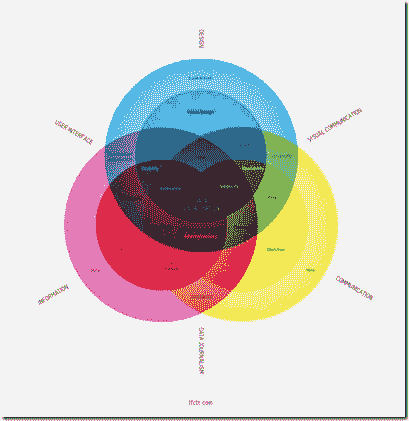
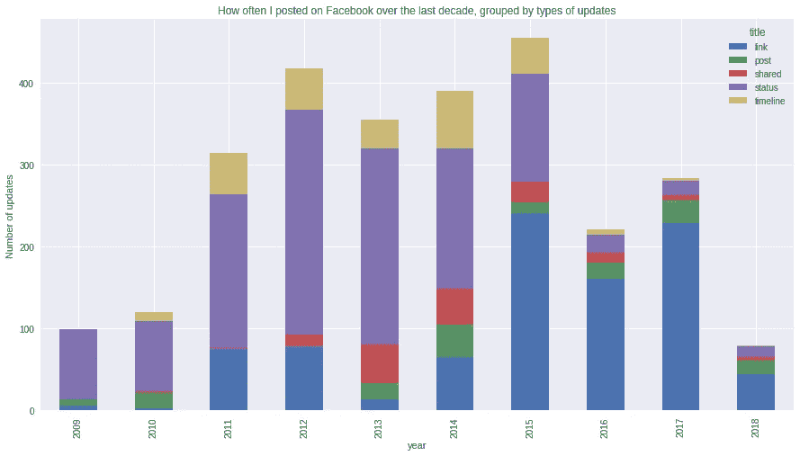
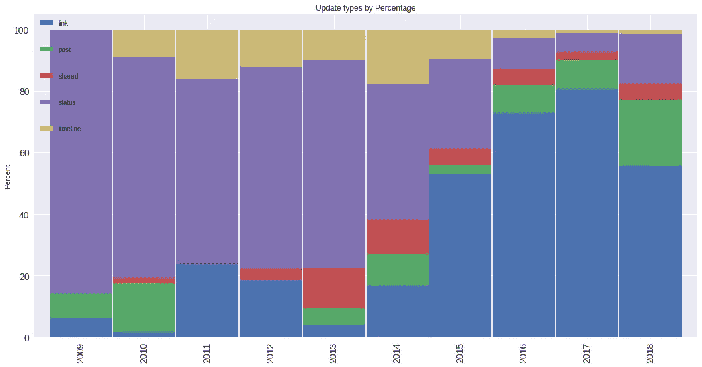
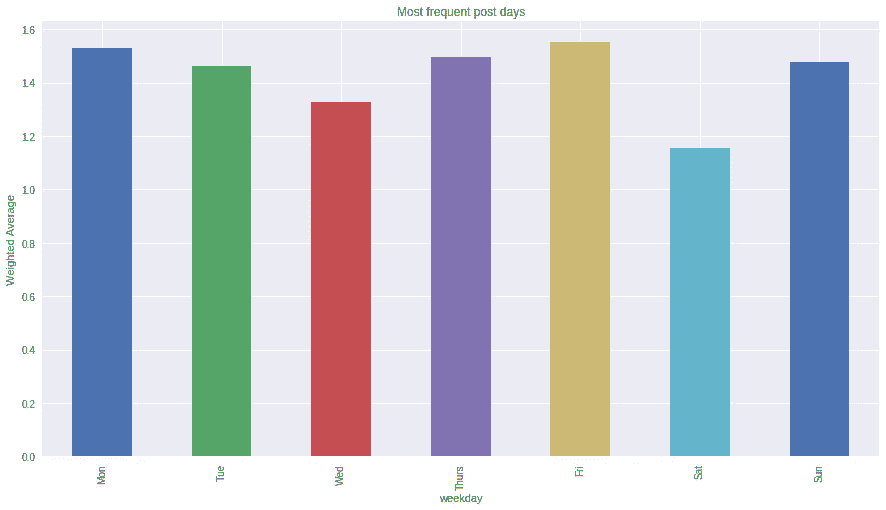
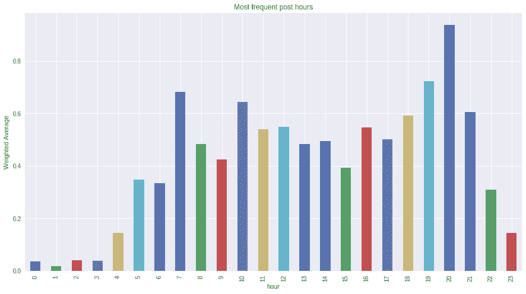
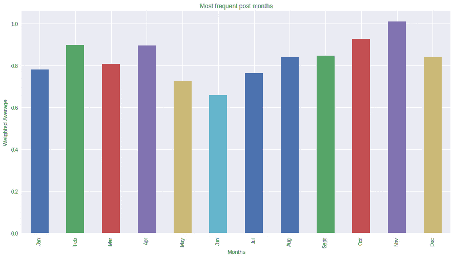

# 使用可视化交流数据

> 原文：<https://towardsdatascience.com/i-decided-to-download-my-social-media-data-facebook-linkedin-and-twitter-with-the-intention-of-64eabf961ed1?source=collection_archive---------12----------------------->



Communicating data using visualizations

## 我下载了我的脸书数据，这些数据分析了我的在线行为，并更新了过去十年的上网频率和总体参与度。

这篇博客文章以分析我在脸书的更新开始了社交媒体分析系列博客。第一次分析的目的是了解:I)我在 2009 年至 2018 年期间在我的脸书账户上发布帖子的频率，并根据更新的类型打破这些更新，即发布状态更新、帖子(这是指分享图片、新闻文章或转发附有一些个人评论的脸书帖子)，在朋友的时间线上分享一些东西，分享一篇文章和发布一篇文章的链接，ii。)按年份和 iii 发布特定类型更新的年度百分比可能性。)我按工作日、小时和月份发帖的倾向，通过过去 10 年发帖频率的加权平均值来衡量。这将作为对我在过去十年中发布的内容类型进行更详细分析的后续，忽略年轻的我可能已经发布的明显令人生厌的帖子。

```
import pandas as pd
import datetime
import matplotlib.pyplot as plt
import numpy as np
from google.colab import drive
drive.mount('/content/gdrive')
fb_posts = pd.read_csv(‘/***/myposts.csv’)
```

我把脸书的数据保存在我的谷歌硬盘上；为了在 [Google Colab](https://medium.com/dair-ai/primer-for-learning-google-colab-bb4cabca5dd6) 上与这些数据进行交互，我必须使用 google.colab 包来挂载 GDrive 并打开与我的分析相关的文件夹和 csv。

**阅读文件**

```
#I need to convert this into a readable datetime 
#iterate through timestamps and convert individual rows 
fb_posts[‘timestamp’] = fb_posts[‘timestamp’].apply(lambda x: datetime.datetime.fromtimestamp(int(x)))
#create month, day, year and time columns
fb_posts[‘year’] = fb_posts.timestamp.dt.year
fb_posts[‘month’] = fb_posts.timestamp.dt.month
fb_posts[‘day’] = fb_posts.timestamp.dt.day
fb_posts[‘time’] = fb_posts.timestamp.dt.time#making the assumption that if 95% of the rows are NaN values, the column doesn’t contain valuable info for the purposes of our analysis
#use dropna and specify threshhold of na values
fb_posts = fb_posts.dropna(thresh=len(fb_posts)*0.05, axis=1)#use list(fb_posts) to id the remaining columns
fb_posts = fb_posts.drop(fb_posts.iloc[:,[1,4]], axis=1)
```

关于从 facebook 导入的数据，您注意到的第一件事是，您的更新的时间戳是以 unix 时间戳格式(一个表示自 1970 年 1 月 1 日以来发生的秒数的数字)导入的，因为它同时表示所有时区。为了将这个时间戳转换成可读时间，我在时间戳列的每一行上应用了一个 lambda 函数。所以我遍历每一行，并应用一个 lambda 函数将时间戳转换成日期时间格式。

然后，我继续使用。年份，。月，。天还有。时间分别。我需要这些专栏来回答我在开篇段落中提出的问题。

目前，dataframe 大约有 126 列，其中大部分对我们的分析没有用。为了过滤掉不重要的列，我删除了 NaN 值占行中值的 95%或更多的列。我这样做是为了减少列的数量，这样我就可以专注于我真正想要用于分析的列(并可能找到其他包含有趣信息的列)。

一旦我有了更少的列，我就根据与我们的分析最相关的列来限制列。

**数据清理**

```
#rename column
fb_posts.rename(columns = {'data/0/post':'posts', 'attachments/0/data/0/external_context/url':'links'}, inplace=True)
fb_posts['title'] = fb_posts['title'].astype(str)
for x in ['link', 'post', 'status', 'timeline','recommend','books','reviewed','playlist','feeling','event','likes','listened','played','published','shared','was','followed','commented','song','responded','wants','invested','photo']:
    fb_posts.loc[fb_posts['title'].str.contains(x), 'title'] = x
#remove chart junk
removal = ['recommend','books','photo','reviewed','playlist','nan','feeling','event','likes','listened','played','published','was','followed','commented','song','responded','wants','invested']
fb_posts2= fb_posts[~fb_posts['title'].isin(removal)]
```

现在有趣的部分来了:清理。我首先将列重命名为更容易引用的名称:然后将 title 列中的所有项目转换为 string 格式。我这样做是为了帮助我们使用一个单词的引用(例如，状态=状态更新)来分类每行所代表的文章类型。

通过将 title 列中的所有项目转换为 string，我可以遍历 title 列中的每个字符串，并检查它是否包含在上面代码块中定义为“x”列表的单词列表中出现的任何单词。如果是这样，我就将该行的值更改为“x”列表中的相关引用文本。

然后，我遍历这个列表，删除引用删除列表中指定的引用词的值。我这样做是因为我只想处理状态、帖子、链接、分享和时间线更新。基于对我在脸书历史上发布的内容的理解，我认为这些是我在脸书活动的主要内容。

**按年份和类型绘制更新频率图**

```
fb_posts2.groupby([‘year’,’title’]).size().unstack().plot.bar(stacked=True)
```



Frequency of Facebook updates

为了形象化我们的图表，我按年份分组，并计算每种更新(标题)的出现次数。有趣的是，频率有点像高斯分布，频率峰值在 2012 年和 2015 年之间的中间，总更新数最低的是在 2009 年和 2018 年的尾部。这不一定表明我在社交媒体上不太活跃，而是我越来越多地从脸书转向 Twitter。这主要是因为该平台潜在的学习价值，以及它如何让自己成为比人们在脸书上分享猫图片和其他随机事情有趣得多的对话。

**按百分比更新**

我想想象的下一个趋势是了解 2009 年至 2018 年间任何一年的更新类型，按百分比计算。

```
#we want to find the count of posts, status updates and link shares by year
nine = fb_posts2[fb_posts2['year']==2009].groupby('title').size()
ten = fb_posts2[fb_posts2['year']==2010].groupby('title').size()
eleven = fb_posts2[fb_posts2['year']==2011].groupby('title').size()
twelve = fb_posts2[fb_posts2['year']==2012].groupby('title').size()
thirteen = fb_posts2[fb_posts2['year']==2013].groupby('title').size()
fourteen = fb_posts2[fb_posts2['year']==2014].groupby('title').size()
fifteen = fb_posts2[fb_posts2['year']==2015].groupby('title').size()
sixteen = fb_posts2[fb_posts2['year']==2016].groupby('title').size()
seventeen = fb_posts2[fb_posts2['year']==2017].groupby('title').size()
eighteen = fb_posts2[fb_posts2['year']==2018].groupby('title').size()
a = [x/sum(x)*100 for x in [nine,ten,eleven,twelve,thirteen,fourteen,fifteen,sixteen,seventeen,eighteen]]
df = pd.DataFrame(a, index= my_names)
#remove all NaN values and replace with 0
df['post'].fillna(0, inplace=True)
df['shared'].fillna(0, inplace=True)
df['timeline'].fillna(0, inplace=True)
```

在这段代码中，我获得了每种类型的更新占该特定年份总更新的百分比。然后，我继续删除由某些年份未发生的某些类型的更新导致的任何 NaN 值，并用 0 替换该 NaN 值。

```
df.plot(kind='bar', stacked=True, width=0.98)
```



Update type by percentage

从这个视觉化中，有一个明显的趋势表明状态更新在减少，我的更新越来越倾向于链接和帖子更新。我对社交媒体的使用案例已经从与老朋友保持联系转变为讨论热门话题或让我的业务和职业抱负感兴趣的问题。这清楚地反映在我的更新趋势中。

**脸书按天更新**

这个分析的问题集中在找出我在工作日更新脸书的倾向。

```
#convert dates to week days
fb_posts2[‘weekday’] = fb_posts2.timestamp.dt.weekday_name#find average tweets per day grouped by year
weighted = fb_posts2.groupby(‘year’).weekday.value_counts(normalize=True).unstack().sum().sort_values().plot(kind=’bar’)
```

在将我的时间戳上的工作日转换为单词 weekday 之后，我寻找一种解决方案来计算我的数据中每年按工作日更新的加权平均值，从最小到最大对条形进行排序，并对数据帧进行[拆分](https://subscription.packtpub.com/book/big_data_and_business_intelligence/9781787123137/11/ch11lvl1sec95/stacking-and-unstacking)以对其进行整形，并返回整个定义期间每天的加权平均值之和。



Most frequent posts by week day

最终结果不言自明:我的脸书更新频率在周末和本周初达到峰值。从最近的角度来看，我更有可能在一周结束和开始时分享脸书的链接，因为这是我最有可能积极检查我的脸书和阅读我更有可能分享的外部内容的时候。我相信我在周五通常更活跃，因为我的注意力往往会在一天结束时下降，因为我会期待周末，而在周一，我通常会在早上早些时候慢慢开始使用社交媒体，并放松进入我的工作。

在过去的两年里，这种情况越来越多地出现在 Twitter 上，而不是脸书，这解释了过去几年脸书帖子数量下降的原因。

**脸书每小时更新**

```
#facebook posts by hour, I need to split the first 2 digits from time
fb_posts2['hour'] = fb_posts['time'].apply(lambda x: x.hour)
time_weight = fb_posts2.groupby('year').hour.value_counts(normalize=True).unstack()
time_weight.sum().sort_index().plot(kind='bar')
```

为了显示过去 10 年中每小时的平均更新，与前面的分析非常相似，我计算了每小时更新的加权平均值，并通过将 groupby 函数与 [value_counts](https://pandas.pydata.org/pandas-docs/stable/generated/pandas.Series.value_counts.html) (计算小时的唯一值总数)结合起来对这些平均值求和。“normalize”参数只允许我计算并返回我计算的小时数的唯一值的相对频率。



Most frequent posts by hour

平均每小时的帖子数从早上 5 点开始持续增加，在下午 6-9 点达到高峰。我会推测，这是我更可能坐在家里拿着手机的时候(取决于讲座或工作后的一年)。此外，我注意到我最容易分心的时间是上午 10-11 点和下午 6-8 点。虽然我通常是一个夜猫子，大多数日子熬夜到凌晨 1 点，周末甚至更久，而且通常在深夜更活跃。我倾向于在晚上 9 点左右不活跃在社交媒体上。

**脸书每月更新**

```
month_weight = fb_posts2.groupby('year').month.value_counts(normalize=True).unstack()
labels = ['Jan','Feb','Mar','Apr','May','Jun','Jul','Aug','Sept','Oct','Nov','Dec']
fig, ax  = plt.subplots()
month_weight.sum().sort_index().plot(kind='bar')
plt.title('Most frequent post months')
plt.ylabel('Weighted Average')
plt.xlabel('Months')
ax.set_xticklabels(labels)
```

为了按月对条形图进行排序，我在 groupby 函数中以整数格式保存了月份。因为我知道按索引排序这些月份将返回从 1 到 12 排序的月份，所以我可以使用 [set_xticklabels](https://matplotlib.org/api/_as_gen/matplotlib.axes.Axes.set_xticklabels.html) 将月份转换为由它们各自的缩写表示的月份



Most frequent posts by month

从每月发帖的频率来看，我在脸书的活跃程度似乎在冬季有所下降，在夏季有所上升，尤其是在接近年底的时候。如果不对我每月发布的帖子类型和主题进行进一步的分析，很难对这种趋势的原因进行理论化。