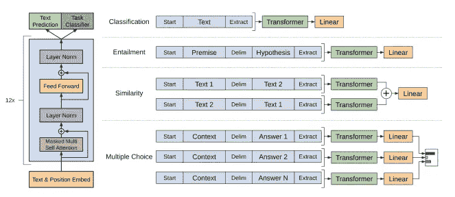
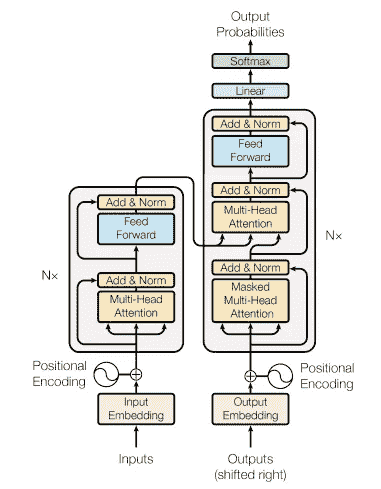
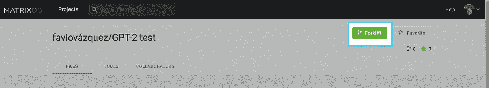

# 这篇文章不是我一个人写的

> 原文：<https://towardsdatascience.com/i-didnt-write-this-article-alone-bc604e50859c?source=collection_archive---------17----------------------->

## AI 在这里，越来越容易使用和理解。

## 使用 Python 在几分钟内用 GPT-2 生成文本。


Credit to my amazing sister [Heizel Vázquez](https://www.instagram.com/heizelvazquez/)

不久前，我写了一篇关于数据科学的文章:

> 数据科学家不是知道如何使用 Python 或 R 的人，他们是可以通过理解他们拥有的数据来改进和优化业务工作方式的人，并创建模型来解释现实的复杂性，同时创建可以推动行动的解决方案，即与业务相关的特定行动。

我想看看我能想到的与这个思路相关的其他东西。这是系统产生的结果:

> 数据科学家是那些了解业务、了解业务需求、了解客户需求、了解业务模式并使用这些知识来更好地了解业务和客户的人。
> 
> 在处理应用程序或业务时，您需要一名数据科学家来了解应用程序或业务需要什么类型的数据。当要做出明智的决策时，你需要一个懂得如何编写优秀的数据可视化(或分析)应用程序的人。这个人也可以理解即将到来的数据，并确定使用这些数据的最佳方式。


# GPT-2 基础


这项工作在很大程度上基于 greycode 和 huggingface 的工作，你可以在这里看到他们的回复:

[](https://github.com/graykode/gpt-2-Pytorch) [## graykode/gpt-2-Pytorch

### 带有 OpenAI gpt-2 Pytorch 实现的简单文本生成器— graykode/gpt-2-Pytorch

github.com](https://github.com/graykode/gpt-2-Pytorch) [](https://github.com/huggingface/pytorch-pretrained-BERT) [## 拥抱脸/py torch-预训练-BERT

### 📖变形金刚的大扩展库:为谷歌的 BERT，OpenAI GPT 和 GPT-2 预训练 PyTorch 模型…

github.com](https://github.com/huggingface/pytorch-pretrained-BERT) 

但是在运行代码之前，我们需要一些关于这个模型如何工作的基础知识(如果您只是想使用这个模型，请转到下一节)。

GPT-2 是一个大型的基于转换器的语言模型，具有 15 亿个参数，在 800 万个网页的数据集上进行训练。GPT-2 训练有一个简单的目标:预测下一个单词，给定一些文本中的所有以前的单词。对我们来说很遗憾，但也许对世界更好的是，他们没有发布整个模型，而是发布了一个较小的模型。您可以在这里看到最初的实现:

[](https://github.com/openai/gpt-2) [## openai/gpt-2

### “语言模型是无监督的多任务学习者”论文的代码——open ai/GPT-2

github.com](https://github.com/openai/gpt-2) 

现在我们有一个(117 米参数)和中等(345 米参数)版本的 GPT-2 测试。该模型如下所示:



Improving Language Understanding by Generative Pre-Training, Radford et al.

这些是型号规格:

> 我们的模型很大程度上遵循了最初的变压器工作。我们训练了一个只有 12 层解码器的变压器，它有掩蔽的自我注意头(768 维状态和 12 个注意头)。对于位置式前馈网络，我们使用 3072 维内部状态。我们使用了 Adam 优化方案，最大学习速率为 2.5e-4。在前 2000 次更新中，学习率从零线性增加，并使用余弦时间表退火至 0。我们在 64 个随机采样的小批次上训练 100 个时期，512 个标记的连续序列。由于 layernorm 在整个模型中广泛使用，简单的权重初始化 N(0，0.02)就足够了。我们使用了一个字节对编码(BPE)词汇，有 40，000 个合并和残差，嵌入，以及 0.1 的注意丢失率用于正则化。我们还采用了在中提出的 L2 正则化的修改版本，在所有非偏置或增益权重上 w = 0.01。对于激活函数，我们使用高斯误差线性单位(GELU)。我们使用学习位置嵌入，而不是原来的工作中提出的正弦版本。

他们在这里提到的“原创作品”是谷歌的一篇论文，名为“注意力是你所需要的”(2017)。这里他们提出了一个看起来像这样的变压器:



Attention Is All You Need (2017)

**Transformer** 是一种避免重复出现的模型架构，而是完全依赖于一种注意机制来绘制输入和输出之间的全局依赖关系。

变压器依靠一个**编码器**和一个**解码器**。这里，编码器将符号表示的输入序列 *(x1，…，xn)* 映射到连续表示的序列 *z = (z1，…，zn)* 。给定 z，解码器然后一次一个元素地生成符号的输出序列 *(y1，…，ym)* 。在每一步，模型都是自回归的，在生成下一步时，消耗先前生成的符号作为附加输入。

它们通过**警示**机构连接。它可以被描述为将查询和一组键-值对映射到输出，其中查询、键、值和输出都是向量。输出被计算为值的加权和，其中分配给每个值的权重由查询与相应键的兼容性函数来计算。

关于注意力机制和它的工作方式还有很多要讨论，请阅读詹姆斯·蒙泰斯的文章:

[](/examining-the-transformer-architecture-part-1-the-openai-gpt-2-controversy-feceda4363bb) [## 检查变压器架构—第 1 部分:开放 GPT 2 争议

### “回收对世界没有好处。它对环境有害，对我们的健康有害，对我们的…

towardsdatascience.com](/examining-the-transformer-architecture-part-1-the-openai-gpt-2-controversy-feceda4363bb) 

# 如何使用 GPT 新协议模型


到目前为止，我们一直是技术性的，但在使用模型之前，最好有一个我们正在做什么的想法。但是现在，我们如何使用它呢？

让我们从旋转 JupyterLab 会话和克隆一些 repos 开始。为此，我使用了一个用于数据科学的云托管系统。

项目在那里(用叉车测试):

 [## MatrixDS |数据项目工作台

### MatrixDS 是一个构建、共享和管理任何规模的数据项目的地方。

community.platform.matrixds.com](https://community.platform.matrixds.com/community/project/5d653ca4d3af3918c87bc0c7/files) 

这是 GitHub 回购协议:

[](https://github.com/FavioVazquez/gpt2-matrixds) [## FavioVazquez/gpt2-matrixds

### 此时您不能执行该操作。您已使用另一个标签页或窗口登录。您已在另一个选项卡中注销，或者…

github.com](https://github.com/FavioVazquez/gpt2-matrixds) 

**注意:如果你铲车回购你会有一切已经测试代码，如果没有遵循以下说明。**

在 JupyterLab(我在本教程中使用的那个)中，打开终端并开始克隆 [greycode](https://github.com/graykode/gpt-2-Pytorch) repo:

```
git clone [https://github.com/graykode/gpt-2-Pytorch](https://github.com/graykode/gpt-2-Pytorch)
```

然后转到刚才创建的文件夹，下载 hugginface 的预训练模型:

```
curl --output gpt2-pytorch_model.bin [https://s3.amazonaws.com/models.huggingface.co/bert/gpt2-pytorch_model.bin](https://s3.amazonaws.com/models.huggingface.co/bert/gpt2-pytorch_model.bin)
```

并安装要求:

```
pip install -r --user requirements.txt
```

我还需要安装 PyTorch 和 tqdm，对于 pip，只需输入:

```
pip install --user torch torchvision 
pip install --user tqdm
```

之后，你就可以走了！您有一个运行实验的命令行工具，可以通过以下方式使用:

```
python main.py --text "This is a text"
```

或者，如果您在笔记本电脑中:

```
!python main.py --text "This is a text"
```

如果您转到 main.py 文件，您将看到模型是如何被使用的，但是没有太多关于模型本身的描述。我们可以改变的论点是:

```
:seed=None : Integer seed for random number generators, fix seed to reproduce     results    
:nsamples=1 : Number of samples to return total    
:batch_size=1 : Number of batches (only affects speed/memory).  Must divide nsamples.    
:length=None : Number of tokens in generated text, if None (default), is determined by model hyperparameters    
:temperature=0.7 : Float value controlling randomness in boltzmann     distribution. Lower temperature results in less random completions. As the temperature approaches zero, the model will become deterministic and repetitive. Higher temperature results in more random completions.    
:top_k=40 : Integer value controlling diversity. 1 means only 1 word is     considered for each step (token), resulting in deterministic completions, while 40 means 40 words are considered at each step. 
:unconditional=False:  If true, unconditional generation.
```

最难的概念是*温度*和 *top_k* ，阅读原文可以更好的理解:


# 例子

**注意:我在这里展示的例子可能与你在 repo 或 notebook 中看到的不一样，它们是经过几次代码迭代后我能找到的最好的引用。**

我们来试几个例子，看看这个东西有多好。

第一个文本将是:

> “人工智能是新的电力”

```
!python main.py --text "AI is the new electricity" --top_k=10
```

样品:

> 在过去的两年里，它一直在开发世界上最先进和最具成本效益的发电系统，并提供世界上最高效的电力。它还致力于让世界上最贫穷的人用得起电，并投资于新能源技术以应对这些挑战。

我不认为算法在这个例子中有足够的信息，它只是谈论电力和功率。让我们尝试一些不同的东西。

让我们试试我的文章[“学习数据科学的 3 个最大错误”](https://medium.com/swlh/the-3-biggest-mistakes-on-learning-data-science-f782e1a8abec)中的一些内容:

> 数据科学需要实践。你所学的一切，即使教授没有告诉你，也要实践和尝试。这是真正理解事物的基础，当你在这个领域工作时，你会做许多不同的实际工作。

```
!python main.py --text "Data science needs practice. Everything you learn, even though if the professor doesn't tell you, practice and try it. This is fundamental to really comprehend things and when you are working in the field you will be doing a lot of different practical stuff." --top_k=20
```

> 下一次你在一个领域，你将会工作或者做很多对你来说不同的事情。你将在现实世界中做这些事情。你可以做不同的事情。你会在不同的领域发现不同的东西。你会在不同的工作中发现不同的东西。你会发现不同的东西。所以这不是你在现实世界中会做的事。你觉得更有趣的工作。你觉得更有趣的工作。你觉得更有趣的工作。你觉得更有趣的工作。有很多在现场的人实际上并不在现场。

```
!python main.py --text "Data science needs practice. Everything you learn, even though if the professor doesn't tell you, practice and try it. This is fundamental to really comprehend things and when you are working in the field you will be doing a lot of different practical stuff." --top_k=10 --temperature=0.8
```

> 如果你看着这个世界，这个世界对你来说是有意义的，不仅仅是这个世界或这个世界，而是整个世界，是这个世界给了人们希望和幸福。你需要了解的是这个世界。

看起来好多了，不是吗？

最后，让我们回到文章的第一句话:

> 数据科学家不是知道如何使用 Python 或 R 的人，而是可以通过理解他们拥有的数据来改进和优化业务工作方式的人，并创建模型来解释现实的复杂性，同时创建可以推动行动的解决方案，即与业务相关的特定行动。

```
!python main.py --text "A data scientist is not someone who knows how to use Python or R, is the person that can improve and optimize how a business work by understanding the data they have and create models that explain the complexity of reality while creating solutions that can drive actions, specific actions related to the business." --top_k=40 --temperature=0.9
```

> 在分析数据时，您需要有人了解您正在查看什么类型的数据，以及您将如何在业务案例中使用这些类型的数据。该人员还可以理解即将到来的数据，并确定在该业务案例中使用何种类型数据的最佳方式。
> 
> 数据科学家是一个可以帮助你开发更好的商业解决方案的人。此人还可以帮助您制定更好的业务决策，以便更好地向客户解释数据。那个人也可以帮助你使用数据分析软件，学习如何更好地分析你的数据。

太棒了。这与我正在考虑的数据科学很接近，但系统帮助我创造了这些句子。您可以尝试一下，但是我建议您测试不同的配置，并阅读产生的文本，看看它是否有意义。


# 结论


我们正在达到人工智能世界的新水平，测试、尝试和扩展世界上最优秀的人的工作和研究变得越来越容易。在本文中，我展示了如何在 MatrixDS 平台中使用 GPT-2 模型，只需要最少的配置和该模型的一些基础知识。

你可以尝试非常不同的场景来测试这个模型，并开始用数据科学和人工智能改变世界。


感谢您的阅读，如果您想了解更多信息，请关注我这里，以及 LinkedIn 和 Twitter:

[](https://www.linkedin.com/in/faviovazquez/) [## 法维奥·瓦兹奎——science y Datos | LinkedIn 创始人/首席数据科学家

### 加入 LinkedIn ‼️‼️重要提示:由于 LinkedIn 技术限制，我现在只能接受连接请求…

www.linkedin.com](https://www.linkedin.com/in/faviovazquez/) [](https://twitter.com/faviovaz) [## 法维奥·巴斯克斯(@法维奥·巴斯克斯)|推特

### Favio Vázquez 的最新推文(@FavioVaz)。数据科学家。物理学家和计算工程师。我有一个…

twitter.com](https://twitter.com/faviovaz)