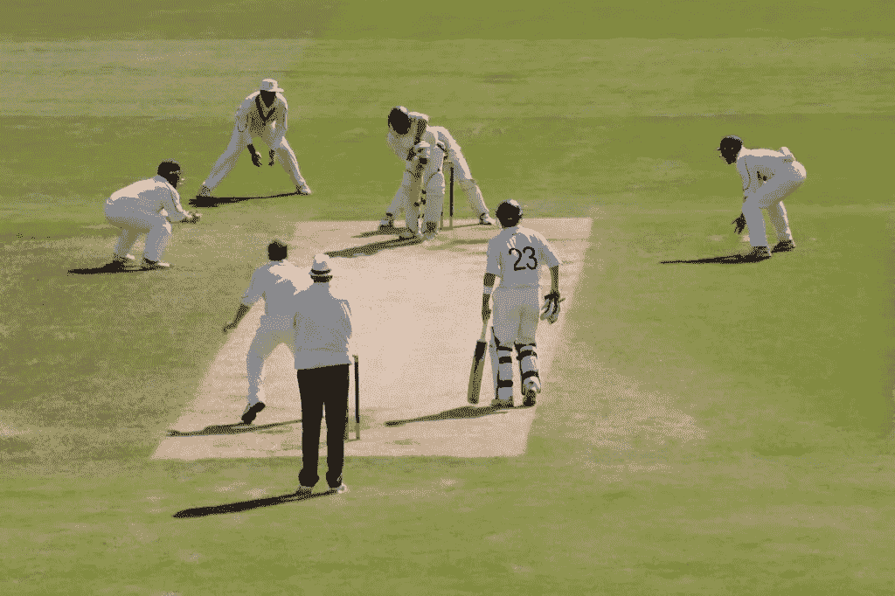
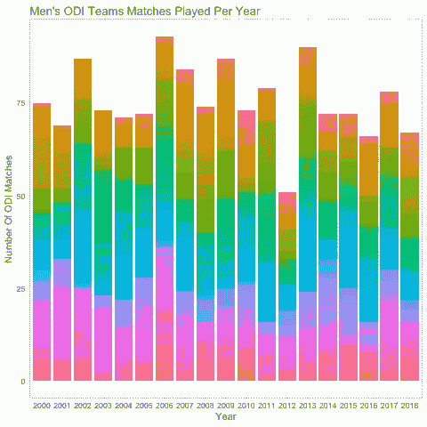
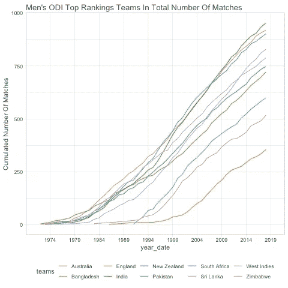
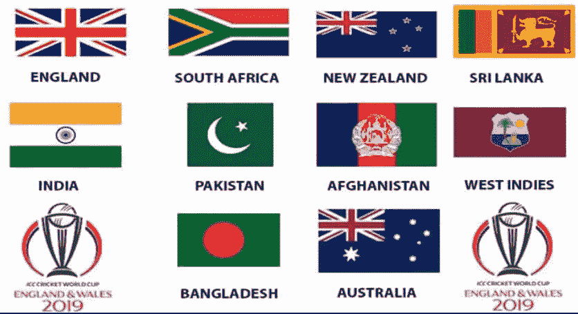
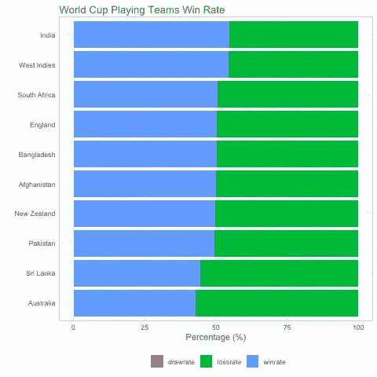

# “我不喜欢板球…我爱它”

> 原文：<https://towardsdatascience.com/i-dont-like-cricket-i-love-it-a710b8cc0f49?source=collection_archive---------14----------------------->

## 网络刮痧遇上潮流

# 介绍

板球是一种球棒和球的游戏，双方各有 11 名队员，比赛场地的中心是一个 20 米(22 码)的球场，两端各有一个小门，每个小门由两个球组成，平衡在三个树桩上。击球方通过用球棒击打在三柱门投球得分，而保龄球和防守方试图阻止这一点，并解雇每个球员(所以他们是“出局”)(维基百科)。

([https://www.istockphoto.com](https://www.istockphoto.com/nl))

# 动机

板球的四年一度的展览，国际刑事法院板球世界杯 2019 年本月早些时候在板球的“主场”英格兰开始。甚至在世界杯开始之前，就有很多关于最新一届世界杯的炒作。ESPNcricinfo 已经成为板球爱好者访问所有板球比赛和球员数据的热门网站。这篇博客背后的动机是如何从网站上收集有用的信息，并在 r 的帮助下从中产生一些基本的见解。在这第一篇博客中，我对“1971 年至 2019 年的国际板球结果”数据集进行了广泛的探索。该数据集列出了从 1971 年到 2019 年初的所有国际板球比赛(如比赛中的对手国家或民族)。

**更具体地说，本博客将涵盖以下内容:**

*   我们将首先学习如何收集 ESPNCricinfo.com 迄今为止不同团队的记录
*   然后，我们将看到一些从一个页面中提取信息的基本技术:我们将按年份提取所有 once day international (ODI)团队记录的比赛团队、获胜者、保证金、场地、比赛日期和记分牌
*   以及所有 ODI 在一个子页面上按年份显示的所有比赛的个人团队得分
*   有了这些工具，你就可以开始你的游戏，并比较不同板球队的比赛(我们自己选择的):我们将看到你如何利用`tidyverse`包，如绘图和`dplyr`，结合`stringr`，来进一步检查数据，并根据`tidyverse`的哲学为进一步的调查和统计推断制定假设。

# 网页抓取 ESPNCricinfo.com:rvest

**步骤 1:** 准备工作
**步骤 2:** 废弃团队记录
**步骤 3:** 提取记分卡 URL
**步骤 4:** 废弃记分卡

## 第一步:准备

首先，我做了一个我想废弃的年份的向量。

## 第二步:删除团队记录

在下一步中，我将这个函数应用于我之前生成的 URL 列表。为此，我使用了`purrr`包中的`map()`函数和 year-url 数据框中的‘rvest’函数。

## 步骤 3:提取记分卡 URL

从`href`属性中提取记分卡的 URL。然后获取 URL 列表并抓取我正在寻找的数据，然后在一些预处理后将其粘贴到数据框中。

## 第四步:废弃记分卡

I`map``rvest`对记分卡 URL 起作用。因为这是大量的网址。我用的是进度条`progress`包。

# 数据清理和与 Tidyverse 的争论

在任何环境中处理数据的一个大问题是数据清理和数据集合并的问题，因为我经常从`ESPNCricinfo.com`收集数据。有无数种方法可以将 R 用于数据争论，但是我非常依赖 tidyverse。我用`tidyr dplyr`来处理不同的数据争论和重塑任务。最后，我编写了一个方便的函数，它从记分牌数据帧中获取输入。它提取所有游戏的分数绑定到一个 tibble。然后应用`map`函数来获取包含团队记录所需信息的数据帧。经过一些处理后，将得到的数据帧连接起来。

# 使用 Tidyverse 进行可视化数据探索

数据可视化是数据分析过程中的一个重要工具。可视化任务的范围可以从生成基本分布图到理解机器学习算法中复杂的因果变量的相互作用。随着数据集的创建，我将可视化 ODI 比赛的分布情况。我将`ggplot2` 创建主要图形，以及一些看起来松散的趋势，为排名靠前的板球队获胜的情节。

# 每年的比赛次数

国际板球理事会(ICC)根据所有球队在不同比赛和双边系列赛中的表现给他们打分。这些分数随后被用于球队的排名。这一排名有助于保持各国之间的良性竞争，以不断争取胜利。基于这个排名，我只进入了前 10 名的团队进行探索和分析。

# 顶级球队的比赛次数

# 2019 年世界杯参赛球队

大英帝国在将板球运动传播到海外方面发挥了重要作用，到 19 世纪中叶，它已经在澳大利亚、加勒比海、印度、新西兰、北美和南非站稳了脚跟。然而，我将只关注有资格参加 2019 年世界杯的球队；包括阿富汗、澳大利亚、孟加拉、英国、印度、新西兰、巴基斯坦、南非、斯里兰卡、西印度群岛。

ICC Cricket World Cup 2019 Teams Final List ([https://dailysportsupdates.com](https://dailysportsupdates.com/icc-cricket-world-cup-2019-teams-qualification-round/))

# 哪个世界杯球队的胜率最高

奥迪斯，印度是领头的。西印度群岛、南非、英格兰和孟加拉国在这种形式中取得了胜利，并在榜单上排名前 5。现在每支球队都至少踢过一次球，根据我们目前看到的表现来预测哪个国家会赢仍然是不切实际的。然而，印度和英格兰似乎都是冠军的有力争夺者，只要他们能保持目前的比赛状态。

# 结论:

我们确定了如何将网页抓取分成不同的阶段，每个阶段都有自己需要应对的挑战:网站分析阶段、数据分析和设计阶段以及生产阶段。在每个阶段中，我们都提到了在进入下一阶段之前要开展的一些活动和要回答的一些问题。在这篇博客中，我们已经看到了用于网络抓取的 R 包是如何应用于统计领域的。我们已经展示了网络抓取如何用于探索背景变量和检索元数据等情况，以及它如何与 r 的`tidyverse`包完美结合。我们在 ICC 拥有最好的 ODI 板球队，它们是胜率最高的球队。我们提供了 plausibe isnight 来预测 2019 年 ICC 板球世界杯，我将在下一篇博客中发表。敬请关注。

# 参考资料:

“我不喜欢板球……我爱它！”:10cc — Dreadlock Holiday
《蟋蟀》。维基百科、国际板球理事会(ICC)
“统计与记录”:ESPNcricinfo.com
“gg plot 2】:H Wickham——数据分析的优雅图形
“Rvest】:H Wickham——轻松收获(刮)网页
“The tidy verse】:H Wickham——R 包
“gist-syntax-themes”:[https://github.com/lonekorean/gist-syntax-](https://github.com/lonekorean/gist-syntax-)主题