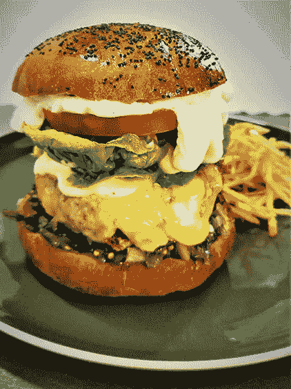
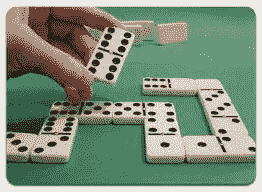

# 我喂了一个机器人八百个汉堡，这就是它吐出来的东西

> 原文：<https://towardsdatascience.com/i-fed-a-bot-eight-hundred-burgers-and-this-is-what-it-threw-up-b78202ca39f9?source=collection_archive---------20----------------------->

似乎没有什么是人类能做的，除非有一个聪明的电脑傻瓜出现并做得更好。首先是简单的计算，然后是工厂。1996 年，计算机在国际象棋上打败了我们，1915 年，它们掌握了围棋，现在，它们也来争夺我们的视频游戏。这开始变得有点烦人了。但有一个领域我们永远比我们的数字对手有优势:创造力。

对吗？计算机不能产生创造性的作品。可以吗？它能想象吗？让我们找出答案。还有什么比人类智慧的顶峰，文明的最高荣耀，汉堡包更好的考验呢？

在我的家乡，每年都有一个美食节，来自城市各处的餐馆竞相做出最好、最有创意、最美味的汉堡。在过去的六年里，我一直在努力收集关于这些汉堡的数据。除了统计汉堡中使用的小圆面包、肉饼和其他配料的种类，我还记录了每个汉堡的名称和描述——总共超过 800 个。

1815 Cafe and Bar’s “Sweet Baby Cheesus”: Crumbed mozzarella with smoked cheddar, parmesan cream, jalapeno relish on a herbed milk bun, with straw fries. Matched with Garage Project White Mischief — Salted White Peach Sour.

汉堡的描述证明了人类的创造力。几乎所有能夹在小圆面包里的东西都出现在了菜单上，而且，在很大程度上，它们显示了对口味组合的深思熟虑。这是一个非凡的创造力壮举——想象并制作出新颖、令人兴奋、但味道也不错的配料组合。

这是我们可以教计算机做的事情吗？我们至少可以试试！让我们建立一个算法，可以产生一个从未见过的汉堡的描述。

我们需要一个可以生成文本的算法。这些技术同样支持聊天机器人和预测文本功能，如预先生成的电子邮件回复和自动完成句子。他们都有一个共同的方法:给定一个单词或短语，最有可能跟随的单词是什么？以“昨天我去了……”开头的句子可能以“……去了图书馆”结尾，但同样也可能以“……完全疯了”结尾给定上下文，这些算法试图计算哪一个是更好的选择。

让我们探索其中的一些算法，看看它们是如何工作的，并希望在此过程中制作出一些美味的汉堡。

实现这一点的最简单的方法被称为“马尔可夫链”。这就像游戏“多米诺骨牌”一样，在游戏中，通过匹配的数字将瓷砖连接起来。然而，我们的瓷砖上写的不是数字，而是单词。

Does anyone actually use Dominos for this?

想象一下，我们把我们集合中的每一个汉堡描述，分解成一对单词。威灵顿牛肉汉堡的“碳烤牛肉馅饼配野蘑菇”变成了“碳烤牛肉”、“牛肉馅饼”、“馅饼配”、“配野蘑菇”，等等。我们以同样的方式分解每一个汉堡的描述，就像多米诺骨牌一样，我们把它们混杂在一个袋子里。

现在，我们一次从袋子里拿出一片瓷砖。就像多米诺骨牌一样，我们可以把它们排列出来，把匹配的单词连接在一起。写有“配肉饼”的磁贴可能会连接到写有“配薯条”的磁贴，就像惠灵顿牛肉汉堡一样，但它也可能会连接到写有“配薯条”的磁贴。通过这种方式，我们把有时几乎有意义的汉堡描述放在一起。这里有几个用这种方法制作的汉堡:

> 奶酪红烧牛肉馅饼配熏牛肉、瑞士奶酪凝块、火柴杆薯条、gorgonzola 馅饼、纯素面包配烧过的甜菜根番茄酱。
> 
> 手工制作的全熏甜菜根小面包，配以印度香料 taki 鳄梨色拉酱硬山羊奶酪酱，烤红辣椒肉饼，填充手切薯条，搭配 w Garage Project 啤酒，阿斯托里亚小面包配以卷心菜沙拉…
> 
> 五香和牛淋薯条(五)

这些汉堡有些问题！第一个汉堡几乎是可信的，抛开你如何“奶酪炖”牛肉，或者“gorgonzola 肉饼”尝起来如何的问题。

第二个汉堡有更大的问题——它有两个小圆面包，配料太多。这个描述几乎没有意义。

最后，第三个汉堡根本不是汉堡！只是一些淋了牛肉的薯条，不知何故做成素食。

这些汉堡描述暴露了马尔可夫链方法的一些弱点。对于这样一个简单的算法，它在这种情况下产生了令人惊讶的一致结果，但它忽略了汉堡构造的几个重要规则:一个汉堡应该只有一个小面包，一个肉饼(通常)，最多两三种其他配料。如果配上薯条或者其他的伴奏，这些都要在描述的最后介绍。马尔可夫链方法无法解释这些规则。

我们需要更复杂的东西。它能够理解它所使用的单词的含义，更重要的是，理解这些单词的顺序的含义。

我们试图解决的问题是，给定一个或多个前面的单词，如何预测句子中的下一个单词。如果一个汉堡的描述以“猪肉配……”开头，那么下一个词更有可能是“泡菜”、“棉花糖”或“老鼠药”之类的东西。为了生成我们的汉堡描述，我们从一个词开始，从我们收集的真实汉堡描述中随机选择。然后我们试着预测，给定第一个单词，最有可能的第二个单词是什么。

如果我们的第一个词是“熏”，那么第二个词很可能是“鹿肉”或“培根”之类的东西，很可能不是“生菜”。给定第二个单词，我们将这对单词反馈到模型中。给定这两个词，最有可能的第三个词是什么？例如，“熏鹿肉馅饼”比“熏鹿肉小圆面包”更有可能。

我们将使用的模型被称为“LSTM”，代表“长期短期记忆”。就像我们在以前的文章中用来分类图像的算法一样，这个模型是一个“神经网络”。这采用了两层或更多层的算法，首先将汉堡描述中的原始单词提取为有意义的数据，然后根据这种提取的“嵌入”进行预测。

LTSM 采用了两项非常重要的创新。首先，它是一个“递归”神经网络。这意味着它不仅知道描述中单词的意思，还知道这些单词的顺序中存在的意思。第二个创新是，该模型可以考虑句子中单词的不同重要性——该模型识别出汉堡的一些细节——如小面包和肉饼——应该只出现一次。该模型可以选择“保留”在汉堡描述中早期出现的单词，并使用这些重要的单词来通知它在文本中稍后选择的单词。

像其他神经网络模型一样，LTSM 是迭代训练的。它开始做出非常天真的选择，随着每一次迭代(或“时代”)的训练，它变得更加复杂。这是我们的模型在一个时期后的输出:

> 牛肉和和和和和和和和和和和和和和和和和和和和

这不是一个鼓舞人心的开始。从我们提供给模型的“种子”单词“beef”中，模型选择了它认为最有可能的下一个单词:“and”。并非没有道理——总体而言，“和”是描述中最常见的词。但是这个模型一次又一次地做出同样的猜测，随着句子越来越长，从不更新它的预测。让我们看看它在另一轮训练后表现如何:

> 牛肉馅饼加牛肉和牛肉和牛肉和牛肉和牛肉和牛肉馅饼加牛肉和牛肉

仍然不太好，尽管它已经在之前的尝试中取得了实质性的进展。据悉,“patty”通常跟在“beef”后面,“with”是另一个常用词。我们继续训练吧。

> 熏肉牛肉馅饼，烟熏牛肉馅饼，自制奶酪和蛋黄酱，夹在小面包里，还有手切薯条

现在我们有进展了！这个模型已经学会了一些重要的东西:它正在向汉堡中添加更多的配料，并且学会了按照可信的顺序摆放这些配料:肉饼、其他配料、小圆面包，最后是薯条。仍然有太多的“和”和“与”，但我们正在取得进展。让我们再来一次:

> 牛肉馅饼配烟熏培根和烟熏奶酪，夹在潘多罗面包里，配以手工切制的薯条

这简直太完美了！四个时代的训练(在我的笔记本电脑上大约四十分钟)给了我们非常好的结果。这是一个非常糟糕的汉堡，但至少它是有意义的。

从这里开始，对模型的改进要慢得多。需要十个以上的时间(和几个小时)才能可靠地做出真正可信的汉堡:

> 牛肉馅饼配烟熏切达番茄和 kāpiti 蓝奶酪，配以潘多罗牛奶面包和薯条

这个模型几乎已经确定了汉堡描述的格式。它学会了像“烟熏切达干酪”这样的短语。据悉，每种配料只应出现一次，尽管在这种情况下，它既有切达奶酪又有蓝奶酪，这是一个奇怪的烹饪选择。除了缺少逗号和大写字母(这些已从训练数据中删除)，这种汉堡不会在餐厅菜单上引起任何关注。

下面是通过向同一个模型提供不同的“种子”单词而创建的几个汉堡:

> 木薯粉加香料的羊肉馅饼，夹有烟熏奶酪、蛤蜊调料和泡菜，放在潘多罗面包里，还有薯条
> 
> 陈年牛肉馅饼配烟熏培根和培根果酱、西红柿酱和火箭酱，夹在 zaidas 面包房的牛奶小面包里，还配有薯条
> 
> 猪肉馅饼配烟熏切达干酪和烟熏切达干酪沙拉，配以潘多罗牛奶面包和薯条
> 
> 炸鸡配泡菜和红卷心菜沙拉，面包配薯条
> 
> 饼干碎乡村肉猪肉馅饼配烟熏切达干酪贸易厨房金斯米德卡斯尔波因特羊乳酪和 kāpiti bay 屠夫培根配克莱尔维尔面包店面包配手工切薯条

相当好吃！我不知道饼干碎猪肉或木薯五香羊肉，但在大多数情况下，这些看起来像很好的汉堡。该模型已经学习了许多复杂的汉堡构造规则，这使它能够可靠地制作出令人信服的餐馆汉堡描述的复制品。

但是上面选择的汉堡掩盖了我们模型的一个弱点。再看更广泛的选择，它生产的汉堡几乎都极其相似。该模型有反复重复的模式:“烟熏培根和培根果酱番茄调味品和火箭”经常出现，每个汉堡都配有薯条，偶尔手工切割。此外，产生的汉堡范围相当狭窄。大部分是牛肉汉堡。很少有人偏离传统的汉堡标准。我们的模特是一个非常缺乏想象力的厨师。

事情是这样的。该模型学习预测句子中的每个单词，如果猜测错误，它将受到惩罚。这有助于模型学习汉堡描述的结构和模式，但当给定相对较小的数据集时，它会鼓励模型做出非常保守的选择。它学会在每个关键时刻做出最有可能的选择。它不是试图有创造性，而是试图成为正确的 T2。

这是所有人工智能算法的一个基本约束。从本质上讲，它们的运作原则是尽量减少误差。我们的汉堡生成器简单地学习了定义普通汉堡的原则，并试图尽可能做出最不令人惊讶的选择。它永远不会包含任何它没有见过的成分。它永远不会想出新的烹饪技术。在模仿汉堡描述的模式方面，它可能比马尔可夫链算法更熟练，但它本质上仍然只是重新排列它所训练的描述的片段。这有点令人失望。我们能做得更好吗？

结果是肯定的！虽然我们无法绕过核心约束——这些算法在内心渴望最小化惊喜，而不是最大化愉悦——但我们能做的是大幅扩大生成器必须利用的信息范围，并增加其计算的复杂性。我们需要深入艰苦的前沿研究——这种研究需要巨大的超级计算机和拥有难以发音领域学位的团队。我无法理解的东西。为了使用这项技术，我们将使用一种更古老、更简单的技术。我们要抄袭别人的作品。

2019 年 4 月，开放人工智能项目发布了他们的“GPT2”模型。这是一个“通用语言模型”。它对于我们的汉堡发电机就像核电站对于野营炉一样。我们的汉堡生成器有大约 20 万个参数——它可以学习数据的单个特征。GPT2 有超过 10 亿。虽然我们的汉堡生成器是在 800 个汉堡描述上训练的——大约 25，000 个单词或 140 千字节——但 GPT2 是在 800 万个网页上训练的——40 千兆字节的数据。你可以在[开放人工智能网站](https://openai.com/blog/better-language-models/)上阅读更多关于这个模型的信息，但你可能会更喜欢[实时实验它的反应](https://talktotransformer.com/)。

这个非常强大的模型运行的基本原理与我们之前的汉堡生成器相似，只是规模扩大了。经过大量文本的训练，它不仅知道如何制作汉堡，还知道如何生成任何类型的文本*。给它一个种子词“牛肉”，它会自信地快速说出一串关于这个主题的句子:*

> 清迈路边餐馆的炖牛肉会让人瞬间怀旧。这是因为该镇长期以来最受欢迎的菜肴——炖牛肉来自这个村庄，它在那里已经存在了 1000 多年

这很有趣，但不是做汉堡。为了实现这一点，我在与之前相同的汉堡数据集上重新训练了该模型，尽管作为额外的挑战，我还包括了汉堡名称。该模型保留了它所看到的文本的复杂性和知识深度，但它学会了将训练集中在制作汉堡上。起初，它的努力相当奇怪:

> …一个大家庭的终结，这很可能是个好主意。这是世界上“最疯狂”的人对最近的研究说的话，这项研究仍然是相关的；更重要的是…

但是很快它就学会了喜欢类似汉堡的单词:

> …是一道非常好的纯素食甜点和辣味炸鸡，配有芝麻、番茄酱、芥末、薄荷和大虾的泡菜薯条，还有烤土豆
> 
> 最爱的烤土豆，配培根…

有趣的是，随着它的学习，它保留了一些它被训练过的数据的怪癖。这里它给了一个摄影师一个不存在的插图。

> 蘑菇，带一点自制的红色奶酪馅饼，生菜，红洋葱和刺山柑。装在一个拉链袋里。(图片:克里布拉扎基)

它似乎对发现的汉堡很兴奋:

> 哦，天哪，一份炸鸡面包是一部 B 级电影，有薯条和香脆的洋葱面包。

然而，没过多久，这种“发电机”就开始生产各种各样新颖的、有时令人倒胃口、但绝对原汁原味的汉堡:

> 中城宿醉:牛肉馅饼配炸洋葱、碎马苏里拉奶酪、鳄梨、红甘蓝味噌、生菜、生菜泡菜和滑稽的宙斯荷兰酸辣酱。
> 
> 帕特里克·斯图尔特爵士:牛肉馅饼来自多塞特郡，配有金斯米德香料茴香、pecorino、rojo 奶酪、猕猴桃沙拉、香草马沙拉胡椒蛋黄酱和甜菜根面包蘸 johnbé酱，还有小玉米爆米花-盐 tahini 凉拌卷心菜。
> 
> 我把它们都毁了:牛肉配肋眼肉、土豆和黄瓜酸辣酱、烟熏椒盐卷饼、肉桂土豆、甜菜根酸辣酱和芒果酸辣酱夹在黑麦面包里，还有红色猕猴桃块和 confit 鸭籽沙拉。
> 
> 小鸡夫人:香脆的油炸鹰嘴豆配奶酪、大蒜黄油、烧烤猪肉酱和星鳀鱼酸辣酱，放在 Arobake 牛奶面包中，配有水煮 piccalilli 和香脆的荷包蛋。
> 
> 肥鸡汉堡:油炸的甜辣鸡腿，配以厚厚的巧克力和墨西哥辣酱，软壳上涂有辣酱。
> 
> 海哲明牛肉汉堡:牛肉馅饼，干草卡哈羊乳酪，啤酒花屠夫蓝奶酪，奶油肉汁，松脆的绿色蔬菜和马槟榔豌豆油炸饼夹在芝麻软米饭团中。
> 
> 臭名昭著的救赎者去年春天滑块所有春夏:玉米饼汉堡；霍夫曼汉堡；罗马牛肉饼配巨嘴鸟乳清干酪肉汁；鹿肉沙拉配脆迷迭香和自制菠萝，配软奶酪酱和手切苹果沙拉。
> 
> 可疑的猪猪扒白宫肉配炸洋葱、炸甜菜根沙拉和大量绿叶菜，配 kū mara 薯条。

那么，计算机又一次胜利了吗？世界上的厨师们能放下帽子，相信算法能发明出比他们想象的更有创意的食物吗？我们教会了一台机器有创造力吗？

This one’s going on the refrigerator

不完全是。正如我们所了解的，我们的模型，即使是最复杂的模型，也根本没有试图去创造。他们只是试图正确地猜测句子中的下一个单词。在我们看来，他们的创造性程度是他们失败和不成功的函数。最终的模型已经很好地学习了英语句子的结构，甚至一些关于动词和形容词如何用于修饰食物的语义:“*荷包蛋*”、“*松脆青菜*”、“*碎马苏里拉奶酪*。但是它还没有完全学会构成“正常”汉堡的规则，因此它做出了不寻常的、令人惊讶的选择。我们可以将这些选择解读为“创造性的”，但它们绝不是小说创作中刻意努力的产物。

为了创造一个真正有创造性的算法，我们需要奖励“创造性”的选择，惩罚不那么有创造性的选择。我们需要能够衡量创造力。这暴露了我们努力的徒劳。到底什么是*创造力？当厨师发明新的食谱时，他在做什么？当艺术家把颜料放到画布上时，他们在想什么？在某种程度上，它们在做和我们的算法一样的事情——它们在它们所选择的媒介的限制下工作；但是他们也在推动*对抗*那些约束。他们试图表达某种东西。*

这重要吗？也许不是。如果有人坐下来点一个“海哲明牛肉汉堡”或“中城宿醉”却不能分辨出他们的汉堡是由计算机而不是人类厨师制作的，他们会知道其中的区别吗？海哲明奶牛的“腌豌豆油炸饼”会因为不是人类构思出来的而变得更难吃吗？会不会显得没创意了？如果“创造力”不在于厨师如何想出他们的食谱，或者艺术家如何选择他们的颜料。如果它只存在于吃汉堡的人的头脑(和胃)中呢？我们无法制造一台有创造力的机器，因为我们无法衡量创造力。也许那是因为*没有*可衡量——创造力不存在于*创造*的行为中，而是存在于*感知的行为中。*

这些问题超越了机器学习和汉堡。但在另一种意义上，它们是它的核心问题:像人一样思考意味着什么？这是精神食粮。

*感谢阅读！本系列的上一篇文章——关于图像识别——可以在* [*这里*](/how-computers-see-image-recognition-and-medieval-pole-arms-1c1375a34d38) *找到。下一篇文章将于下月发表。*