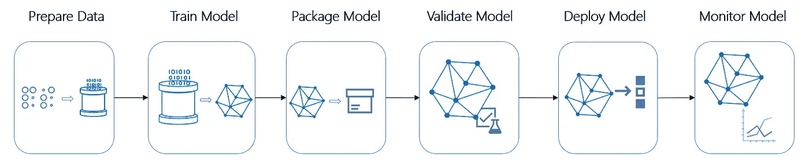

# 我不知道如何建立一个机器学习管道。但我是这么想的。

> 原文：<https://towardsdatascience.com/i-had-no-idea-how-to-build-a-machine-learning-pipeline-but-heres-what-i-figured-f3a7773513a?source=collection_archive---------5----------------------->

## 学习从零开始构建机器学习管道


Photo by [JJ Ying](https://unsplash.com/@jjying?utm_source=medium&utm_medium=referral) on [Unsplash](https://unsplash.com?utm_source=medium&utm_medium=referral)

> 当事情变得困难时，困难就开始了。

作为一名学习人工智能(AI)的研究生，我对机器学习(ML)的接触很大程度上是学术性的。然而，当给我的任务是为时间序列预测模型创建一个简单的 ML 管道时，我意识到我是多么的无知。此外，我几乎找不到任何关于这个主题的具体信息或代码，因此我决定写这个主题。

本文将介绍如何创建一个简单的 ML 管道的基本结构(*随着时间的推移，可能会补充更多的信息*)。

## 什么是机器学习管道*，为什么它们是相关的？*

正如“管道”一词所暗示的，它是 ML 循环中一系列链接在一起的步骤，通常涉及获得数据、处理数据、对各种 ML 算法进行训练/测试，以及最终获得一些输出(以预测等形式)。与传统的“管道”不同，新的现实输入及其输出通常会反馈到更新模型的管道。微软 Azure 的这篇[文章](https://docs.microsoft.com/en-us/azure/machine-learning/service/concept-ml-pipelines)很好地描述了 ML 管道。



Typical ML Pipeline (source: [https://docs.microsoft.com/en-us/azure/machine-learning/service/concept-ml-pipelines](https://docs.microsoft.com/en-us/azure/machine-learning/service/concept-ml-pipelines))

简而言之，ML 变得如此广泛如此迅速，以至于模型的准确性变得与访问、缩放和存储这些模型的能力同等重要。ML 管道本质上是一个**自动化 ML 工作流程**。

(管道现在已经可以在平台上使用，比如 Azure 机器学习管道和亚马逊 SageMaker。虽然它们代表了数据团队构建和部署的一种快速有效的方式，但是本文并没有解决上述这些服务。)

## 动机

在构建和部署 ML 模型时，效率是关键。然而，理解其中的细微差别和困难将有助于我们理解为什么自动化工作流是非常受欢迎的，尤其是当我们谈到可伸缩性和跟踪变更的简易性时。

除了拥有适当的结构和隔离 ML 堆栈不同部分的方法(数据处理、特性选择等)，值得一提的是*日志记录更改*也是 ML 模型部署的重要部分。以下是一些原因:

*   如果输入要素发生变化，其余要素的权重也可能发生变化。我们希望始终能够跟踪一个模型相对于另一个模型的增量，以便我们能够始终评估是否有任何改进。
*   当我们不断迭代有细微变化的模型时，在保持清晰和灵活性的同时跟踪配置文件的更新变得很困难。
*   数据输入可能会随着时间而改变。将这些作为日志的一部分进行跟踪也很重要。
*   随着额外的数据反馈，更新测试和验证集是很重要的，因为我们需要保证模型之间的可比性。

## ML 管道的组件

1.  **README.md**
    大多数人应该对这个很熟悉。这只是一个**降价**文件，指导用户如何运行具有任何特性的管道。这方面的例子可以在任何 Github 存储库中找到。
2.  **requirements.txt**
    这是一个**文本** **文件**保存了所有的库版本需求。它由所有用于在管道中执行代码的外部(非预安装的 Python 库)库组成。创建这样一个文件的目的是为了让管道可以很容易地移植到另一个平台上，比如 Docker 容器或虚拟机。安装这些需求可以作为 *run.sh* 文件的一部分。 *requirements.txt* 文件的例子如下:

```
scikit-learn==0.20.0
numpy==1.16.3
pandas==0.24.2
statsmodels==0.9.0
scipy==1.3.1
Keras==2.2.4
seaborn==0.8.1
```

3. **run.sh**

这本质上是一个 **bash 脚本**来完成以下任务(非穷举):

*   下载可能存储在云上的数据
*   在 *requirements.txt* 中安装库需求
*   创建任何文件夹/子文件夹来存储输出(日志、图表等)。)
*   运行任何属于 ML 管道的 python 模块/类/脚本

```
# Download dataset stored on cloud
curl -o dataset.csv [https://insert_cloud_storage_url/dataset.csv](https://insert_cloud_storage_url/dataset.csv)# Install libraries in requirements.txt
pip install -r requirements.txt# Make a charts directory if it doesn't exist; This is to store model chart outputs for example
[ -d charts ] || mkdir charts# Execute main script
python mlp/main.py -f experiments/config.yaml
```

4. **main.py**

这应该是执行大部分代码的主文件。这应该包括解析配置文件的代码(在步骤 5 中)。一个例子可能是这样的(这个例子来自马丁·托马斯——大声喊出来帮忙！):

```
def load_cfg(yaml_filepath):
    """
    Load a YAML configuration file. Parameters
    ----------
    yaml_filepath : str Returns
    -------
    cfg : dict
    """
    # Read YAML experiment definition file
    with open(yaml_filepath, 'r') as stream:
        cfg = yaml.load(stream)
    cfg = make_paths_absolute(os.path.dirname(yaml_filepath), cfg)
    return cfgdef make_paths_absolute(dir_, cfg):
    """
    Make all values for keys ending with `_path` absolute to dir_. Parameters
    ----------
    dir_ : str
    cfg : dict Returns
    -------
    cfg : dict
    """
    for key in cfg.keys():
        if key.endswith("_path"):
            cfg[key] = os.path.join(dir_, cfg[key])
            cfg[key] = os.path.abspath(cfg[key])
            if not os.path.isfile(cfg[key]):
                logging.error("%s does not exist.", cfg[key])
        if type(cfg[key]) is dict:
            cfg[key] = make_paths_absolute(dir_, cfg[key])
    return cfg
```

之后，该文件可用于运行其他脚本中的代码，这些脚本可用于数据预处理、特性选择、参数调整等。这个文件构成了其他文件的主干。

5.**配置文件**

通常，模型配置(调整超参数等)总是写在代码块本身中。但是，在单独的配置文件中维护这些配置已经成为一种惯例，因为它们可以更容易地处理，并且不需要在实际的代码块中进行修改。这些都是典型的 [*。yaml* 文件](https://en.wikipedia.org/wiki/YAML)。以下内容应该可以通过配置文件进行配置:

*   数据集加载
*   预处理
*   特征抽出
*   参数选择
*   模型创建
*   模型评估

一个*的例子。yaml* 文件应该是这样的:

```
dataset:
  script_path: ../datasets/cifar10_keras.py
model:
  script_path: ../models/optimized.py
optimizer:
  script_path: ../optimizers/adam_keras.py
  initial_lr: 0.0001
train:
  script_path: ../train/train_keras.py
  artifacts_path: ../artifacts/cifar10_opt/
  batch_size: 64
  epochs: 1000
  data_augmentation:
    samplewise_center: False
    samplewise_std_normalization: False
    rotation_range: 0
    width_shift_range: 0.1
    height_shift_range: 0.1
    horizontal_flip: True
    vertical_flip: False
    zoom_range: 0
    shear_range: 0
    channel_shift_range: 0
    featurewise_center: False
    zca_whitening: False
```

6.**创建的任何其他 python 模块/类/脚本**

这可以包括从数据预处理、特征选择到处理数据所需的任何事情。

7.**正确的项目文件夹结构**

有一个合适的文件夹结构是很重要的，因为对于任何试图理解项目如何工作的人来说，这变得更加整洁和清晰。

```
├── artifacts
│   ├── train : Logfiles, trained models
│   └── test  : Logfiles
├── datasets : Data loading scripts
├── experiments : Configuration files
├── models : Scripts defining how the model looks like
├── optimizers : Scripts defining the optimizeres
└── train : Script to run the training
```

## 估价

每个机器学习模型都有一个评估指标，通常以交叉熵(又称对数损失)、均方误差/绝对误差或简单的准确度(或精确度/召回率)的形式存在。这些指标可以输出到控制台，以帮助用户确定模型是否在改进，或者可以记录到文本文件中。

# 结束语

希望这能帮助那些试图理解为什么机器学习管道很重要以及如何创建一个管道的人！

***支持我！*** —如果你喜欢我的内容并且*没有*订阅 Medium，请考虑支持我并通过我在这里的推荐链接[订阅](https://davidcjw.medium.com/membership) ( *注意:你的一部分会员费将作为推荐费*分摊给我)。