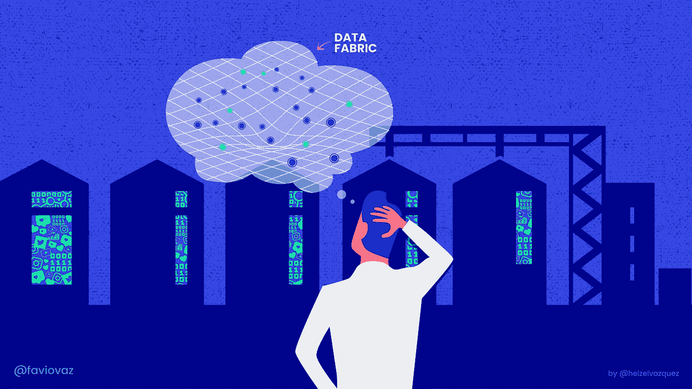
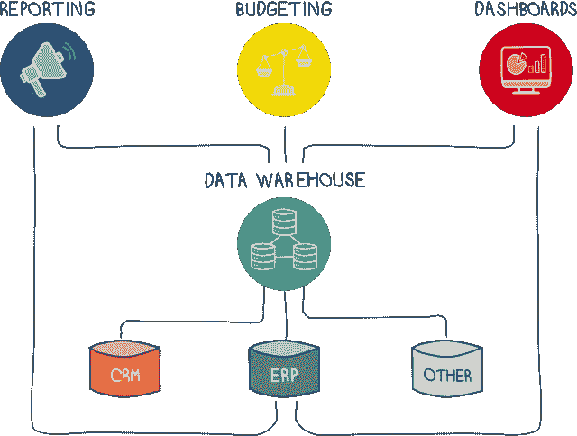
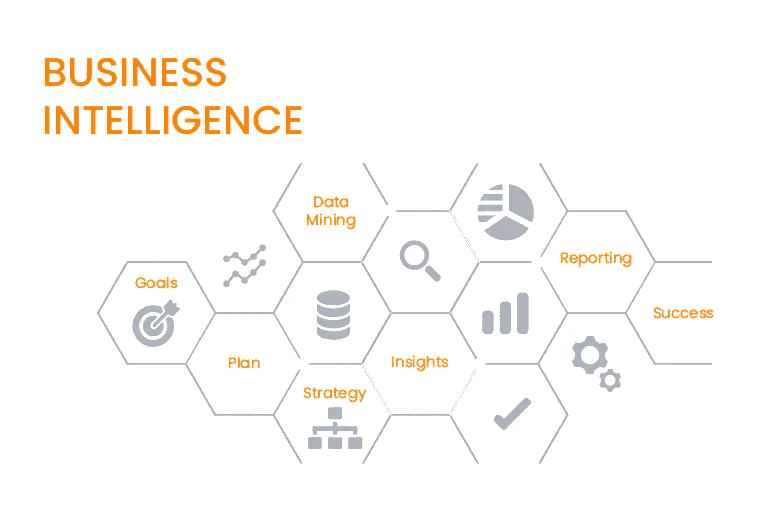
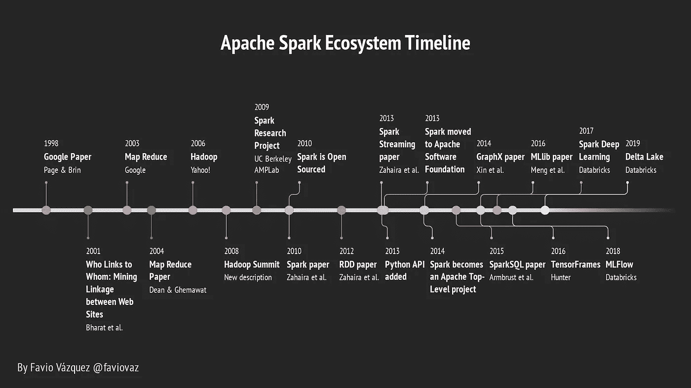
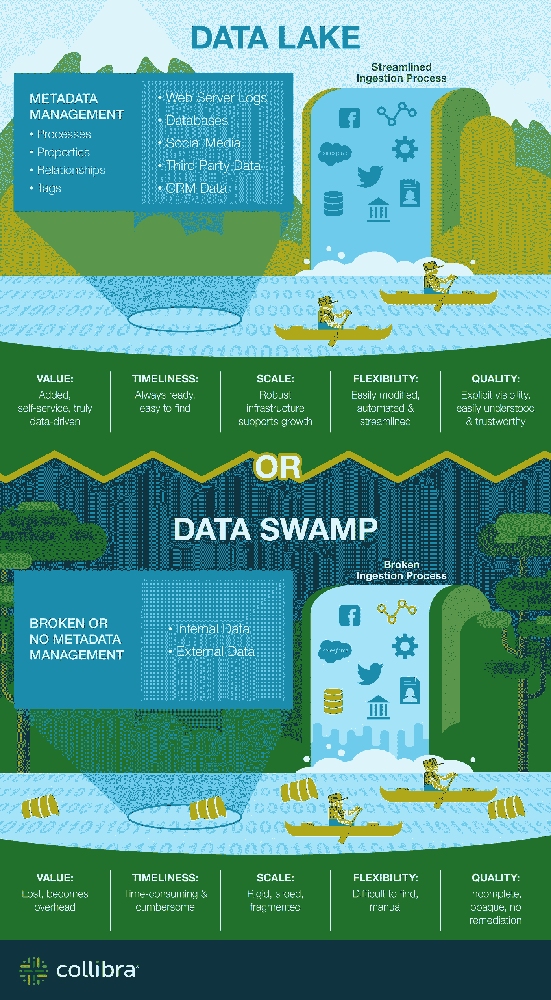
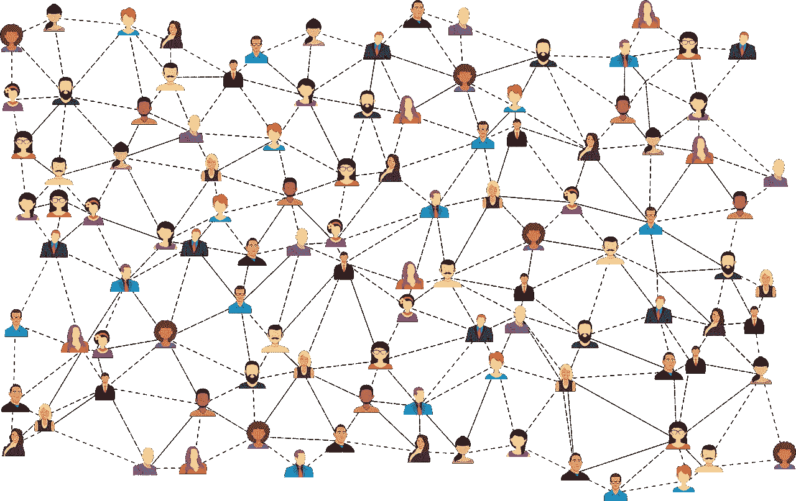

# 我有很多数据，就是不知道在哪里！

> 原文：<https://towardsdatascience.com/i-have-a-lot-of-data-i-just-dont-know-where-421d98c3cc3a?source=collection_archive---------14----------------------->

## 如果你对你的公司有这样的看法，你应该看看这篇文章。

Follow our company [https://twitter.com/cienciaydatos_](https://twitter.com/cienciaydatos_)

# 介绍

[https://hbr.org/2017/06/does-your-company-know-what-to-do-with-all-its-data](https://hbr.org/2017/06/does-your-company-know-what-to-do-with-all-its-data#comment-section)

如果你正在读这篇文章，很可能你正在用你的数据做些什么，或者想用它做些什么。但是，这并不容易，对不对？

如今(实际上)大多数以数据为中心的项目都很复杂、昂贵，需要组织和文化的改变，有很长的时间来实现价值，并且不容易扩展。有什么问题？

在这篇文章中，我将讨论在我看来公司试图使用他们的数据面对的最大问题，它与几十年来做的事情有关，这些事情过去有效，但现在不再有效。

# 数据难题

欢迎来到数据时代。一切都产生数据，每个人都想使用它。最大的问题是如何实现？

在剑桥语义学最近的一篇名为“[数据结构的故事](https://info.cambridgesemantics.com/the-story-of-the-data-fabric-whitepaper)的文章中，他们指出了我们在组织和数据中存在的三个具体问题:

*   来自大量结构化和非结构化来源的数据比以往任何时候都多。
*   原始形式的数据在数据质量方面变化很大。有时它是成形的和干净的。其他时候是稀疏的，不均匀的。
*   数据有许多不同的(和不兼容的)格式。

[https://blog.adverity.com/data-warehouse-marketing-better-faster-insights](https://blog.adverity.com/data-warehouse-marketing-better-faster-insights)

这一切都来自于“**数据湖时代**”。几年前，当数据开始呈指数级增长时，我们改变了我们的**数据仓库**，简而言之，它是将来自组织内许多不同来源的**数据**汇集在一起的系统，用于将**报告**和**分析**到数据湖。几乎每个组织中都有数据仓库，它们是为数据科学的前身“商业智能(BI)”而创建的。在 BI 中，我们对来自关系数据库(主要是)的有组织和结构化的数据进行报告、分析和研究，原始数据虽然存在，但并没有被使用。

[https://www.inovaprime.com/business-intelligence-transform-data-into-successful-decisions/](https://www.inovaprime.com/business-intelligence-transform-data-into-successful-decisions/)

当数据增长并变得越来越怪异和无结构时，一个新的范例出现了。浩荡的**数据湖。**

[https://www.credera.com/blog/technology-solutions/comparing-data-lakes-and-data-warehouses/](https://www.credera.com/blog/technology-solutions/comparing-data-lakes-and-data-warehouses/)

在几乎所有从事大数据和数据科学的公司中，这都是标准。数据湖的前提是:存储任何规模的所有结构化和非结构化数据。所以我们开始这样做。然后创造了很多新技术来管理它们，比如 [Hadoop](https://hadoop.apache.org/) 和 [Spark](https://spark.apache.org/) 。

这是我不久前创建的 Apache Spark 的一个简短故事，但也展示了大数据在这些年里是如何转变的(顺便说一句，这是最新的):

[https://twitter.com/faviovaz](https://twitter.com/faviovaz)

到底发生了什么？我们有可能分析大量的数据，不同类型的数据，而且是实时的，这太棒了。但问题是，尽管我们尽了最大努力来管理我们的数据，并使一切严密，但这并不容易。

我们的大多数数据湖都变成了数据沼泽:

[https://www.collibra.com/blog/blogdata-lake-vs-data-swamp-pushing-the-analogy/](https://www.collibra.com/blog/blogdata-lake-vs-data-swamp-pushing-the-analogy/)

这种情况并不少见。**尽管我们有办法改善我们使用数据湖的方式，并真正管理它，但在我们需要的时候获取我们想要的数据并不容易。**

这就是为什么当我与公司合作时，我听到最多的是:

> 我们有很多数据，只是不知道在哪里。它应该在这里的某个地方…

This is not what we want :(

数据通常在筒仓中，由一个部门控制，并与组织的其他部分隔离，就像农场筒仓中的谷物与外界隔绝一样。是时候停止了。请记住:

> 要从数据中提取价值，数据必须易于探索、分析和理解。

# 走向数据结构

如果您一直关注我的研究，您可能还记得我对数据结构的定义:

> 数据结构是支持公司所有数据的平台。它是如何被管理、描述、组合和普遍访问的。该平台由企业知识图构成，以创建统一的数据环境。

这里我想强调两点，数据结构是由**企业知识图**构成的，它应该尽可能自动化**。**

**为了创建一个知识图，你需要语义和本体来找到一个有用的方法来链接你的数据，唯一地识别和连接数据与常见的业务术语。**

**这里的关键是，在这个新模型**下，我们不是在寻找可能的答案，而是在寻找答案。我们想要事实——那些事实从何而来并不重要。****

**数据湖的概念也很重要，因为我们需要一个存储数据、管理数据和运行工作的地方。但是我们需要一个智能数据湖，一个了解我们拥有什么以及如何使用它的地方。我们必须努力将组织中的所有数据组织在一个地方，并真正管理和治理这些数据。**

**为了进入数据结构领域，我们需要开始考虑本体、语义、图形数据库、关联数据等，以构建知识图，然后找到一种自动接收、准备和分析数据的方法。**

**您可以在此阅读有关如何开始构建数据结构的更多信息:**

** [## 机器学习的数据结构。第 2 部分:构建知识图。

### 在能够开发数据结构之前，我们需要构建一个知识图。在这篇文章中，我将建立一个基础…

towardsdatascience.com](/the-data-fabric-for-machine-learning-part-2-building-a-knowledge-graph-2fdd1370bb0a) 

# 结论:数据结构中的数据科学

[https://towardsdatascience.com/the-data-fabric-for-machine-learning-part-1-2c558b7035d7](/the-data-fabric-for-machine-learning-part-1-2c558b7035d7)

使用数据的最终目的是从中做出决策。数据科学做到了这一点:我们有数据，在数据科学工作流程之后，我们应该能够根据我们创建的分析和模型做出决策。

到目前为止，我已经写了两篇关于如何开始在数据结构中进行机器学习(ML)和深度学习(DL)的文章:

 [## 机器学习的数据结构。第一部分。

### 语义学的新进展如何帮助我们更好地进行机器学习。

towardsdatascience.com](/the-data-fabric-for-machine-learning-part-1-2c558b7035d7)  [## 机器学习的数据结构。第 1-b 部分:图上的深度学习。

### 图形的深度学习日益重要。在这里，我将展示思考机器的基础…

towardsdatascience.com](/the-data-fabric-for-machine-learning-part-1-b-deep-learning-on-graphs-309316774fe7) 

在此之前，我们需要打破我们的“数据孤岛”,协调组织数据对于发现新的见解和释放我们数据的全部潜力是必要的。

我们真正需要的是一个允许数据分析的基于图表的系统。通常这被称为图形在线分析处理(OLAP)。

图形 OLAP(如 Anzo)可以提供企业大规模大数据分析所需的高性能，并与图形在线事务处理(OLTP)数据库(如 Neo4j、Amazon Neptune、ArangoDB 等)相结合。)你有一个很好的方法来开始构建你的知识图表。

成功创建数据结构后，您将能够执行数据科学工作流中最重要的部分之一:机器学习，因为 ML 在此上下文中是:

> *使用算法在数据结构中发现见解的自动过程，该算法能够使用存储在 it 中的数据找到这些见解，而无需专门为此编程。*

还要记住，通过结构生成的洞察本身是新数据，这些新数据作为结构的一部分变得显式/明显。也就是说，洞察力可以扩大图表，潜在地产生进一步的洞察力。

因此，在数据结构中进行数据科学的过程要容易得多，因为我们有一个完整的系统来存储和自动化数据接收、处理和分析，这也使我们能够以更快、更清晰的方式找到和探索组织中可用的所有数据。不再有奇怪的数据和庞大的查询来获得简单的值，这也是目标之一。

我们周围有一些我们甚至不知道的数据结构的例子。世界上大多数成功的公司都在实施和迁移他们的系统，以构建数据结构，当然还有其中的所有东西。我想是时候让我们所有人都开始建立自己的了。

感谢你阅读这篇文章。如果您有任何问题，请在此写信给我:

 [## 法维奥·瓦兹奎——science y Datos | LinkedIn 创始人/首席数据科学家

### 加入 LinkedIn ‼️‼️重要提示:由于 LinkedIn 技术限制，我现在只能接受连接请求…

www.linkedin.com](https://www.linkedin.com/in/faviovazquez/) 

祝学习愉快:)**