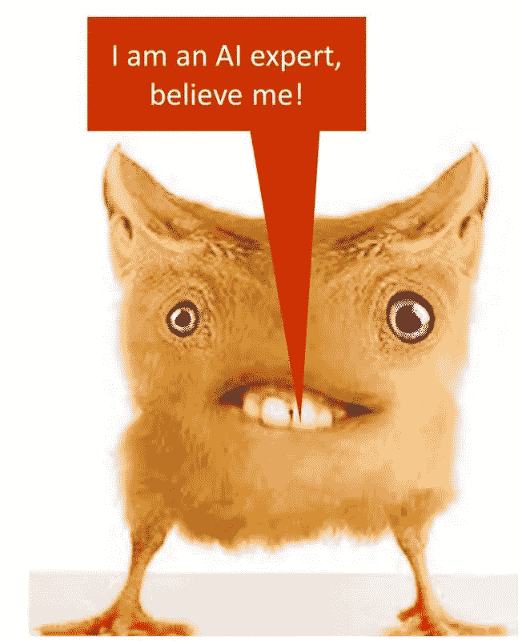
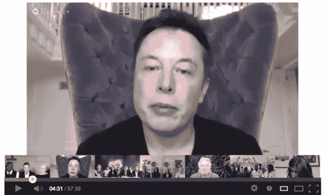
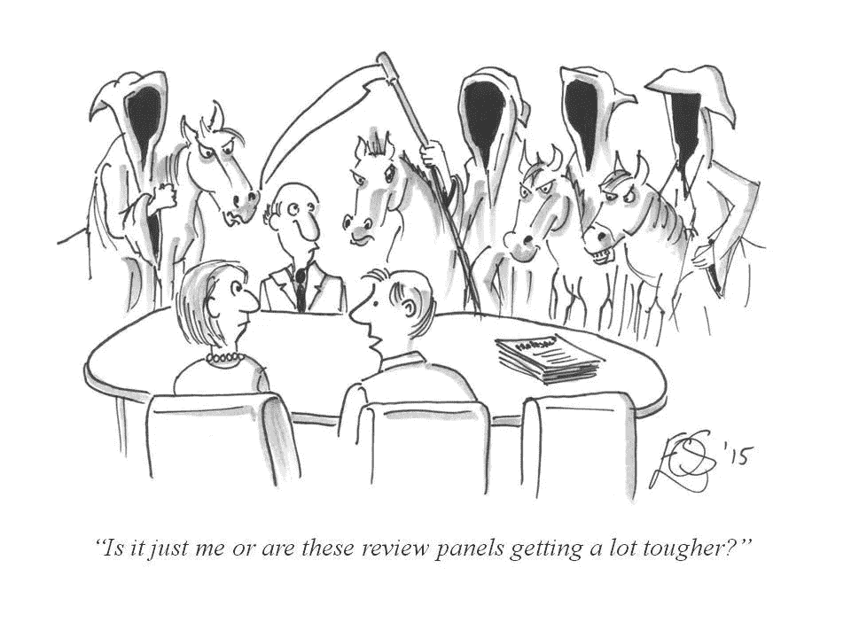
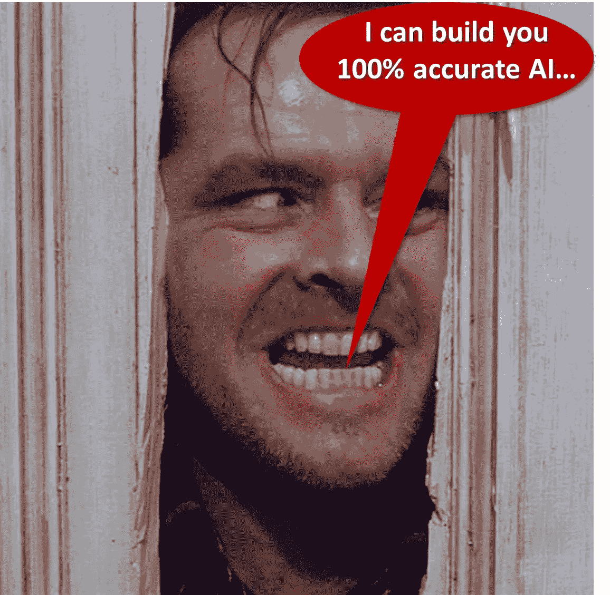
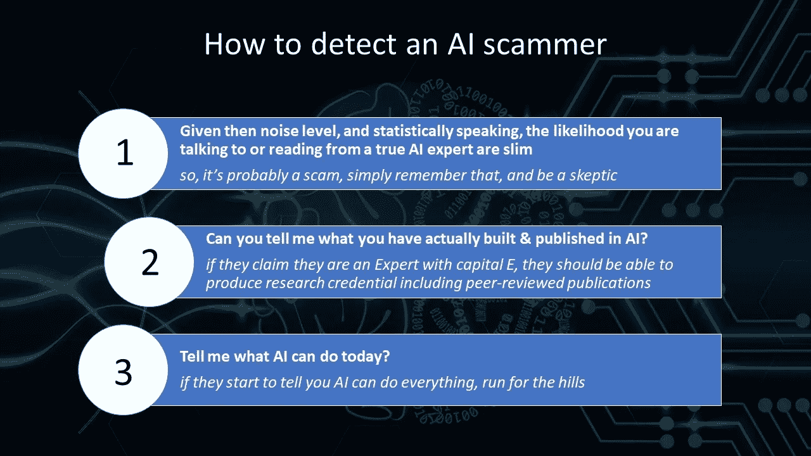

# 《我知道 AI》:如何抓深度学习骗子

> 原文：<https://towardsdatascience.com/i-know-ai-how-to-catch-deep-learning-scammers-60324c87b2eb?source=collection_archive---------16----------------------->

I know AI… gimme gimme

今天早上，我在开始新的一天之前喝着我通常喝的浓咖啡，平静地浏览 LinkedIn 的帖子，这时我看到了一篇由新动物学物种的一名成员(自称)人工智能专家撰写的文章。

虽然这个家伙(某个寻求关注的博主)和主题(意识、机器，以及他认为他真的需要写的其他超级大操蛋的东西)并不重要，但两个想法迅速在我脑海中闪现。

首先，不仅仅是一个想法和情感:我是一个愤怒的爱喝浓缩咖啡的意大利人，他真的很享受他的 am 杯，不会被不好的东西打扰，比如阅读无意义的人工智能垃圾。

第二:我怎样才能阻止这种情况，防止全球范围的浓缩咖啡中毒，同时也帮助其他对人工智能感兴趣的人迅速

> *撇开这些骗子，专注于什么是真正的人工智能内容？*

与此相关，我想到了另一个问题:

> *我怎样才能帮助雇主或企业净化人工智能黄金，使其远离垃圾和假货？*

我想出了一个三条规则的小备忘单——在这篇文章的最后找到它——你可以免费下载、打印和使用。

当你阅读一个“人工智能专家”的帖子，雇用一名自称是人工智能专家的员工，或者，如果你是一名企业主或负责思考人工智能产品，面试所谓的“人工智能解决方案提供商”，声称是最后一个艾龙绝地血统时，你可以记住这些原则。

这将是不完整的，快速而简单的，但是注射一针禽流感疫苗总比在一个充满禽流感病毒的社会里漫不经心地走来走去要好。

虽然，直到最近才像那样…

# 当事情真的很糟糕的时候

我在意大利高中毕业后就加入了对人工智能的探索，当时构建神经网络既不时尚(范思哲衬衫是这样的……)也不酷。

{是的，今天工作的人工智能的真实名字叫做神经网络}。

这实际上是一种耻辱:我记得，在波士顿攻读博士学位期间，有一天走出麻省理工学院，被告知"*神经网络巫毒之类的东西根本行不通，专注于决策树。*“令人沮丧。

那是艰难的时期，对科学的纯粹热情(以及几茶匙的固执和疯狂)对我和我的许多人工智能同事来说是必不可少的，尽管有批评和居高临下的评论。我甚至记得一个国防部机构的项目经理告诉我。听着，我喜欢你，我甚至可以考虑这个提议，但请把这些神经网络废话从文本中删除，然后我们再看”。

但是对于那些能够坚持自己的信仰和理论的人来说，事情有了很好的转机。对麻省理工学院来说没什么，他们输掉了人工智能的比赛，他们生产的更聪明的人工智能/机器人是 Roomba，它像一个被蒙住眼睛的醉汉和超重的沙鼠一样撞桌子和椅子。以下是令人惊叹的技术演示:

[https://www.youtube.com/watch?v=ASjLXrbVlMw](https://www.youtube.com/watch?v=ASjLXrbVlMw)

这里跑题了，回到 AI。

然而，我需要再三考虑我的愿望…

虽然神经网络将麻省理工学院传统人工智能理论爱好者甩在身后是件好事，但人工智能及其意识的兴起不幸地向我们吐了太多虚假的“人工智能专家”。

从某种意义上来说，这让那些想成为“人工智能嗡嗡声”一员的人撒了很多谎。一些告诉我们*“这是永远不会起作用的巫毒肥料”*的人现在是神经网络的倡导者*、*以及在他们的简历、网站等地方撒上 *AI、ML、深度学习*的全新人群，就像是牛肝菌蘑菇烩饭上的欧芹一样(我可以做一个很棒的——欧芹最后会变得新鲜……是的，大量)。

由此产生的新动物学物种以不同的形式出现，从“人工智能专家”到“人工智能程序员”到“人工智能工程师”，声称直接来自人工智能宙斯，并饮用人工智能知识的源泉。

所以，这里有一张小抄，以一些简单规则的形式给你。

# 让我们从简单的开始:

如果他们开始谈论埃隆·马斯克和*“人工智能接管世界”*，或者张开他们的嘴，你认为在听到*“埃隆……”*之后，他们会完成*“…n·马斯克”*，跑向门口(或者给他们看一个)。我在下面放了一张图来提醒你为什么:

# 为了 f#@&缘故，算算吧:他们不是专家

好了，你去掉了高斯的马斯克尾巴。唷！….让我们来看看真正的第一条规则。

现在，说真的，让我们花点时间做些数学计算。

> *全球大约有 2.2 万名拥有博士学位的人工智能专家*

(如果你不相信我，请在下面打勾)。

[https://www . Bloomberg . com/news/articles/2018-02-07/just-how-shallow-is-the-artificial-intelligence-talent-pool](https://www.bloomberg.com/news/articles/2018-02-07/just-how-shallow-is-the-artificial-intelligence-talent-pool)

估计其中大概有一半能真正(真正)知道自己在做什么(更别说成为真正的思想领袖了)，你注定会落到 10K 下面。随着人口接近 8B，你与人工智能专家交谈的机会确实很小。

所以，规则 1，你的默认值是:

> 规则 1:从统计学上来说，我不是在和专家交谈。我需要持怀疑态度。

现在，为什么和一个有博士学位的专家交谈很重要？让我们来看看第二条规则:

# 如果他们声称自己是专家，告诉他们“让我看看”

现在，有很多聪明人，很多超级聪明的人和天才等等。他们原本没有选择人工智能作为他们的激情和焦点，但现在想进入人工智能。我认识很多这样的人，我要说的是:

很好，很棒，这是当今地球上可能发生的最好的事情之一，应该受到称赞。我们需要更多对 AI 感兴趣的人！更多！更多！

当这些人(以及他们那些没有喝过智能河水的不那么聪明的表亲)声称他们是人工智能专家时，问题就来了，这就是第二条规则出现的时候。这很简单。*让他们给你看*。就像墨菲斯问尼欧会不会功夫。

和你说话的人是什么背景？他们接受过正规的 AI 教育吗？如果是，他们在哪里，什么时候，学了什么？

请他们在他们声称是专家的人工智能领域发表论文(论文、书籍章节、摘要)。这将是一个非常简单但极具指示性的酸性测试。

为什么？发表一篇经过同行评审的人工智能论文需要几个月或几年的努力，并经历严谨的思维过程，包括推介和专家同行的评判(以及消化几乎不可避免的修改和拒绝)。这是一个你希望你的专家/雇员/顾问经历的心理健身房，作为*必要条件*他们作为人工智能专家的输出是无效的。

人工智能就是这样一个既广又深的领域。大脑是一个极其复杂的机器，成千上万的研究已经分析、剖析并试图用数学来形式化它的复杂性。你想依赖那些了解人工智能的人，特别是当你雇佣一个“人工智能预言家”来告诉你人工智能的走向，以便你的组织做好准备。我自己在这个领域花了 20 多年，我几乎没有触及表面…知道你大脑中的每一个突触是如何工作的，能够用数学方法模拟它以及神经元中数以百万计的其他结构，一直到行为的宏观方面，更不用说把这些东西放在硅片上的问题了……这不是你在 Coursera 上学到的东西——一辈子是不够的。让我们现实一点，废话少说。

如果他们没有付出多年的努力——并向他们的同行证明他们无愧于自己的主张——那就忽略不计吧。

所以，总结一下:

> 规则 2:如果你是专家，给我看看你的同行评审出版物。如果你没有，再见。

# 嘿，快速问题…你认为 AI 今天能做什么？

这是另一个严峻的考验。虽然有一个共同的信念，特别是在舔邮票的硅谷主义者中*“要天真，要大胆，你对一个主题知道得越少越好……你会跳出框框思考，赚一大笔钱”*，我邀请你和一个刚刚告诉你*“嘿，我以前从未驾驶过宇宙飞船，这就是为什么它会工作”的人一起踏上飞往火星的火箭。*

再见。

现在，根据我的经验，人们认为人工智能可以做、擅长并准备投入使用的东西的数量(包括认为人工智能已经准备好接管并杀死我们所有人的人群)与他们真正了解人工智能的程度成反比。

简单来说:

> *真 AI 专家= >“今天的 AI 有局限性”*

由于她已经从事这项工作，她知道要达到 100%准确的工作系统有多难，并且会清楚地表达期望、限制和“完美路线图”，这通常比我们提前几年。但这是真的，由此产生的人工智能将做承诺的事情——这通常仍然非常有用。恰恰相反:

> *人工智能骗局= >“我可以给你造一个做你想做的一切的人工智能”*

简而言之，第三条规则:

> 规则 3:如果他们开始告诉你人工智能无所不能，赶紧逃之夭夭

# 好的，正如我所承诺的，这是给你的三条可打印的备忘单:

这些规则不是神剑，但可以帮助。

尽情享受吧！

*原载于 2019 年 2 月 22 日*[*https://medium.com*](https://medium.com/overcoming-deep-learning-ai-2-0/deep-scammers-how-to-catch-ai-false-prophets-69841f4db4fa)*。*