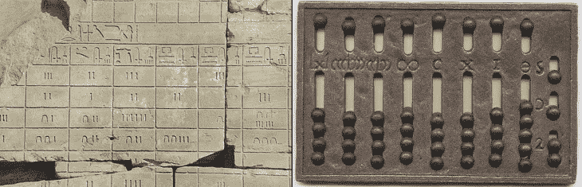
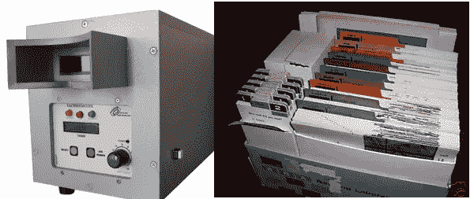
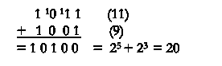
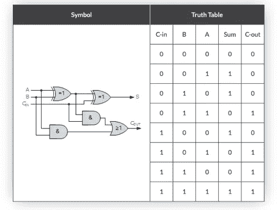
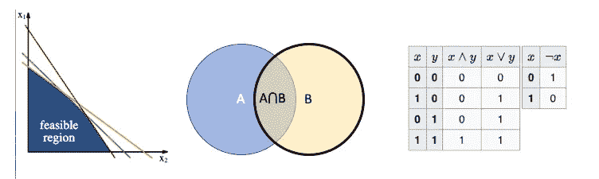
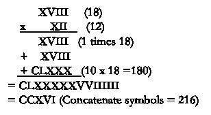

# 我喜欢新的数学

> 原文：<https://towardsdatascience.com/i-liked-the-new-math-e4a9c9d2e170?source=collection_archive---------20----------------------->

## “谢尔曼，把 WABAC 机器调到很远很远的地方…”

Figure 1: Egyptian numerals and a Roman counting board (Roman abacus)

*“当我回想起我在高中学的那些废话时，我能思考真是个奇迹”*——西蒙和加芬克尔*，柯达彩色胶卷*

我们成长于 60 年代的加州，经历了很多教育实验。我们在课堂上有豆袋椅。我们眯着眼睛看着不舒服的金属和玻璃装置进行“快速阅读”。我们阅读彩色层压卡片上的文学片段。我记得在阅读箱结束时，我为达到 SRA 等级“紫色”而自豪，但不是读一本真正的书。四个食物组被一个金字塔代替，鼓励你吃很多很多的碳水化合物。然后是“新数学”

Figure 2: Why Johnny can’t read. A tachistoscopic projector and the SRA reading system

《新数学》是数学课程中的一次雄心勃勃的变革，以应对“人造卫星冲击”这在美国是一件大事，在欧洲也是如此。这是一个大胆而雄心勃勃的计划，要把每个孩子都变成下一个沃纳·冯·布劳恩(假设沃纳·冯·布劳恩是艾伦·图灵)。这也是一个明显的失败。

我喜欢它。嗯，不全是。如果你像我一样，你沉浸在其中，你不能可靠地将它与旧数学(如乘法表、代数、几何等)区分开来。).新数学扩展(并取代)了传统数学课程的抽象主题，如集合论、模运算、代数不等式、数基、符号逻辑和布尔代数。咻！谁还记得不平等？(提示:它涉及对象中的数字线和阴影)

愤世嫉俗和争论哪个话题最没用有点太容易了，新数学在当时受到了相当正确的批评(参见:*为什么强尼不能加:新数学的失败* [1】)。

新数学于 1973 年夭折。(凶手稍后揭晓。)将近 50 年后，我想弄明白这到底是怎么回事。以下是我的亲身经历。你们很多人会感受到我的痛苦。或许，你会像我一样，在大学或研究生院经历过似曾相识的感觉，其中一些概念再次出现，甚至开始变得有意义。

**基数**

最受嘲笑的话题是基数。汤姆·莱勒在一首歌中模仿了它，这首歌抓住了父母和老师的困惑:

*我从中得到这个问题的那本书要你用八进制来做。但是不要慌！八进制实际上就像十进制一样——如果你少了两根手指的话！*

我们可以试一试吗？坚持住…

*你不能从二中减去三，
二小于三，
所以你看看八位中的四。
现在实际上是四个八，
所以你把它变成三个八，
重组，你把一个八变成八个一
然后你把它们加到两个上，
你得到一个二进制八，
这是十进制十，
你拿走三，这是七。
Ok？*

*新数学万岁，
很简单，
非常简单，
只有孩子才能做！”*

可以说，基数是所有数字中最容易接近和最实用的。快速更新一下，下面是基数为 2 的 7:

7 = 2⁰+2 +2 = 111 基数 2

加法(和其他算术运算)的执行方式与普通数学(以 10 为基数:

显然，二进制数学在数字时代变得至关重要。为了强调这一点，我们和一位 NASA 工程师以及一台 10 英尺高的电脑开了一个学校大会。谁不想成为一名宇航员？什么时候我们都会有自己的电脑？

学习基本数字和其他替代数字系统是有价值的，就像学习外语可以帮助你理解你的母语一样。一个来自生物学的类比:“如果你想知道为什么只有两种性别，试着想象 3…或 7 的进化优势。”

二进制是独一无二的，因为它是开关(开/关)、逻辑(对/错)，当然还有计算机的自然语言。二进制数学及其孪生兄弟布尔代数允许我们设计电路来执行任何数学计算(图 3)。

Figure 3: A physical embodiment of an adding machine, combining elementary logic circuits AND, OR, and NOT. The variable C_out is the carry digit. Cool, huh?

我们了解到计算机可以做任何数学上的事情。布尔代数可以用来解决逻辑和命题演算。计算机在数学或逻辑推理方面的表现比人类更好！(实际上，这有点令人沮丧。一种新的、时髦的东西“人工智能”风靡一时。电影对计算机统治世界发出了世界末日般的警告(2001 年*【18】【1968】，*科洛斯:福宾计划*【1970】)。听起来熟悉吗？*

所以，我们这些流鼻涕的孩子明白一些我们父母不明白的事情。我们离理解数字计算机的工作原理只有几个星期了。布尔代数正在取得进展，但是突然，我们进入了另一个抽象层次。这是五年级和一些新代数的时间。

**集合论**

四年级和五年级的数学对我来说有点模糊。出于某种原因，我们不再把数字看作数量，而是把数字看作事物，而事物属于集合。从我的记忆中，一个介于 4 和 8 之间的整数变成了“整数集:”

S0 = {5，6，7}，它是两个无限集合的交集:

S0 = S1 ⋂ S2，其中

S1 = {-∞，… 4，5，6，7}而 S2 = {5，6，7，8，9，… ∞}

当时和现在对我来说，这是一个完全的谜，为什么数学应该通过将数字视为“集合”中的“对象”而变得更容易。如果这给我贴上了市侩的标签，就当我是小资产阶级的一员吧。无产者如何看待这一切？

集合论是许多数学分支的潜在基础，因为几个领域的公理都可以转换成更一般的理论。另一方面，它在实践中是笨拙和乏味的，每个学科的原生方法更简单和更容易使用。集合论的一个不幸遗产是维恩图，这是人们唯一记得的东西，并且在商业演示中无处不在地使用，以给出内容的幻觉。

**代数不等式**

由于想出一组连续的数是相当困难的，我们的老师同时引入了代数不等式来处理实数行上的量，因此 4 到 8 之间的实数可以表示为

4 < x < 8

Which could be expressed using the logical/Boolean notation:

x > 4 和 x <8

Problems moved on to thinking in two dimensions (4x+y < 0), so we were finally moving into traditional algebra. Set theory was cast aside, perhaps because they had run out of examples of problems easily solved with set theory.

Figure 4: One Algebra to rule them all? Parsing Space, Things, and Propositions.

By the end of the 5th grade, our minds whirled with the nuances of the operations union(U), addition( **+** )，以及‘逻辑 AND'(⋀).它们都“有点”是同一个想法，但是每种情况下的数学都不同。到目前为止，在掌握基础代数之前，我们已经学习了三种代数。显然，我们需要的是另一个代数。

**模运算**

我没有在模运算上投入太多时间——可能是因为我的老师不知道它有什么用处。需要澄清的是:我在 1998 年的老师大多是被解雇的火箭科学家.(以防你错过，我们在 1969 年赢得了太空竞赛。)如果我的老师们不明白这一点，他们可能会有所发现。

模运算(有时也称为时钟运算)处理在一个周期内重复的数字——或模数(对于时钟来说是 12 ),并找出余数。如果两个数 *a* 和 *b* 被 *n* 除后有相同的余数，则称它们为*同余*。

*a*≡*b*mod*n*

在时钟时间中，从午夜开始的 100 个小时等于凌晨 4 点

100 mod 12

在西方音乐中，频率每 12 个音符增加一倍，所以所有的“C 音”在 mod 12 中都是全等的。

加、减、除、换等都有规律可循。类似于普通算术的规则。但是，尽管二进制数学与十进制数学有一点点不同，但模数学却有很大不同。

我做了 40 年的专业科学家，从来没有使用过计算器上的“MOD”按钮，所以认为这个按钮有用的人一定是一个真正的爱好者。另一方面，也许他是在炫耀他知道模数是什么，而设计会议上没有人有勇气问。

我已经有几十年没想过这个问题了，直到我听了一个有趣的讲座，讲的是它的发明者卡尔·弗里德里希·高斯关于他发展数论的工作。下面只是简单总结一下，以免吓到你。读者咨询:这会有点疼。

**黄金定理(二次互易定理)**

原来所有的素数都可以分为两类，全等于 1 模 4 的和全等于 3 模 4 的。

家庭 1

5 13 17 29 37 41 53 61 73 79 89 97 101…

家庭 2

3 7 11 19 23 31 43 47 59 67 71 83 103 …

第一个数列中的素数可以互为平方根，至少在模数学中是这样的。(如果 p 是 q 的模平方根，那么 q 就是 p 的模平方根)。例如，13 和 29 具有“倒易模块残基”

29 16 mod 13 4 mod 13

13 ≡ 100 mod 29 ≡ 10 mod 29

这就是我所说的“非常不同”这种事情在普通数学中是不会发生的。理解这意味着什么需要奉献，而它的意义我们大多数人都不知道。这是我所知道的——这是一个如此重要的结果，已经有 246 个发表的证明，其中 6 个是高斯自己的。找到实际上无法通过暴力解决的问题的解决方案(例如分解巨大的多项式)是至关重要的。这也是证明费马大定理的基础，考虑到抽象的程度，花 300 年来证明也就不足为奇了。

模数学的一个突出应用是密码学(常见的 RSA 令牌使用非常简单的模算法来加密和解密消息)。这就引出了一个问题:我们这些少年犯应该从研究这个中得到什么？

数学充满了像这样怪异和奇妙的东西，但很少有人会自愿报名参加一个关于**数学鉴赏**的课程。如果你想了解更多，我推荐雷蒙德·弗洛德在 YouTube 上的格雷欣学院演讲。

还是没兴趣？好的。让我们试试更适合年龄的东西。

**埃及和罗马数字的算术**

在最近的一次技术会议上，我注意到没有一个年轻的与会者能看清演讲厅外墙上的日期。这让我很难过。因此，这里有一个关于如何用罗马数字做数学的简单重述。同样，没有人需要知道这些，但这很有趣。

**罗马数字加法规则**

1.消除减法符号(例如用 IIII 代替 IV)

2.将所有符号按顺序分组，例如 CCCLXXXVVIIIIIIII)

3.简化/缩略:从右到左，将重复的符号替换为其更高的等值值(例如 VV →X)。埃及人更讨厌，因为他们没有 5，50 等等，所以有更多的符号来计算。

4.重新引入减法(如果你喜欢的话)

乘法可能比阿拉伯数字更容易:

几个更有趣的事实:罗马人发明了他们自己版本的算盘(图 1)，以加速这种计算。用罗马数字做长除法或小数运算是很痛苦的，然而直到十八世纪，欧洲部分地区仍用罗马数字记账。

数学应该没坏处。对我来说，它一直很有趣。但这只是我。

**验尸:**

1973 年，大卫·麦考尔，一位广告主管，在帮助他的孩子学习乘法表时感到沮丧，为 ABC 电视台创作了周六早晨卡通系列片，“*乘法石*”。这是“返璞归真”运动最具标志性的表现。早期的支持者不是别人，正是迈克尔·埃斯纳和查克·琼斯(华纳兄弟卡通片的传奇动画师/导演)。上帝保佑查克·琼斯。

历史学家兼数学家莫里斯·克莱恩对新数学提出了简洁的批评:“抽象不是数学发展的第一阶段，而是最后阶段。”理解数学的结构和理论对它的使用来说并不是真正必要的，但是我们中的一些人变得好奇。我们学的很多东西都不再教了，数学又变得很干涩很枯燥，像以前一样。掉下来的一些东西是最有趣的。

当我可怜的女儿很小的时候，我给她上了新的数学课(但不是集合论！).她喜欢它。她只花了几个小时就学会了二进制数学。所以，我开始在她传统的苏格兰女子小学做客座演讲。他们喜欢它。女孩们跳到黑板前，添加日语、印度语、汉语的数字，以及其他乘法数字的方法。老师们开始听我的课。令我惊讶的是，他们没有学会如何处理罗马数字。他们可能都更喜欢它，因为他们知道他们不会在这个琐事上被评分；我只是想让他们知道它在那里。

*Russell Anderson 没有成为宇航员，但是他在 1984 年为空间站和“星球大战”导弹防御系统工作。他在加州大学完成了生物工程博士学位。他的学术研究涉及生物系统(神经、免疫和进化)的学习。他曾在 IBM、KPMG、Opera Solutions、NICE/Actimize、HCL、HNC Software、Mastercard、JP Morgan Chase 和苏格兰哈利法克斯银行担任首席科学家。他发表了 30 多篇科学论文，获得了 8 项专利。*

欢迎提问/评论:anderson.transactionanalytics@outlook.com

[https://www.linkedin.com/in/russell-anderson-3571361](https://www.linkedin.com/in/russell-anderson-3571361)

[1]莫里斯·克莱恩(1973)。*为什么强尼不会加法:新数学的失败*。纽约:圣马丁出版社。

[2]汤姆·莱勒，《新数学之歌》(1965)。【https://www.youtube.com/watch?v=UIKGV2cTgqA 

[3]雷蒙德·弗洛德。高斯和热尔曼。伟大数学家格雷欣系列讲座。2016 年 2 月[https://www . Gresham . AC . uk/lessons-and-events/gauss-and-germain # p 7 ipofiz 3 rbhxgcy . 03](https://www.gresham.ac.uk/lectures-and-events/gauss-and-germain#p7iPofIz3rBhxGCY.03)

[4]二次互易定理的 246 个证明。[http://www.rzuser.uni-heidelberg.de/~hb3/fchrono.html](http://www.rzuser.uni-heidelberg.de/~hb3/fchrono.html)