# 我用 Excel 做了一个动态飓风图！

> 原文：<https://towardsdatascience.com/i-made-a-dynamic-hurricane-map-with-excel-d3673135fdab?source=collection_archive---------27----------------------->

这几天一直痴迷于研究[数据图](/4-uses-of-data-maps-in-business-analysis-9f9589c3f69a)。我挑战自己，用 Excel 做了一个数据图。下图是我用 Excel 绘制的飓风厄玛的动态图。

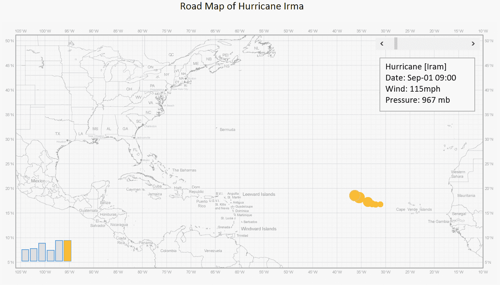

如果你有兴趣，我很乐意和你分享用 Excel 制作飓风图的过程。它使用气泡图来描绘飓风的动态路径，并显示风力的变化。下面是制作飓风地图的具体步骤。

# 1.准备材料

①找到一张美国大西洋地图，其中包括纬度和经度线。

注意，我们需要的地图必须有经纬线。公共网络上提供的许多地图是不准确的。我从[国家飓风中心和中央太平洋飓风中心](https://www.nhc.noaa.gov/tracking_charts.shtml)下载了这张地图。

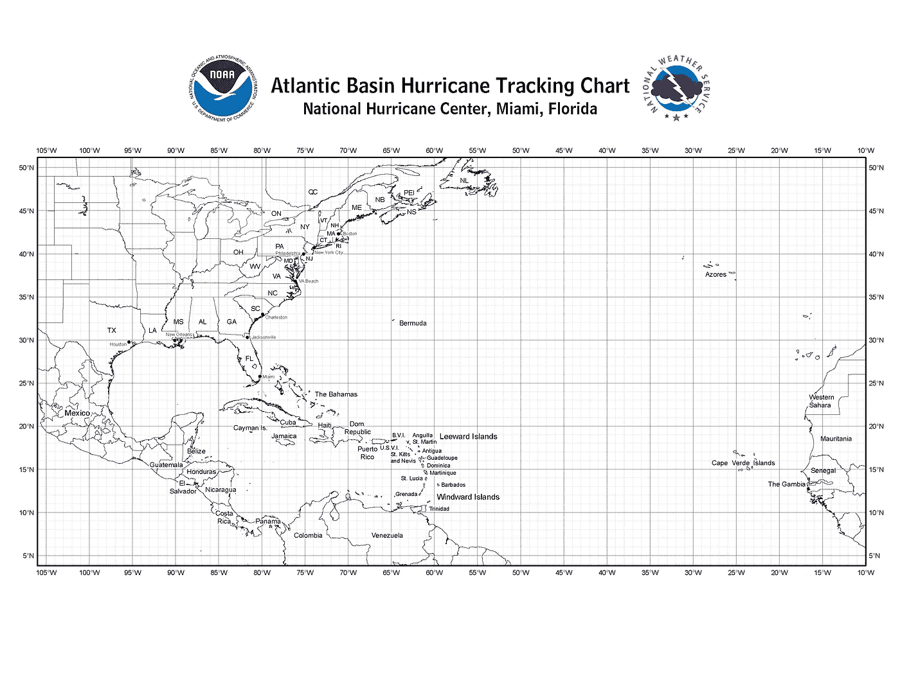

②从[天气地下](https://www.wunderground.com/hurricane/atlantic/2017/hurricane-irma?mr=1)下载飓风 Irma 的风暴轨迹统计，包括日期、时间、纬度、经度、风力等。

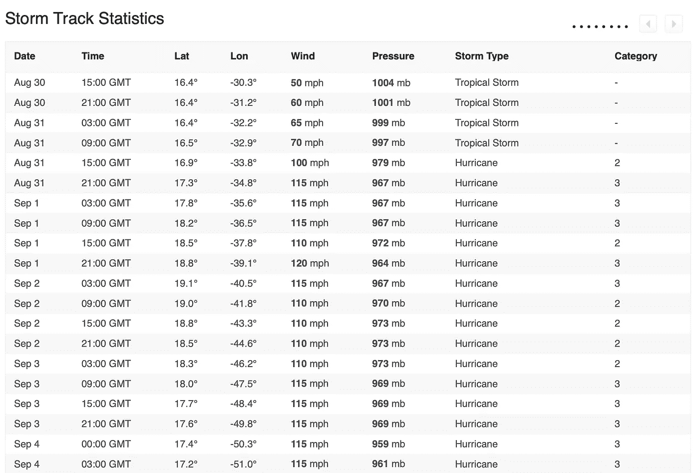

# 2.过程数据

①去掉纬度、经度、风速、风压等数据的单位。日期和时间应该转换成 Excel 易于处理的格式。

②我们可以看到，数据资料中每六三个小时记录一次飓风统计。在这里，我们每六个小时记录一次数据。

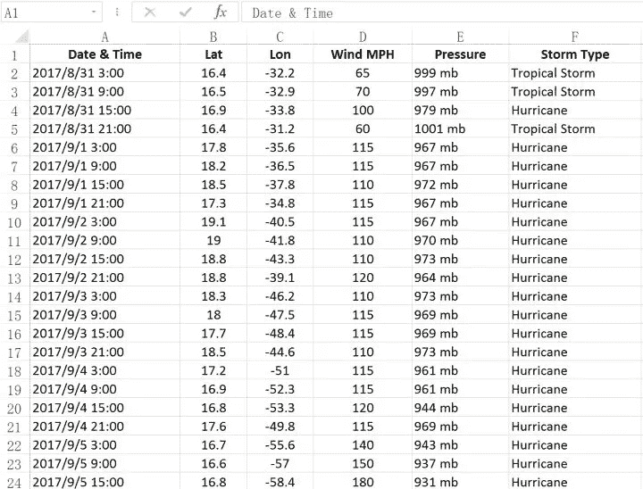

# 3.画一个气泡图

①将上面的图插入表格，然后在上面画一个气泡图。气泡图的 X 轴代表经度数据，Y 轴代表纬度数据，气泡大小取决于风压的值。

②设计图表区的格式。气泡图中坐标轴的最大值和最小值根据纬度和经度读数设置。并使坐标上的间距与地图上的经纬度间距一致。这里我将间距设置为 5，这样可以确保气泡图绘制的数据点与地图上的实际经纬度相匹配。

③拖放绘图区域的边界，使其与底部大西洋地图中的坐标轴重合。然后隐藏轴数据，将边框设置为“无线条”。

# 4.制作动态效果

为了实现飓风轨迹的动态效果，我们可以使用**滑块控件**来控制时间。我们每滑一次，时间就增加 6 个小时。滑块链接的单元格将数据传递到图表左侧的表格区域。然后通过查询时间点获得相应的经纬度数据和风数据。同时，图表的两组数据源都是从这个时间数据生成的。整个控制链就这样形成了，滑块对图表的最终控制也就完成了。

除此之外，如果我想实现滑块的自动控制，我将需要 VBA 代码来使图表自动显示动态效果。

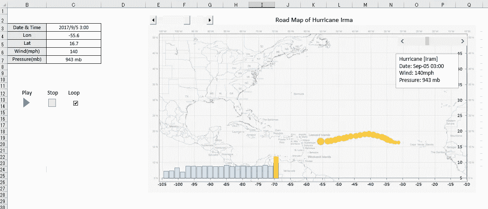

## 操作流程:

①用 VBA 写两个宏。一个宏控制开始，另一个控制停止。

②画 4 个控件，代表开始、停止、循环和滑块。指定上述宏。

③滑块控件的格式指定左侧单元格，记录滑动数据。上面的单元“数据和时间”调用该单元的数据。

④准备动态数据。

为了达到上述动态效果，气泡图中实际准备了两组数据。一组显示飓风在当前时间点之前经过的所有路径点，另一组标记飓风在当前时间点的位置。

这里我们需要使用 LOOKUP 函数，并将单元格的数据称为“Data & Time”。

对于第一组数据，我们选择小于或等于当前时间点的所有数据，并将其他数据点设置为#N/A。

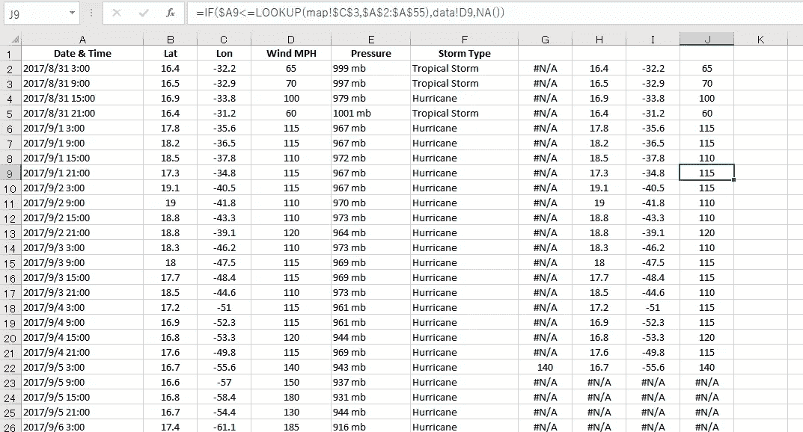

对于第二组，我们选择与当前时间匹配的数据，其他数据也设置为#N/A。这里，#N/A 不在图表中显示数据点。

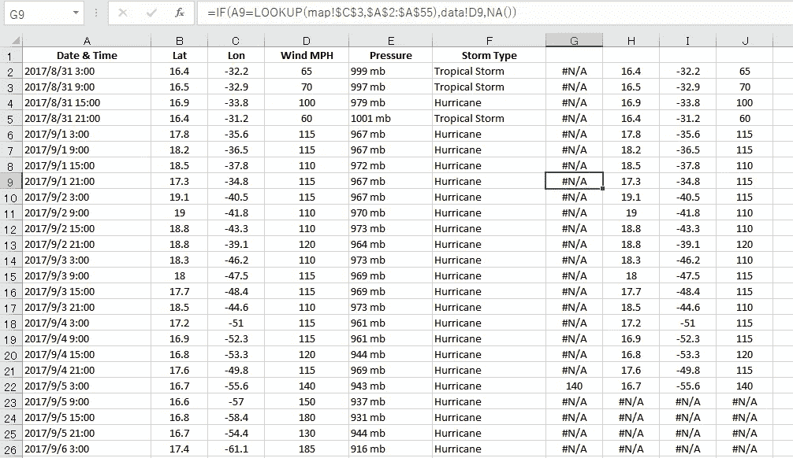

⑤将气泡图绑定到数据源。

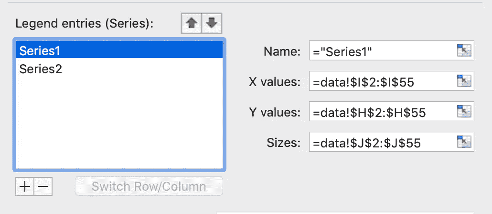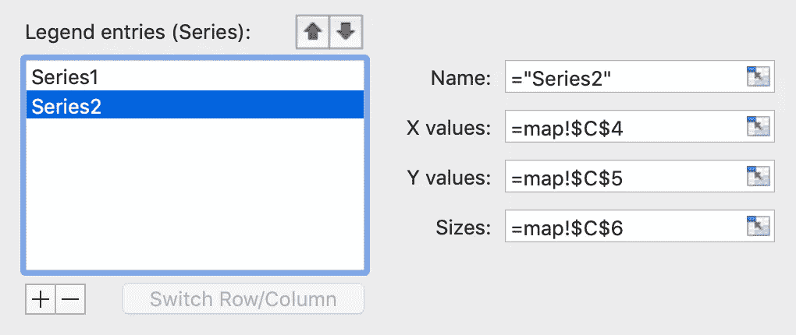

在最后一步，我们将气泡图绑定到数据源，飓风轨迹图就完成了。

图表中的文本框可以通过链接单元格直接从单元格中获取数据点的信息。地图上除了气泡图之外，还增加了一组柱形图来表示风，其数据绑定操作形式与气泡图相同。

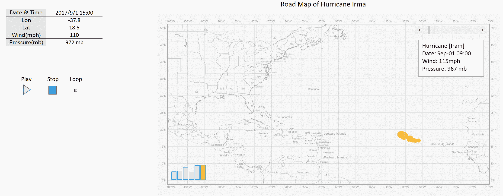

嗯，用 Excel 做飓风图的大致思路是这样的。下面是飓风厄玛的官方地图。是不是和我用 Excel 做的很像？

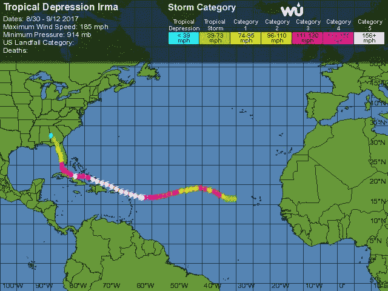

*From* [*Weather Underground*](https://www.wunderground.com/)

# 技巧

Excel 的功能非常强大，但是如果你想用它制作一些复杂的图表，你必须有代码库，还要学习 VBA 语言，这很费时间。我分享过一篇文章[*数据地图在商业分析中的 4 种用途*](/4-uses-of-data-maps-in-business-analysis-9f9589c3f69a) ，其中所有地图都是用零代码可视化工具 [FineReport](http://www.finereport.com/en/product?utm_source=medium&utm_medium=media&utm_campaign=blog&utm_term=09) 制作的。操作很简单。如果不理解代码，可以尝试这个工具创建数据可视化图表。

# 您可能也会对…感兴趣

[数据可视化中的前 16 种图表类型](/top-16-types-of-chart-in-data-visualization-196a76b54b62)

[新手如何设计酷炫的数据可视化？](/how-can-beginners-design-cool-data-visualizations-d413ee288671)

[业务仪表盘初学者指南](/a-beginners-guide-to-business-dashboards-981a8192a967)

*原载于 2019 年 7 月 25 日*[*http://www.finereport.com*](http://www.finereport.com/en/data-visualization/i-made-a-dynamic-hurricane-map-with-excel%EF%BC%81.html)*。*