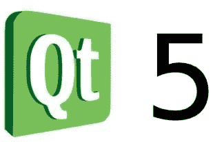

# 我制作了一个机器学习模型来评估我的浏览体验

> 原文：<https://towardsdatascience.com/i-made-a-machine-learning-model-to-evaluate-my-browsing-experience-793b5b1022f5?source=collection_archive---------20----------------------->

> 如果你像我一样…

你可能对机器学习有点不健康的痴迷。我当然知道…我一直把自己当成数据科学活动的小白鼠。收集关于我自己和所有人的数据很难，但令人兴奋的是现在我可以告诉你了。

# 我做了什么

在过去的几周里，我一直在记录我的网络浏览搜索，以及与我的浏览体验相对应的评级。我这样做的目的是

> 用人工智能驱动我的生活。

嗯，也许不是…也许我这么做只是为了**的乐趣**。与正常的数据科学项目类似，这种折磨人的活动的很大一部分实际上是收集数据。我有过许多伟大的想法，但由于数据收集这一步，这些想法根本不可行。几个失败的 arduino 项目(尝试了大脑植入，但没有成功)被遗失在我一台电脑的文件夹里。这些 ***绝妙的*** 想法大多与我的个人健康或自动化我每天做的事情有关。

举个例子，我花了整整一个月的时间开发帮助我睡眠的软件，因为我是一个失眠症患者。所以第一部分是想出一种方法来监控我什么时候醒来，什么时候睡觉……你可能会笑，但我用网络摄像头训练了一个神经网络，它可以判断我的眼睛是睁开还是闭上。

> 接招吧，谷歌！

事实证明，检测睁开或闭上的眼睛实际上非常困难，但我有一个工作正常的模型，我准备开始使用它。那么是哪里出了问题呢？生活充满变数，你无法真正控制，有些你可以控制，我给自己做了一个测试集，预测甚至不接近，因为我是**残酷地不一致**。

当我开始我的网络浏览项目时，一个完全基于软件的高级应用程序来收集某种类型的数据的想法绝对吸引了我。我打算用 Python 开发一个 web 浏览器，记录我的搜索查询(输入到浏览器中的搜索框中)，每次我关闭它时，它都会要求我对我的体验进行一到十的评分。

> 是的，这很烦人。

# 我是如何做到的

项目一开始，我就遇到了第一个大问题。我无法在 GTK3+中获得任何形式的 web-kit。我几乎完全退出，而不是切换到不同的 GUI 框架。最终，我选择了 Qt，主要有两个原因:

*   Kivy 是一个大得多的包，安装有点乏味…
*   Qt5 有一个更老的基础，因此问题已经被提出来了，错误也已经被挤爆了。

在构建了我的极简浏览器(很高兴回到 Chrome)后，我让关闭按钮请求一个数字并转储，并设置了一个小脚本来记录我的网络浏览习惯。

大约两周后，我对我拥有的数据量非常有信心，大约有 2，500 个浏览器会话，所以我将我的数据加载到 Python 中，并决定了我的模型。我决定和我的老朋友一起使用 tfidf 变压器，

> 随机森林分类器

在我的模型建立并运行之后，我能够输入一个查询，并了解当时我的一天是如何进行的。回报异常的低，大多数结果低于 5，我记得最多的是 7。

> 但是……为什么呢？

因为我是一个愤世嫉俗的人，我倾向于连续几个小时打开浏览器，所以我用一个相当个人化的偏见量表来评价我的体验…

> 此外，浏览器带来了糟糕的体验。

在训练完这个模型后，我可以自信地说，我对自己彻底失望了。我确实从反过来预测中获得了乐趣，猜测我谷歌了哪些让我如此不安的短语，但这不足以弥补我以科学的名义在这个项目上花费的时间。与其他项目类似，这个项目绝对是一个失败。不管我认为我创造的东西有多糟糕，我真的很喜欢做它。希望将来我能重温这个，或者类似的想法，做出更酷的东西。也许我会花钱请人帮我使用浏览器，这样我就不用这么做了。

这是一个痛苦的经历，失去一个你如此热爱的项目，因为有一天你醒来说:

> 这个项目很糟糕。

但是失败也是乐趣的一部分。因为实验，数据科学是一件有趣的事情。测试总是受欢迎的，而且永远不会引起争论。希望我能接受这次失败，并在以后用更多的数据、更好的浏览器和更少的偏见来抵消它。也许有一天我会重温那个古老的睡眠计划，不管怎样，我都很兴奋去做我想做的事情。