# 我在第一次人工智能比赛中获得了第四名。Unity 障碍塔比赛的收获

> 原文：<https://towardsdatascience.com/i-placed-4th-in-my-first-ai-competition-takeaways-from-the-unity-obstacle-tower-competition-794d3e6d3310?source=collection_archive---------22----------------------->

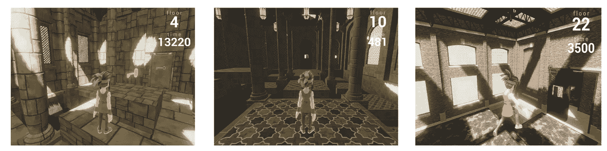

在过去的几年里，我的大部分业余时间都花在了[修补](https://github.com/Sohojoe)，学习和[研究](https://arxiv.org/abs/1902.09097)机器学习，特别是强化学习和数字演员上。

最近我决定参加[障碍塔挑战](https://www.aicrowd.com/challenges/unity-obstacle-tower-challenge)。令我惊讶的是，我早期的努力短暂地名列榜首，我在第一轮中排名第二，因为我的代理人掌握了塔的前 10 层(0 到 9 层)。

虽然我的代理人在大部分比赛中处于第二位，但它从未完全掌握 10 楼，最终排名第四。

# 第一轮:

我的第一步是复制这篇论文的发现，“障碍塔:视觉、控制和规划的一般化挑战”，这是我使用 Rainbow 示例代码完成的。

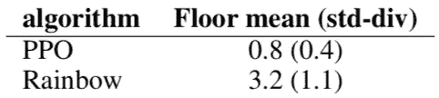

Obstacle Tower Challenge authors found that PPO did not generalize well.

我决定改用 PPO 算法。虽然 PPO 算法在障碍塔论文中表现不佳，但是它有一个[高](https://openai.com/blog/learning-dexterity/) [天花板](https://openai.com/five/)，我想探究一下为什么它在这种环境下表现不佳。

我假设，通过实现最先进的 PPO 实现中使用的最佳实践和优化，其性能应该没有理论上限(至少与其他无模型强化学习算法相比)。

我用了论文里的[代码](https://github.com/openai/large-scale-curiosity)，[好奇心驱动学习](https://arxiv.org/abs/1808.04355)大规模研究，让我的代理人在短时间内得了 9.4 分，获得第一名。在训练时，我发现好奇心奖励(参数'— int_coeff ')似乎不会影响表现。我发现我需要减少它的影响，以便算法可以学习环境(— int_coeff=0.025，— ext_coeff=0.975)

我发现 TensorFlow 框架不容易使用，所以寻找 PyTorch 替代代码库。我选择了'[py torch-a2c-ppo-acktr-Gail](https://github.com/ikostrikov/pytorch-a2c-ppo-acktr-gail)'，并围绕 PPO 算法的实现构建了我的代码。我能够复制我之前的分数。

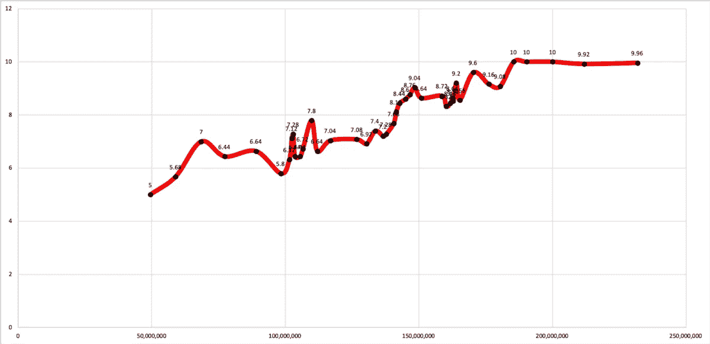

Performance of Agent in Round One.

通过进一步的完善和培训，我能够获得稳定的 10 分，因此代理始终能够在公共和测试种子上完成挑战的前 10 层。

以下是代理完成谜题的一些示例:

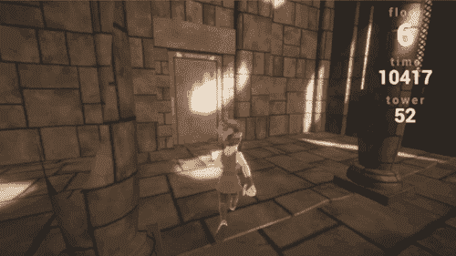

Easy Key Puzzles: lower levels have relatively simple key / door placement where the key is on or close to the path through the level. The agent is able to learn without any prior semantic knowledge of the relationship between keys and door.

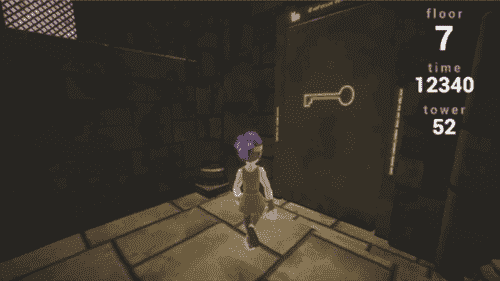

Hard Key Puzzles: later levels have a more complex key/door placement where the agent must search for the key.

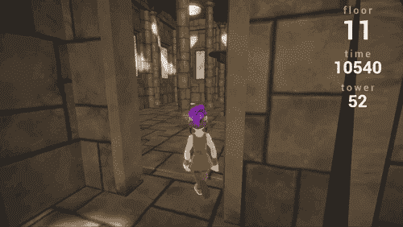

Double Jump Puzzle: this was one of the harder puzzles in the first 10 levels. The agent learns to do a double jump. Some seeds have a blocking mechanic, whereby the agent must complete this puzzle to get the key and progress.

# 第一轮论文

我觉得我已经走了很长的路来证明我的假设，并利用第一轮和第二轮之间的时间进行了一些实验分析，并写了一篇技术论文， [PPO Dash:在深度强化学习中提高泛化能力](https://arxiv.org/abs/1907.06704)，附带源代码【github.com/sohojoe/ppo-dash】T2

我的代理人在基本 PPO 算法上做了一些简单但经过深思熟虑的修改，超越了当时发表的障碍塔论文的最新水平。我希望展示每个最佳实践和优化的单独价值，就像 DeepMind 的论文一样，[“彩虹:结合深度强化学习的改进”](https://arxiv.org/abs/1710.02298)

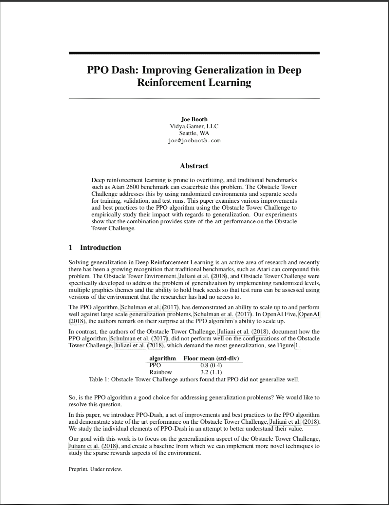

PPO Dash: Improving Generalization in Deep Reinforcement Learning

对于消融研究，我单独训练每一个修改，然后逐步组合。在 10 米的训练步骤中，我将 17 个不同的实验中的每一个都跑了 3 次，每次跑大约需要 5 个小时。

这篇论文有点失败，只有一处修改(减少动作空间)具有统计学意义。

要么其他修改没有价值，要么我们需要超过 10m 的训练步骤来分离它们的价值。我会假设是后者，但考虑到消融研究的总训练时间超过 250 小时(或 2 周)，这有点令人沮丧。

我建议阅读技术文章，了解最佳实践和优化的详细分类，但是，这里有一个摘要:

*   **动作空间缩减:**我选择在这项任务中积极进取，因为我希望网络专注于更大的泛化目标，而不是背负着学习动作之间的语义关系的负担，这是人类想当然的。我选了一套 8 个动作(比原来的 54 个动作下降了 85%)。在论文中，我测试了 10 米台阶上 6、8、20、27 和 54 个动作空间。

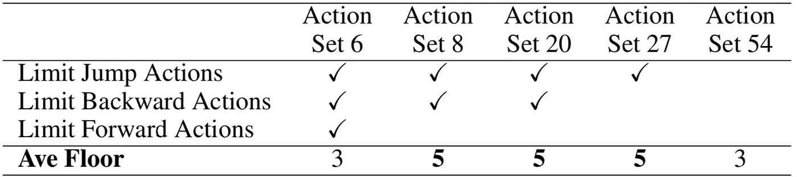

Comparison of action sets and their impact on the maximum floor reached after 10m steps.

*   **帧堆栈缩减:**帧堆栈缩减的目标是通过减少所需网络输入的数量来提高学习性能。我发现我可以将历史画面的数量减少到一个黑白画面。
*   **大规模超参数:**通常 PPO 算法的超参数针对 Atari 基准进行调整。我的假设是障碍塔挑战环境更接近于布尔达等人(2019)的 Unity Maze 环境，因为这两个环境都是 3D 性质的，并且两个环境都有稀疏的奖励。我们实现了对超参数的以下改变:8 个时期，在恒定学习速率下的学习速率为 1e-4(没有线性衰减)，熵系数= 0.001，小批量数量= 8，并发代理数量= 32，每个时期的步骤数量= 512
*   **向量观察:**添加向量观察的目的是最大化可见像素的使用，并消除策略需要学习可视编码状态信息的负担。我还将之前的动作和之前的奖励添加到向量中。
*   **归一化观测值:**归一化观测值的目标是帮助增加每个像素的方差。
*   **悬赏黑客:**我做了以下改动来增强悬赏信号。完成楼层:添加剩余生命值以鼓励政策尽快完成每个楼层(奖励范围在 1 到 4 之间)。拼图完成:给予奖励 1(默认情况下，这是 0.1)。生命拾取:拾取一个蓝点/生命拾取奖励 0.1。游戏结束:给予-1 的奖励。
*   **循环记忆:**增加循环记忆的动机是它将帮助策略学习解谜的时间方面。

我的直觉是，1000 万步太少了，不足以展示这些修改的影响。例如，我在没有记忆的情况下只能得 9.2 分。对于第二轮，我放弃了标准化的观察。目前还不清楚奖励黑客攻击的影响有多大，我也不确定我会不会再次使用它。

# 探索谜题 vs 语义谜题

许多研究人员将稀疏奖励环境的挑战(如蒙特祖马的复仇)视为“探索问题”，并提出了解决方案，如好奇心(最大化对不确定状态的探索)和赋权(最大化未来可选性)。虽然这些在解决一些谜题时很有用，例如双跳谜题，但我不认为它们能解决 10 级中介绍的方块谜题。

当一个人类玩家遇到积木拼图时，他们从多年玩视频游戏和看印第安纳琼斯电影中获得了丰富的语义知识。他们知道语义关系:“玩家可以推板条箱”，“触发开门”，以及“谜题可以重置。”

语义关系的好处是，人们可以应用图论将语义链接在一起来解决问题。我们经常把天才归因于将两个看似不相关的想法联系起来，为一个难题提供一个新颖的解决方案的行为。或许，如果我们能够在语义上模拟环境，那么我们的人工智能将会展现出一些这种天赋。

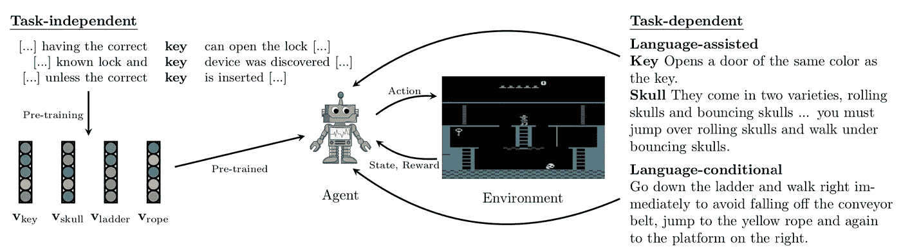

Illustration of different roles and types of natural language information in reinforcement learning. From the paper ‘A Survey of Reinforcement Learning Informed by Natural Language’

我不是第一个有这种洞察力的人。这篇名为“自然语言强化学习综述”的论文很好地概述了这一领域的活跃研究。

# 方糖项目

我的想法是为 visual OpenAI 创建一种[图灵测试](https://en.wikipedia.org/wiki/Turing_test)。健身房兼容的环境。想象两个终端，终端 A 和终端 B，其中任何一个都可以由一个 ***人*** 、 ***重放数据*** ，或者一个 ***AI*** 策略来控制。

这个想法是训练两个代理——一个终端 A 代理，学习发布“指令”或“想法”加奖励，另一个终端 B 代理，学习掌握 OpenAI。健身房环境。

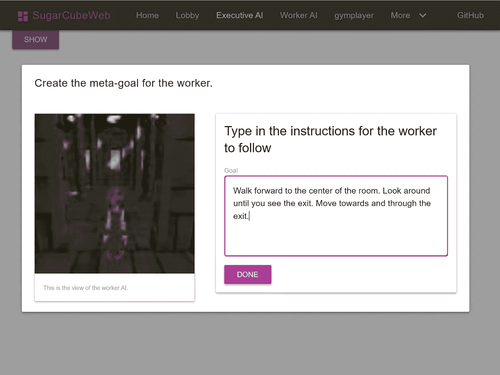

Project Sugar Cube: Terminal A gives instructions to Terminal B

终端 A 查看来自终端 B 的视觉环境反馈，并向终端 A 发出基于文本的“指令”或“想法”以及+1 / -1 奖励信号。

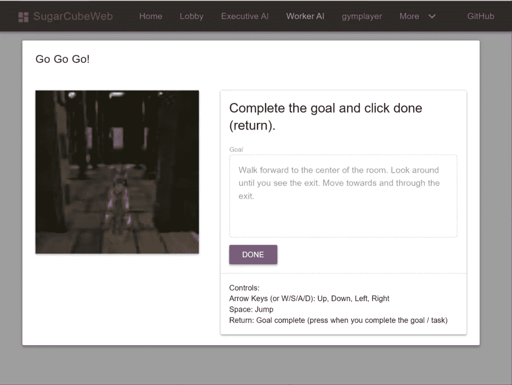

Project Sugar Cube: Terminal B tries to complete the goal

终端 B 是开放的。对健身房环境做了一些修改——它从终端 A 接收文本输入，并从终端 A 接收额外的奖励信号。

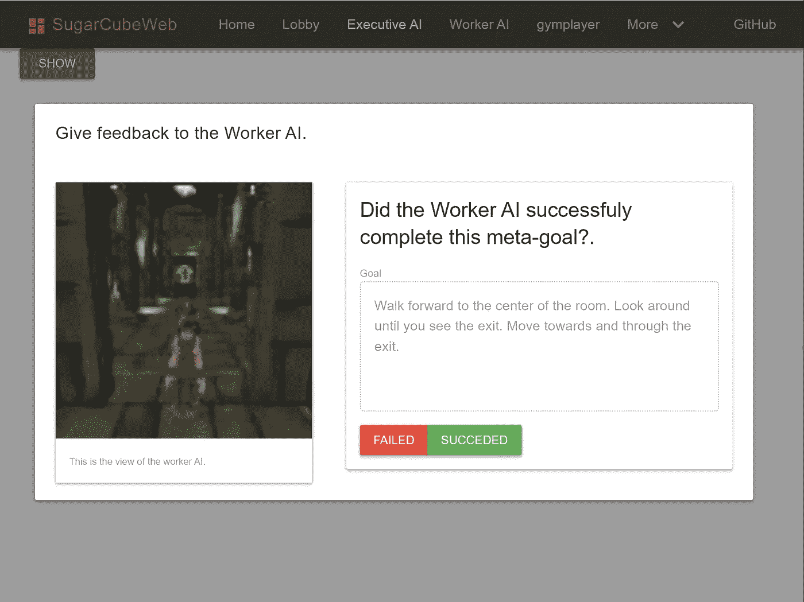

Project Sugar Cube: Terminal A gives a positive or negative reward based on Terminal B’s performance.

终端 A 然后给终端 b 正面或负面的奖励。

因为每个终端都是抽象的，所以可以采取分阶段的方法。例如，一个步骤可以集中于在预先记录的终端 A 输入和奖励上训练终端 B。

我选择花时间开发方糖项目的原型，知道这是一个长远的竞争回报，但我知道我有一个解决方块难题的 B 计划。

我即将发布支持两个人类用户的原型，以及用于数据收集的障碍塔环境。我计划在下一年用我在第一轮中赢得的谷歌云积分来收集数据。

# 第二轮决赛

第二回合见证了障碍塔环境的重大更新。最初，我很难再现第一轮的结果，并发现我需要在所有视觉风格中随机化。当我专注于项目方糖原型时，我离开了这个培训。

在比赛结束前两周左右，我又把注意力转移到了比赛上。我的“B 计划”是注入预先录制的人类完成积木拼图的演示。

我曾希望通过使用预先录制的输入来驱动代理，直到完成拼图之前，然后慢慢增加它必须完成的步骤数，从而使用逆向强化学习。我遇到的问题是，不知何故，当重新开始一个级别时，环境没有完全重置，所以重放经常不同步。

我改变了策略，在训练中注入了原始的观察、奖励和行动。最初，我是这样做的，当代理达到第 10 级时，它将通过该级别的预记录，然后通过使用策略。学习起来很慢，所以我实现了设置随机重放之间采取的策略步骤数量的能力。

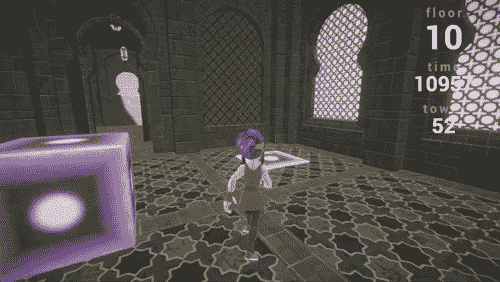

Final agent solving the block puzzle. Note how it struggles on the first few attempts.

同样，这很慢，但它有时确实学会了完成积木拼图。它还完成了更高的级别，这是令人满意的，因为我只提供了 10 级的演示。

然而，它并没有完全概括。它会掌握一些种子，但会像掌握其他种子一样忘记它们。

此时尝试任何重要的新策略都为时已晚。我试着录制更多的演示。我试着移除演示，它会慢慢忘记如何完成积木拼图。此外，我尝试从 10 级开始，但这似乎也使它变得更糟。

通过我不同的提交，它确实在某些时候通过了每个测试种子的第 10 级，但不是在同一次运行中。我尝试了不同的训练有素的网络实例的集合，这可能有一点点帮助。

我推荐读读 [Unixpickle 的](https://twitter.com/unixpickle) [写他的获奖经纪人的](https://blog.aqnichol.com/2019/07/24/competing-in-the-obstacle-tower-challenge/)；Unixpickle 还在演示中使用了 PPO 以及一些有趣的技巧。听起来好像我的经纪人在他实施 [Prierarchy](https://blog.aqnichol.com/2019/04/03/prierarchy-implicit-hierarchies/) /用 KL 术语代替熵奖励之前达到了一个类似的平台。我想尝试在我的代码中实现 KL 项，因为如果不用他使用的其他技巧，看看积木拼图是否是可解的会很有趣。

# 最后的想法

我真的很享受在比赛中工作的时光，在 Twitter 上与其他参赛者互动，以及它给我的灵感，让我与方糖项目一起朝着语义学和 RL 方向努力。

我最后的分数是 10.8。我已经跌出了前三名，这意味着没有奖金(现金、谷歌云积分、旅行补助)。然而，对我来说，获胜的目标从来没有发展我的直觉、改善我的纪律以及朝着我创造数字演员的长期目标努力那么重要。