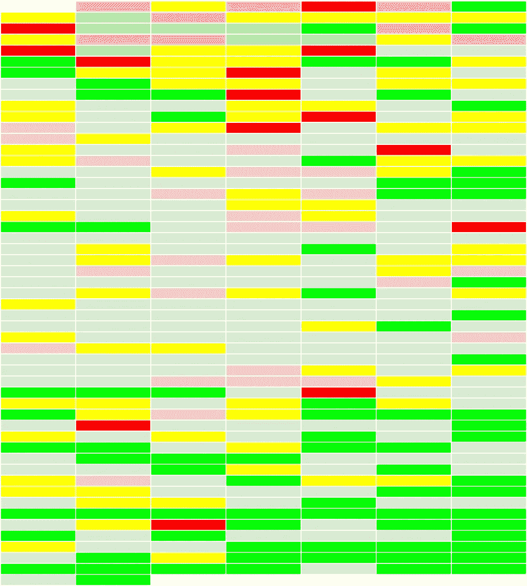
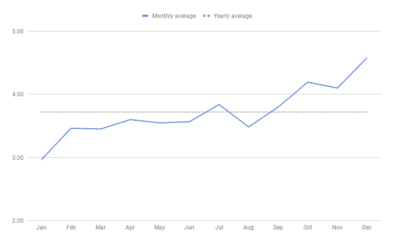
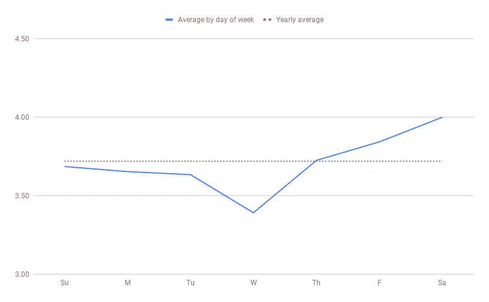
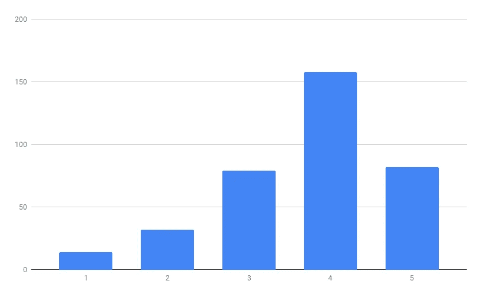

# 一年来，我每天都追踪自己的快乐

> 原文：<https://towardsdatascience.com/i-tracked-my-happiness-each-day-of-2018-cafe0d048aa2?source=collection_archive---------11----------------------->

## 观察和分析我自己心理健康的趋势

## 序言

2018 年，我每天都跟踪自己的心理健康状况。我用 1-5 的等级来评价我的快乐，其中“1”是非常糟糕的一天，“2”是有点糟糕的一天，“3”是一般的一天，“4”是有点好的一天，“5”是非常好的一天。我想在这篇文章之前说，我理解尝试和量化心理健康是多么复杂和困难。我的荒谬简单，完全主观，固有偏见的评级系统绝不是试图准确地代表心理健康谱的复杂性。我的目的只是想象和观察一年中我自己心理健康的任何趋势。我根据那天我的总体感觉来选择分数。然后，我使用 Google sheets 记录了这个分数，还记下了每天发生的任何重大事件，作为补充的定性数据(稍后会详细介绍)。也就是说，我认为找到专门适合你的精神健康管理方法很重要，但我希望这个项目有助于提供一个不同的视角。

## 数据

这是我 2018 年每天得分的热图，以日历的形式展示出来。向所有红绿色盲的人道歉:(

**Legend**

**My 2018 Happiness Heat Map**

## **分析**

在这一节中，我试图通过从不同角度更详细地查看数据来确定趋势。借助一些简单的公式、条件格式和过滤，我能够识别一些常见的主题。我还列出了解释这些结果的可能原因。我要再次重申，这不是一项科学研究。我给出的解释仅仅基于我自己过去的抑郁和焦虑经历，我过去作为健康顾问的经历，以及我在这个项目过程中学到的东西。

**全年日均得分:** ***3.72*** 这是基线得分。我们会将其他分数与此进行比较。

**各月平均得分**

今年开局不利，但有明显的上升趋势，尤其是下半年。最明显的原因是我在九月中旬从旧金山地区搬到了纽约。搬到一个新的城市和州是一次具有挑战性的经历，但对我来说，它给了我专注于改善心理健康所需的精神空间和机会。我是一个城市男孩，纽约市散发出一种我无法用语言表达的能量。

搬到纽约市前的平均分: ***3.51***
搬到纽约市后的平均分: ***4.25***

很明显，三个月是一个小样本，我仍然处于蜜月期。我需要重新审视 2019 年的数据，看看搬到纽约对我的心理健康有何长期影响，但现在我会随遇而安。

不仅仅是这一举动解释了我的上升趋势。随着时间的推移，我越来越擅长管理自己的心理健康。我变得更好地认识到是什么引发了我的抑郁或焦虑，我积极地让自己远离那些会让症状变得更糟的情况。我认为这个项目在其中起了很大的作用。因为我是一个视觉型的人，看到我糟糕的一天被用醒目的红色标在电子表格上，促使我把第二天标在一个绿色方框里，或者至少标在一个黄色方框里。如果我连续看到太多的 1 或 2，我知道我必须做些什么。我计算了每个月底的平均值，所以我开始注意到每个月我的平均值都会稍微上升。我会挑战自己，在下个月取得更好的成绩。看到我的心理健康像那样被绘制出来，有助于我对自己负责。

**一周中各天的平均分数**

他们把星期三叫做“驼峰日”是有原因的，是吧？我确信周三的低平均水平和一周的辛苦工作有一定的关联。我想周五和周六是我最美好的日子，因为这两天我会和我所爱的和关心的人在一起。现在我知道了这些信息，我计划在周三安排更多的时间进行自我护理，以抵消较低的分数。也许我可以把跆拳道课安排在周三晚上，或者留出时间去做

**按分数计数**

对于所有阅读这篇文章的 redditors，我最喜欢的一个 subs 是 r/databasebeautiful，所以想象一下当数据看起来像一个几乎完美的(右偏)钟形曲线时我的喜悦。唯一令人惊讶的是，我以为我得到了更多的 1，但也许这只是我的抑郁症欺骗我相信事情比实际情况更糟。

**得分“1”后第二天的平均得分: *3.86*** 我想特别强调一下这个统计数据。在我的抑郁或焦虑对我打击最大的日子里，我真的很容易回到我的旧习惯，只是呆在我的房间里整天悲伤。如果是 2017 年，我抑郁症最严重的时候，那肯定是这样。在我失业的大约 4-5 个月的时间里，我会熬夜到凌晨 4 点，下午 2 点醒来。我让负能量滚到了第二天。我醒来时会比睡觉时更难受。3.86 的分数实际上高于平均分，这意味着我不仅没有让自己沉溺于自己的坏想法，我还特意充分利用了第二天。这显示了与前一年相比的大幅增长，这是我为自己感到非常自豪的事情。

**旅行时的平均得分: *4.00*** 这一项可能不会让人感到太惊讶。今年我迷上了旅行，总共花了大约 5 周时间在州外或国外旅行(不包括搬到纽约)。我能走出公寓的任何时候通常都是美好一天的标志。旅行也帮助我走出我的“泡沫”,提醒我这个世界还有很多我没有经历过的事情。如果你有财力做到这一点，我鼓励你每年至少去一个和你说不同语言的国家旅行。

**“1-2”得分的主要原因** 我在笔记上记下了以下原因:

焦虑和抑郁 x20，孤独，孤立，感觉自己不够，感觉生活落后，与前任争吵，被工作和研究生院拒绝，疲惫，在医院与父母，朋友和家人争吵，压力过大，精神崩溃，自卑。

**“4–5”分数的主要原因** 与朋友出去玩 x100，与家人共度时光，老鹰队赢得超级碗，按摩治疗，拳击，在工作之外与同事出去玩，加薪，良好的锻炼，惊喜生日派对，音乐会，旅行，权力的游戏赛季结局，卡斯科，第一次吃汉堡，搬到纽约，纽约的第一场雪，朋友来看我。

我明年的目标很简单:减少前者，增加后者。

## 外卖

这个项目通过让我保持责任感，直接促进了我心理健康的改善。考虑到我每天花不到一分钟的时间来跟踪，我认为这种努力是值得的。列出你所有糟糕的日子和导致它们的事情听起来可能违反直觉，但它实际上激励我更加努力地工作，以避免那些红盒子。我认为这很大程度上说明了我们的文化，以及我们面对这些负面情绪有多么害怕，但我明白了，如果你一直把它藏在心里，就很难解决它。2018 年是我奔向我的恐惧并最终解决它们的一年。我将在 2019 年继续跟踪我的心理健康，现在我知道要寻找什么，希望下次数据分析可以更详细。我分享这些数据不是为了说服你做同样的事情，而是为了鼓励你考虑通过找到一种对你有效的方法来更积极地照顾自己的心理健康。我们非常重视我们的身体健康，但对我们的精神健康却不太重视。我也鼓励你与你信任的人，但最重要的是与你自己，进行更多关于精神健康的开放、诚实和坦诚的对话。这些对话不会很舒服，但它们变得越来越有必要。

感谢收听，
NV