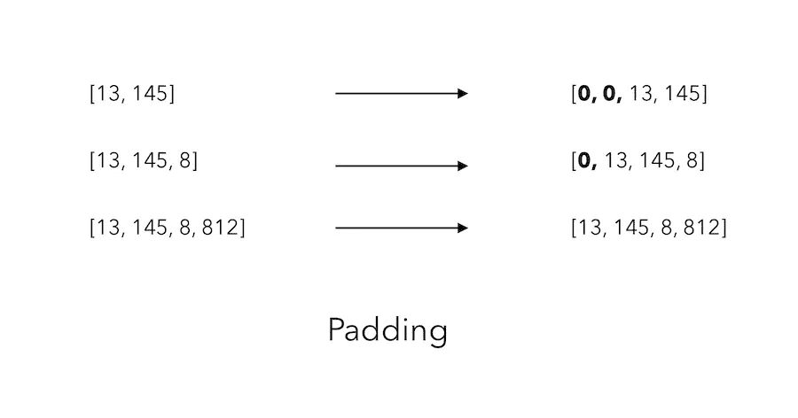

# 我训练一个网络像我一样说话

> 原文：<https://towardsdatascience.com/i-trained-a-network-to-speak-like-me-9552c16e2396?source=collection_archive---------19----------------------->

## [内部 AI](https://medium.com/towards-data-science/inside-ai/home)

## 而结局真的很搞笑。语言生成指南。


在过去的几个月里，我在我的个人博客上写了 100 多篇文章:【https://maelfabien.github.io/】。这是相当可观的内容。我想到了一个主意:

> 🚀训练一个语言生成模型**像我一样说话**。🚀

或者更确切地说，要像我一样把**写成**。这是说明语言生成的主要概念、使用 Keras 的实现以及我的模型的局限性的最佳方式。

本文的全部代码可以在这个资源库中找到:

[](https://github.com/maelfabien/Machine_Learning_Tutorials) [## mael fabien/机器学习教程

### 在这个库中，我上传了代码、笔记本和来自我的个人博客 https://maelfabien.github.io/…的文章

github.com](https://github.com/maelfabien/Machine_Learning_Tutorials) 

在我们开始之前，我发现这个 [Kaggle 内核](https://www.kaggle.com/shivamb/beginners-guide-to-text-generation-using-lstms)是理解语言生成算法结构的有用资源。

# 语言生成

> 自然语言生成是一个旨在生成有意义的自然语言的领域。

大多数情况下，内容是作为单个单词的序列生成的。对于这个伟大的想法，它是这样工作的:

*   您训练一个模型来预测序列中的下一个单词
*   你给训练好的模型一个输入
*   并迭代 N 次，从而生成接下来的 N 个单词


Sequential Prediction Process

## 1.数据集创建

第一步是建立一个数据集，它可以被我们稍后将要建立的网络所理解。首先导入以下包:

**a .加载数据**

我写的每一篇文章的标题都遵循这个模板:


这是我们通常不希望在最终数据集中出现的内容类型。我们将把重点放在文本本身。

所有文章都写在一个单独的降价文件中。报头基本上携带关于标题、图片报头等的信息。

首先，我们需要指向包含文章的文件夹，在我的名为“maelfabien.github.io”的目录中。

**b .句子标记化**

然后，打开每篇文章，并将每篇文章的内容追加到列表中。然而，由于我们的目的是生成句子而不是整篇文章，我们将把每篇文章分成一个句子列表，并将每个句子附加到列表“all_sentences”中:

```
all_sentences= []

for file in glob.glob("*.md"):
    f = open(file,'r')
    txt = f.read().replace("\n", " ")
    try: 
        sent_text = nltk.sent_tokenize(''.join(txt.split("---")[2]).strip())
        for k in sent_text :
            all_sentences.append(k)
    except : 
        pass
```

总的来说，我们有 6800 多个训练句子。到目前为止的过程如下:


Sentence split

**c. N-gram 创建**

然后，想法是创建 N 个一起出现的单词。为此，我们需要:

*   在语料库上安装一个标记器，将一个索引与每个标记相关联
*   将语料库中的每个句子分解为一系列标记
*   存储一起出现的令牌序列

可以用下面的方式来说明:


N-gram creation

让我们实现这一点。我们首先需要安装标记器:

```
tokenizer = Tokenizer()
tokenizer.fit_on_texts(all_sentences)
total_words = len(tokenizer.word_index) + 1
```

变量‘total _ words’包含已经使用的不同单词的总数。这里，8976。然后，对于每个句子，获取相应的标记并生成 N 元语法:

变量“token_list”包含一系列标记形式的句子:

```
[656, 6, 3, 2284, 6, 3, 86, 1283, 640, 1193, 319]
[33, 6, 3345, 1007, 7, 388, 5, 2128, 1194, 62, 2731]
[7, 17, 152, 97, 1165, 1, 762, 1095, 1343, 4, 656]
```

然后,“n 元语法序列”创建 n 元语法。开头是前两个词，然后逐渐加词:

```
[656, 6]
[656, 6, 3]
[656, 6, 3, 2284]
[656, 6, 3, 2284, 6]
[656, 6, 3, 2284, 6, 3]
...
```

**d .填充**

我们现在面临以下问题:不是所有的序列都有相同的长度！我们如何解决这个问题？

我们将使用衬垫。Paddings 在变量“input_sequences”的每一行之前添加 0 的序列，以便每一行与最长的一行具有相同的长度。



Illustrating Padding

为了将所有句子填充到句子的最大长度，我们必须首先找到最长的句子:

```
max_sequence_len = max([len(x) for x in input_sequences])
```

在我的例子中，它等于 792。对一个句子来说，这看起来太大了！由于我的博客包含一些代码和教程，我希望这句话实际上是用 Python 代码写的。让我们画出序列长度的直方图:


Length of sequences

单个序列 200 +字的例子确实很少。将最大序列长度设置为 200 怎么样？

```
max_sequence_len = 200
input_sequences = np.array(pad_sequences(input_sequences, maxlen=max_sequence_len, padding='pre'))
```

它会返回如下内容:

```
array([[   0,    0,    0, ...,    0,  656,    6],
       [   0,    0,    0, ...,  656,    6,    3],
       [   0,    0,    0, ...,    6,    3, 2284],
       ...,
```

**e .分割 X 和 y**

我们现在有了固定长度的数组，它们中的大多数在实际序列之前都填充了 0。好吧，我们怎么把它变成训练集？我们需要分开 X 和 y！请记住，我们的目标是预测序列中的下一个单词。因此，我们必须把除了最后一个外的所有记号作为我们的 X，把最后一个作为我们的 y。


Split X and y

在 Python 中，就这么简单:

```
X, y = input_sequences[:,:-1],input_sequences[:,-1]
```

我们现在将把这个问题看作一个多类分类任务。像往常一样，我们必须首先对 **y** 进行一次热编码，以获得一个稀疏矩阵，该矩阵在对应于令牌的列中包含 1，在其他地方包含 0:


在 Python 中，使用 Keras Utils `to _ categorical `:

```
y = ku.to_categorical(y, num_classes=total_words)
```

x 现在的形状是(164496，199)，y 的形状是(164496，8976)。

我们有大约 165，000 个训练样本。x 是 199 列宽，因为它对应于我们允许的最长序列(200 - 1，要预测的标签)。y 有 8976 列，对应于所有词汇单词的稀疏矩阵。数据集现在准备好了！

## 2.建立模型

我们将使用长短期记忆网络(LSTM)。LSTM 的重要优势是能够理解整个序列的相关性，因此，句子的开头可能会对第 15 个单词产生影响。另一方面，递归神经网络(RNNs)只意味着依赖于网络的前一状态，并且只有前一个词有助于预测下一个词。如果我们选择 RNNs，我们会很快错过上下文，因此，LSTMs 似乎是正确的选择。

**a .模型架构**

由于训练可能非常(非常)(非常)(非常)(非常)(非常)(不开玩笑)长，我们将建立一个简单的 1 嵌入+ 1 LSTM 层+ 1 密集网络:

```
def create_model(max_sequence_len, total_words):

    input_len = max_sequence_len - 1

    model = Sequential()

    # Add Input Embedding Layer
    model.add(Embedding(total_words, 10, input_length=input_len))

    # Add Hidden Layer 1 - LSTM Layer
    model.add(LSTM(100))
    model.add(Dropout(0.1))

    # Add Output Layer
    model.add(Dense(total_words, activation='softmax'))

    model.compile(loss='categorical_crossentropy', optimizer='adam')

    return model

model = create_model(max_sequence_len, total_words)
model.summary()
```

首先，我们添加一个嵌入层。我们将它传递到一个有 100 个神经元的 LSTM 中，添加一个 dropout 来控制神经元的共同适应，最后得到一个致密层。请注意，我们在最后一层应用了 softmax 激活函数，以获得输出属于每个类的概率。使用的损失是分类交叉熵，因为它是一个多类分类问题。

该模式的总结是:


Model Summary

**b .训练模型**

我们现在(终于)准备好训练模型了！

```
model.fit(X, y, batch_size=256, epochs=100, verbose=True)
```

然后模型的训练将开始:

```
Epoch 1/10
164496/164496 [==============================] - 471s 3ms/step - loss: 7.0687
Epoch 2/10
73216/164496 [============>.................] - ETA: 5:12 - loss: 7.0513
```

在 CPU 上，一个历元大约需要 8 分钟。在 GPU 上(例如在 Colab 中)，您应该修改所使用的 Keras LSTM 网络，因为它不能在 GPU 上使用。您可能需要这个:

```
# Modify Import
from keras.layers import Embedding, LSTM, Dense, Dropout, CuDNNLSTM

# In the Moddel
...
    model.add(CuDNNLSTM(100))
...
```

我倾向于在几个步骤停止训练，以进行样本预测，并在给定几个交叉熵值的情况下控制模型的质量。

以下是我的观察:


## 3.生成序列

如果你已经读到这里，这就是你所期待的:**生成新句子！**为了生成句子，我们需要对输入文本应用相同的转换。我们将构建一个循环，针对给定的迭代次数生成下一个单词:

```
input_txt = "Machine"

for _ in range(10):

    # Get tokens
    token_list = tokenizer.texts_to_sequences([input_txt])[0] # Pad the sequence
    token_list = pad_sequences([token_list], maxlen=max_sequence_len-1, padding='pre') # Predict the class
    predicted = model.predict_classes(token_list, verbose=0)

    output_word = ""

    # Get the corresponding work
    for word,index in tokenizer.word_index.items():
        if index == predicted:
            output_word = word
            break

    input_txt += " "+output_word
```

当损失在 3.1 左右时，下面是它使用“Google”作为输入生成的句子:

> 谷歌是世界范围内产生的大量数据

它实际上没有任何意义，但它成功地将谷歌与大量数据的概念联系起来。这令人印象深刻，因为它仅仅依赖于单词的共现，而没有整合任何语法概念。

🚀如果我们在训练中多等一会儿，让损失减少到 2.5，并给它输入“随机森林”:

> Random Forest 是一个完全托管的分布式服务，旨在支持大量初创公司的愿景基础架构

同样，生成的内容没有意义，但语法结构相当正确。

该损失在大约 50 个时期后偏离，并且从未低于 2.5。

我认为我们在这里达到了开发方法的极限:

*   这个模型仍然非常简单
*   训练数据不像它应该的那样干净
*   并且数据量非常有限

也就是说，我发现结果非常有趣，例如，经过训练的模型可以很容易地部署在 Flask WebApp 上。

# 结论

我希望这篇文章有用。我试图说明语言生成的主要概念、挑战和限制。与我们在本文中讨论的方法相比，更大的网络和更好的数据无疑是改进的来源。如果您有任何问题或意见，请留下您的评论:)

**来源:**

*   Kaggle 内核:[https://www . ka ggle . com/Shiva MB/初学者指南-文本生成-使用-lstms](https://www.kaggle.com/shivamb/beginners-guide-to-text-generation-using-lstms)
*   最初发布于此:[https://mael fabien . github . io/project/NLP _ Gen/# generating-sequences](https://maelfabien.github.io/project/NLP_Gen/#generating-sequences)