# 我用机器学习来预测一场终极飞盘锦标赛，它有点工作

> 原文：<https://towardsdatascience.com/i-used-machine-learning-to-predict-an-ultimate-frisbee-tournament-and-it-kinda-worked-a39979eea022?source=collection_archive---------14----------------------->

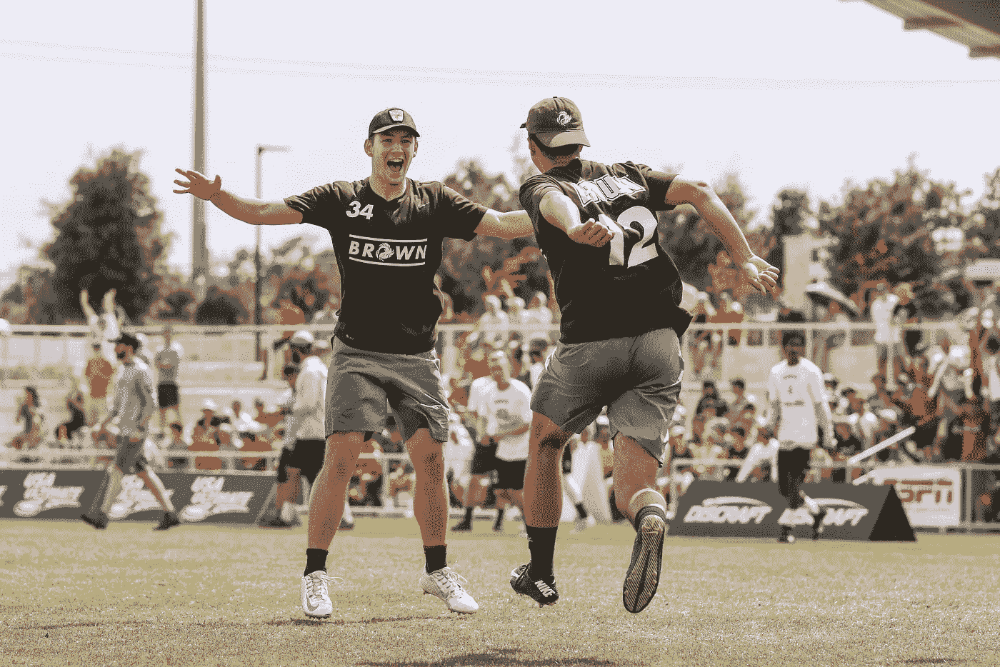

Photo by Paul Rutherford of UltiPhotos.com

丹尼尔·沃尔顿拥有大气科学博士学位和数学硕士学位。他对统计和建模充满热情，是一名有抱负的数据科学家。你可以在 [*LinkedIn*](https://www.linkedin.com/in/daniel-walton-8b999448/) *上和他联系。他也是一名经验丰富的终极玩家，连续八次获得 USAU 俱乐部全国赛资格，最近一次是在西雅图 Mixtape。*

# 挑战

我想，这只需要几个小时。著名的遗言…

Ultiworld.com，终极飞盘的主要新闻网站，刚刚发布了大学生国家队的种子。更重要的是，他们还公布了参加年度大学生国民幻想游戏的规则，该游戏名为#TheGame。总共选出五支队伍:女子组两支，男子组两支，两个组各一支。谁的五队组合在大学全国赛中得分最高，谁就获胜。等等，我们先退后一步。

终极到底是什么？

This is ultimate. (Photo by Paul Rutherford of UltiPhotos.com)

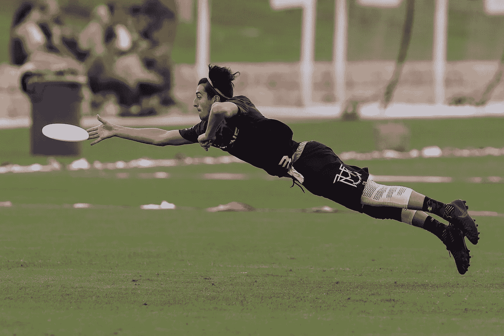

Yes, this is ultimate too. (Photo by Paul Rutherford of UltiPhotos.com)

No, this is not ultimate. This is actually Frisbee Dog.

极限飞盘或简称“极限”(也是出于商标原因)是两个七人小组之间的运动。球员通过完成传球将圆盘向前推进，并通过在端区接住传球得分。比赛通常进行到 15 分钟，两人获胜，尽管他们经常被时间限制缩短。

美国终极大学国民赛是大学赛季的终极锦标赛。这是一项为期四天的活动，其中包括女子组和男子组的 20 支最佳队伍。第一阶段是分组赛，参赛队伍被分成四组，每组五支队伍，与同组的其他队伍进行循环赛。

例如，以下是女子组的比赛:

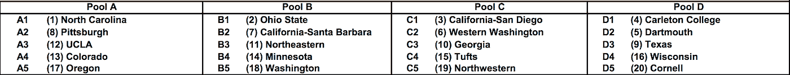

Women’s division pools. (Overall seed is in parentheses.)

例如，在 B 组，俄亥俄州是头号种子队(B1)，华盛顿是最低种子队(B5)。俄亥俄州将会在所有的桌球比赛中受到青睐，而华盛顿将会在所有的比赛中处于劣势。

获得小组前三名的球队将进入 12 支球队的淘汰赛，以确定全国冠军。以下是冠军等级:

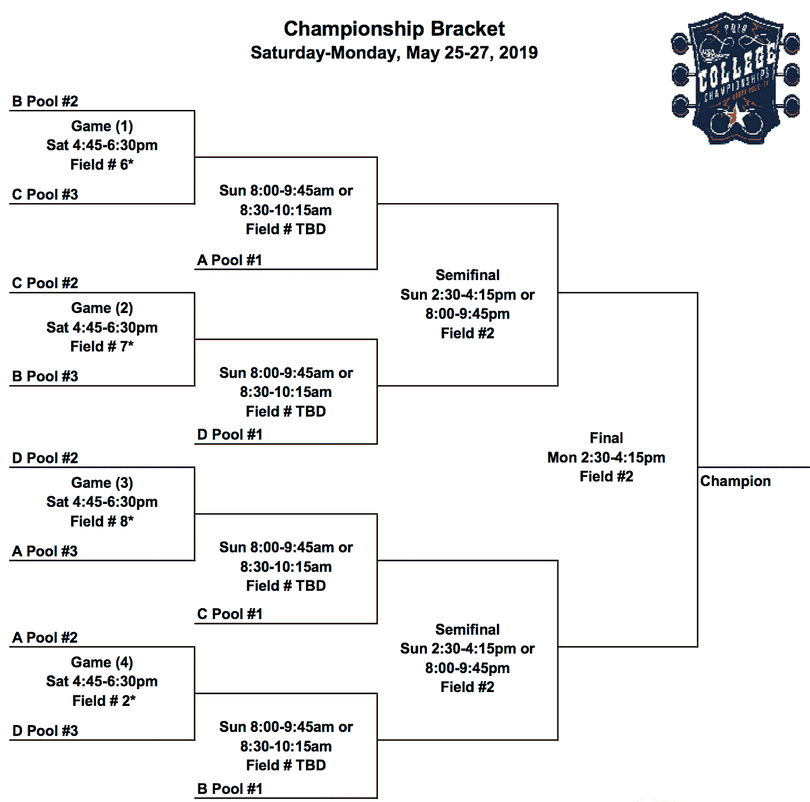

关于支架的几点注意事项:

*   每个池中排名第一的选手有机会进入四分之一决赛
*   第二名和第三名必须参加四分之一决赛

好了，回到#TheGame。正如我所说的，一个参与者选择五个队:两个女子队，两个男子队，以及一个可以来自任何一个部门的队。其团队获得最多综合幻想点数的参与者赢得#TheGame。

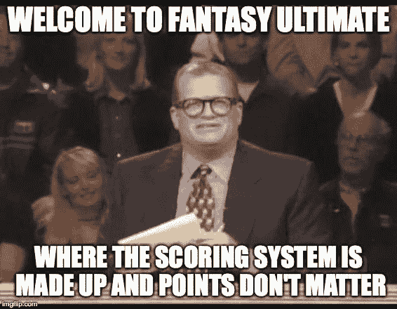

梦幻积分是根据一个队的总胜场数(池赛和排位)乘以该队在池中的种子来计算的。这使得事情更加平衡，所以垫底的种子仍然可以通过扳回一些冷门来获得很多分。因此，如果你是俄勒冈州，A 组的五号种子选手，你赢得了两场比赛和一场比赛，你将赢得 3 胜× 5 分/胜= 15 分。

一个团队也可以获得奖励积分。成为泳池中的第一名值得 1 点奖励积分。赢得一场四分之一游戏可赢得 1 点奖励积分。赢得半决赛可获得 2 点奖励积分。赢得决赛可获得 3 点奖励积分。

如果北卡罗莱纳州(头号种子和最受欢迎的冠军)赢得了所有的台球比赛，并赢得了冠军，他们将获得 14 分。如果俄勒冈州，他们池中的 5 号种子，赢得了所有的桌球比赛和冠军，他们将获得 42 分。因此，较低的种子有较高的天花板，但不太可能前进。

因此，为了准确评估一支球队的梦幻价值，我们需要知道他们在锦标赛中赢得每场比赛的可能性有多大。

就像我说的，小菜一碟。比赛还有 7 天就要开始了，但我应该只需要几个小时就能编写一些 Python 代码，运行一些蒙特卡洛模拟，并计算出每个团队的虚拟积分的预计分布。

我错了。

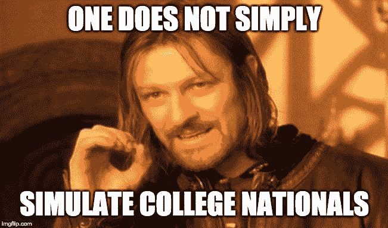

# 模拟终极锦标赛

锦标赛的关键组成部分是游戏。如果我们可以模拟一场比赛以某个分数结束的可能性，那么我们就可以把锦标赛模拟成一系列的比赛。

这里有一些我们想要解释的关于终极游戏如何运作的事实:

*   各队随机决定哪个队开始进攻。该团队收到开球通知，称为“拉动”。
*   如果 A 队开始进攻并得了一分，那么另一队 B 队将开始进攻下一分。
*   如果 A 队在进攻上开始得分，没有得分，他们将继续在进攻上开始得分，直到得分。(外面的统计学家可能已经在想，“*在第一次成功之前的一系列失败，这听起来像一个负二项式过程。”你说得对。]*

以下是一些简化的假设:

*   当一个队得 15 分时，比赛就结束了。
*   没有时间限制，没有两分的胜算。
*   没有中场休息。

[注意:实现半场本来是很容易的。我应该这么做，因为这可能会在势均力敌的比赛中产生影响。明年！]

现在，有趣的部分。我是这样模拟游戏的:

当 a 队开始进攻时，我们通过投掷一枚有 *P(正面)* = *pₐ* 的加权硬币来模拟他们获胜。如果正面朝上，A 队得一分，B 队开始进攻下一分。如果出现反面，B 队得一分，A 队在下一分重新开始进攻。

当 b 队在进攻中开始得分时，我们抛第二枚不同重量的硬币，硬币上有 *P(正面)* = *pᵦ* ，看看 b 队是否在进攻中得分。

连续掷硬币是独立的(即团队不会受到之前分数的好/差结果的影响。)

从统计学上来说，我们的过程基本上是一系列负二项式过程，其中成功的概率取决于哪支球队开始进攻。

以下是一些常见问题:

问:*为什么是两枚硬币？*

答:有两个不同的硬币反映了这样一个事实，即当球队开始进攻时和开始防守时，他们通常会让不同的球员上场。A 队的进攻球员对阵 B 队的防守球员，和 B 队的进攻球员对阵 A 队的防守球员，是一场根本不同的对决。

问:*这样的复杂性值得吗*？

答:是的。我最初的模型，对所有的点投相同权重的硬币，产生了正确的平均分数，但是方差太大了(比游戏数据支持的更多的冷门)。

现在，要模拟 a 队和 b 队之间的博弈，我们需要知道两个概率， *pₐ* 和 *pᵦ* 。直觉上，它们应该取决于团队的相对实力。本质上，我调整了这两个参数，直到我根据实际比赛数据得到正确的预期分数和正确的冷门频率。

但是给定两个队，期望的得分和失误的频率是多少？

# 我来这里是为了机器学习，这有什么用？

很高兴你问了。我使用机器学习技术来模拟预期得分和冷门频率如何取决于两队的实力。但要做到这一点，我们需要实际的数据。[机器学习不是你的事？点击[这里](https://medium.com/p/a39979eea022#8be8)跳转到我的幻想精选。对我的代码感兴趣？都在 [GitHub](https://github.com/dwal3000/college-nationals) 上。]

为了收集数据，我用美声和熊猫浏览了 USAU 的网站。下面是我刮的[代码](https://nbviewer.jupyter.org/github/dwal3000/college-nationals/blob/master/Scrape_Ultimate_Games.ipynb)。我搜集了所有 50 强球队比赛的 USAU 评分和比赛数据。游戏数据仅仅是每场比赛的结果(W/L)和分数。一个球队的实力等级是一个数值，根据他们的对手和比分来衡量他们的实力。大胜仗或者对抗好竞争的胜仗通常会增加一个团队的力量等级；巨大的损失或在劣势竞争中的损失通常会降低他们的额定功率。因此，力量等级评估了你的团队在所有比赛中的实力。

我抢了常规赛(2019 年 4 月 4 日)结束的收视率和季后赛，2019 年 4 月 4 日到 2019 年 5 月 23 日的比赛数据(叫分组赛和地区赛；他们在全国赛之前)。通过仅使用评级发布后的游戏数据，我们可以测试权力评级是否是对未来*游戏*的预测。(我们知道它们是过去*游戏的反映，因为它们就是从那里产生的。)评估我们的建模框架的预测能力很重要，因为我们最终将应用相同的框架来预测全国赛将会发生什么。*

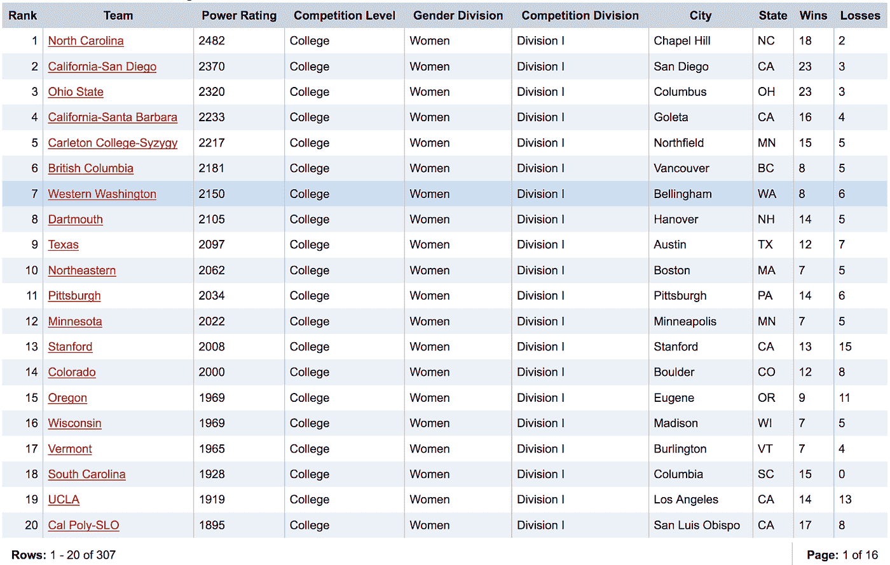

*Snapshot of USA Ultimate women’s power ratings from the end of the regular season (4/4/2019)*

机器学习的本质。简而言之，我根据训练数据拟合模型；他们在测试数据上表现得相当好。这让我相信，我们的框架将有助于预测大学国民的比赛结果。下面是我的机器学习[代码](https://nbviewer.jupyter.org/github/dwal3000/college-nationals/blob/master/Simulate_Nationals_Outcomes.ipynb)。

像任何优秀的数据科学家一样，我将我的数据分成训练集和测试集(对半分)。你们中的一些人可能会奇怪，为什么我在这么大的测试集中选择了拆分。答案是，在这个数据集中，扰动相对较少，我担心的是，如果我进行典型的 5 路或 10 路分割，我会得到根本没有*扰动的测试集。*

首先，我使用非线性回归将得分建模为两个团队之间功率等级差异的函数。实际上，具体来说，目标变量是*调整后的胜利差额*，这说明了在一些游戏中获胜者不会得到 15 分的事实。调整后的胜利差额的计算方法是，首先将一场比赛的分数标准化为 15，然后从最受欢迎者的分数中减去受欢迎者的分数。因此，如果最受欢迎的选手以 12-8 获胜，那么标准化得分将是 15-10，调整后的胜利差额将是+5。(如果处于劣势的一方以 12 比 8 获胜，那么调整后的胜率将是-5。)

所以，就像我说的，我用非线性回归来模拟胜率。我实际上使用了一个逻辑函数，因为它的形状和解释符合调整后的胜率分布。【注:这与*逻辑回归*不同，后者实际上是一种分类。后来，我使用逻辑回归，但对于赢/输的结果。]

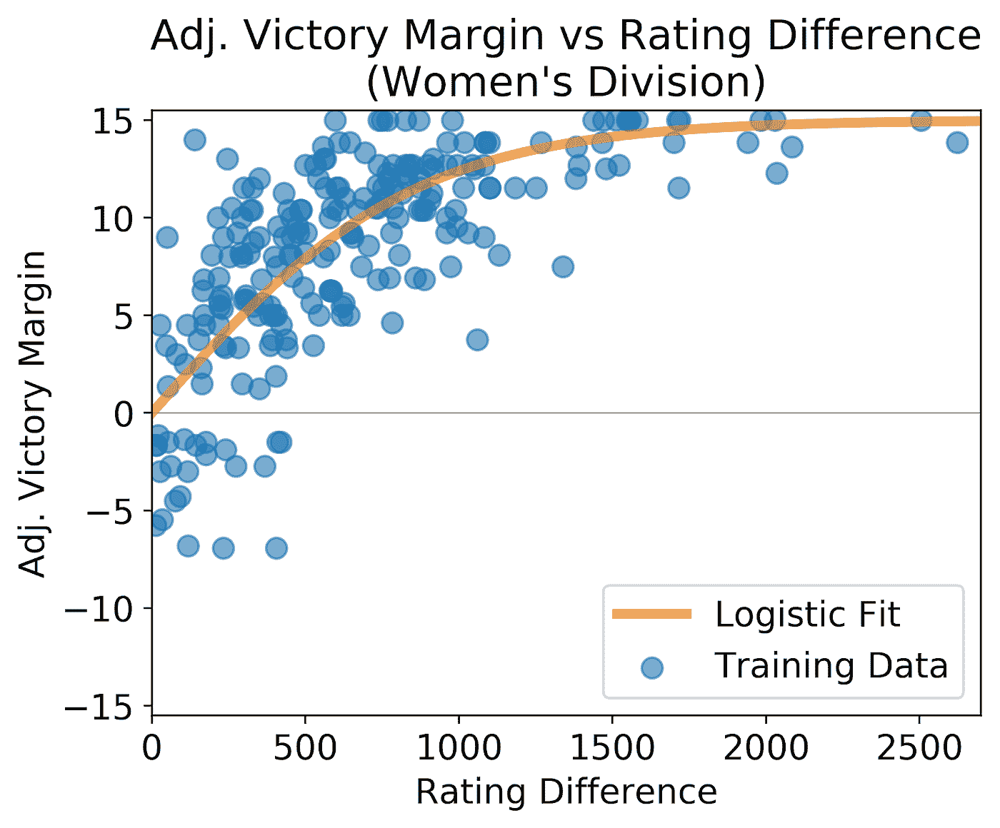

*Logistic curve fit to training data. Of the 229 games in the training data, there were 23 upsets (i.e. victory margin < 0).*

为了预测游戏结果(高评级团队是赢还是输)，我使用了逻辑回归，将功率评级差异作为预测变量。逻辑回归在这里是合适的，因为我们的数据有二元结果，我们希望能够预测这些结果的*概率*。

*Logistic regression used to predict win probability of the higher-rated team based on rating difference.*

好了，现在我们来拟合胜率和获胜概率的模型。但是，为什么我们又想知道预期的胜利差额和胜利概率呢？因为我们需要这些来限制概率 *pₐ* 和 *pᵦ* ，即每支球队开始进攻时各自得分的机会。基本上，胜利的差额告诉我们ₐ和 pᵦ的比例，而胜利的概率允许我们去拟合ₐ.

有趣的是，如果 a 队是最受欢迎的，那么期望分数大约是 15 比( *pᵦ* / *pₐ* ) 15。[我不会在这里讨论数学的细节，但是如果你愿意的话，可以在家里试一试。*正是*真的是*e*(b 队得分)/e(a 队得分) **→** *pᵦ* / *pₐ，*为胜分 **→** ∞。例如，如果 A 队得分占其进攻得分的 60 %, B 队得分占其进攻得分的 40%,那么预期得分大约为 15 到 10，因为 0.4/0.6 15 = 10。这允许我们将 *pᵦ* 表示为 *pₐ* 和调整后的胜利差额的函数:

*pᵦ* = *pₐ* (15 —可调胜利差额)/ 15

例如:如果两个队之间的预期胜利差距是 3，那么

*pᵦ*=*pₐ*(15–3)/15 =*pₐ*12/15 = 0.8*pₐ*。

现在，我们只需要约束 *pₐ* ，这可以通过获胜概率来实现。但是首先，让我们为 *pₐ* 开发一些直觉。高 *pₐ* 情景代表什么？让我们看一个极端的场景。如果 *pₐ* 真的很高(比如 1.0)，那么 a 队每进攻一分就得分一分。如果他们先开始进攻，他们每次都会赢得比赛*，即使 *pᵦ* 很高。因此， *pₐ* 的高值意味着非常少的扰乱。另一方面，假设ₐ相对较低(比如 0.1)。既然，a 队是热门，b 队是冷门，*pᵦ*<*所以 *pᵦ* 也低。进攻得分的低概率意味着球队很可能会在防守连续得分的情况下长距离奔跑。如此长时间的跑步会导致更多的可变分数和更高的失误几率。所以，低的 pₐ值意味着更多的冷门。**

*根据我从 Ultianalytics.com 得到的有限数据，pₐ对于精英团队来说似乎相当稳定，在 0.6-0.8 的范围内。如果它真的是常数，那将是非常了不起的。本质上，它会说，无论处于劣势的一方的技能如何，最受欢迎的一方都应该以同样的速度转化为进攻方。是真的吗？我的直觉告诉我，当被看好的一方比被看好的一方强得多时，这可能是不正确的。然而，它可能适用于全国赛，在全国赛中，球队之间的差距比其他比赛要小。尽管如此，我没有足够的数据来确定这种或那种方式。就我们的计算而言，它确实使事情变得简单多了。我有没有提到我快没时间了？至此，距离全国赛第一场比赛不到 24 小时。所以我做了一个简化的假设，pₐ不变。正如我们将看到的，我们得到的模型表现良好，所以这个假设并没有过度阻碍这个实验。*

*所以，我决定假设一个常数 *pₐ* ，但是它的值应该是多少呢？本质上，它是我们模型的超参数。我在参数空间中使用网格搜索来确定最佳值。根据培训数据，女性为 0.65；男性为 0.78。对这些价值观的解释是，男性最喜欢的发球比女性最喜欢的发球得分略高。*因此，如果两个男队和两个女队在评分上相差相同的数量，那么我们预计男队比赛中的冷门会更少，而女队比赛中的冷门会更多。**

*我使用测试集来评估模型。我将从测试数据推断出的获胜概率曲线与我的模型的获胜概率预测进行了比较。*

*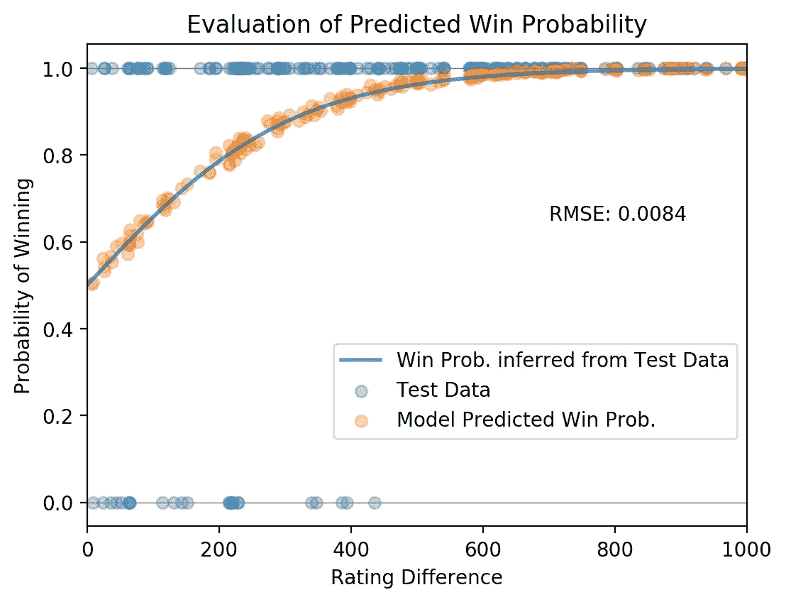*

**Women’s test data (W/L; blue dots), win probability inferred from test data (blue line), and predicted win probability from my model based on training data (orange dots).**

*对于女性来说，预测的获胜概率(橙色点)和从测试数据中推断的获胜概率(蓝色线)之间的一致性相当好。均方根误差为 0.008。男性方面的协议较弱，均方根误差为 0.016。男性模型有一个明显的偏差，因为它低估了最受欢迎的人在测试中获胜的概率。*

*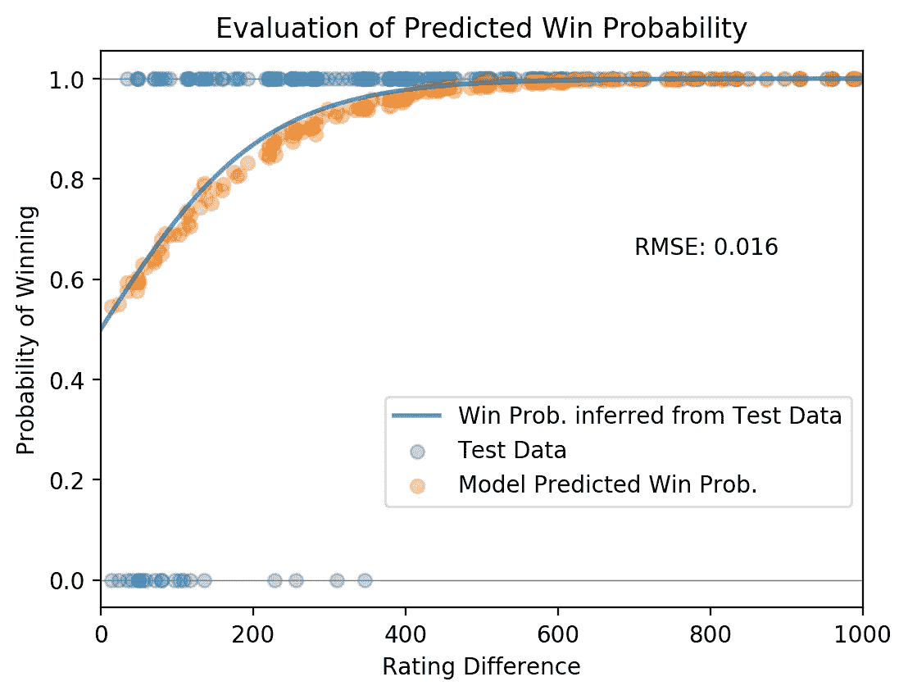*

**Men’s test data (blue dots), win probability inferred from test data (blue line), and predicted win probability from my model based on training data (orange dots).**

*误差似乎比预期的要低。这部分是因为大部分比赛是在极不匹配的队伍之间进行的。许多游戏都有超过 0.95 的获胜几率，所以即使模型没有完全正确，概率的差异也很小。尽管如此，即使对于不太确定的游戏，我们的模型预测的获胜概率在 0.1 以内。*

*此外，我不想对模型验证组件进行过多的讨论，因为现在全国赛已经举行了，我们可以直接测试模型的表现了！*

*但是，在我开始之前，让我们来谈谈如何做出梦幻般的选择。*

# *幻想精选*

*模拟大学国民的目标是为幻想终极产生精选。但是让我们先看看单个游戏的结果是什么样的。这是一支球队在一场基于 1000 次模拟的比赛中击败男子队头号种子北卡罗来纳州的可能性。*

*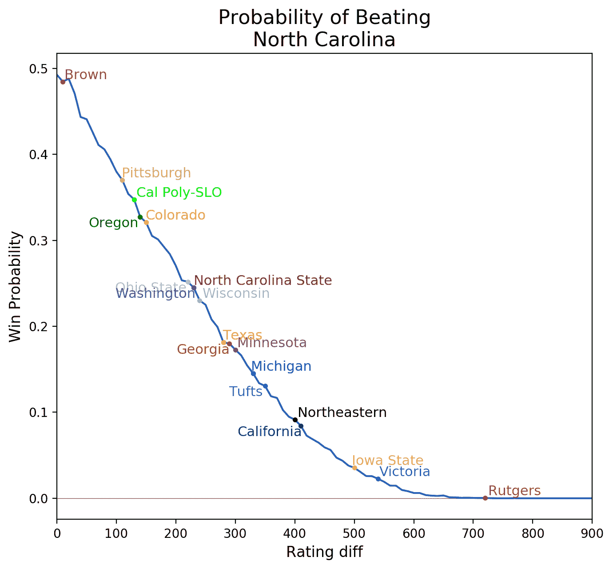*

**Probability of upsetting North Carolina in the men’s division based on 1,000 simulations for each rating difference. Brown has a nearly 50/50 chance of beating North Carolina in a single game. Meanwhile, Northeastern would be expected to pull off the upset only 1 time in 10 games.**

*现在我们进入锦标赛本身。每支队伍晋级的可能性有多大？*

*回到女子组。*

*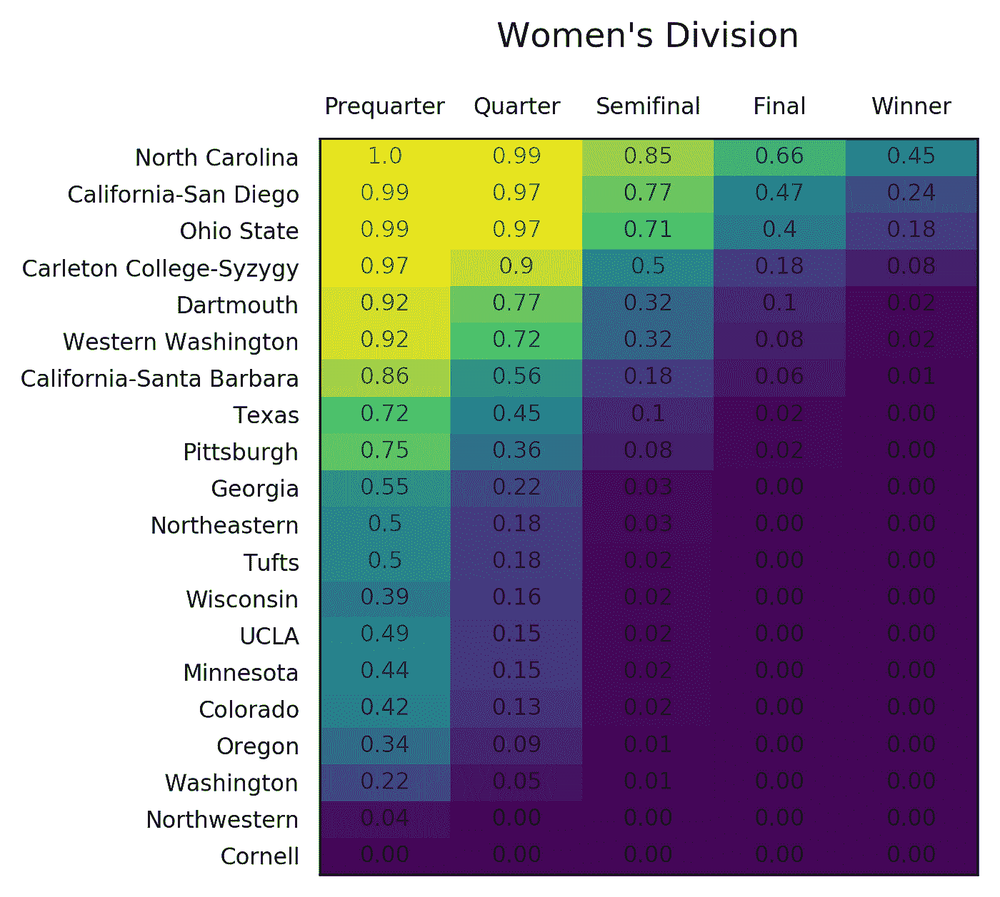*

**Chance of each team in the women’s division of reaching a given round.**

*我们的模拟显示北卡罗来纳州有 45%的胜算！两届卫冕冠军达特茅斯夺冠的几率只有 2%。达特茅斯今年成绩不佳，甚至不是他们的头号种子，但我想很多人仍然在他们身上下注。*

*去男队。*

*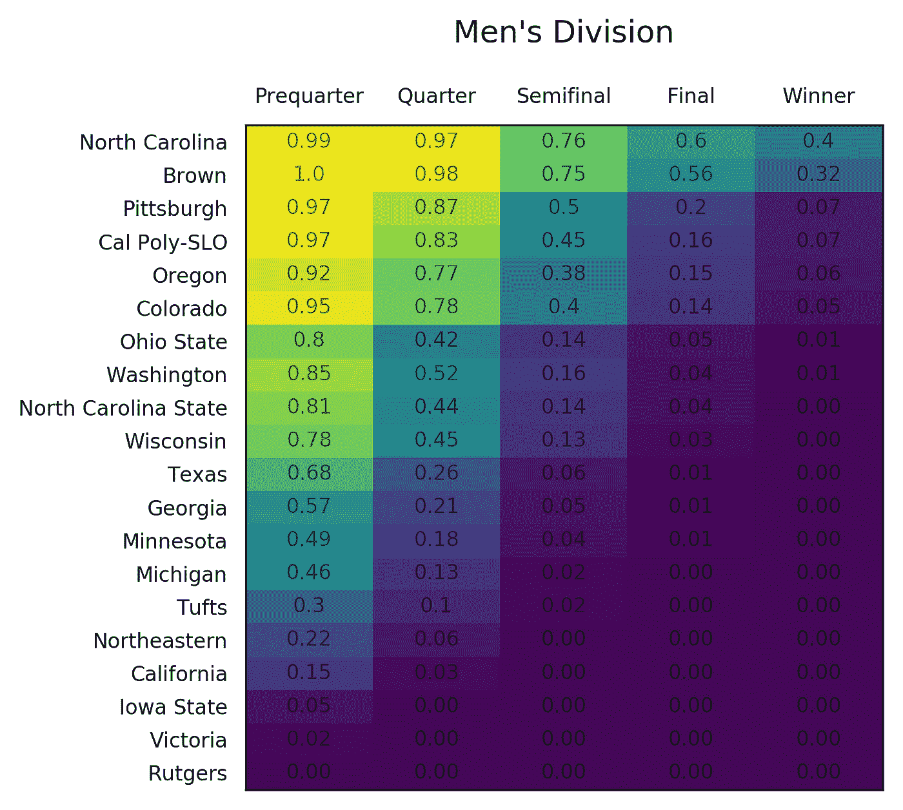*

**Chance of each team in the men’s division advancing to at least the given round.**

*模拟显示北卡罗来纳和布朗很有可能进入决赛，北卡罗来纳最有可能赢得所有比赛。正如我们将会看到的，模拟在很大程度上是正确的。*

*好吧，但这在幻想点数方面意味着什么？*

*让我们先检查一下时钟。我还剩多少时间？大学全国赛的第一场比赛在太平洋时间早上 6 点开始。这里是几点？太平洋时间凌晨 1 点。我只剩下 5 个小时了。*

*我一周的大部分时间都在睡觉，我几乎没有时间以完全数据驱动的方式做出选择。我会把我制作它们的方式描述为“主要是数据驱动的”。*

*以下是#TheGame 基于模拟大学国民 1000 次的幻想点数分布。[我知道统计学中的标准是 10，000 次模拟，但我还是没有时间。]*

*女子组:*

*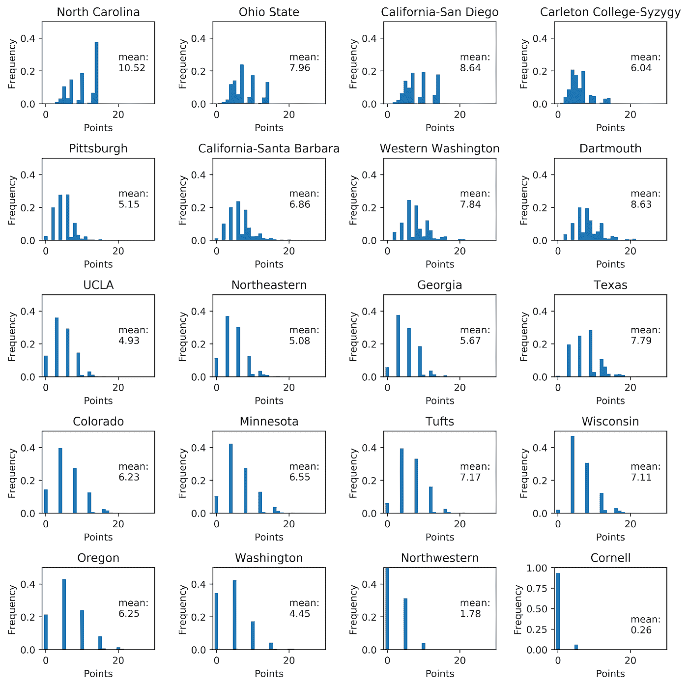*

**Distribution of fantasy points in #TheGame for each women’s team. Columns are pools A-D.**

*在女性方面，北卡罗莱纳州有望获得最多的幻想得分(10.52)，但它甚至没有接近。接下来是 UCSD 8.64，达特茅斯 8.63。也有一些有价值的中间种子，德州女子队(在他们的池中排名第三)预计将获得 7.79 分。我确保不选康奈尔(预期分数 0.26)。*

*现在是男子组:*

*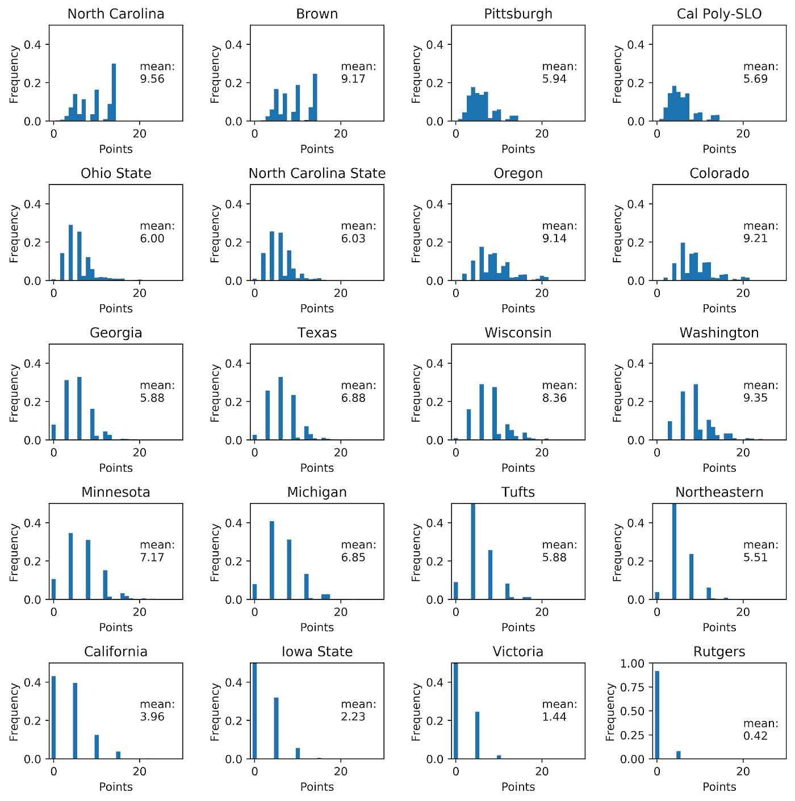*

**Distribution of fantasy points in #TheGame for each men’s team. Columns are pools A-D.**

*最受欢迎的 UNC 和 Brown 都有望获得大量的幻想分数，分别为 9.56 和 9.17 分。然而，模拟显示了来自 2 种子俄勒冈州(9.14)和科罗拉多州(9.21)，以及 3 种子威斯康星州(8.36)和华盛顿州(9.35)的一些优异值。*

*然而，我在思考中遇到了一个问题。如果我只是根据期望值来挑选，我会尽量提高我的平均得分。但是我真的会在比赛中*赢*吗？或者我会在大多数比赛中获得高分，但从来没有赢过？也许我需要一个不同的策略，一个试图最大化我成为*顶级*终结者的百分比机会的策略。如果#TheGame 中有大量条目，这一点尤其重要。如果选择了所有可能的组合，那么你必须选择最佳组合才能获胜。*

*所以，我重新定义了这个问题。我应该选择哪些团队，以便尽可能多地第一个完成？*

*此外，我意识到我不能独立挑选团队。一个团队的道路可能会受到另一个团队表现的影响。因此，它们的结果是交织在一起的。*

*所以，我想尽可能多地挑选出排名前*对*的队伍。*

*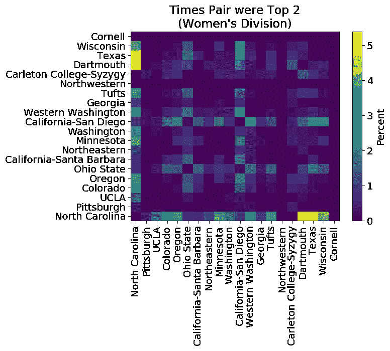*

**Percentage of the time that a given pair of women’s teams was the top pair.**

*基于这些信息，北卡罗来纳和达特茅斯最常成为最佳组合，超过 5%的几率。还有，呀。也就是说，即使我做出最佳选择，我也只有 5%的机会获胜！如果有成千上万的参赛者，这可能是非常好的。我想关键是结果有很大的随机性，没有一组球队能保证获胜。*

*这种分析也可以在三人一组的团队中进行。只是更难想象。结果表明，北卡罗莱纳州、达特茅斯和得克萨斯州是最常见的三甲(1.8%)。*

*我非常喜欢这首三重奏。它还列出了模型中没有的信息:达特茅斯队本赛季唯一的失利是在西北挑战赛上，由于受伤，他们失去了他们的顶级贡献者之一克莱尔·特罗普。另外，他们有血统，两次卫冕冠军。*

*所以我决定去北卡罗来纳、达特茅斯和德克萨斯。我对这个选择感觉很好，正如我们将看到的，它有起有落。*

*男人们来了:*

*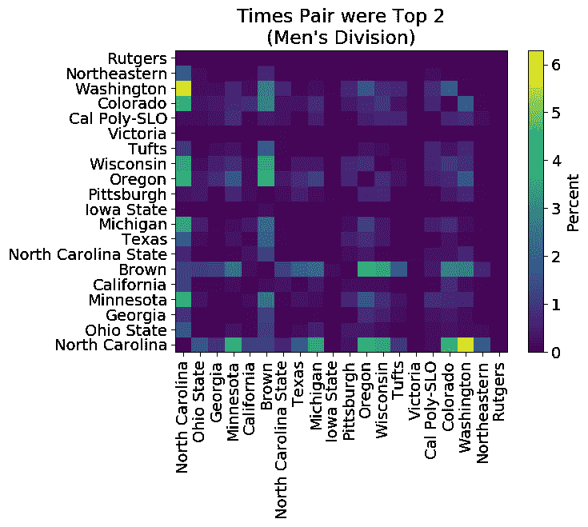*

**Percentage of the time that a given pair of men’s teams was the top pair.**

*看了上面的图后，你可能会问我是否选择了北卡罗来纳和华盛顿，因为它们经常出现在最前面(6%的情况)。这是一个非常合理的选择。但是，当我到达这一点的时候，已经是凌晨 3:30 了，我很累，时间不多了。我没有听从模拟的建议，而是决定*即兴发挥*。*

*嗯，算是吧。在内心深处，我坚信北卡罗莱纳和布朗将会在决赛中相遇。我之前展示的进步概率支持了这个观点。此外，我选择 3 号种子德克萨斯是冒着风险的，我想减少我在男人方面的风险。为什么？嗯，我在女队获得前三名(1.8%)已经不太可能了，我不想在男队也获得 3 号种子华盛顿的好运。所以，我决定挑选两支大部分时间都能拿很多分的男队。*

*如果让我再做一次这个决定，我会用不同的方式来做。我会更容易接受风险。我会听从数据而不是回避。具体来说，我会查看五个团队的哪个组合是最常见的五元组。但是，我选择了北卡罗来纳大学和布朗大学，主要是因为这是我想要的。很抱歉，数据驱动决策，但我是必须忍受这些选择的人，而不是你。是的，当时很晚了，我正在和一个决策原则进行对话。*

*但是我也选择了北卡罗来纳大学和布朗大学，因为这个图表:*

*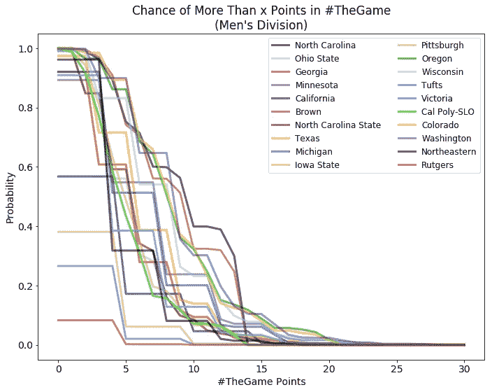*

**Chance that a men’s team scores more than* x *points in #TheGame.**

*注意北卡罗来纳(黑线)和布朗(褐线)对于大多数风险水平是最佳选择还是接近？当然，有一些球队有更高的最高分，但是如果我选择一个不同的球队，在*大多数*情况下，他们会比北卡罗来纳或布朗表现更差。*

*所以在凌晨 4 点左右，我提交了我的选择:*

*女子:**北卡罗来纳，达特茅斯，德克萨斯***

*男子:**北卡，布朗。***

# *我做得怎么样？*

*既然锦标赛已经结束，幻想点数也已经计算出来，我们可以回顾一下，看看我的选择有多好，我的模型是否有用。*

*以下是锦标赛的结果:*

***女子组***

*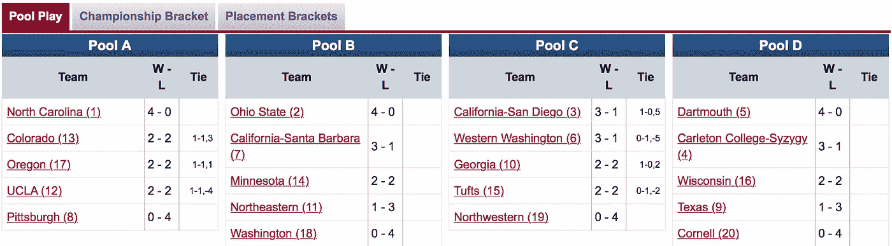*

*Women’s pool play results.*

*在 A-C 组中，头号种子队在小组中获得第一名。在 D 组，2 号种子选手达特茅斯击败 1 号种子选手卡尔顿学院赢得比赛。加油达特茅斯！我的另一个团队德克萨斯队在 D 组中获得第四名，仅获得 3 分，未能晋级。悲哀。*

*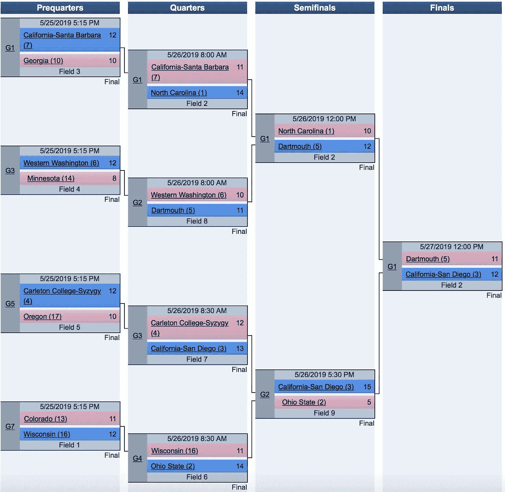*

*Women’s bracket results.*

*加州大学圣迭戈分校在一场激动人心的决赛中以 12 比 11 击败达特茅斯。北卡表现不错，在半决赛中输给了达特茅斯。*

***男子组***

**

*Men’s pool play results. Top-seeded teams finished first in each pool.*

*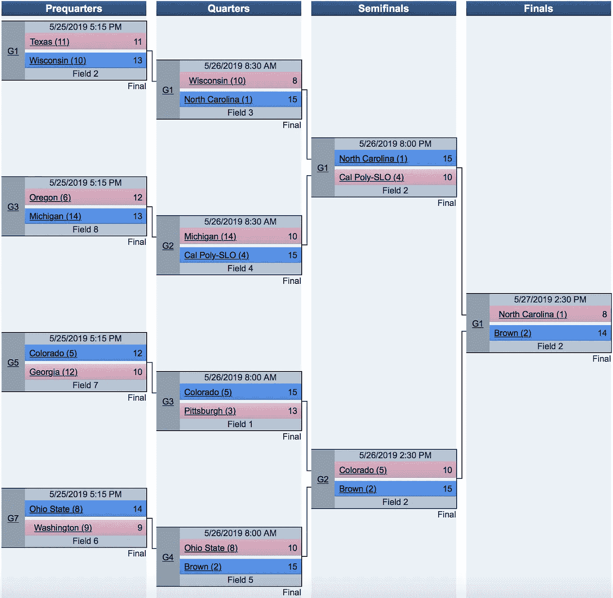*

*Men’s bracket results.*

*我的队伍，北卡罗来纳和布朗，在决赛中相遇！然后，布朗以 14-8 击败卫冕冠军，将王冠带回家。*

*但是我的模拟准确吗？明星队平均以正确的比率和正确的数量获胜了吗？*

## *胜利差额*

*这个模型在预测胜率方面表现如何？嗯，偏向是女队-0.51 球，男队+0.73 球。所以，在女队方面，失败者的表现比我预测的要好，而在男队方面，最受欢迎者的表现比我预测的要好。在两个分区中，实际拟合(虚线)与预测拟合(实线)非常吻合。*

*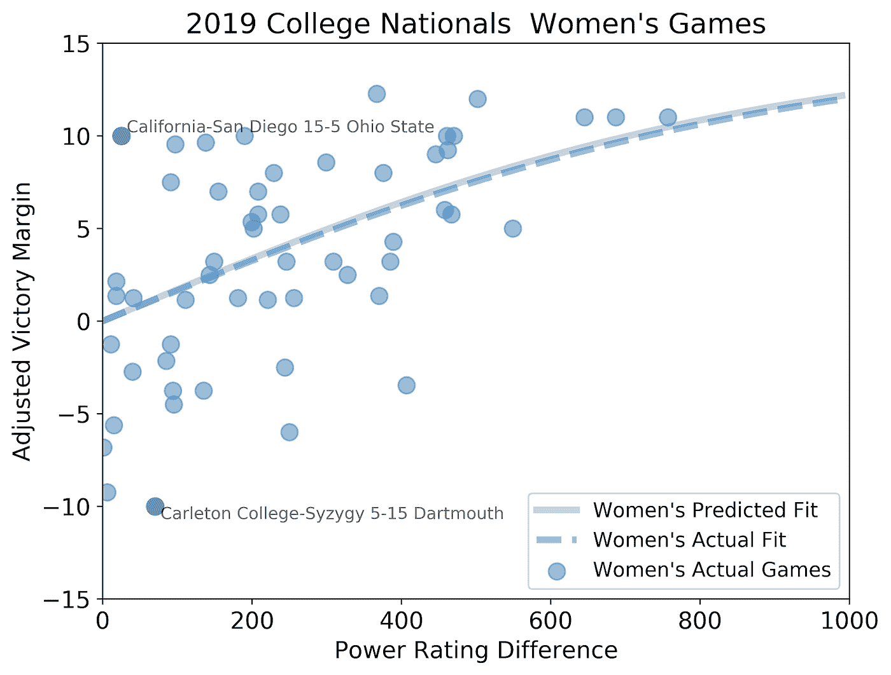*

**2019 Women’s College Nationals results with predicted and actual fits.**

*根据我们的模型，最令人惊讶的女子比赛(根据胜利差额)是 UCSD 在半决赛中以 15 比 5 击败俄亥俄州立大学，以及 Dartmouth 在台球比赛中以 15 比 5 击败 Carleton College。*

*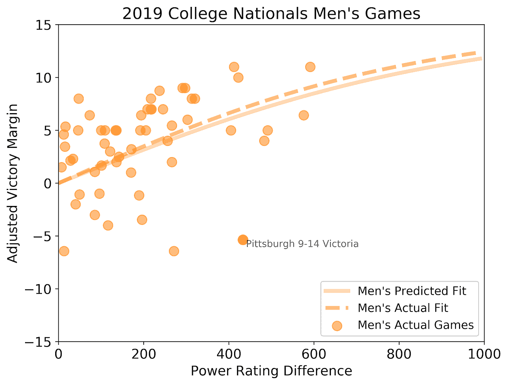*

**2019 Men’s College Nationals results with predicted and actual fits.**

*根据我们的模型，最令人惊讶的男子比赛是维多利亚(5 号种子选手)以 14-9 的比分战胜匹兹堡(1 号种子选手)。由于在评分上落后 400 多分，维多利亚队击败匹兹堡队的可能性只有二十分之一。比胜利本身更令人印象深刻的是 5 个百分点的差距——它甚至没有接近！*

## *获胜概率*

*男子组的冷门比预期的稍微多一点，而女子组的冷门恰到好处。*

*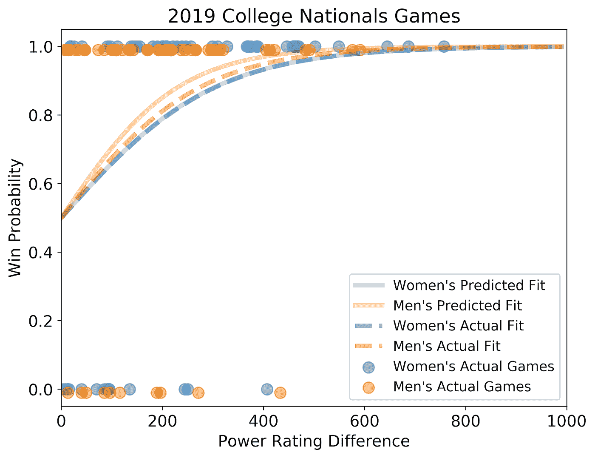*

**Win probabilities and actual game outcomes from 2019 College Nationals. A vertical stagger is added to help visually separate the men’s and women’s games.**

*我还可以用其他方法评估这个模型，包括使用对数损失函数。但是我选择了上面的方法，因为它们有一个相当清晰的解释:团队是否以正确的频率和正确的数量赢得了胜利？我认为答案基本上都是肯定的。*

## *幻想分数*

*全国赛后几天就公布了梦幻得分。我一直在急切地等待结果。我的主要由数据驱动的方法真的会有回报吗？*

*让我们看看我的选择如何:*

*女性:*

*达特茅斯(决赛选手——耶！):16 分*

*北卡罗来纳大学(半决赛):7 分*

*德克萨斯(打完台球出去——哎哟！):3 分*

*男子:*

*布朗(冠军——耶！):14 分*

*UNC(决赛选手):10 分*

*总分:50 分*

*因此，布朗大学、北卡罗来纳大学男子分校和达特茅斯大学都超出了预期，但得克萨斯州和北卡罗来纳大学女子分校表现不佳，这很伤人。德克萨斯州只差一分就能击败威斯康星州，在 D 组中获得第三名，这将使我获得额外的 3 分，外加一个在这个组别中挣更多钱的机会。北卡罗来纳大学和达特茅斯大学在半决赛中相撞，因此，不幸的是，只有一个人能晋级。达特茅斯超出模型预期最多，获得 16 分(预期分:8.63)。布朗通过赢得他们所有的比赛和冠军，最大限度地提高了他们的分数，这很好。我很确定北卡罗来纳大学和布朗大学会成为男子组的决赛选手，他们确实是。总的来说，我肯定在桌面上留下了一些点，但感觉像是一个坚实的努力。*

*所以，最大的问题是。获胜的分数是多少？*

*获胜分数高达 64 分！获胜者选择:*

*UCSD (W 冠军):13 分*

*达特茅斯(西部决赛):16 分*

*布朗(男子冠军):14 分*

*北卡罗来纳州(男子决赛):10 分*

*科罗拉多州(男子半决赛):11 分*

*我有三个这样的团队！*

*胜利者的 64 分离最优组合(67 分:UCSD，达特茅斯，布朗，密歇根，威斯康星女)只差 3 分。这一证据支持了我的假设，即赢家必须拥有最优组合——或者接近最优组合。*

*我到底排在哪里？我排在第 70 位，在 696 名参赛者中并列第 200 名。*

*这是分布图的样子:*

*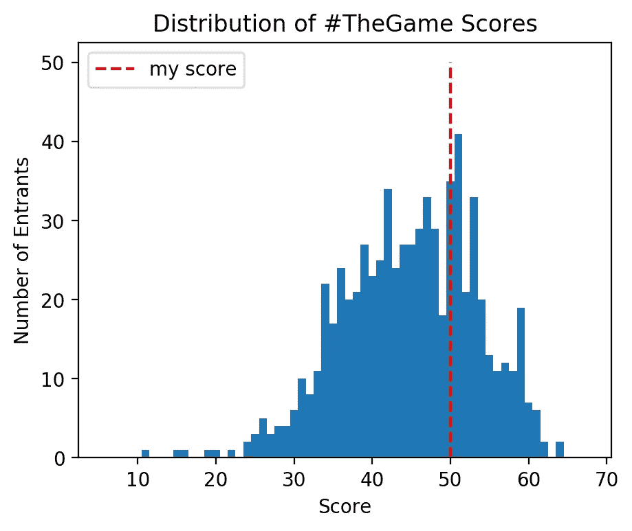*

*Distribution of score in #TheGame. My score of 50 was in the 70th percentile. Full results are [here](https://ultiworld.com/2019/05/30/d-college-championships-2019-thegame-winners-results/).*

*只剩下一场比赛了，很难评价我的选择策略是否正确。把过程和结果分开很重要。即使您根据模型预测选择了最有可能获胜的组合，该组合仍然只在大约 1%的情况下获胜。因此，使用模型可以帮助你做出明智的选择，但锦标赛的实际结果仍有很大的随机性。*

# *总结想法*

*即使我的选择没有赢得#TheGame，我也觉得建模练习是成功的。全国赛的比赛分数和获胜概率很大程度上符合我的预测。*

*这个模型最显著的失败是低估了达特茅斯的优势。达特茅斯只有 10%的机会进入决赛，但他们有时看起来很有统治力，在通往决赛的路上击败了排名第 4 的卡尔顿、排名第 6 的西华盛顿和排名第 1 的北卡罗来纳大学。事实上，他们距离击败第二名 UCSD 并赢得冠军只有一分之差。与此同时，该模型给他们只有 2%的机会成为冠军。*

*模特怎么会错过这个？嗯，它没有考虑像风、血统(球队是否有在全国大赛中比赛的经验)和伤病这样的重要因素。该模型只有一个预测指标:额定功率。权力评级并没有抓住一个事实，即达特茅斯的五场常规赛失利发生在一个周末，他们失去了关键球员克莱尔·特罗普。这也不考虑他们的血统(两届卫冕冠军)。*

*明年，如果我加入其他预测因素，看看这个模型会有多大的改进将会很有趣。使用前几年的数据，系谱可以直接并入。纳入条件将涉及更困难的天气数据，主要是温度和风速。今年的全国赛在德克萨斯州举行，天气刮风而且非常热。我也可以考虑终极世界的权力排名，这是对团队质量更主观的衡量。*

*虽然其他预测可能是有用的，但这一分析的普遍成功证明了 USAU 功率等级的价值。它们是一个有用的预测器，可以预测一个队击败另一个队的机会。*

*#TheGame 的创造者正在考虑改变评分系统的可能性，这样头号种子队的价值就会降低，而更多不同的球队会被选中。有没有办法逆向工程我的模型，以确定更公平的乘数和奖金点？这可能是一个有趣的练习。*

*明年我肯定还会这么做。它是非常有趣的。*

**想看看我的代码吗？* [*GitHub*](https://github.com/dwal3000/college-nationals) *上有。想聊终极，统计学，还是机器学习？你可以发邮件给我，地址是沃尔顿(at)加州大学洛杉矶分校(dot) edu 分校，在*[*LinkedIn*](https://www.linkedin.com/in/daniel-walton-8b999448/)*上联系我，或者在 Twitter 上关注我*[*@ Daniel _ walton*](https://twitter.com/daniel_walton)*。**