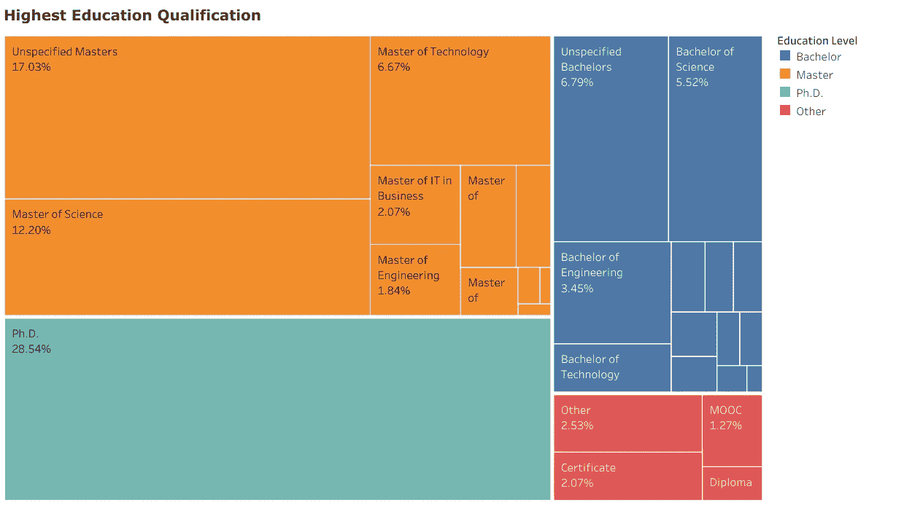
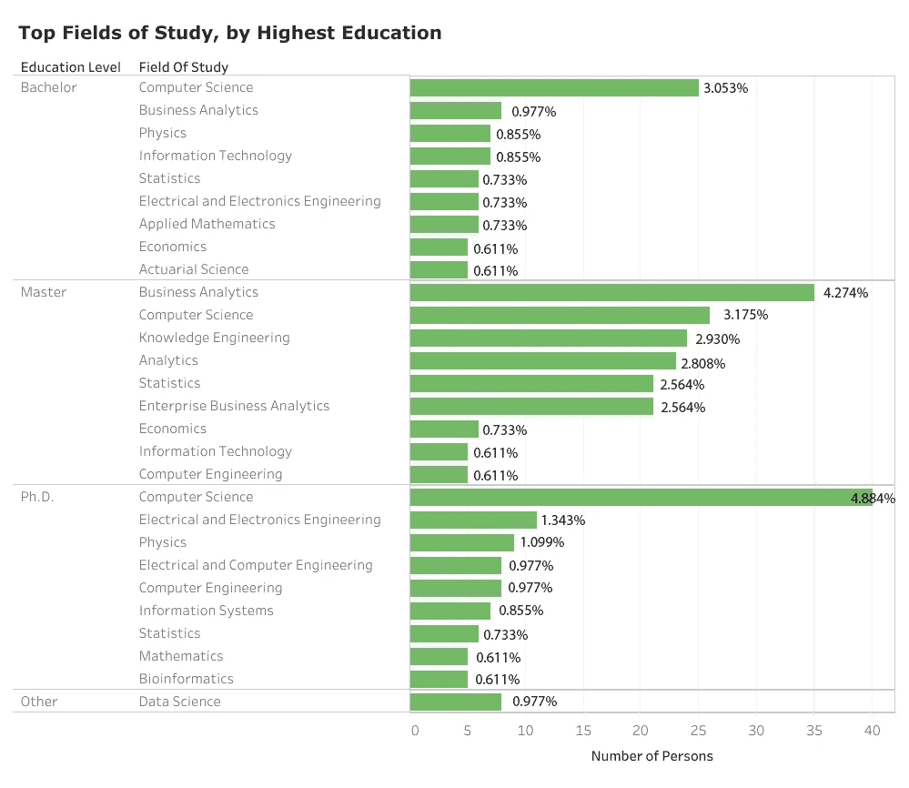
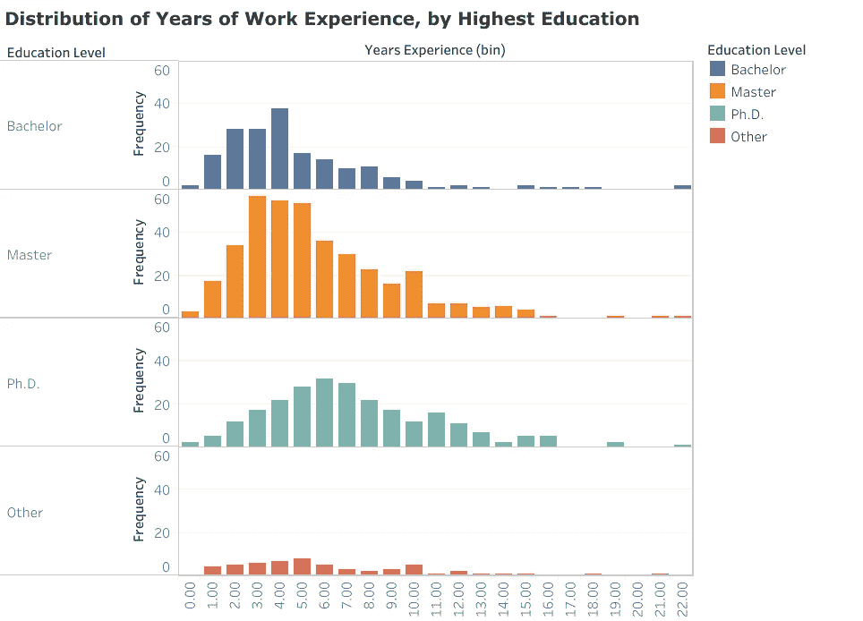
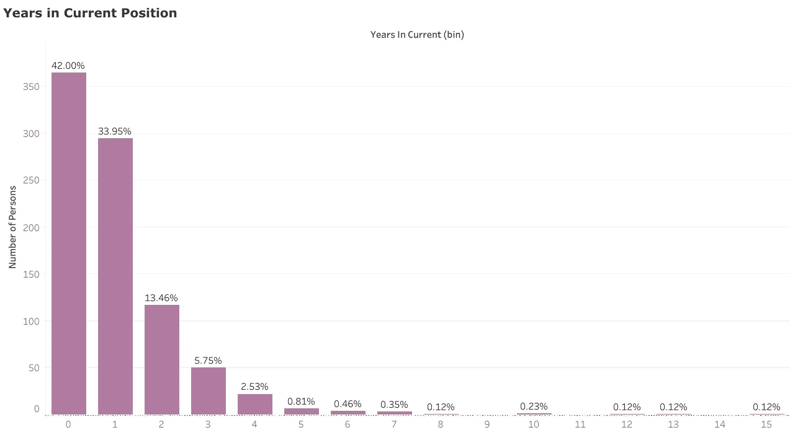
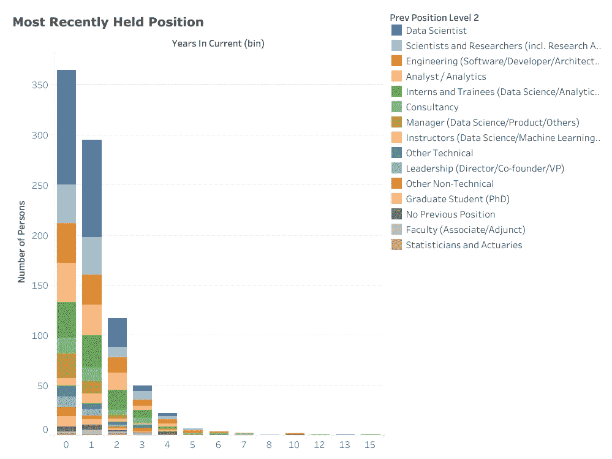
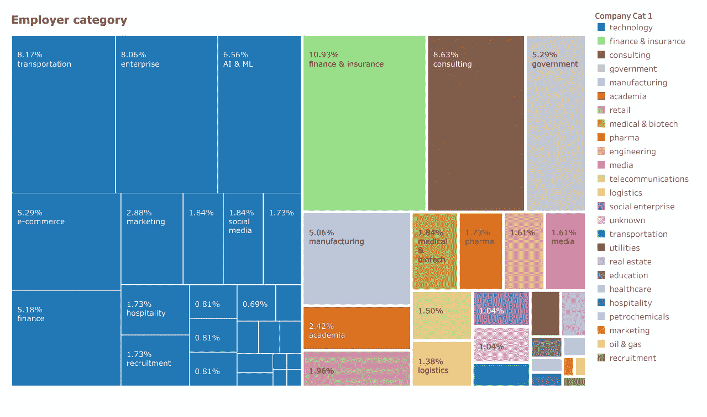

# 我没有被聘为数据科学家。所以我寻找关于谁的数据。

> 原文：<https://towardsdatascience.com/i-wasnt-getting-hired-as-a-data-scientist-so-i-sought-data-on-who-is-c59afd7d56f5?source=collection_archive---------0----------------------->

## 我们可以看看数据科学家之前实际做了什么，而不是关注他们被认为需要的技能

Acquiring data about what I wanted to be. (Image by [David S.A](https://pixabay.com/users/pixtomental1-9093724/) from Pixabay)

在我写这篇文章的时候，我的“走向数据科学”主页上的每一篇热门文章都在谈论应用或学习数据科学中的特定技能。*每一个人*。最重要的是宏观技能，如[如何作为数据科学家与利益相关者合作](/how-to-work-with-stakeholders-as-a-data-scientist-13a1769c8152)和[如何成为数据工程师](/who-is-a-data-engineer-how-to-become-a-data-engineer-1167ddc12811)，接下来是一系列非常具体的技能，包括关于[批量梯度下降与随机梯度下降](/difference-between-batch-gradient-descent-and-stochastic-gradient-descent-1187f1291aa1)、[多类文本分类](/multi-class-text-classification-with-scikit-learn-12f1e60e0a9f)、[更快的 R-CNN](/faster-r-cnn-object-detection-implemented-by-keras-for-custom-data-from-googles-open-images-125f62b9141a) 等等的技术入门。作为数据科学中“共享概念、想法和代码”的专用媒体平台，这种学习资源在数据科学追随者中获得很高的人气并不奇怪，他们可能正在浏览以数据为中心的项目和职业。但是对于一个新手来说，优先考虑什么是最重要的，很快就会变得令人生畏。一个人应该接受训练成为一名卡格勒大师吗？将神经网络应用于图像识别或自然语言处理？[都不是](https://medium.com/@thisismetis/dear-aspiring-data-scientists-just-skip-deep-learning-for-now-9c17030f6e44)？既然都是关于[将模型投入生产](https://medium.com/@tomaszdudek/but-what-is-this-machine-learning-engineer-actually-doing-18464d5c699)，那么 [Kubernetes](https://www.youtube.com/watch?v=frQeK8xo9Ls) 和学习部署模型怎么样？Hadoop 到底怎么了？

我的 LinkedIn 简介描述我是一名软件工程师和数据科学家。根据我的工作经历，前一半可能更准确，因为我只获得过数据科学方面的短期合同。在自愿放弃之前的医疗统计职业后，我开始对试图在我的工作地新加坡找到一份全职数据科学家的工作感到烦恼。我见过一些熟人，只有学士学位，却很容易获得职位，而我的医学统计学硕士学位和 Web 开发大会证书似乎没有给他们带来我希望的毁灭性打击(在[康威维恩图](http://drewconway.com/zia/2013/3/26/the-data-science-venn-diagram)中，三分之二的人是这样认为的)。我的耐心也随着一些*“我如何得到某某角色”*类型的网上泛滥的沾沾自喜的建议而变得越来越少，毕竟，只有 1 个样本。

我开始意识到，我已经将数据科学的*实践*与*战略融合在一起，成为了它的一部分*。令我惊讶的是，这些竟然不是一回事。像大多数新手一样，我从博客帖子、数据科学招聘信息的需求部分以及该领域人士的道听途说中收集信息。这些来源对技能的高度关注，更不用说数据科学家能够并且应该学习一大堆东西的 **的 [**鞭挞和经常说教的语气了**，讽刺的是，这可能会使初学者陷入一个追逐最新技能的永无止境的循环中，而最有效的策略可能是](https://www.linkedin.com/pulse/getting-data-science-job-ben-taylor-deeplearning-/)[首先迅速获得一个与数据相关的职位](http://veekaybee.github.io/2019/02/13/data-science-is-different/)，然后[在工作中学习技能](/becoming-a-data-scientist-when-dan-becker-pointed-out-i-had-it-all-wrong-86fb81397e8c)。**

丹尼尔·卡内曼称之为成为[可用性启发式](https://www.verywellmind.com/availability-heuristic-2794824)受害者的一个例子。我认为我需要在早餐前掌握 [10 项不可能的技能](https://www.kdnuggets.com/2018/05/simplilearn-9-must-have-skills-data-scientist.html)，因为这是我读到的关于数据科学家的样子，没有停下来考虑可能有成千上万的数据科学家已经被成功聘用，**他们中的大多数(根据定义)不是超级明星**。我需要的不是另一篇关于数据科学家所需的顶级技能的自鸣得意的文章，而是关于那些成功转型到数据科学的人的真实数据。他们之前在做什么？

> 我需要的是… *成功转型到数据科学的人的实际数据*

## **关于数据科学家的数据**

虽然有一些关于谁是数据科学家的公开的大规模[调查](https://www.kaggle.com/kaggle/kaggle-survey-2018)，但我发现这些数据存在几个问题:

*   **自选偏倚。**因为这些调查隶属于某些类型的组织，并且完全是自愿的，所以在样本中，某一类回答者可能被过度代表。我看到了一个特别的问题，过度热情的 TensorFlow 实践者主导了 Kaggle 数据科学调查，这可能与数据科学在商业中的实际应用非常不同。
*   **回答者偏差。**由于完全出于自愿，并且对受访者没有任何反馈(你不会因为错误陈述自己而遭受任何后果)，个人受访者可能更不愿意夸大他们的头衔或学历或其他类型的数据。
*   市场代表。我的主要动机是找出那些在我的目标市场(新加坡)中被成功聘用为数据科学家的人的资料。据我所知，调查数据中充斥着数据科学的追求者(主要是学生)，而关于新加坡数据科学家的具体数据却很有限。

毫无疑问，LinkedIn 是我需要获取数据的地方。虽然可能仍然存在一些选择偏差(LinkedIn 的算法可能不会向我展示一个真正随机的数据科学家样本)，但我认为它被求职者和招聘行业广泛采用，作为一种内置的检查，以最大限度地减少受访者的偏差，并确保其简介的真实性。可以说，LinkedIn 的个人资料受制于实际就业市场的压力。

此外，LinkedIn 允许我指定我希望在搜索查询中分析的资料的地理位置，如果需要的话，可以将其限制在新加坡。只有一个问题:获取数据本身。

## 刮数据:别说我没警告你

围绕抓取 LinkedIn 数据的合法性一直存在一些争议。虽然最近的[先例](https://www.theverge.com/2017/8/15/16148250/microsoft-linkedin-third-party-data-access-judge-ruling)确定这些信息是公开的，因此可以被任何人提取，但法律地位远未确定。无论如何，当你试图收集 LinkedIn 数据时，你会遇到几个障碍:

*   你将违反 LinkedIn 的[用户协议](https://www.linkedin.com/help/linkedin/answer/56347/prohibited-software-and-extensions?lang=en)。虽然这类合同的可执行性仍不明朗，但你有可能因违反服务条款而被暂停账户。
*   LinkedIn 为你可以在免费层点击的个人资料数量设置了上限，你的小 selenium bot 会很快达到这个上限(特别是如果你花了很多时间只是调试 scraper)。
*   LinkedIn 一直在悄悄地、频繁地改变他们的 HTML 标签，因此**基于任何当前标签属性集的抓取具有相当短的保质期**。

可以说，在标签被替换和代码过时之前，我编写的 scraper 在足够长的时间内仍然有用，可以获得相当大的数据集(1027 个 LinkedIn 个人资料)。(如果您想了解更多关于代码的信息，请随时联系我)。

使用搜索查询“数据科学家和新加坡”，我从 LinkedIn 的人员部分提取了尽可能多的个人资料。我认为真正相关的数据元素只有三个:**当前职位**(职位和雇主名称)**教育**(最近的机构和研究领域)和**经历**(职位、组织和以前角色的持续时间)。将自己限制在这三个要素上不仅节省了编写和调试 scraper 的时间，也是我试图将不遵守 LinkedIn 服务条款的潜在责任范围最小化。

在过滤掉数据科学有志者、学生和信息不足的个人资料后，我只剩下 869 份数据科学家个人资料。现在我可以开始提问了:目前受雇的数据科学家有哪些共同特征？

## 发现 1:大多数数据科学家都有研究生学位

从数据中最引人注目的发现是，大多数(73%)目前受雇的数据科学家不仅仅拥有学士学位，这一发现在其他地方也得到了证实。多数人(44%)拥有硕士学位，而博士学位的比例为 29%比 21%，高于学士学位。只有 6%的数据科学家将某种形式的 MOOC、训练营或非传统认证作为他们的主要资格。这表明，未来的雇主信任高级学位提供的信号，以满足数据科学家职位的复杂要求。**它还摒弃了数据科学训练营或其他非传统认证项目足以替代此类学位的观念**。

Most recent education qualification reported by a sample of data scientists from LinkedIn

## **发现 2:计算机科学和工程，但商业分析也占据了研究领域**

计算机科学、数学和统计学以及工程学科构成了数据科学职业生涯的基石，这一共同概念在一定程度上得到了数据的证实。但是，还是有区别的。迄今为止，计算机科学超过了所有其他单一领域，占所有研究学科的 14%。**工程**是一个多样化的类别，包括化学、电气和电子以及所谓的知识工程等不同领域，累计占所学学科的 22%。**数学和统计**也以各种名义出现，包括应用数学、数学物理、统计和应用概率，但似乎分量较小，累计只占研究学科的 12%。在数据科学教育赌注中，一个令人惊讶的赢家是**商业分析**和其他分析领域，它们总共占学科的 15%。事实上，对于那些声称拥有硕士学位是最高学历的数据科学家来说，这是排名第一的领域。

其他排名靠前的领域还有**物理** (3.5%)和**信息技术** (2.2%)。出现的情况是，虽然计算和工程相关领域已经证明了成为数据科学家的持续相关性，但数学和统计学在某种程度上被更新的面向商业的分析领域(及其变体)所掩盖。然而，其他领域的一个非常长的尾巴代表了当前数据科学家所追求的学科的广泛多样性。

Top fields of study reported by a sample of data scientists from LinkedIn (tail distributions hidden). Percentages are out of fields of study across all levels

## 发现 3:目前受雇的数据科学家往往处于职业生涯中期

在这个样本中，数据科学家报告的工作经验的典型年数在**4-6 年**之间，取决于他们的最高资格水平。这似乎是显而易见的，但也许值得重复一遍的是，大多数数据科学家不是直接从他们英勇的 MOOC 征服中毕业的大学毕业生，这有时似乎是关于如何进入该领域的博客帖子给人的印象。与大多数其他空缺职位一样，填补该职位的一般人可能会是有经验的人。

另外一个有趣的事实是，*报告非传统认证项目的数据科学家中没有一个是新聘人员，之前至少有一年的工作经验。*

Cumulative years of work experience reported by a sample of data scientists from LinkedIn

## **调查结果 4:大多数数据科学家职位都是新的**

证实上述发现的另一个数据点是，大多数数据科学家(76%)担任当前职位的时间不到 2 年，其中许多人(42%)任职时间不到 1 年。这表明，虽然大多数数据科学职位空缺都是相对较新的，但填补这些空缺的人已经在就业市场上呆了一段时间。

Years in current role reported by a sample of data scientists from LinkedIn. ‘0’ indicates 0–1 years (exclusive)

## 发现五:研究员、软件工程师、分析师还是数据科学实习生？很好。现有数据科学家？甚至更好。

找出数据科学家在他们当前职位之前正在做什么是我想要得到的核心见解。也许不出所料(考虑到样本中研究生学位持有者的优势)，他们中的很大一部分(11%)报告说以前是科学家或研究人员(包括研究助理和研究员)。相当一部分人(11%)报告了某种形式的**软件工程**职位，包括开发人员和解决方案架构师。另一部分数据科学家以前是各种形式的**分析师** (11%)，包括数据分析师和系统分析师。有趣的是，**实习生和培训生** (11%)也是成熟的数据科学家角色的一个可行的前身，他们通常采取数据科学或分析实习的形式。其他排名靠前的职位包括**咨询** (5%)、各种**管理**职位(5%)和**数据科学指导** (3%)。

值得注意的是，在尝试获得一个新的数据科学职位时，没有什么比已经是一名数据科学家更好的了。足足有 28%的样本报告数据科学家是以前的职位。此外，这种在职优势似乎还在增加，例如，29%的在职 1 年或不到 1 年的雇员报告他们以前的职位是数据科学家，相比之下，只有 12%的在职 3-4 年的雇员。

对我来说，值得注意的是，统计学家****和精算师**处于现有数据科学家的最底层。**

****

**Most recently held position reported by a sample of data scientists from LinkedIn, grouped by years in current role. ‘0’ indicates 0–1 years (exclusive)**

## **发现 6:一半的数据科学家来自非科技公司**

**虽然资金雄厚的成熟技术公司(如谷歌或亚马逊)往往在获得数据科学家职位的理想地点方面受到关注，但值得注意的是，该样本中近一半(49%)的数据科学家来自不直接创造技术产品的地方。这些往往是来自**金融和保险** (11%)、**咨询** (9%)、**政府** (5%)、**制造业** (5%)和**学术界** (2.4%)的公司和机构。在技术类别中，代表性较好的行业包括**交通** (8%，主要是由于新加坡的打车应用 Grab)**企业** (8%，包括 IBM、SAP 和微软)**电子商务** (5%)和**金融** (5%)。在这里，我们看到了像星展银行这样招聘数据科学家的金融机构与像路孚特这样利用数据科学为这类机构创造技术产品的金融科技公司之间的区别。**

**有一大类科技公司被我标为 AI ML T21(6.5%)。这包括像 [DataRobot](https://www.datarobot.com/sg/) 这样拥有交付实际自动化机器学习产品记录的公司，也包括像 [Amaris 这样的新公司。AI](https://www.amaris.ai/) 。**

**如果非技术公司和技术公司的数据科学家之间的这种分裂与其他地方提出的[A 型和 B 型数据科学家的特征](https://www.quora.com/What-is-data-science/answer/Michael-Hochster)完全一致，那就太方便了，因为它表明就业市场(至少在新加坡)在为这两种类型提供机会方面一直相当公平。然而，这将是一个有趣而有价值的假设来测试。**

****

**Category of employers reported by a sample of data scientists from LinkedIn**

## **结论:这一切对我意味着什么？**

**如果你真的想获得一个数据科学家的职位，而不是通过阅读随机的博客帖子来烦恼你需要什么样的技能，那么了解一下*到底是谁*在这方面取得了成功可能会更有帮助。最常见的特征组合可能是拥有计算机科学、工程、数学或分析硕士或博士学位的人；在工业部门工作了大约 4-6 年的人；前世是研究员、软件工程师、分析师或数据科学实习生。**然而，不要错误地认为*这种*组合构成了大多数数据科学家，**因为它代表了概率的倍增(这些概率本身可能并不独立)。正如这篇文章和其他研究所指出的，数据科学家的背景极其多样化，比软件工程师等其他职位更加多样化。尽管如此，出现的情况是，某些个人资料确实更受青睐，人们对你简历“脱颖而出”程度的期望可能与简历偏离这些个人资料的程度成正比。**

**最后，我要指出的是，尽管数据没有提到从 MOOCs 和 bootcamps 等非传统认证中获得技能的必要性，但它确实暗示了一些关于它们的充足性的事情:它们显然不是。研究生学位是一个更好的数据科学就业前景指标。这并不是说获得这样的技能不重要；数据科学正在快速发展，许多最重要的算法和技术将不会被传统的学术大纲所涵盖。**这只是表明，获得特定技能可能是为了满足一种需求，而不是满足你作为数据科学家的直接就业能力。****

**无数关于数据科学的专业课程不断涌现，这些课程似乎旨在利用有志之士的不安全感，他们一次又一次地被告知，他们需要特定的技能组合来实现突破。了解谁实际上被聘为数据科学家的数据，给这种存在主义的考虑泼上了一盆冷水。**

## **笔记**

**如果有任何理由对数据吹毛求疵，那就是怀疑样本的代表性。LinkedIn 只显示与你至少有三级关系的个人资料，这些个人资料可能已经通过非随机算法进行了排序(我的 scraper 按顺序提取了顶部的个人资料结果)。需要说明的是，我没有最佳连接，无法从目标市场获得真正随机的数据科学家样本(例如，我的网络中没有足够的集线器节点)。从其他 LinkedIn 账户获取更多个人资料，并进行敏感性分析，会让这个问题变得更加明朗。**

**这篇文章中的所有可视化内容(以及更多内容)都被放在一个名为“[谁是新加坡的数据科学家”的生动故事中？](https://public.tableau.com/profile/hanif.samad#!/vizhome/DataScientistsSG-forMedium/Story1)”。如果你对数据或代码有任何实质性的问题，请考虑这篇文章的回复部分，或者写一封电子邮件发给 hanif.samad.sg@gmail.com。**

**【https://github.com/claussian/Li-Scraper】2020 年 10 月 11 日更新:用于抓取 LinkedIn 的代码现在可以在以下资源库中找到:**

******

***Also on [KDnuggets](https://www.kdnuggets.com/2019/10/top-stories-2019-sep.html).***

******

***And mentioned on [Hacker News](https://news.ycombinator.com/item?id=20707895).***